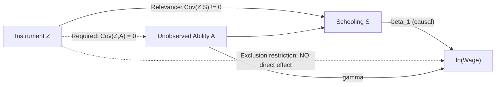

## Ability Bias and Instrumental Variable Approaches

### Overview

Ability bias is the central econometric threat to causal interpretation of the schooling coefficient in earnings regressions: individuals with higher unobserved ability tend to acquire more schooling *and* independently earn higher wages, so any correlation between schooling and earnings partly reflects sorting rather than a pure causal return. Instrumental variable (IV) methods were developed specifically to purge this bias by isolating variation in schooling that is plausibly unrelated to ability. This item provides a focused, technical treatment of the ability bias problem and the IV toolkit built to address it, complementing the broader survey in "Estimating Returns to Schooling."

### Formal Statement of the Ability Bias Problem

**Key Points**

- Assume the true earnings-generating process includes an unobserved ability term $A_i$:

$$\ln w_i = \beta_0 + \beta_1 S_i + \gamma A_i + \varepsilon_i$$

- If the researcher estimates the restricted (omitted-variable) model:

$$\ln w_i = \beta_0 + \beta_1 S_i + u_i, \quad u_i = \gamma A_i + \varepsilon_i$$

- The OLS estimator's probability limit is:

$$\text{plim}(\hat{\beta}_1^{OLS}) = \beta_1 + \gamma \cdot \frac{Cov(S_i, A_i)}{Var(S_i)}$$

- If $\gamma > 0$ (ability raises earnings) and $Cov(S_i, A_i) > 0$ (higher-ability individuals acquire more schooling), the OLS coefficient is biased **upward** — it overstates the causal return to schooling
- The magnitude of the bias depends on how strongly ability predicts both schooling choice and earnings, neither of which is directly observable

### Why Ability Is Fundamentally Unobserved

**Key Points**

- "Ability" in this context is a composite unobservable encompassing cognitive skill, motivation, discount rate/patience, health, and non-cognitive traits
- Even proxies like IQ or standardized test scores capture only part of the relevant construct, and are themselves partly shaped by prior schooling, family investment, and test-taking familiarity — introducing a **reverse causality/bad control** problem when used as regression controls
- Family background variables (parental education, income) are correlated with, but not equivalent to, child ability — using them as controls only partially addresses the bias

### The Logic of Instrumental Variables

**Key Points**

An instrument $Z_i$ must satisfy two conditions:

1. **Relevance**: $Cov(Z_i, S_i) \neq 0$ — the instrument must meaningfully predict schooling
2. **Exclusion restriction**: $Cov(Z_i, u_i) = 0$ — the instrument must affect earnings *only* through its effect on schooling, with no direct path and no correlation with the omitted ability term

Formally, the IV estimator recovers:

$$\hat{\beta}_1^{IV} = \frac{Cov(Z_i, \ln w_i)}{Cov(Z_i, S_i)}$$

which is consistent for $\beta_1$ if and only if both conditions hold. Condition (2) is fundamentally **untestable** — it must be argued on institutional/theoretical grounds, not verified statistically, though partial diagnostic evidence (e.g., overidentification tests when multiple instruments exist) can offer indirect support.

### Two-Stage Least Squares (2SLS) Mechanics

**First stage** — regress schooling on the instrument and exogenous controls:

$$S_i = \pi_0 + \pi_1 Z_i + \mathbf{X}_i\boldsymbol{\gamma} + \nu_i$$

Generate fitted values $\hat{S}_i$, which by construction contain only the variation in schooling explained by $Z_i$ and $\mathbf{X}_i$ — variation argued to be uncorrelated with ability.

**Second stage** — regress earnings on the fitted schooling values:

$$\ln w_i = \beta_0 + \beta_1 \hat{S}_i + \mathbf{X}_i\boldsymbol{\delta} + \varepsilon_i$$

**Key Points**

- Standard errors from a manually computed two-step procedure are incorrect (they don't account for first-stage estimation uncertainty); software 2SLS routines (e.g., `ivreg2` in Stata, `ivreg` in R) compute the correct asymptotic standard errors automatically
- The first-stage F-statistic on the excluded instrument(s) is the standard diagnostic for instrument strength — conventionally compared against a rule-of-thumb threshold (commonly cited as $F > 10$), though this threshold has been shown in more recent econometric work to be an imperfect general guide, with weak-instrument-robust inference methods (e.g., Anderson-Rubin confidence sets) recommended when instrument strength is borderline [Inference: methodological consensus on precise thresholds continues to evolve]

### Weak Instrument Bias

**Key Points**

- When the instrument is only weakly correlated with schooling (small $\pi_1$, low first-stage F-statistic), the IV estimator is biased *toward the OLS estimate* in finite samples, even though it remains asymptotically consistent
- Bound, Jaeger & Baker (1995) demonstrated this problem explicitly for the Angrist-Krueger quarter-of-birth instrument, showing that adding many weak instruments (interactions of quarter of birth with year and state) worsened rather than improved estimation precision and bias
- Weak instruments also produce confidence intervals that are **not centered correctly** even asymptotically under conventional 2SLS inference, motivating weak-instrument-robust procedures

$$\text{plim}(\hat{\beta}_1^{IV}) - \beta_1 \approx \frac{1}{F} \times [\text{plim}(\hat{\beta}_1^{OLS}) - \beta_1] \quad \text{(approximate finite-sample bias intuition)}$$

### Catalog of Instruments Used in the Returns-to-Schooling Literature

| Instrument | Study | Mechanism | Main Critique |
| --- | --- | --- | --- |
| Quarter of birth × compulsory schooling law | Angrist & Krueger (1991) | Birth timing interacts with fixed school-entry/exit ages to generate schooling variation unrelated to ability | Weak instrument (Bound, Jaeger & Baker 1995); possible direct effects of birth timing on outcomes |
| Distance to nearest college | Card (1995) | Lower commuting/psychic cost of college attendance for geographically proximate individuals | Distance may correlate with local labor market conditions or family location choices |
| College tuition changes | Kane & Rouse (1995) | Direct cost variation affects enrollment | Tuition policy may correlate with state-level economic conditions affecting wages |
| Compulsory schooling law changes (state/country level) | Various (Acemoglu & Angrist 2001; European studies) | Legal minimum schooling requirement changes over time/place | Policy changes may coincide with other reforms (curriculum, labor market policy) |
| School construction program | Duflo (2001) | Large-scale, geographically targeted school-building program in Indonesia | Requires assumption that program placement was not driven by anticipated local economic growth |
| Maternal/parental education (as instrument for own schooling in some designs) | Various | Intergenerational schooling transmission | Direct exclusion restriction violation likely (parental education directly affects home environment/earnings) |

### Detailed Case Study: Card (1995) — Distance to College

**Key Points**

- Uses geographic proximity to a four-year college at the time an individual was of college-going age as an instrument for years of schooling
- Rationale: proximity reduces the direct and psychic costs of college attendance (commuting vs. residential costs, informational familiarity), inducing marginal students to attend who would not otherwise
- Card's IV estimates were found to be **larger** than corresponding OLS estimates in his sample, which he interpreted as consistent with the LATE for credit-constrained compliers exceeding the population-average return, rather than as evidence against ability bias per se
- Critique: distance to college may be correlated with unobserved regional characteristics (urbanization, local labor demand, school quality) that independently affect earnings, potentially violating the exclusion restriction

### Detailed Case Study: Angrist & Krueger (1991) — Quarter of Birth

**Key Points**

- Exploits the interaction between compulsory schooling laws (requiring attendance until a fixed birthday, e.g., 16th birthday) and school-entry-age cutoffs (e.g., must be 6 by a fixed calendar date to enter first grade)
- Children born earlier in the year are older when they start school and reach the legal dropout age having completed *more* schooling than children born later in the year in some U.S. state-year cells (or less, depending on the precise institutional configuration) — the mechanism generates a mechanical, ability-unrelated source of schooling variation
- The original paper found IV estimates close to OLS estimates, interpreted at the time as evidence against large ability bias
- Subsequently heavily scrutinized on weak-instrument grounds; also scrutinized for potential exclusion restriction violations, as quarter of birth has been linked in other literatures to relative age effects in school (youngest-in-cohort effects on academic performance and confidence), which could independently affect later earnings through channels other than total years of schooling [documented critique in subsequent literature]

### Overidentification and Specification Testing

**Key Points**

- When more instruments are available than endogenous regressors, overidentifying restrictions tests (e.g., Sargan or Hansen J-test) can check whether the *additional* instruments are correlated with the second-stage residual
- **Important limitation**: passing an overidentification test does not prove exclusion restriction validity — it only checks whether multiple instruments produce *mutually consistent* estimates; if all instruments share a common violation (e.g., all correlated with regional development), the test will not detect it
- Comparing IV estimates across different instruments/studies, and checking whether they cluster around a similar value despite different identifying assumptions, is often treated as informal corroborating evidence, though formally this is not equivalent to validity proof

### Reconciling the "IV ≥ OLS" Empirical Puzzle

**Key Points**

Card's (1999, 2001) survey highlights a persistent empirical pattern: IV estimates of the schooling-earnings relationship are frequently as large as, or larger than, OLS estimates — contrary to the simple prediction that purging upward ability bias should *lower* the estimated return. Proposed explanations include:

1. **Measurement error attenuation dominates**: Classical measurement error in self-reported schooling biases OLS downward more than ability bias pushes it upward, so OLS understates the true return, and IV (which is not subject to the same attenuation, since instruments are typically not subject to the same measurement error as self-reported schooling) corrects this
2. **Heterogeneous returns + LATE**: If marginal returns to schooling are higher for credit-constrained individuals (who face the steepest marginal cost of schooling and thus the highest marginal benefit needed to justify enrollment), and instruments tend to shift the schooling decisions of exactly these individuals, the LATE can exceed the ATE
3. **Instrument-specific institutional features**: Some proposed instruments may have subtle direct effects on earnings that happen to bias the IV estimate upward, though this would undermine rather than explain the pattern as a general phenomenon

[Inference: the relative contribution of each explanation is not fully resolved in the literature and remains a topic of ongoing methodological discussion]

### Worked Numerical Example: Weak Instrument Diagnostics

Suppose a researcher runs a first-stage regression of schooling on an instrument (distance to college) and controls, obtaining:

$$\hat{S}_i = 13.2 - 0.15 \cdot Distance_i + \text{controls}, \quad F\text{-stat on } Distance = 3.8$$

**Interpretation**

- An $F$-statistic of $3.8$ falls well below the conventional rule-of-thumb threshold of $10$, signaling a weak instrument
- Under these conditions, standard 2SLS point estimates and confidence intervals are unreliable; the researcher should report weak-instrument-robust confidence sets (e.g., Anderson-Rubin) alongside or instead of conventional 2SLS output
- Compare to a stronger design, e.g., a compulsory schooling law change with $F = 45$, which would support more confidence in standard 2SLS inference

*[Unverified/illustrative]: Figures constructed for pedagogical demonstration, not drawn from a specific published study.*

### Diagram: Sources of Bias and Correction Paths (svg_diagram)

<svg xmlns="http://www.w3.org/2000/svg" viewBox="0 0 720 420">
<rect width="720" height="420" fill="#ffffff" />
<text x="360" y="25" font-size="16" font-weight="bold" text-anchor="middle" fill="#1a1a1a">Ability Bias: Sources and Corrections (svg_diagram)</text>
<rect x="30" y="60" width="200" height="60" rx="6" fill="#fee2e2" stroke="#dc2626" />
<text x="130" y="85" font-size="12" font-weight="bold" text-anchor="middle" fill="#7f1d1d">Ability Bias</text>
<text x="130" y="102" font-size="10" text-anchor="middle" fill="#7f1d1d">Biases OLS upward</text>
<rect x="270" y="60" width="200" height="60" rx="6" fill="#fef3c7" stroke="#d97706" />
<text x="370" y="85" font-size="12" font-weight="bold" text-anchor="middle" fill="#78350f">Measurement Error</text>
<text x="370" y="102" font-size="10" text-anchor="middle" fill="#78350f">Biases OLS downward</text>
<rect x="510" y="60" width="180" height="60" rx="6" fill="#dbeafe" stroke="#2563eb" />
<text x="600" y="85" font-size="12" font-weight="bold" text-anchor="middle" fill="#1e3a8a">Net OLS Bias</text>
<text x="600" y="102" font-size="10" text-anchor="middle" fill="#1e3a8a">Ambiguous sign</text>
<line x1="230" y1="90" x2="510" y2="90" stroke="#666" stroke-width="1" marker-end="url(#arrow)" />
<line x1="470" y1="90" x2="510" y2="90" stroke="#666" stroke-width="1" />
<rect x="150" y="180" width="420" height="60" rx="6" fill="#dcfce7" stroke="#059669" />
<text x="360" y="205" font-size="12" font-weight="bold" text-anchor="middle" fill="#064e3b">Instrumental Variables</text>
<text x="360" y="222" font-size="10" text-anchor="middle" fill="#064e3b">Removes correlation with unobserved ability via exogenous variation in S</text>
<line x1="360" y1="120" x2="360" y2="180" stroke="#666" stroke-width="1" />
<rect x="80" y="280" width="150" height="50" rx="6" fill="#f3f4f6" stroke="#6b7280" />
<text x="155" y="300" font-size="10" text-anchor="middle" fill="#374151">Twin Fixed Effects</text>
<text x="155" y="315" font-size="9" text-anchor="middle" fill="#374151">(differences out ability)</text>
<rect x="290" y="280" width="150" height="50" rx="6" fill="#f3f4f6" stroke="#6b7280" />
<text x="365" y="300" font-size="10" text-anchor="middle" fill="#374151">2SLS with Instrument</text>
<text x="365" y="315" font-size="9" text-anchor="middle" fill="#374151">(quarter of birth, distance)</text>
<rect x="500" y="280" width="150" height="50" rx="6" fill="#f3f4f6" stroke="#6b7280" />
<text x="575" y="300" font-size="10" text-anchor="middle" fill="#374151">RDD at Policy Cutoff</text>
<text x="575" y="315" font-size="9" text-anchor="middle" fill="#374151">(compulsory schooling law)</text>
<line x1="360" y1="240" x2="155" y2="280" stroke="#666" stroke-width="1" />
<line x1="360" y1="240" x2="365" y2="280" stroke="#666" stroke-width="1" />
<line x1="360" y1="240" x2="575" y2="280" stroke="#666" stroke-width="1" />
</svg>

### Practical Diagnostic Checklist for Applied IV Work

**Key Points**

1. Report and justify the first-stage F-statistic; consider weak-instrument-robust inference if borderline
2. Argue the exclusion restriction explicitly using institutional knowledge — this cannot be tested directly
3. If multiple instruments are available, report overidentification tests, while noting their limitations
4. Explicitly characterize the LATE population (who are the compliers?) and discuss whether this population is policy-relevant for the intended application
5. Compare IV results to OLS and, where possible, to twin/sibling or RDD estimates as informal cross-validation
6. Report both classical and heteroskedasticity/cluster-robust standard errors, especially with instruments varying at a coarser level (state, cohort) than the unit of observation

### Limitations and Open Methodological Debates

**Key Points**

- No instrument used in the literature is universally accepted as fully satisfying the exclusion restriction; all remain subject to context-specific critique
- The LATE framework means that even a "valid" instrument does not, strictly speaking, estimate the population-average return to schooling — a persistent tension for policy applications that require ATE-type parameters
- Advances in weak-instrument-robust inference (Anderson-Rubin, conditional likelihood ratio tests) have improved statistical practice but have not resolved the deeper identification debate about instrument validity
- Contemporary practice increasingly combines multiple identification strategies (IV, RDD, twins, structural models) as complementary robustness checks rather than relying on a single "definitive" estimate [Inference: reflects a general trend in applied methodology, not a claim about any specific consensus figure]

**Next Steps**

- Estimating Returns to Schooling (broader survey of methods)
- The Mincer Earnings Function (baseline specification)
- Local Average Treatment Effects and the Complier Population (Imbens & Angrist 1994)
- Weak Instrument Diagnostics and Robust Inference Methods
- Twin and Sibling Study Designs in Labor Economics
- Regression Discontinuity Design: Theory and Applications
- Measurement Error in Econometric Models
- Structural Dynamic Models of Schooling Choice (Keane & Wolpin)