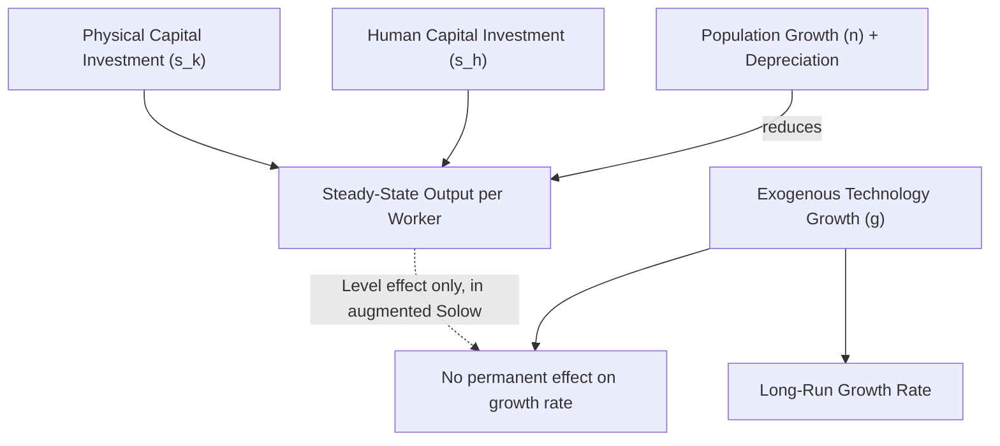
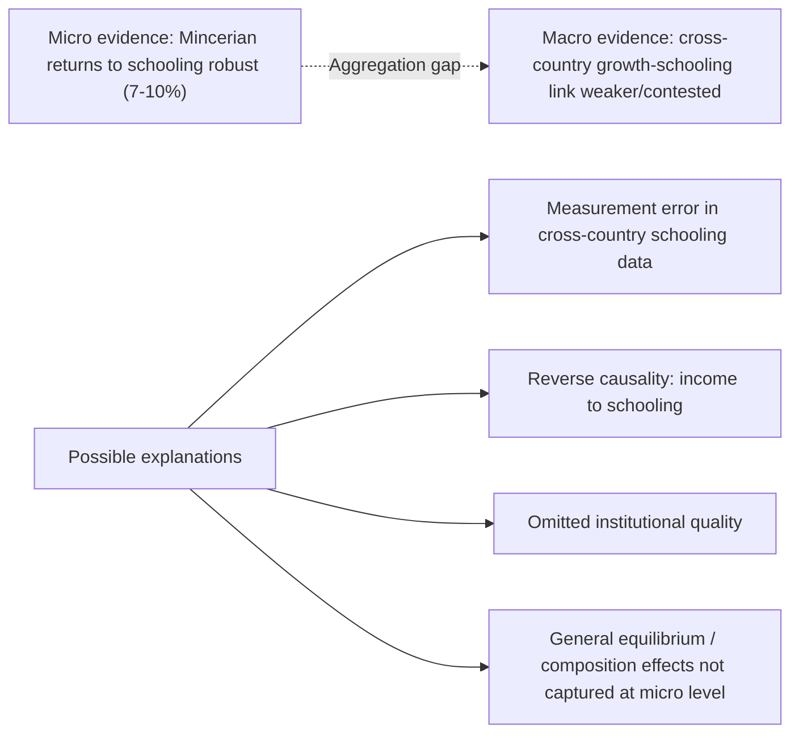

## Human Capital and Economic Growth

### Overview

The relationship between human capital accumulation and aggregate economic growth is a central theme linking micro-founded labor economics (individual returns to schooling) to macroeconomic growth theory. This item examines how human capital enters formal growth models — from augmented neoclassical (Solow-style) frameworks to endogenous growth theory — and surveys the empirical cross-country and micro-to-macro evidence on education's contribution to output growth, productivity, and long-run development.

### Human Capital as a Factor of Production: The Augmented Solow Model

**Key Points**

- The standard Solow (1956) growth model includes physical capital $K$, labor $L$, and exogenous technology $A$: $Y = A K^\alpha L^{1-\alpha}$
- Mankiw, Romer & Weil (1992) augmented this framework by adding human capital $H$ as a third accumulable factor:

$$Y = K^\alpha H^\beta (AL)^{1-\alpha-\beta}$$

- Human capital is treated analogously to physical capital: it is accumulated through investment (schooling), depreciates, and enters the production function with a positive output elasticity $\beta$
- This augmented model substantially improved the Solow model's empirical fit to cross-country income variation, addressing the "too-large" implied capital shares that plagued the unaugmented model when calibrated to explain observed income differences [documented empirical finding from Mankiw-Romer-Weil's influential paper]

#### Steady-State Implications

In the augmented Solow framework, the steady-state level of income per effective worker depends on both the physical capital investment rate $s_k$ and the human capital investment rate $s_h$ (e.g., school enrollment rates):

$$\ln\left(\frac{Y}{L}\right)^* = \ln A + \frac{\alpha}{1-\alpha-\beta}\ln(s_k) + \frac{\beta}{1-\alpha-\beta}\ln(s_h) - \frac{\alpha+\beta}{1-\alpha-\beta}\ln(n+g+\delta)$$

where $n$ is population growth, $g$ is technology growth, and $\delta$ is the depreciation rate.

**Key Points**

- This is still a **level effect** model: higher human capital investment raises the steady-state *level* of output per worker, but does not generate permanent differences in the long-run *growth rate*, which remains pinned down by exogenous technological progress $g$
- This is a crucial distinction from endogenous growth models (below)

### Endogenous Growth Theory: Human Capital as an Engine of Growth

**Key Points**

- In contrast to the augmented Solow framework, endogenous growth models treat human capital accumulation as a source of *permanent* growth rate effects, not just level effects
- **Lucas (1988)**: models human capital accumulation with externalities — an individual's human capital raises not only their own productivity but also the productivity of others around them (a knowledge spillover), generating increasing returns at the aggregate level even under constant returns at the individual level
- **Romer (1990)**: emphasizes human capital devoted to research and development (R&D) as the driver of technological progress, itself endogenously determined by the stock of human capital allocated to the research sector rather than production
- **Nelson & Phelps (1966)**: human capital determines a country's capacity to *adopt and adapt* frontier technology (a "catch-up" mechanism), distinct from human capital's role as a direct production input

#### The Lucas Model (Simplified Structure)

Human capital accumulates according to:

$$\dot{h}(t) = h(t) \cdot \delta \cdot [1 - u(t)]$$

where $u(t)$ is the fraction of time devoted to current production (versus human capital accumulation) and $\delta$ is a learning parameter. Output depends on both individual and *average* human capital in the economy (the externality):

$$Y = A K^\alpha [u h L]^{1-\alpha} h_a^\gamma$$

where $h_a$ is the average human capital level in the economy, and $\gamma > 0$ captures the spillover/externality strength.

**Key Points**

- The externality term $h_a^\gamma$ is what generates sustained endogenous growth — it prevents diminishing returns to human capital accumulation from choking off growth in the long run
- This spillover mechanism is theoretically appealing but has proven **empirically difficult to identify and measure directly** [Inference: the empirical literature on human capital externalities/spillovers remains contested, with mixed findings across studies using different identification strategies]

### Empirical Cross-Country Growth Regressions

**Key Points**

- Barro (1991) and subsequent Barro-style growth regressions regress cross-country GDP growth rates on initial income (testing for conditional convergence) and human capital proxies (school enrollment rates, average years of schooling):

$$g_{i} = \beta_0 + \beta_1 \ln(Y_{i,0}) + \beta_2 H_i + \mathbf{X}_i\boldsymbol{\gamma} + \varepsilon_i$$

- Findings generally show a positive and statistically significant coefficient on initial human capital stock/schooling variables, interpreted as evidence that human capital contributes to growth, whether through direct production effects, absorptive capacity for technology, or governance/institutional channels correlated with education [documented pattern in Barro-style cross-country regressions, subject to substantial methodological debate]

#### Methodological Critiques of Cross-Country Growth Regressions

**Key Points**

1. **Measurement error in schooling data**: cross-country schooling stock data (e.g., Barro-Lee dataset) is constructed from imperfect census/survey sources with substantial measurement error, especially for developing countries and earlier time periods — this can bias coefficients (typically attenuating them, though the exact bias in a cross-country panel with fixed effects is more complex than the simple single-equation case)
2. **Reverse causality**: richer countries can afford more schooling investment, creating a reverse causal channel from income to human capital that confounds the human-capital-to-growth direction
3. **Omitted institutional variables**: institutional quality, rule of law, and governance may be correlated with both schooling investment and growth, generating omitted variable bias
4. **Pritchett's (1996, 2001) "Where Has All the Education Gone?" critique**: found that, in many cross-country panel specifications using fixed effects and controlling for other factors, the *growth rate* of schooling shows a surprisingly weak or even negative correlation with growth in some specifications — a puzzling finding given the robust micro-level Mincerian evidence that schooling raises individual earnings [documented and influential critique paper; findings and their interpretation remain debated in subsequent literature]
5. **Aggregation problem**: the well-established micro-level (Mincerian) relationship between individual schooling and individual earnings does not mechanically imply a proportional macro-level relationship between aggregate schooling and aggregate output growth, because of potential general equilibrium effects, externalities, and measurement inconsistencies between micro and macro data sources

### Distinguishing Schooling Quantity from Schooling Quality

**Key Points**

- Hanushek & Kimko (2000) and subsequent work by Hanushek & Woessmann argue that raw years-of-schooling measures used in most cross-country growth regressions mask substantial cross-country variation in **school quality** (proxied by international test scores such as TIMSS, PISA)
- When cognitive skill measures (test scores) are substituted for or added alongside years-of-schooling in growth regressions, they explain substantially more cross-country growth variation than quantity-of-schooling measures alone [documented finding from Hanushek-Woessmann research program]
- This suggests that the weak/inconsistent cross-country schooling-growth link found by Pritchett and others may partly reflect the **quality-blind nature** of standard schooling-quantity measures rather than a genuine absence of a human-capital-growth relationship
- Policy implication: education investment strategies focused purely on enrollment/attainment expansion, without attention to learning outcomes/quality, may fail to generate the growth effects predicted by quantity-based models [Inference drawn from the Hanushek-Woessmann research program's stated policy implications]

### Channels Through Which Human Capital Affects Growth

**Key Points**

1. **Direct production input**: human capital raises output directly, as in the augmented Solow framework (level effect)
2. **Innovation/R&D capacity**: human capital devoted to research raises the rate of technological progress (Romer-style endogenous growth)
3. **Technology absorption/catch-up**: human capital determines a country's ability to adopt frontier technologies developed elsewhere (Nelson-Phelps mechanism), particularly relevant for developing/catching-up economies
4. **Externalities/spillovers**: aggregate human capital may raise individual productivity beyond the private return captured by the individual (Lucas externality channel)
5. **Institutional and social channels**: education may improve governance quality, reduce corruption, and improve civic participation, indirectly supporting growth-friendly institutions [Inference: this channel is theoretically plausible and discussed in the institutions-and-growth literature, but is harder to cleanly separate from direct human capital effects empirically]

### Diagram: Channels from Human Capital to Growth (svg_diagram)

<svg viewBox="0 0 720 400" xmlns="http://www.w3.org/2000/svg">
<rect width="720" height="400" fill="#ffffff"/>
<text x="360" y="25" font-size="16" font-weight="bold" text-anchor="middle" fill="#1a1a1a">Human Capital to Growth: Transmission Channels (svg_diagram)</text>
<rect x="290" y="50" width="140" height="45" rx="6" fill="#dbeafe" stroke="#2563eb"/>
<text x="360" y="77" font-size="12" text-anchor="middle" fill="#1e3a8a">Human Capital</text>
<rect x="30" y="150" width="150" height="55" rx="6" fill="#dcfce7" stroke="#059669"/>
<text x="105" y="172" font-size="10" font-weight="bold" text-anchor="middle" fill="#064e3b">Direct Production</text>
<text x="105" y="188" font-size="9" text-anchor="middle" fill="#064e3b">(Solow level effect)</text>
<rect x="200" y="150" width="150" height="55" rx="6" fill="#fef3c7" stroke="#d97706"/>
<text x="275" y="172" font-size="10" font-weight="bold" text-anchor="middle" fill="#78350f">R&D / Innovation</text>
<text x="275" y="188" font-size="9" text-anchor="middle" fill="#78350f">(Romer endogenous growth)</text>
<rect x="370" y="150" width="160" height="55" rx="6" fill="#ede9fe" stroke="#7c3aed"/>
<text x="450" y="172" font-size="10" font-weight="bold" text-anchor="middle" fill="#4c1d95">Technology Absorption</text>
<text x="450" y="188" font-size="9" text-anchor="middle" fill="#4c1d95">(Nelson-Phelps catch-up)</text>
<rect x="550" y="150" width="150" height="55" rx="6" fill="#fee2e2" stroke="#dc2626"/>
<text x="625" y="172" font-size="10" font-weight="bold" text-anchor="middle" fill="#7f1d1d">Externalities</text>
<text x="625" y="188" font-size="9" text-anchor="middle" fill="#7f1d1d">(Lucas spillovers)</text>
<line x1="360" y1="95" x2="105" y2="150" stroke="#666" stroke-width="1"/>
<line x1="360" y1="95" x2="275" y2="150" stroke="#666" stroke-width="1"/>
<line x1="360" y1="95" x2="450" y2="150" stroke="#666" stroke-width="1"/>
<line x1="360" y1="95" x2="625" y2="150" stroke="#666" stroke-width="1"/>
<rect x="220" y="280" width="280" height="50" rx="6" fill="#f3f4f6" stroke="#6b7280"/>
<text x="360" y="300" font-size="11" font-weight="bold" text-anchor="middle" fill="#1f2937">Aggregate Output Growth</text>
<text x="360" y="316" font-size="9" text-anchor="middle" fill="#374151">Level effect vs. permanent growth-rate effect (model-dependent)</text>
<line x1="105" y1="205" x2="300" y2="280" stroke="#666" stroke-width="1"/>
<line x1="275" y1="205" x2="340" y2="280" stroke="#666" stroke-width="1"/>
<line x1="450" y1="205" x2="390" y2="280" stroke="#666" stroke-width="1"/>
<line x1="625" y1="205" x2="420" y2="280" stroke="#666" stroke-width="1"/>
</svg>

### Worked Numerical Illustration: Augmented Solow Growth Accounting

Suppose a growth accounting exercise decomposes output growth as:

$$g_Y = \alpha \cdot g_K + \beta \cdot g_H + (1-\alpha-\beta) \cdot g_A$$

With hypothetical parameter values $\alpha = 0.33$, $\beta = 0.30$, $g_K = 4\%$, $g_H = 1.5\%$ (driven by rising average schooling), and residual TFP growth $g_A = 1.8\%$:

$$g_Y = 0.33(4\%) + 0.30(1.5\%) + 0.37(1.8\%) = 1.32\% + 0.45\% + 0.67\% = 2.44\%$$

**Interpretation**: under this hypothetical decomposition, human capital accumulation contributes roughly $0.45$ percentage points (about $18\%$) of the total $2.44\%$ annual growth rate — illustrating how growth accounting frameworks attribute output growth across capital deepening, human capital deepening, and residual technology growth.

*[Unverified/illustrative]: Parameter values and results are constructed for pedagogical purposes and do not represent a specific country's actual growth accounting estimates; real-world values vary substantially by country, period, and the specific accounting methodology used.*

### Human Capital, Inequality, and Growth

**Key Points**

- Beyond aggregate levels, the **distribution** of human capital within a country has been studied as a potential independent determinant of growth — more equal distributions of education may support broader-based economic participation, though findings in this sub-literature are less robust and more contested than the core human-capital-level results [Inference: this is a less settled area than the core augmented Solow/endogenous growth literature]
- Human capital investment is also central to theories of the **poverty trap**: credit constraints preventing poor households from investing optimally in children's education can generate persistent, self-reinforcing low-human-capital, low-growth equilibria — a theme connecting this topic to development economics more broadly

### Policy Implications and Applications

**Key Points**

- Cross-country evidence (even accounting for the Pritchett-style critiques) is broadly interpreted as supportive of education investment as a growth-promoting policy lever, though the *quality* of education investment (not just quantity/enrollment) appears critical based on the Hanushek-Woessmann findings
- Growth accounting exercises are used by international organizations (World Bank, IMF) to attribute historical growth performance across countries/regions to human capital versus other factors, informing development policy prioritization
- The Nelson-Phelps technology-absorption channel provides a rationale for developing countries to prioritize human capital investment as part of a "catch-up" growth strategy, distinct from the direct-production-input rationale

### Limitations and Ongoing Debates

**Key Points**

- The macro-level relationship between schooling and growth remains less robustly established than the micro-level Mincerian relationship between schooling and individual earnings — a genuine and only partially resolved puzzle in the literature (the Pritchett critique)
- Distinguishing level effects (augmented Solow) from permanent growth-rate effects (endogenous growth models) is empirically difficult, since both can generate similar transitional dynamics over the finite time horizons typically observed in data
- Measurement of human capital stock across countries remains imperfect; quality-adjusted measures (incorporating test scores) are a significant improvement but are unavailable or unreliable for many developing countries and earlier historical periods
- Reverse causality and omitted variable concerns (institutional quality in particular) continue to complicate causal interpretation of cross-country schooling-growth correlations, and credible instrumental variable strategies at the country-growth level are considerably harder to construct than at the individual-earnings level [Inference: reflects general methodological consensus regarding the added difficulty of macro-level causal identification relative to micro-level]

**Next Steps**

- The Mincer Earnings Function (micro-level foundation)
- Estimating Returns to Schooling (micro identification strategies)
- The Solow Growth Model and Conditional Convergence
- Endogenous Growth Theory (Romer, Lucas models in full)
- The Hanushek-Woessmann School Quality Research Program
- Cross-Country Growth Regressions: Methodology and Critiques (Barro, Pritchett)
- Poverty Traps and Credit Constraints in Human Capital Investment
- Technology Diffusion and Absorptive Capacity (Nelson-Phelps)