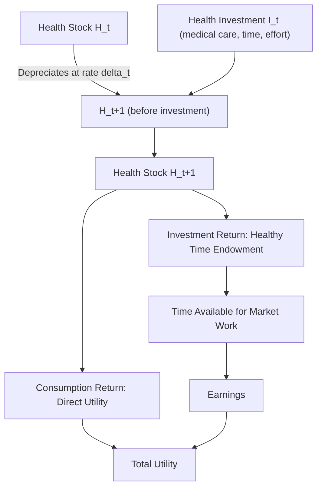

## Health as Human Capital

### Overview

The health-as-human-capital framework, formalized by Michael Grossman (1972), treats health as a durable capital stock that individuals invest in and that directly determines earning capacity, alongside education. Unlike education, health capital is unique in that it enters utility *directly* (people value health for its own sake, not only instrumentally) while also functioning as an investment good that determines the amount of healthy time available for market work. This item examines the theoretical structure of the Grossman model, its integration with labor supply and earnings determination, and the empirical literature on the health-earnings relationship.

### The Grossman Model: Core Structure

**Key Points**

- Health is modeled as a stock $H_t$ that depreciates over time at a rate $\delta_t$ (which typically increases with age) and can be augmented through health investment $I_t$ (medical care, exercise, nutrition, time inputs)
- The stock evolves according to a capital accumulation equation analogous to physical/human capital more broadly:

$$H_{t+1} = H_t(1 - \delta_t) + I_t$$

- Health investment $I_t$ is produced using a household production function combining purchased medical care $M_t$, own time $T_t^H$, and other inputs (education, which raises the efficiency of health production):

$$I_t = f(M_t, T_t^H; E_t)$$

- Health capital yields two distinct types of returns:
  1. **Consumption return**: health enters utility directly — individuals value being healthy independent of any earnings implications
  2. **Investment return**: health determines the total time endowment available in each period, since illness reduces the number of healthy days available for work and leisure

$$\Omega_t = H_t \cdot \Omega^{max}$$

where $\Omega_t$ is total healthy time available in period $t$ and $\Omega^{max}$ is the maximum possible time endowment (e.g., all days in the period).

### Optimal Health Investment: The Grossman Demand Curve for Health

**Key Points**

- The individual chooses the optimal health stock by equating the marginal cost of health investment with its marginal benefit (both consumption and investment returns)
- In the **pure investment model** (abstracting from the direct utility/consumption value of health, isolating the labor-market channel), the optimality condition is:

$$MEC = \frac{\pi_t (\delta_t + r)}{\text{marginal product of health in producing healthy time}}$$

where $MEC$ is the marginal efficiency of health capital, $\pi_t$ is the marginal cost of gross investment, $r$ is the discount/interest rate, and $\delta_t$ is the depreciation rate

- **Key comparative static**: since depreciation $\delta_t$ rises with age, the optimal health stock *declines* over the life cycle even without any change in preferences — this generates the well-documented empirical pattern of declining health with age as a rational response to a rising cost of maintaining health capital, not merely a biological given
- Individuals with higher wages have a higher opportunity cost of time spent sick (higher value of healthy time), which — holding the health production technology fixed — implies higher optimal health investment for higher-wage individuals, a mechanism generating a positive correlation between wages and health independent of any direct causal effect of health on productivity

### The Efficiency Role of Education in Health Production

**Key Points**

- The Grossman model treats education as an efficiency-enhancing input into the health production function: more educated individuals are hypothesized to produce a given increment of health more efficiently (better information use, superior health behaviors, more effective interaction with the healthcare system)
- This creates two competing empirical explanations for the well-documented positive education-health gradient:
  1. **Productive efficiency**: education makes individuals better health producers for any given level of health inputs
  2. **Allocative efficiency**: education improves the choice of health *inputs* (better selection of behaviors/treatments) rather than raising the productivity of a fixed input bundle
- Empirically distinguishing productive from allocative efficiency effects has proven difficult, and both may operate simultaneously [Inference: this distinction is a recognized theoretical taxonomy in the health economics literature, but empirical decomposition between the two channels remains an active and only partially resolved research question]

### Health and Earnings: The Empirical Relationship

**Key Points**

- Cross-sectional evidence consistently finds a strong positive correlation between health status and earnings/wages, but as with schooling, this correlation is subject to multiple confounding pathways
- **Reverse causality**: higher earnings enable better health investment (medical care access, nutrition, reduced work-related stress), running from earnings to health rather than health to earnings
- **Omitted variable bias**: unobserved factors (time preference/discount rate, cognitive ability, family background) may independently drive both health investment and labor market success
- **Selection into employment/occupation**: healthier individuals may selectively enter higher-paying occupations or industries, and poor health may force selection into lower-paying, less physically demanding jobs — creating occupation-based selection effects

$$\ln w_i = \beta_0 + \beta_1 Health_i + \beta_2 S_i + \beta_3 X_i + \varepsilon_i$$

**Key Points on Interpretation**

- $\hat{\beta}_1$ in a naive OLS specification is a **biased composite** of the causal effect of health on productivity/earnings, the reverse causal effect of earnings on health investment, and shared unobserved confounders — isolating the pure causal channel requires similar identification strategies to those used in the returns-to-schooling literature

### Identification Strategies for the Health-Earnings Relationship

| Strategy | Mechanism | Key Studies / Approach | Main Limitation |
| --- | --- | --- | --- |
| Instrumental variables | Health shocks plausibly unrelated to prior earnings trajectory (e.g., specific disease onset, genetic health instruments) | Various health economics IV studies | Exclusion restriction concerns; health shocks may still correlate with unobserved factors |
| Natural experiments / policy shocks | Health insurance expansions, disease eradication programs | e.g., malaria eradication studies examining long-run economic outcomes in affected regions | Requires exogenous variation in program placement/timing |
| Panel/fixed-effects models | Within-individual variation in health over time, differencing out time-invariant unobserved heterogeneity | Longitudinal health-earnings panel studies | Does not address time-varying confounders or reverse causality within-period |
| Sibling/twin comparisons | Differences health outcomes within families sharing genetic/environmental background | Adapted from schooling twin-study designs | Small samples; health differences between twins may still be endogenous to other factors |

### Case Study: Disease Eradication and Long-Run Economic Outcomes

**Key Points**

- A prominent strand of the health-human-capital literature examines large-scale disease eradication campaigns (e.g., malaria, hookworm) as natural experiments, using pre-existing geographic variation in disease burden interacted with the timing of eradication as a source of identifying variation
- Findings from this literature generally support a **causal positive effect of childhood health on adult human capital and earnings outcomes**, operating partly through improved childhood cognitive development and increased schooling attainment (health capital in childhood raising the efficiency of subsequent human capital investment) [documented pattern across several disease-eradication natural experiment studies, though specific point estimates vary by study, disease, and region and should be verified against primary sources for applied use]
- This literature connects health-as-human-capital to the broader human capital and economic growth theme: childhood health functions as a foundational input that complements later educational investment, consistent with dynamic complementarity models of skill formation (Cunha & Heckman)

### Dynamic Complementarity: Health and Skill Formation

**Key Points**

- Cunha & Heckman's dynamic skill formation framework treats health and cognitive/non-cognitive skill development as **complementary and self-reinforcing** across childhood developmental stages
- Early-life health investments (prenatal care, early childhood nutrition) raise the *productivity* of later educational investments — a child with better early health capital extracts more human capital benefit from a given quantity of schooling
- This implies that health and education interventions are not independently additive in their effects on lifetime earnings; the *sequencing and complementarity* of investments matters for total human capital accumulation
- Policy implication: this framework provides theoretical support for early childhood health and nutrition interventions as a foundation for the effectiveness of later educational investment, rather than treating health and education policy as separable domains [Inference: this is the standard policy implication drawn in the Cunha-Heckman-adjacent literature]

### Worked Numerical Example: Grossman Model Depreciation Dynamics

Suppose an individual's health stock depreciation rate rises with age according to $\delta_t = 0.03 + 0.001(Age_t - 25)$ for $Age_t \geq 25$, and gross health investment is held constant at $I = 5$ (index units) per period, with initial health stock $H_{25} = 100$.

**At age 25:** $\delta_{25} = 0.03$

$$H_{26} = 100(1 - 0.03) + 5 = 97 + 5 = 102$$

**At age 55:** $\delta_{55} = 0.03 + 0.001(30) = 0.06$

If health stock at age 55 is (illustratively) $H_{55} = 95$:

$$H_{56} = 95(1 - 0.06) + 5 = 89.3 + 5 = 94.3$$

**Interpretation**: at the same level of gross investment, the higher depreciation rate at older ages results in a *declining* net health stock over time (94.3 < 95), whereas at age 25 the same investment level produced *growth* in the health stock (102 > 100). This illustrates the model's core mechanism: the rationally optimal response to rising depreciation is either increased investment to maintain the stock, or an accepted gradual decline in health capital as the marginal cost of maintenance rises with age.

*[Unverified/illustrative]: Parameter values are constructed for pedagogical demonstration of model mechanics and are not drawn from a specific empirical study or calibration.*

### Health Insurance, Labor Supply, and "Job Lock"

**Key Points**

- Health-as-human-capital theory connects to labor supply distortions arising from employer-provided health insurance systems (particularly relevant in the U.S. institutional context)
- **Job lock**: workers may remain in a job primarily to retain employer-sponsored health insurance, rather than moving to a more productive job match, if alternative employment would result in a loss or gap in coverage (e.g., due to pre-existing condition exclusions in some historical insurance market structures)
- This represents a labor market friction connecting health capital investment (insurance as a mechanism for financing health investment) to broader labor market efficiency questions, distinct from the pure production-function role of health capital [Inference: the job lock literature is a distinct but related empirical research strand within health economics and labor economics]

### Diagram: The Grossman Model — Consumption vs. Investment Returns (svg_diagram)

<svg xmlns="http://www.w3.org/2000/svg" viewBox="0 0 700 380">
<rect width="700" height="380" fill="#ffffff" />
<text x="350" y="25" font-size="16" font-weight="bold" text-anchor="middle" fill="#1a1a1a">Grossman Model: Dual Return to Health Capital (svg_diagram)</text>
<rect x="270" y="55" width="160" height="50" rx="6" fill="#dbeafe" stroke="#2563eb" />
<text x="350" y="85" font-size="12" font-weight="bold" text-anchor="middle" fill="#1e3a8a">Health Stock H_t</text>
<rect x="80" y="160" width="220" height="70" rx="6" fill="#dcfce7" stroke="#059669" />
<text x="190" y="185" font-size="12" font-weight="bold" text-anchor="middle" fill="#064e3b">Consumption Return</text>
<text x="190" y="203" font-size="10" text-anchor="middle" fill="#064e3b">Direct utility from being healthy</text>
<text x="190" y="218" font-size="10" text-anchor="middle" fill="#064e3b">(independent of earnings)</text>
<rect x="400" y="160" width="220" height="70" rx="6" fill="#fef3c7" stroke="#d97706" />
<text x="510" y="185" font-size="12" font-weight="bold" text-anchor="middle" fill="#78350f">Investment Return</text>
<text x="510" y="203" font-size="10" text-anchor="middle" fill="#78350f">Healthy time available</text>
<text x="510" y="218" font-size="10" text-anchor="middle" fill="#78350f">for market work</text>
<line x1="350" y1="105" x2="190" y2="160" stroke="#666" stroke-width="1.5" />
<line x1="350" y1="105" x2="510" y2="160" stroke="#666" stroke-width="1.5" />
<rect x="400" y="280" width="220" height="55" rx="6" fill="#f3f4f6" stroke="#6b7280" />
<text x="510" y="302" font-size="11" font-weight="bold" text-anchor="middle" fill="#1f2937">Labor Earnings</text>
<text x="510" y="318" font-size="9" text-anchor="middle" fill="#374151">Via increased working time</text>
<line x1="510" y1="230" x2="510" y2="280" stroke="#666" stroke-width="1.5" />
<rect x="80" y="280" width="220" height="55" rx="6" fill="#f3f4f6" stroke="#6b7280" />
<text x="190" y="302" font-size="11" font-weight="bold" text-anchor="middle" fill="#1f2937">Utility (Welfare)</text>
<text x="190" y="318" font-size="9" text-anchor="middle" fill="#374151">Direct, not earnings-mediated</text>
<line x1="190" y1="230" x2="190" y2="280" stroke="#666" stroke-width="1.5" />
</svg>

### Applications and Policy Relevance

**Key Points**

- The Grossman framework underlies much of applied health economics' treatment of health insurance markets, public health investment prioritization, and cost-benefit analysis of health interventions in terms of both quality-of-life (consumption return) and productivity (investment return) effects
- Distinguishing consumption from investment returns is important for welfare analysis: interventions valued only via earnings effects will understate total welfare gains from health improvements that also directly raise utility
- The complementarity insight (Cunha-Heckman-adjacent) supports early childhood health/nutrition program prioritization in development economics and social policy design
- Occupational health and safety regulation can be framed within this model as policy intervention to correct externalities or information failures in individuals' otherwise-private health investment decisions

### Limitations and Open Questions

**Key Points**

- The consumption/investment decomposition, while theoretically clean, is difficult to empirically separate — most reduced-form health-earnings studies estimate a composite effect without cleanly isolating the pure investment-channel contribution to earnings
- Reverse causality (earnings enabling health investment) remains a persistent and difficult-to-fully-resolve identification challenge, generally requiring health-specific instruments or natural experiments (disease shocks, policy-driven insurance expansions) analogous to the schooling IV literature
- The productive-versus-allocative-efficiency distinction for education's role in health production remains an active empirical research question without full resolution
- Model calibration (depreciation rates, investment cost functions) is technically demanding and sensitive to functional form and data source choices, limiting the model's direct quantitative predictive precision relative to its qualitative/conceptual value [Inference: general methodological caveat regarding structural health capital model calibration, consistent with broader structural estimation challenges noted elsewhere in the human capital literature]

**Next Steps**

- The Mincer Earnings Function (parallel human capital framework for schooling)
- Ability Bias and Instrumental Variable Approaches (identification strategies transferable to health-earnings estimation)
- Human Capital and Economic Growth (macro-level integration of health capital)
- Dynamic Skill Formation and Childhood Development (Cunha-Heckman framework)
- Health Insurance Markets and Job Lock
- Disease Eradication Natural Experiments in Development Economics
- Occupational Health and Safety Regulation (links to Compensating Wage Differentials chapter)
- Aging, Health Depreciation, and Labor Force Participation