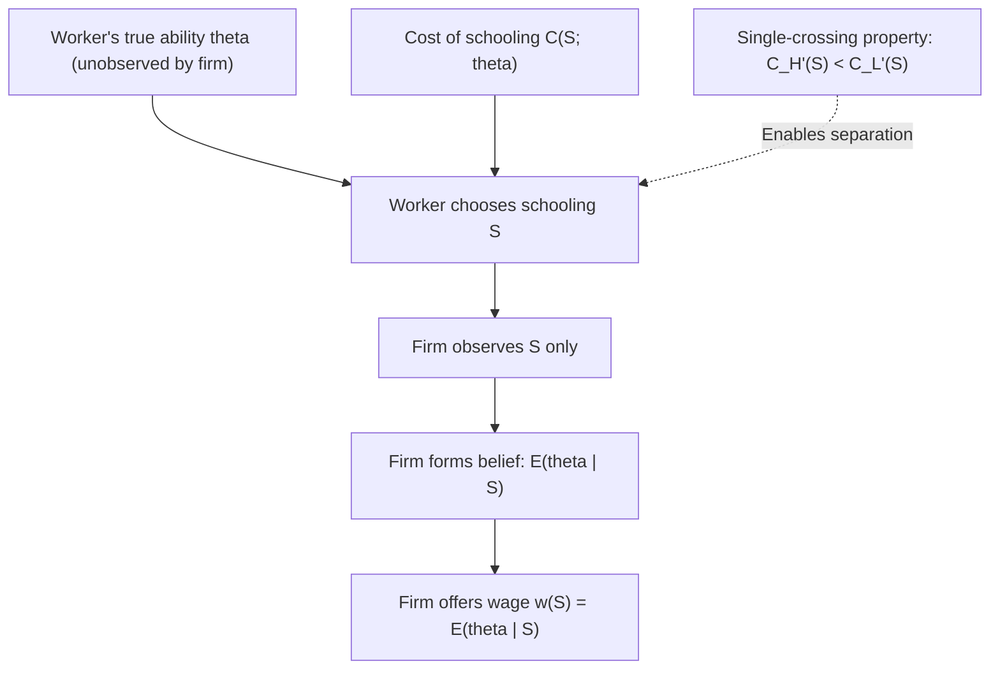
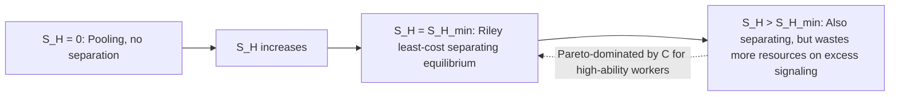
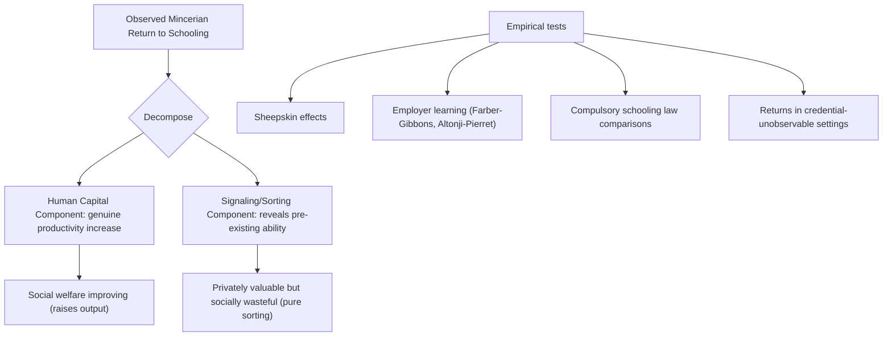

## Spence's Job Market Signaling Model

### Overview

Michael Spence's job market signaling model (1973) provides an alternative theoretical foundation for the observed positive correlation between education and earnings — one that does not require education to raise worker productivity at all. In the pure signaling framework, education serves as a **credible signal** of pre-existing, unobservable worker ability to employers, who cannot directly observe productivity at the point of hiring. This model fundamentally reframes the interpretation of the Mincerian return to schooling and initiated an extensive theoretical and empirical literature on signaling, screening, and information asymmetry in labor markets.

### The Core Problem: Asymmetric Information in Hiring

**Key Points**

- Workers know their own productivity/ability type; firms do not observe it directly at the time of hiring
- If firms cannot distinguish high- and low-ability workers, and offer a single pooling wage based on average expected productivity, high-ability workers are effectively subsidizing low-ability workers, and firms cannot competitively differentiate compensation
- Spence's insight: if there exists an observable action (education) that is **less costly for high-ability workers to acquire than for low-ability workers**, high-ability workers can credibly separate themselves by acquiring more education, even if education itself does nothing to raise productivity

### Formal Setup

**Key Points**

- Two worker types: high-ability ($H$) with productivity $\theta_H$ and low-ability ($L$) with productivity $\theta_L < \theta_H$, with population proportions known to firms but individual type unobservable
- Cost of acquiring education level $S$ differs by type: $C_H(S) < C_L(S)$ for all $S > 0$, and critically, the **marginal cost** of education is lower for high-ability workers: $C_H'(S) < C_L'(S)$ — this single-crossing property is the technical condition that makes separation possible
- Firms, in competitive equilibrium, pay wages equal to the expected productivity conditional on observed schooling level: $w(S) = E[\theta \mid S]$
- Critically, in the **pure signaling model**, schooling does not enter the productivity function directly: $\theta$ is fixed at birth/pre-labor-market and unaffected by $S$

$$\theta_i \text{ is exogenous}, \quad w(S) = E[\theta \mid S] \text{ (rational expectations, competitive zero-profit condition)}$$

### Separating Equilibrium

**Key Points**

- A **separating equilibrium** exists when high- and low-ability workers choose different schooling levels, and firms correctly infer type from the observed choice
- In the simplest two-type model, low-ability workers choose $S_L = 0$ (no signaling value in acquiring education, since they cannot cheaply separate further below), while high-ability workers choose some $S_H^* > 0$ sufficient to deter low-ability workers from mimicking them
- The **incentive compatibility constraints** require:

$$\theta_H - C_H(S_H^*) \geq \theta_L - C_H(0) \quad \text{(H doesn't want to mimic L)}$$

$$\theta_L - C_L(0) \geq \theta_H - C_L(S_H^*) \quad \text{(L doesn't want to mimic H)}$$

- The second constraint is the *binding* one in the standard setup, and determines the minimum signaling level $S_H^*$ required for separation:

$$\theta_H - \theta_L \geq C_L(S_H^*) - C_L(0)$$

- This condition states that the wage gain from being correctly identified as high-ability must be at least as large as the cost a low-ability worker would incur to fraudulently acquire the same signal — if this holds, low-ability workers are deterred, and separation is sustained

### Multiplicity of Separating Equilibria

**Key Points**

- A key feature of signaling models is that **many separating equilibria can satisfy the incentive compatibility constraints simultaneously** — any $S_H \geq S_H^{min}$ (the minimum level satisfying the low-ability worker's incentive constraint) supports a valid separating equilibrium
- This creates an equilibrium selection/refinement problem: without additional restrictions, the model does not pin down a unique level of signaling
- The **Riley (1975) least-cost separating equilibrium** (or "Riley outcome") is commonly invoked as the natural equilibrium selection, corresponding to the *lowest* level of $S_H$ that still satisfies the low-ability worker's incentive compatibility constraint — this minimizes wasteful signaling costs while still achieving separation, and is often justified via game-theoretic refinements (e.g., the intuitive criterion of Cho & Kreps 1987)

### Pooling Equilibrium

**Key Points**

- Alternatively, a **pooling equilibrium** can arise where both types choose the same schooling level (often $S = 0$), and firms pay a single wage equal to the population-average expected productivity $E[\theta]$
- Pooling equilibria are sustained when the potential gain from separating is not large enough, or when off-equilibrium-path beliefs are structured such that deviating to higher schooling is not rewarded with a sufficiently favorable wage
- Pooling equilibria are generally considered less robust to refinement criteria (like the intuitive criterion) than separating equilibria, since they typically rely on somewhat arbitrary out-of-equilibrium belief specifications to be sustained

### The Welfare Implications of Pure Signaling

**Key Points**

- If education has **zero direct productivity effect** in the pure signaling model, then all resources spent on educational signaling by high-ability workers are, from a social welfare standpoint, **pure waste** — the signal successfully sorts workers, generating private benefits to high-ability workers and firms (better matching), but does not increase aggregate output
- This is a stark departure from human capital theory, where schooling investment raises aggregate productivity and is welfare-improving from a growth perspective
- **Key policy implication**: if a substantial fraction of the observed return to schooling reflects pure signaling rather than human capital accumulation, then education subsidies may be less socially valuable than a pure human-capital-theory perspective would suggest, since they induce costly credential competition without raising total output
- This creates one of the most consequential and long-running debates in labor economics: **what fraction of the Mincerian return to schooling reflects genuine productivity enhancement (human capital) versus pure sorting/signaling?** [This is explicitly a contested, actively debated empirical question in the literature, not a settled figure]

### Distinguishing Signaling from Human Capital Empirically

**Key Points**

Several empirical strategies have been proposed to disentangle the two theories, though none is fully conclusive:

1. **Sheepskin effects**: if earnings jump disproportionately at credential-completion years (e.g., 12th grade diploma, 4-year degree) relative to equivalent non-completion years of schooling, this is often interpreted as evidence for signaling, since a pure human capital story would predict roughly linear returns per year regardless of credential completion — though sheepskin effects are also consistent with nonlinear human capital production or licensing/regulatory requirements tied to credentials
2. **Ability-independent education variation**: examining returns to schooling induced by policy changes unrelated to worker ability (compulsory schooling law changes) — if the return to *compulsorily induced* schooling equals the return to voluntarily chosen schooling, this is more consistent with human capital theory; if forced schooling has a much lower return, it favors interpretation of much of the standard return as ability sorting rather than either signaling or human capital effects
3. **Employer learning models**: if firms initially pay based on the signal (education) but wages converge toward true productivity as employers directly observe worker performance over time (Farber & Gibbons 1996; Altonji & Pierret 2001), the *coefficient on schooling should decline with labor market experience* as employers substitute direct performance observation for the initial signal — this pattern has found some empirical support, though findings vary and results are sensitive to specification [documented empirical strategy and finding pattern, subject to ongoing methodological debate regarding robustness]
4. **Signaling value should be irrelevant where credentials cannot be observed by employers**: studies examining settings where formal credentials are not required or verified (e.g., some self-employment or informal-sector contexts) and finding continued positive schooling-earnings relationships are sometimes cited as evidence for a human-capital component, since a pure signaling story predicts no return where the signal cannot be transmitted to a relevant audience

### The Employer Learning Model (Farber & Gibbons 1996; Altonji & Pierret 2001)

**Key Points**

- Formalizes the idea that firms initially rely heavily on easily observable signals (education) when setting wages for new labor market entrants, since direct productivity observation takes time
- As tenure/experience accumulates, firms progressively learn a worker's true productivity through observed performance, and wages converge toward productivity-based pay
- Empirical prediction: the coefficient on schooling in a Mincer-style wage regression should **decline with experience**, while the coefficient on directly-observed-but-initially-unpriced ability proxies (e.g., AFQT test scores not disclosed to employers at hiring) should **increase with experience** as employers learn this information indirectly through performance
- Altonji & Pierret (2001) found empirical support for this pattern using NLSY data, interpreted as evidence that education does carry some signaling value beyond pure human capital content, though the magnitude of the effect and its interpretation remain subject to debate [documented finding, interpretation debated]

### Worked Numerical Example: Separating Equilibrium Condition

Suppose $\theta_H = \$80{,}000$, $\theta_L = \$40{,}000$, and the cost of acquiring $S$ years of schooling for a low-ability worker is $C_L(S) = \$5{,}000 \cdot S$ (linear cost).

**Minimum signaling level for separation:**

$$\theta_H - \theta_L \geq C_L(S_H) - C_L(0)$$

$$80{,}000 - 40{,}000 \geq 5{,}000 \cdot S_H$$

$$40{,}000 \geq 5{,}000 \cdot S_H$$

$$S_H \geq 8$$

**Interpretation**: high-ability workers must acquire at least 8 years of schooling to deter low-ability workers from mimicking the signal, given these cost and productivity parameters. If high-ability workers face a lower marginal cost, e.g., $C_H(S) = \$2{,}000 \cdot S$, their cost of acquiring $S_H = 8$ is $\$16{,}000$ — well below the $\$40{,}000$ wage gain, confirming that acquiring the signal is individually rational for high-ability workers under this parameterization.

*[Unverified/illustrative]: Numerical values are constructed for pedagogical demonstration of the model's incentive-compatibility mechanics and do not represent empirical estimates from any specific labor market.*

### Diagram: Separating Equilibrium — Cost Curves and Incentive Compatibility (svg_diagram)

<svg xmlns="http://www.w3.org/2000/svg" viewBox="0 0 700 420">
<rect width="700" height="420" fill="#ffffff" />
<text x="350" y="25" font-size="16" font-weight="bold" text-anchor="middle" fill="#1a1a1a">Signaling Cost Curves and Separation (svg_diagram)</text>
<line x1="80" y1="370" x2="650" y2="370" stroke="#333" stroke-width="2" />
<line x1="80" y1="370" x2="80" y2="50" stroke="#333" stroke-width="2" />
<text x="360" y="400" font-size="13" text-anchor="middle" fill="#333">Schooling Level (S)</text>
<text x="30" y="210" font-size="13" text-anchor="middle" fill="#333" transform="rotate(-90 30 210)">Cost / Wage Gain</text>
<path d="M 80 370 L 550 100" stroke="#dc2626" stroke-width="2.5" fill="none" />
<text x="440" y="145" font-size="11" fill="#dc2626">C_L(S): Low-ability cost (steep)</text>
<path d="M 80 370 L 550 280" stroke="#2563eb" stroke-width="2.5" fill="none" />
<text x="440" y="300" font-size="11" fill="#2563eb">C_H(S): High-ability cost (shallow)</text>
<line x1="80" y1="180" x2="650" y2="180" stroke="#059669" stroke-width="1.5" stroke-dasharray="6,4" />
<text x="560" y="175" font-size="11" fill="#059669">theta_H - theta_L (wage gain)</text>
<line x1="330" y1="370" x2="330" y2="180" stroke="#999" stroke-width="1" stroke-dasharray="3,3" />
<circle cx="330" cy="180" r="5" fill="#7c3aed" />
<text x="335" y="165" font-size="11" fill="#7c3aed">S_H* (Riley least-cost separation)</text>
<text x="290" y="395" font-size="10" fill="#7c3aed">S_H*</text>
</svg>

### Screening as the Firm-Side Counterpart

**Key Points**

- Signaling models place the informed party (the worker) as the active party choosing a costly action; **screening models** (Rothschild & Stiglitz 1976, developed primarily in insurance markets but applicable to labor markets) instead have the uninformed party (the firm) design a menu of contracts to induce self-selection
- In a labor market screening context, firms might offer a menu of wage-tenure or wage-hours contracts designed so that only certain worker types find particular contracts attractive, achieving separation without requiring an a priori observable signal like schooling
- The signaling/screening distinction is primarily about **which side of the market takes the costly action first**, though both frameworks share the core insight that asymmetric information can be resolved (partially) through self-selection mechanisms

### Extensions and Related Signaling Applications

**Key Points**

- **Job market signaling beyond education**: the same framework has been applied to other observable-but-costly signals, including internship/apprenticeship completion, professional certifications, and (in some applications) conspicuous unpaid labor market experience
- **Statistical discrimination interaction**: if signaling costs differ systematically across demographic groups for reasons unrelated to true ability (e.g., differential access to educational resources), the signaling framework can generate persistent group-level wage gaps even absent employer taste-based discrimination — connecting signaling theory to the broader discrimination literature
- **Multi-signal models**: extensions incorporating multiple signals (education plus test scores, recommendation letters, etc.) explore how firms optimally weight multiple imperfect signals of underlying ability

### Applications and Policy Relevance

**Key Points**

- Signaling theory provides a caution against interpreting all education policy effects through a pure human-capital lens: expanding access to credentials without addressing underlying skill gaps may simply shift the signaling threshold upward (credential inflation) without raising aggregate productivity
- Understanding the signaling-versus-human-capital decomposition is directly relevant to cost-benefit analysis of higher education subsidies, since the social return to education (relevant for subsidy justification) may be substantially lower than the private/Mincerian return if a large signaling component is present
- The employer-learning literature has informed debates about "ban the box" and related policies restricting employer access to certain applicant information, since restricting one signal may increase employer reliance on other signals (including proxies correlated with protected characteristics) — a live and actively researched policy question [Inference: this connection is drawn in some policy-oriented labor economics literature discussing signaling and information restriction policies]

### Limitations and Critiques

**Key Points**

- The pure signaling model is a stylized theoretical benchmark; most economists believe schooling has *both* human capital and signaling components, with the empirical debate centered on relative magnitudes rather than either theory's exclusive validity [broadly reflects the consensus framing in labor economics textbooks and surveys, though the precise magnitude split remains genuinely unresolved]
- Multiple equilibria (the separating equilibrium multiplicity problem) limit the model's precise predictive power without invoking equilibrium refinement concepts that are themselves debated in game theory
- Empirical tests (sheepskin effects, employer learning patterns) provide suggestive but not fully conclusive evidence, since alternative explanations for each empirical pattern typically exist
- The model's assumption of firms' zero-profit competitive wage-setting based on $E[\theta|S]$ abstracts from real-world features like long-term employment relationships, internal labor markets, and firm-specific human capital that complicate the simple spot-market signaling story

**Next Steps**

- Screening Models and Self-Selection (Rothschild-Stiglitz)
- The Mincer Earnings Function (contrast: human capital baseline)
- Sheepskin Effects and Credentialism
- Employer Learning Models (Farber-Gibbons, Altonji-Pierret)
- Statistical Discrimination Theory
- Credential Inflation and Higher Education Policy
- Estimating Returns to Schooling (empirical decomposition challenges)
- Game-Theoretic Equilibrium Refinements (Intuitive Criterion, Cho & Kreps)