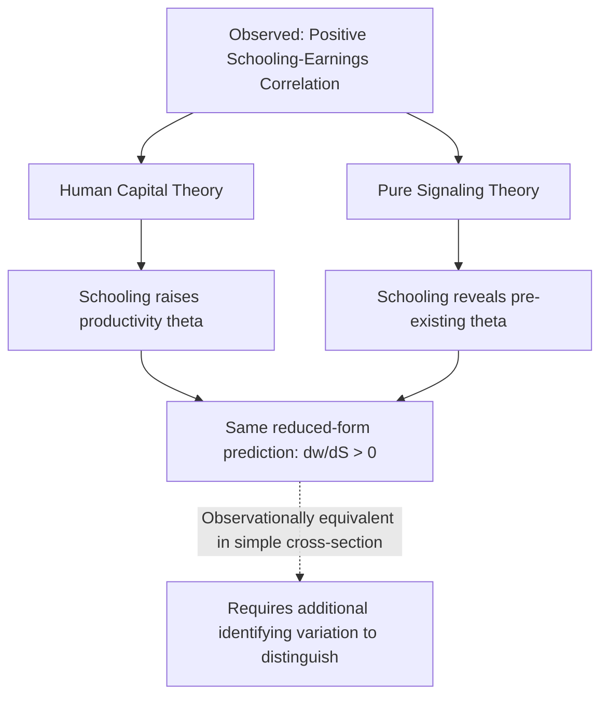
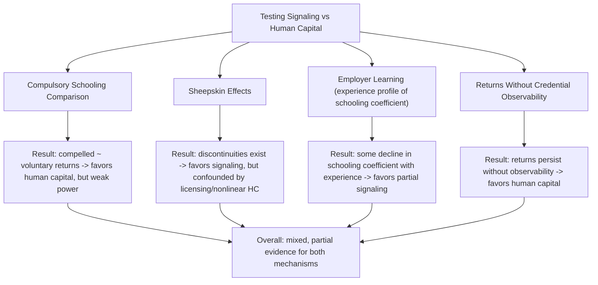

## Signaling Versus Human Capital Explanations

### Overview

This item directly confronts the central identification problem introduced by Spence's signaling model: given that both human capital theory and signaling theory predict a positive correlation between schooling and earnings, how can researchers empirically distinguish the two, and what does the evidence suggest about their relative importance? This is one of the longest-running unresolved debates in labor economics, with methodological, empirical, and welfare-policy implications spanning both the human capital and signaling literatures.

### Why the Two Theories Are Observationally Similar

**Key Points**

- Both theories predict $\partial \ln w / \partial S > 0$ — more schooling is associated with higher earnings
- Both theories are consistent with a positive correlation between measured ability proxies (e.g., test scores) and schooling, since higher-ability individuals may both find schooling more productive (human capital) and cheaper to acquire (signaling)
- A single cross-sectional wage regression **cannot, by construction, distinguish the two mechanisms** — the identical reduced-form equation is consistent with both a purely productivity-based story and a purely sorting-based story
- This observational equivalence is what has motivated decades of creative identification strategies attempting to find differential predictions between the two theories

### Formal Distinction Between the Models

| Feature | Human Capital Theory | Pure Signaling Theory |
| --- | --- | --- |
| Effect of $S$ on productivity $\theta$ | Direct causal effect: $\theta = \theta(S)$ | None: $\theta$ fixed, exogenous to $S$ |
| Social value of education expansion | Positive (raises aggregate output) | Zero or negative (pure sorting cost) |
| Return to *involuntary* schooling variation (e.g., compulsory schooling law) | Should equal return to voluntary schooling | Should be near zero, since forced schooling doesn't change perceived ability if not chosen to signal |
| Return in settings where credentials are unobserved by employers | Should persist (productivity effect independent of signal transmission) | Should vanish (no one to signal to) |
| Wage-experience profile for schooling coefficient | Should not systematically decline as employers learn true productivity | Should decline as employers substitute direct observation for the initial signal |
| Sheepskin/credential discontinuities | Not predicted under smooth production function (unless licensing effects) | Predicted, since discrete credentials often serve as discrete signaling thresholds |

### Empirical Strategy 1: Compulsory Schooling Law Comparisons

**Key Points**

- The logic: if schooling induced by compulsory attendance laws (rather than voluntary choice) yields the same earnings return as voluntarily chosen schooling, this favors human capital theory, since compelled schooling should carry little to no signaling value (an employer knowing schooling was legally mandatory, not chosen, gains less information about worker ability from observing it)
- Studies using compulsory schooling law instruments (see the Ability Bias and Instrumental Variable Approaches item for full IV mechanics) have generally found returns to instrumented (compelled) schooling that are similar in magnitude to OLS returns to voluntary schooling, which many researchers interpret as evidence *against* a dominant pure-signaling explanation for the bulk of the Mincerian return [documented interpretation in the literature, though the inference is indirect and depends on assumptions about how much signaling value compelled versus voluntary schooling actually carries]
- **Critique of this test**: it is not fully clean, since employers may not actually know whether a specific worker's schooling was legally compelled or voluntarily chosen at the margin — the signal (years of schooling on a resume) looks identical either way, so the test's power to distinguish signaling from human capital is weaker than it first appears [Inference: this is a recognized methodological limitation of using compulsory schooling variation to test the signaling hypothesis specifically]

### Empirical Strategy 2: Sheepskin Effects

**Key Points**

- If earnings rise disproportionately at credential-completion years (12th grade, 4-year college degree) relative to non-completion years of equivalent schooling duration, this discontinuity is often interpreted as evidence for signaling, since human capital accumulation via a smooth production function should generate roughly continuous returns per year of schooling
- Empirical studies (e.g., Hungerford & Solon 1987; Jaeger & Page 1996) have documented statistically significant sheepskin effects — disproportionate returns at diploma/degree-completion years [documented empirical finding across multiple studies, though the precise magnitude and its full interpretation remain debated]
- **Alternative (non-signaling) explanations for sheepskin effects**:
  1. Occupational licensing requirements directly tied to credential completion (e.g., certain professions legally require a specific degree) — a regulatory/institutional explanation unrelated to pure signaling
  2. Nonlinear, threshold-based human capital production, where completing a coherent curriculum (versus partial coursework) genuinely confers disproportionately more skill
  3. Employer screening heuristics that use credentials as a low-cost administrative filter, which is related to but conceptually distinct from Spence's game-theoretic signaling equilibrium
- Because of these alternative explanations, sheepskin effects are considered **suggestive but not definitive** evidence for pure signaling

### Empirical Strategy 3: Employer Learning Models

**Key Points**

- The Farber-Gibbons (1996) and Altonji-Pierret (2001) employer learning framework provides one of the more theoretically sharp tests: if education is partly a signal that employers use because they cannot yet observe true productivity, the schooling coefficient in a wage regression should **decline with labor market experience**, as employers substitute directly observed performance for the initial (partially uninformative once true ability is revealed) signal
- Correspondingly, the coefficient on ability proxies *not* observed by employers at hiring (e.g., AFQT scores not disclosed on resumes) should **increase with experience**, as this information becomes indirectly revealed through observed performance and wage-setting
- Altonji & Pierret (2001), using NLSY data, found empirical patterns broadly consistent with this prediction, providing some support for a signaling component in the return to schooling — though the estimated magnitude of the signaling component varies across studies and specifications [documented finding; magnitude and robustness across specifications and datasets debated]
- **Critique**: employer learning could also reflect firms updating about human-capital-relevant traits that are themselves subject to continued human capital investment/depreciation on the job, muddying a clean signaling interpretation

### Empirical Strategy 4: Returns Where Credentials Cannot Be Observed

**Key Points**

- If pure signaling requires transmission of the signal to an economic agent making a decision based on it, settings where credentials are unobservable or unverifiable to the relevant party should show a **weaker or absent schooling-earnings relationship** under pure signaling, but a **persistent relationship** under human capital theory
- Some studies have examined self-employed individuals (who effectively "hire themselves" and thus cannot benefit from signaling their own ability to themselves) and found continued positive returns to schooling in self-employment earnings, cited as evidence for a human capital component [Inference: this comparison is a recognized test design in the literature, though self-employment earnings involve their own selection and measurement complications that complicate clean interpretation]
- Similarly, studies of returns to schooling in informal-sector or subsistence-agriculture settings in developing countries, where formal credential verification by employers/buyers is often minimal, provide another quasi-natural test setting, generally also finding continued positive (though sometimes smaller) returns [Inference: interpretation of these findings as evidence against pure signaling requires assuming genuinely minimal credential transmission in these settings, which is itself an empirical question]

### Synthesis: The Prevailing View in the Literature

**Key Points**

- The consensus among most labor economists is that the observed return to schooling likely reflects a **mixture of human capital accumulation and signaling/sorting**, rather than either theory being exclusively correct [broadly reflects standard framing in labor economics textbooks and surveys]
- The precise magnitude split between the two components remains genuinely unresolved and is likely to vary by education level (e.g., signaling may play a larger relative role at the margin of college completion, where credentialing is most salient, versus lower grade levels where basic literacy/numeracy human capital gains are more plausibly dominant), country/institutional context, and labor market sector
- Some researchers (e.g., work associated with Bryan Caplan's *The Case Against Education*, 2018) have argued for a larger relative signaling component than the mainstream consensus, generating continued academic and public debate; this remains a **contested position rather than an established empirical consensus** [Speculation-adjacent public debate; Caplan's specific quantitative claims about the signaling share are disputed by other researchers in the field, and should be treated as one perspective within an ongoing debate rather than a settled figure]

### Welfare and Policy Implications of the Decomposition

**Key Points**

- If the signaling share is large, the **social** return to expanding education access (relevant for public subsidy policy) is smaller than the **private** Mincerian return, since a substantial fraction of the private benefit comes at the expense of other workers being relatively disadvantaged in the sorting competition (a zero-sum-like element) rather than raising aggregate output
- If the human capital share is large, education subsidies are more clearly justified on productivity/growth grounds, aligning private and social returns more closely
- This decomposition question directly connects to the "Human Capital and Economic Growth" item's puzzle (Pritchett's weak cross-country schooling-growth link) — if a substantial fraction of the individual-level return to schooling is pure signaling/sorting rather than productivity enhancement, this could partly explain why aggregate cross-country growth regressions find a weaker schooling-growth relationship than the robust micro-level Mincerian evidence would suggest, since signaling/sorting benefits accruing to individuals do not necessarily aggregate into higher total output [Inference: this connection between the signaling debate and the Pritchett aggregation puzzle is a recognized theoretical linkage discussed in the broader human capital literature, though it is one of several proposed explanations for the puzzle, not a fully established resolution]
- Credential inflation: if signaling plays a substantial role, expanding access to a given credential (e.g., broader bachelor's degree attainment) may simply raise the threshold required for effective signaling (employers requiring a master's degree where a bachelor's previously sufficed), without a proportional productivity gain — a dynamic consistent with observed long-run credential inflation trends in many labor markets [documented observed trend, causal attribution to signaling dynamics specifically is one of several proposed explanations alongside skill-biased technical change and other factors]

### Worked Illustration: Decomposing a Mincerian Coefficient

Suppose the standard Mincer regression yields $\hat{\beta}_1 = 0.09$ (a 9% return per year of schooling). Suppose further that a compulsory-schooling-law IV estimate (interpreted as closer to the pure human capital component, per the logic above) yields $\hat{\beta}_1^{IV} = 0.075$.

**Illustrative interpretation** (not a rigorous decomposition, but the type of reasoning sometimes informally applied):

$$\text{Signaling-attributable share} \approx \frac{0.09 - 0.075}{0.09} \approx 16.7\%$$

**Important caveat**: this back-of-envelope subtraction is *not* methodologically rigorous, since IV estimates using compulsory schooling instruments identify a LATE for a specific complier population and are subject to their own biases (weak instruments, potential exclusion restriction violations) — the gap between OLS and IV estimates reflects multiple potential sources (ability bias, LATE-vs-ATE differences, measurement error) beyond just a clean signaling/human-capital decomposition. This example is included only to illustrate the *type* of reasoning researchers have informally applied, not as an endorsed rigorous methodology.

*[Unverified/illustrative]: Numbers are constructed for pedagogical purposes; no specific published study is being cited or represented here.*

### Diagram: Decomposing the Mincerian Return (svg_diagram)

<svg xmlns="http://www.w3.org/2000/svg" viewBox="0 0 700 340">
<rect width="700" height="340" fill="#ffffff" />
<text x="350" y="25" font-size="16" font-weight="bold" text-anchor="middle" fill="#1a1a1a">Decomposing the Observed Return to Schooling (svg_diagram)</text>
<rect x="250" y="55" width="200" height="50" rx="6" fill="#dbeafe" stroke="#2563eb" />
<text x="350" y="85" font-size="12" font-weight="bold" text-anchor="middle" fill="#1e3a8a">Observed Mincerian Return (~9%)</text>
<rect x="100" y="160" width="220" height="70" rx="6" fill="#dcfce7" stroke="#059669" />
<text x="210" y="185" font-size="12" font-weight="bold" text-anchor="middle" fill="#064e3b">Human Capital Component</text>
<text x="210" y="203" font-size="10" text-anchor="middle" fill="#064e3b">Genuine productivity increase</text>
<text x="210" y="218" font-size="10" text-anchor="middle" fill="#064e3b">Socially valuable</text>
<rect x="380" y="160" width="220" height="70" rx="6" fill="#fee2e2" stroke="#dc2626" />
<text x="490" y="185" font-size="12" font-weight="bold" text-anchor="middle" fill="#7f1d1d">Signaling/Sorting Component</text>
<text x="490" y="203" font-size="10" text-anchor="middle" fill="#7f1d1d">Reveals pre-existing ability</text>
<text x="490" y="218" font-size="10" text-anchor="middle" fill="#7f1d1d">Privately valuable, socially costly</text>
<line x1="350" y1="105" x2="210" y2="160" stroke="#666" stroke-width="1.5" />
<line x1="350" y1="105" x2="490" y2="160" stroke="#666" stroke-width="1.5" />
<rect x="150" y="270" width="400" height="50" rx="6" fill="#f3f4f6" stroke="#6b7280" />
<text x="350" y="292" font-size="11" font-weight="bold" text-anchor="middle" fill="#1f2937">Exact split remains empirically unresolved</text>
<text x="350" y="308" font-size="9" text-anchor="middle" fill="#374151">Likely varies by education level, sector, and institutional context</text>
</svg>

### Practical Guidance for Interpreting Applied Returns-to-Schooling Estimates

**Key Points**

1. Any estimated Mincerian coefficient — whether from OLS, IV, twin studies, or RDD — reflects **some combination** of human capital and signaling effects unless the specific identification strategy explicitly targets separating them (e.g., employer learning tests, credential-unobservability comparisons)
2. Policy conclusions drawn from a raw Mincerian coefficient about the *social* value of education expansion should be treated cautiously, since the private-return coefficient does not map one-to-one onto social welfare gains if a signaling component is present
3. Sheepskin effect tests and employer learning tests should be interpreted as **partial, suggestive evidence**, not definitive proof, given the alternative explanations available for each pattern
4. Researchers should be explicit about which component(s) of the schooling-earnings relationship a given identification strategy is best suited to isolate, rather than treating all returns-to-schooling estimates as interchangeable measures of a single "true" causal parameter

### Limitations and Open Questions

**Key Points**

- No single empirical test in the literature is considered fully dispositive; the overall evidentiary picture is built from multiple partial, sometimes conflicting studies using different identification strategies, populations, and time periods
- The theoretical models (pure human capital vs. pure signaling) are stylized polar cases; most economists view them as complementary rather than mutually exclusive explanations operating simultaneously in real labor markets [reflects general consensus framing, though the specific balance remains debated]
- Measuring the "social value" implications of the decomposition requires additional assumptions about general equilibrium effects, externalities, and dynamic effects on technology adoption that go beyond the simple accounting exercises typically presented
- The debate has significant public policy salience (higher education subsidy design, student loan policy, credential requirements in occupational licensing) but the underlying empirical decomposition needed to fully resolve competing policy positions remains incomplete [Inference: general characterization of the state of the debate's policy relevance and empirical maturity]

**Next Steps**

- Spence's Job Market Signaling Model (theoretical foundation)
- The Mincer Earnings Function (baseline empirical specification)
- Ability Bias and Instrumental Variable Approaches (identification toolkit)
- Employer Learning Models (Farber-Gibbons, Altonji-Pierret)
- Screening Models and Self-Selection (Rothschild-Stiglitz)
- Occupational Licensing and Credentialism
- Credential Inflation in Labor Markets
- Human Capital and Economic Growth (macro-level aggregation puzzle connection)