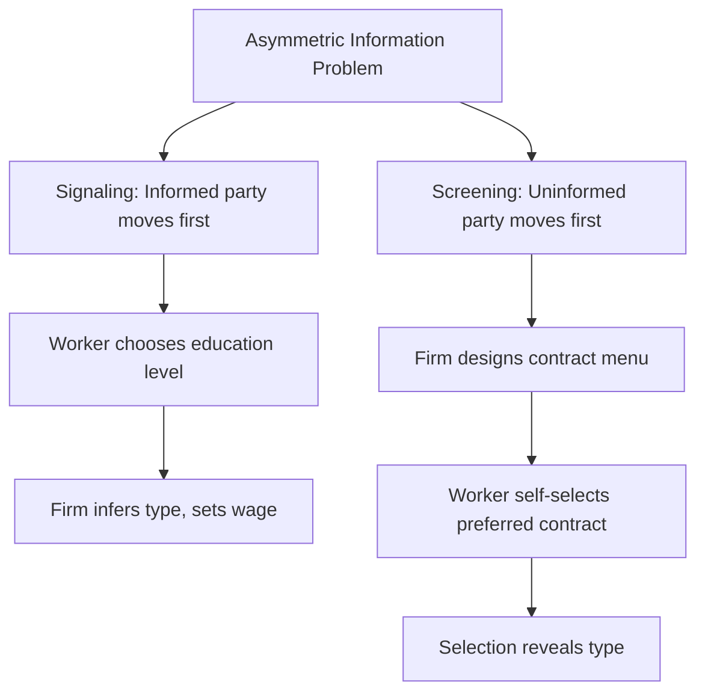
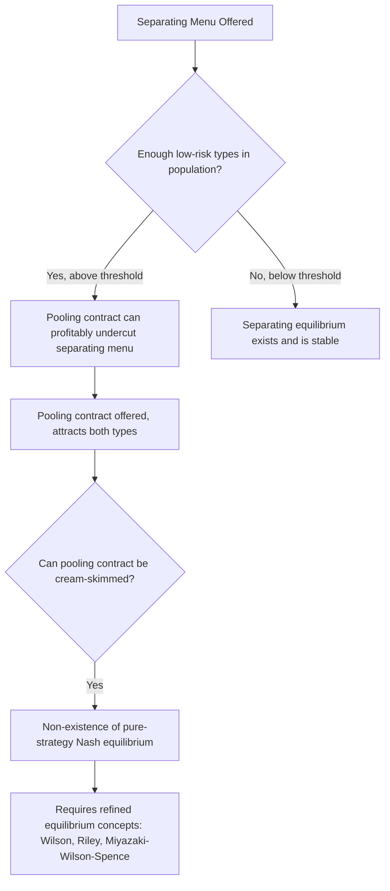

## Screening and Sorting Equilibria

### Overview

While Spence's signaling model places the informed party (workers) as the active agent choosing a costly signal, screening models place the uninformed party (firms, insurers, or other principals) as the active designer of a menu of contracts intended to induce self-selection by type. Developed primarily by Rothschild & Stiglitz (1976) in insurance markets and extended to labor markets, screening theory provides a complementary — and in some respects more general — framework for understanding how markets resolve information asymmetries through sorting mechanisms, with its own distinct equilibrium existence problems and empirical applications.

### Signaling Versus Screening: The Fundamental Distinction

**Key Points**

- **Signaling** (Spence 1973): the *informed* party (worker) moves first, choosing a costly action (education) before the uninformed party (firm) responds with a wage offer
- **Screening** (Rothschild-Stiglitz 1976): the *uninformed* party (firm/insurer) moves first, designing a menu of contracts (e.g., wage-hours combinations, wage-tenure profiles, insurance policies with varying premium-deductible combinations), and the informed party then self-selects among the offered menu
- Both frameworks share the core insight that **self-selection based on differential costs or preferences across types** can achieve informational separation without requiring direct observation of the unobservable type
- The key game-theoretic distinction is the order of moves and which party bears the design burden — this has significant implications for equilibrium existence, as detailed below

### The Rothschild-Stiglitz Screening Model (Insurance Market Origin)

**Key Points**

- Originally developed for insurance markets: insurers cannot observe individual accident/risk probabilities directly, but can design a menu of policies (premium, coverage/deductible combinations) such that high-risk and low-risk individuals self-select into different policies
- High-risk individuals prefer policies with more complete coverage (since they expect to file claims more often, high coverage is worth the higher premium), while low-risk individuals prefer policies with partial coverage and lower premiums (since they are less likely to need extensive coverage)
- The screening menu is designed so that each type's incentive-compatible choice reveals their true type, achieving separation through **quantity/quality rationing** rather than a costly pre-market signal

#### Adaptation to Labor Markets

**Key Points**

- In a labor market screening application, firms might offer menus such as:
  - Wage-hours combinations (e.g., a lower base wage with generous overtime pay versus a higher flat wage with no overtime), designed so that high-productivity/high-effort workers self-select into the performance-sensitive contract
  - Wage-tenure profiles (steep seniority-based wage growth versus flat wage schedules), where workers who intend to stay long-term (often correlated with lower turnover-prone types) self-select into the back-loaded contract, as in Lazear's (1979) delayed compensation model (connecting screening theory to efficiency wage and implicit contract literatures)
  - Piece-rate versus fixed-wage contract offers, where higher-ability/higher-effort workers self-select into piece-rate schemes that reward their (privately known) higher productivity

### Formal Structure: Menu Design and Incentive Compatibility

**Key Points**

- The firm (or insurer) designs a set of contracts $\{(w_H, x_H), (w_L, x_L)\}$ where $w$ is a wage/premium term and $x$ is a quantity/quality term (hours, coverage, effort requirement)
- **Incentive compatibility constraints** ensure each type prefers their intended contract:

$$U_H(w_H, x_H) \geq U_H(w_L, x_L) \quad \text{(H prefers own contract to L's)}$$

$$U_L(w_L, x_L) \geq U_L(w_H, x_H) \quad \text{(L prefers own contract to H's)}$$

- **Participation constraints** ensure each type prefers participating over the outside option:

$$U_H(w_H, x_H) \geq U_H^{outside}, \quad U_L(w_L, x_L) \geq U_L^{outside}$$

- The firm/insurer typically also faces a **zero-profit condition** (in competitive equilibrium) for each contract, given the self-selected type composition

### The Rothschild-Stiglitz Non-Existence Problem

**Key Points**

- A central and famous result of the Rothschild-Stiglitz framework is that a **pure-strategy separating equilibrium may fail to exist** under certain conditions, particularly when the proportion of low-risk (or low-cost) types in the population is sufficiently high
- Intuition: if there are enough low-risk types, an entrant firm could profitably offer a **pooling contract** that attracts both types away from the separating menu, since the pooling contract can be priced based on average risk while still being attractive to both types relative to their separating-equilibrium contracts — but this pooling contract itself is then vulnerable to further undercutting by contracts that cream-skim the low-risk types, leading to a **non-existence** of any stable pure-strategy Nash equilibrium in some parameter regions
- This differs sharply from the Spence signaling model, where a continuum of separating equilibria typically exists (with equilibrium selection, not existence, being the primary issue) — the screening model can have **existence failure** as a more fundamental problem
- Subsequent literature has proposed various equilibrium refinements and alternative solution concepts to address this non-existence issue, including:
  - **Wilson (1977) equilibrium**: allows firms to anticipate and react to the withdrawal of unprofitable contracts by competitors, restoring equilibrium existence in a modified game structure
  - **Riley (1979) reactive equilibrium**: incorporates anticipated entry-deterrence responses
  - **Miyazaki-Wilson-Spence equilibrium concepts**: allow cross-subsidization between contract types within a single firm's offered menu

### Comparing Signaling and Screening Equilibrium Properties

| Property | Spence Signaling | Rothschild-Stiglitz Screening |
| --- | --- | --- |
| Who moves first | Informed party (worker) | Uninformed party (firm/insurer) |
| Equilibrium existence | Generally exists (multiple separating equilibria) | Can fail to exist under competitive conditions |
| Equilibrium multiplicity | Multiple separating equilibria; selection problem (Riley outcome) | Fewer equilibria when they exist, but existence itself is fragile |
| Welfare properties | Separating equilibrium may be costly (wasted signaling resources) relative to full information | Separating equilibrium is typically less wasteful than signaling, since sorting occurs through contract design rather than costly external actions, but is still inefficient relative to full information |
| Typical market context | Education/labor markets | Insurance markets; adapted to labor contracts, credit markets, and other settings |

### Screening in Labor Contract Design: Selected Applications

**Key Points**

1. **Efficiency wage/deferred compensation screening**: Lazear's (1979) model of rising wage-tenure profiles can be interpreted through a screening lens — offering back-loaded compensation schedules screens out workers who intend to shirk or leave early, since only workers planning long tenure find the contract attractive relative to a flat-wage alternative
2. **Piece-rate versus salary self-selection**: firms offering a choice between piece-rate and fixed-salary compensation can screen for worker ability/effort type, since higher-ability workers rationally prefer piece-rate schemes (they expect to earn more under performance-based pay) — empirically studied in contexts like windshield installation (Lazear 2000) and other performance-pay natural experiments [documented in the personnel economics literature]
3. **Probationary periods and up-or-out contracts**: initial low-wage probationary contracts followed by a promotion/termination decision can function as a screening device, allowing firms to observe performance before committing to long-term high-wage contracts — connects to "up-or-out" tournament and promotion literature in personnel economics
4. **Benefits package self-selection**: offering menus of benefits (health insurance generosity, retirement contribution matching, parental leave policies) can screen for worker characteristics correlated with expected tenure or family circumstances, though this raises separate discrimination and adverse selection concerns in practice

### Worked Illustration: Simplified Screening Menu

Suppose a firm faces two worker types: high-effort ($H$) and low-effort ($L$), with cost of effort $c_H = 2$ and $c_L = 5$ (low-effort workers find effort more costly), and output per unit effort $= 10$.

The firm offers two contracts:

- **Contract A** (high-powered): base wage $w_A = 20$, requires effort level $e = 3$
- **Contract B** (low-powered): base wage $w_B = 35$, requires effort level $e = 1$

**Utility check (net of effort cost):**

For type $H$ ($c_H = 2$):

$$U_H(A) = 20 - 2(3) = 14, \quad U_H(B) = 35 - 2(1) = 33$$

Under this parameterization, type $H$ actually prefers Contract B — indicating the menu as specified does **not** achieve the intended separation and would need to be redesigned with steeper incentive-compatible pricing (e.g., a genuine piece-rate structure where pay scales directly with output) for high-effort types to be induced to select the high-effort contract.

**Corrected illustrative piece-rate contracts:**

- **Contract A'**: pay $= 5 \times \text{output}$, no fixed base
- **Contract B'**: flat wage $= 25$, regardless of output

Under piece rate, type $H$ (low cost of effort, presumably higher output capability) earns more by selecting into the piece-rate contract, while type $L$ (high cost of effort) prefers the flat wage, achieving separation.

*[Unverified/illustrative]: Numbers and this simplified example are constructed for pedagogical demonstration of the incentive-compatibility mechanics involved in screening menu design, and do not represent a specific empirical or published model calibration.*

### Diagram: Screening Menu Self-Selection (svg_diagram)

<svg xmlns="http://www.w3.org/2000/svg" viewBox="0 0 700 400">
<rect width="700" height="400" fill="#ffffff" />
<text x="350" y="25" font-size="16" font-weight="bold" text-anchor="middle" fill="#1a1a1a">Screening: Firm-Designed Contract Menu (svg_diagram)</text>
<rect x="270" y="50" width="160" height="45" rx="6" fill="#dbeafe" stroke="#2563eb" />
<text x="350" y="77" font-size="12" font-weight="bold" text-anchor="middle" fill="#1e3a8a">Firm Designs Menu</text>
<rect x="100" y="140" width="200" height="55" rx="6" fill="#dcfce7" stroke="#059669" />
<text x="200" y="162" font-size="11" font-weight="bold" text-anchor="middle" fill="#064e3b">Contract A: Piece-Rate</text>
<text x="200" y="178" font-size="9" text-anchor="middle" fill="#064e3b">Pay scales with output</text>
<rect x="400" y="140" width="200" height="55" rx="6" fill="#fef3c7" stroke="#d97706" />
<text x="500" y="162" font-size="11" font-weight="bold" text-anchor="middle" fill="#78350f">Contract B: Flat Wage</text>
<text x="500" y="178" font-size="9" text-anchor="middle" fill="#78350f">Fixed pay, no performance link</text>
<line x1="350" y1="95" x2="200" y2="140" stroke="#666" stroke-width="1.5" />
<line x1="350" y1="95" x2="500" y2="140" stroke="#666" stroke-width="1.5" />
<rect x="100" y="250" width="200" height="55" rx="6" fill="#f3f4f6" stroke="#6b7280" />
<text x="200" y="272" font-size="11" font-weight="bold" text-anchor="middle" fill="#1f2937">High-Ability/Effort Workers</text>
<text x="200" y="288" font-size="9" text-anchor="middle" fill="#374151">Self-select into piece-rate</text>
<rect x="400" y="250" width="200" height="55" rx="6" fill="#f3f4f6" stroke="#6b7280" />
<text x="500" y="272" font-size="11" font-weight="bold" text-anchor="middle" fill="#1f2937">Low-Ability/Effort Workers</text>
<text x="500" y="288" font-size="9" text-anchor="middle" fill="#374151">Self-select into flat wage</text>
<line x1="200" y1="195" x2="200" y2="250" stroke="#666" stroke-width="1.5" />
<line x1="500" y1="195" x2="500" y2="250" stroke="#666" stroke-width="1.5" />
<rect x="200" y="340" width="300" height="45" rx="6" fill="#ede9fe" stroke="#7c3aed" />
<text x="350" y="365" font-size="11" font-weight="bold" text-anchor="middle" fill="#4c1d95">Self-selection reveals type without direct observation</text>
</svg>

### Sorting Equilibria More Broadly: Roy Model Connections

**Key Points**

- Screening and signaling models of information asymmetry should be distinguished from the broader concept of **sorting equilibria** in labor economics, such as the Roy (1951) model of occupational/sectoral self-selection based on comparative advantage
- The Roy model describes workers sorting across sectors (e.g., agriculture versus manufacturing, or across occupations) based on their own comparative productivity advantage, generating selection effects in observed sectoral wage distributions **without necessarily involving any asymmetric information problem** — this is a distinct (though related) sorting mechanism from the signaling/screening literature's focus on resolving informational asymmetry
- Roy-model-style self-selection has significant implications for interpreting cross-sectional wage comparisons across occupations, migration decisions, and union/non-union sector comparisons, since observed wage differences partly reflect selection on unobserved comparative advantage rather than a pure treatment effect of occupation choice itself

### Empirical Applications of Screening Theory

**Key Points**

- **Personnel economics research** on performance-pay adoption and its effects on worker composition (e.g., Lazear's 2000 windshield-installation piece-rate study) provides some of the clearest empirical evidence for screening-type self-selection effects in real labor markets, finding that switching from fixed wages to piece rates raised average output partly through worker self-selection (higher-ability workers self-selecting into or remaining at the firm) in addition to any direct incentive effect on existing workers [documented empirical finding from a widely cited natural-experiment-style study]
- **Insurance market applications** (health insurance plan choice, life insurance underwriting) remain the most direct empirical testing ground for the original Rothschild-Stiglitz framework, with mixed empirical support for the predicted separating equilibrium structure — some studies find evidence consistent with adverse-selection-driven sorting (e.g., a positive correlation between coverage generosity chosen and subsequent claims), while others find this correlation is weak or absent in certain markets, motivating extensions incorporating both adverse selection and moral hazard simultaneously [documented mixed empirical picture in the insurance economics literature]

### Applications and Policy Relevance

**Key Points**

- Understanding screening equilibria informs the design of employee benefit and compensation packages intended to attract and retain desired worker types without requiring costly direct assessment
- The Rothschild-Stiglitz non-existence result has significant regulatory implications for insurance markets (health insurance mandate debates, in particular), since it suggests that unregulated competitive insurance markets facing adverse selection may not settle into a stable equilibrium at all, providing a theoretical rationale for regulatory interventions like mandated minimum coverage or community rating
- In labor market contexts, screening theory provides a framework for understanding "up-or-out" promotion systems, probationary employment periods, and performance-pay adoption as rational institutional responses to unobservable worker type, complementing signaling theory's emphasis on pre-market credentialing

### Limitations and Open Questions

**Key Points**

- The non-existence problem in the pure Rothschild-Stiglitz framework remains a genuine theoretical complication; real-world markets evidently do reach some form of stable outcome, suggesting that either the refined equilibrium concepts (Wilson, Miyazaki-Wilson-Spence) or additional real-world features (regulation, repeated interaction, reputation) resolve the theoretical non-existence issue in practice, though which mechanism dominates in any given market is an empirical question not fully settled by the theory alone [Inference: general characterization of the gap between theoretical non-existence results and observed market stability]
- Empirically distinguishing screening-driven sorting from other sources of worker-firm sorting (comparative advantage à la Roy, pure preference heterogeneity unrelated to information asymmetry, search frictions) remains methodologically challenging
- As with signaling theory more broadly, screening models are often better suited to qualitative/conceptual understanding of contract design logic than to precise quantitative prediction, given the sensitivity of equilibrium outcomes to specific functional form and parameter assumptions

**Next Steps**

- Spence's Job Market Signaling Model (contrasting framework)
- Signaling Versus Human Capital Explanations (empirical decomposition)
- The Roy Model of Occupational Self-Selection
- Personnel Economics: Performance Pay and Worker Sorting (Lazear)
- Adverse Selection in Insurance Markets
- Efficiency Wage Theory and Deferred Compensation
- Game-Theoretic Equilibrium Concepts (Wilson, Riley, Miyazaki-Wilson-Spence)
- Occupational Licensing as an Alternative Screening Mechanism