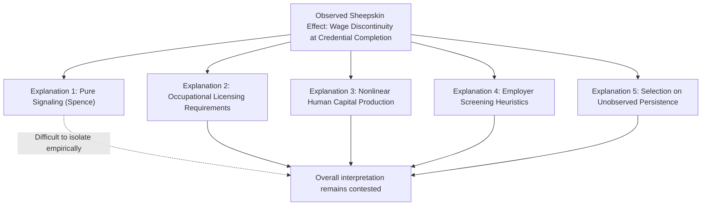
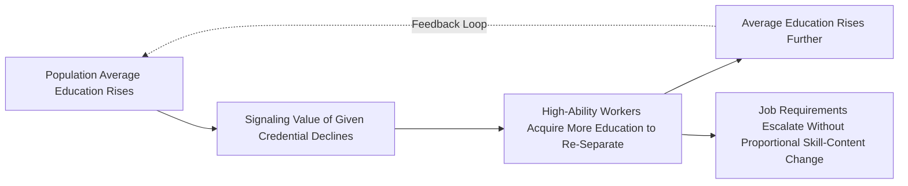

## Credentialism and Sheepskin Effects

### Overview

Sheepskin effects refer to the empirical phenomenon that earnings jump disproportionately at credential-completion points (e.g., completing 12th grade to obtain a high school diploma, completing a fourth year of college to obtain a bachelor's degree), relative to earnings gains from equivalent years of schooling that do not culminate in a credential. Credentialism refers to the broader labor-market phenomenon of employers using formal credentials as hiring/promotion filters, sometimes argued to exceed what is justified by the actual skill content the credential certifies. This item examines the empirical documentation of sheepskin effects, competing theoretical explanations, and the credential inflation dynamics connected to both signaling and screening theory.

### Defining and Measuring Sheepskin Effects

**Key Points**

- The term "sheepskin effect" derives from the historical practice of printing diplomas on sheepskin parchment — the "sheepskin" itself (the credential document) is argued to carry independent labor market value beyond the underlying skills it certifies
- Empirically, sheepskin effects are identified by estimating a wage equation with **schooling-level dummy variables** (rather than a continuous linear years-of-schooling term) and testing whether the coefficients jump disproportionately at credential-completion years:

$$\ln w_i = \beta_0 + \sum_{k} \delta_k \cdot \mathbb{1}[S_i = k] + \mathbf{X}_i\boldsymbol{\gamma} + \varepsilon_i$$

- A pure linear human capital production process would predict roughly equal increments $(\delta_{k} - \delta_{k-1})$ across all years of schooling; sheepskin effects are evidenced by finding $(\delta_{12} - \delta_{11})$ (diploma year) or $(\delta_{16} - \delta_{15})$ (bachelor's degree year) substantially exceeding the increments for adjacent non-credential years

### Key Empirical Studies

**Key Points**

- **Hungerford & Solon (1987)**: one of the earliest rigorous documentations of sheepskin effects using U.S. Current Population Survey data, finding statistically significant discontinuities at diploma/degree-completion years relative to a smooth linear schooling specification [documented finding from an influential early paper in this literature]
- **Jaeger & Page (1996)**: extended the analysis and found sheepskin effects robust across demographic groups and specifications, further reinforcing the empirical robustness of the credential-discontinuity pattern [documented finding]
- **Subsequent literature**: has generally replicated the qualitative finding of credential discontinuities across various datasets and countries, though the precise magnitude of the effects varies by study, time period, and country [Unverified precise magnitudes — cross-study comparison requires care given differing specifications, samples, and time periods; consult primary sources for specific quantitative claims]

### Competing Explanations for Sheepskin Effects

**Key Points**

Sheepskin effects are consistent with multiple distinct theoretical mechanisms, which is precisely what makes them suggestive-but-not-definitive evidence for pure signaling (as discussed in the Signaling Versus Human Capital Explanations item):

1. **Pure signaling interpretation**: credential completion functions as a discrete threshold signal in a Spence-style model — employers use degree completion (not partial coursework) as the relevant sorting variable, since the incentive-compatibility logic of separating equilibria often naturally generates discrete thresholds rather than smooth continuous signals
2. **Occupational licensing and regulatory requirements**: many professions (law, medicine, teaching, accounting, nursing, and various skilled trades) have **legal licensing requirements** tied explicitly to credential completion — a lawyer cannot practice without a J.D. and bar passage regardless of how many years of legal coursework were completed short of the degree. This is a direct institutional/regulatory explanation entirely independent of signaling theory
3. **Nonlinear human capital production**: completing a coherent, integrated curriculum (capstone courses, comprehensive coordinated skill-building across a full degree program) may genuinely confer disproportionately more human capital than the sum of individual course components, especially where skills are complementary and only fully "activate" once the complete skill set is acquired
4. **Employer screening heuristics/administrative filtering**: even absent formal game-theoretic signaling equilibria, employers may use credential completion as a low-cost administrative filter for large applicant pools (a practical HR screening tool), which is related to but conceptually distinct from Spence's strategic signaling framework — this is closer to a "rule of thumb" cost-minimization heuristic than deliberate equilibrium sorting
5. **Selection on unobserved persistence/conscientiousness**: individuals who complete a credential (versus dropping out one year short) may differ systematically in unobserved traits like conscientiousness, persistence, or planning ability that independently predict labor market success — completion itself becomes a signal of these traits, somewhat distinct from ability-based signaling in the classic Spence sense

### Distinguishing the Licensing Explanation Empirically

**Key Points**

- One useful empirical strategy for isolating the licensing-specific explanation from broader signaling/screening interpretations is to compare sheepskin effects **across occupations that do and do not have formal licensing requirements tied to specific credentials**
- If sheepskin effects are substantially larger or exclusively present in licensed occupations (medicine, law, teaching, cosmetology in some jurisdictions) compared to unlicensed occupations requiring similar credential levels, this supports the licensing-specific explanation over a general signaling story
- If sheepskin effects persist at similar or comparable magnitude even in occupations without formal licensing ties to specific credentials, this is more consistent with a general signaling or screening-heuristic explanation operating independently of regulatory requirements [Inference: this comparative empirical design is a recognized strategy in the literature for partially isolating the licensing channel, though full separation of all five explanations listed above from a single empirical design remains difficult]

### Credential Inflation: Theoretical Mechanism

**Key Points**

- **Credential inflation** (or "credentialism" in its dynamic sense) refers to the long-run trend of rising educational requirements for a given job, even where the actual skill content of the job has not proportionally increased
- Under a signaling-theoretic interpretation, credential inflation arises because: as the average education level in the population rises (for reasons potentially unrelated to any individual employer's actual skill needs, e.g., broader access to higher education, credit expansion for education financing, cultural/status motivations), the *relative* signaling value of any given credential level declines, since a larger fraction of average-or-below-average-ability workers can also now attain it
- This induces an "arms race" dynamic: high-ability workers must acquire progressively more education to maintain the same relative separation from lower-ability workers, even though the productivity content of any specific job may be unchanged — a job that once required only a high school diploma now requires a bachelor's degree, not because the job's tasks changed, but because credential inflation has eroded the diploma's separating power
- This dynamic is analytically related to (though distinct from) a pure Spence static equilibrium — it requires a **dynamic, population-level extension** of the signaling framework where the equilibrium separating threshold shifts over time as the underlying ability distribution of credential-holders changes [Inference: this dynamic extension of static signaling theory to explain credential inflation over time is a recognized theoretical application discussed in the signaling/screening literature, though formal dynamic equilibrium models of credential inflation are less standardized than the static Spence framework itself]

### Empirical Evidence on Credential Inflation

**Key Points**

- Studies documenting rising minimum educational requirements in job postings over time, even for occupations with relatively stable task content, are cited as evidence consistent with credential inflation dynamics [documented trend observed in labor market job-posting analyses over recent decades, though attribution of the full trend to signaling-driven credential inflation specifically — as opposed to genuine skill-biased technical change raising actual skill requirements — remains a subject of ongoing empirical and methodological debate]
- Distinguishing credential inflation (pure signaling escalation) from **skill-biased technical change** (genuine rising skill requirements due to changing technology) is methodologically challenging, since both predict rising observed educational requirements over time but for different underlying reasons with very different welfare implications
- Bryan Caplan's *The Case Against Education* (2018) argues for a substantial credential inflation/signaling interpretation of long-run rising educational attainment trends; this remains a **contested position** within the broader economics profession rather than an established consensus finding [explicitly noting this is one perspective in an active debate, not settled empirical consensus]

### Worked Numerical Example: Estimating a Sheepskin Effect

Suppose a wage regression with schooling-level dummies (relative to 11 years of schooling as the base category) yields:

$$\delta_{12} = 0.15 \text{ (High school diploma)}, \quad \delta_{15} = 0.28, \quad \delta_{16} = 0.48 \text{ (Bachelor's degree)}$$

**Calculating increments:**

- Increment from 11 to 12 years (diploma completion): $0.15 - 0 = 0.15$ (15 log points)
- Increment from 15 to 16 years (bachelor's completion): $0.48 - 0.28 = 0.20$ (20 log points)

If, by contrast, the increment from 13 to 14 years (a non-completion year within the college range) is estimated at only $0.05$ (5 log points), the disproportionate jump at the 16th year (bachelor's completion, 20 log points) relative to the smoother increment at year 14 (5 log points) constitutes the sheepskin effect — nearly four times the per-year wage gain concentrated at the credential-completion year.

*[Unverified/illustrative]: Coefficients are constructed for pedagogical demonstration and do not represent a specific published study's actual estimates; consult primary empirical sources (e.g., Jaeger & Page 1996 and subsequent replications) for documented magnitude ranges.*

### Diagram: Sheepskin Effect — Wage Profile by Years of Schooling (svg_diagram)

<svg xmlns="http://www.w3.org/2000/svg" viewBox="0 0 700 400">
<rect width="700" height="400" fill="#ffffff" />
<text x="350" y="25" font-size="16" font-weight="bold" text-anchor="middle" fill="#1a1a1a">Sheepskin Effect: Discontinuous Wage Profile (svg_diagram)</text>
<line x1="70" y1="350" x2="650" y2="350" stroke="#333" stroke-width="2" />
<line x1="70" y1="350" x2="70" y2="50" stroke="#333" stroke-width="2" />
<text x="360" y="380" font-size="13" text-anchor="middle" fill="#333">Years of Schooling</text>
<text x="25" y="200" font-size="13" text-anchor="middle" fill="#333" transform="rotate(-90 25 200)">ln(Wage)</text>
<path d="M 100 320 L 200 300 L 280 285" stroke="#2563eb" stroke-width="3" fill="none" />
<line x1="280" y1="285" x2="280" y2="215" stroke="#dc2626" stroke-width="3" stroke-dasharray="2,2" />
<text x="290" y="250" font-size="10" fill="#dc2626">Diploma jump (Yr 12)</text>
<path d="M 280 215 L 380 195 L 460 175 L 500 165" stroke="#2563eb" stroke-width="3" fill="none" />
<line x1="500" y1="165" x2="500" y2="90" stroke="#dc2626" stroke-width="3" stroke-dasharray="2,2" />
<text x="440" y="130" font-size="10" fill="#dc2626">Bachelor's jump (Yr 16)</text>
<path d="M 500 90 L 580 75" stroke="#2563eb" stroke-width="3" fill="none" />

<text x="95" y="335" font-size="10" fill="#666">9</text>

<text x="275" y="335" font-size="10" fill="#666">12</text>

<text x="495" y="335" font-size="10" fill="#666">16</text>

<text x="575" y="335" font-size="10" fill="#666">18</text>

</svg>

### Credentialism, Discrimination, and Labor Market Access

**Key Points**

- To the extent employers rely heavily on credentials as low-cost screening filters (whether for pure signaling reasons or administrative convenience), this can create **access barriers** for capable individuals who lack formal credentials due to cost, discrimination in educational access, or non-traditional career paths, even if their actual productivity would be comparable to credentialed workers
- This connects credentialism to policy debates around "skills-based hiring" reforms, which attempt to shift employer screening away from credential requirements toward direct skills assessments — an active area of contemporary human resources and labor market policy [Inference: this policy connection is a recognized contemporary application of credentialism theory in HR/labor market practice discussions, reflecting an active area of employer practice change rather than settled empirical consensus on effectiveness]
- Occupational licensing requirements, when not clearly justified by public safety/quality concerns, have been criticized by some economists as a form of institutionalized credentialism that raises entry barriers and reduces labor market mobility without proportional consumer protection benefit — though this remains a debated position with counterarguments emphasizing genuine quality assurance benefits of licensing in many professions [contested policy debate, presented evenhandedly]

### Applications and Policy Relevance

**Key Points**

- Understanding sheepskin effects is directly relevant to higher education policy debates about the value of degree completion versus partial coursework (e.g., policy discussions around "some college, no degree" populations, who empirically often see limited wage returns to partial college attendance despite incurring costs and forgone earnings)
- Credential inflation dynamics inform ongoing "skills-based hiring" reform movements, including removal of degree requirements from job postings by some large employers, aimed at reducing signaling-driven barriers to employment for qualified but uncredentialed workers
- Occupational licensing reform debates directly engage with the licensing-specific explanation for sheepskin effects, weighing consumer protection benefits against labor market entry barrier costs

### Limitations and Open Questions

**Key Points**

- The five competing explanations for sheepskin effects (signaling, licensing, nonlinear human capital, screening heuristics, unobserved persistence selection) are not mutually exclusive and likely operate simultaneously to varying degrees across different credentials, occupations, and contexts — no single study has definitively decomposed their relative contributions
- Distinguishing credential inflation (signaling-driven) from skill-biased technical change (genuine skill-requirement growth) in observed rising educational requirements over time remains a substantial empirical and methodological challenge
- Cross-country and cross-time comparisons of sheepskin effect magnitudes are complicated by differing educational system structures, licensing regimes, and labor market institutions, limiting the generalizability of any single country's documented findings
- The policy implications of credentialism (skills-based hiring reforms, licensing reform) rest on contested empirical premises about the relative signaling versus human capital content of credentials, meaning policy conclusions in this area should be treated as reflecting one interpretation within an ongoing debate rather than settled findings [Inference: general characterization of the state of policy debate maturity in this area]

**Next Steps**

- Spence's Job Market Signaling Model (theoretical foundation for discrete signaling thresholds)
- Signaling Versus Human Capital Explanations (broader empirical decomposition debate)
- Screening and Sorting Equilibria (contract-design alternative to signaling)
- Occupational Licensing: Economic Analysis and Policy Debates
- Skills-Based Hiring Reform Movements
- The Mincer Earnings Function (baseline continuous-schooling specification)
- Skill-Biased Technical Change (alternative explanation for rising skill requirements)
- Higher Education Policy: Completion Rates and "Some College, No Degree" Outcomes