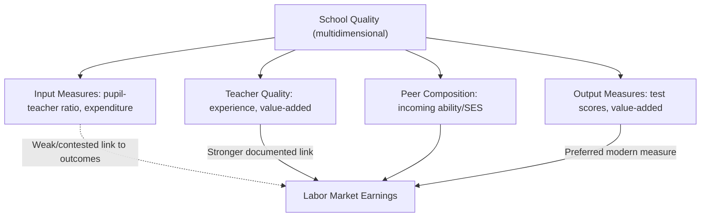
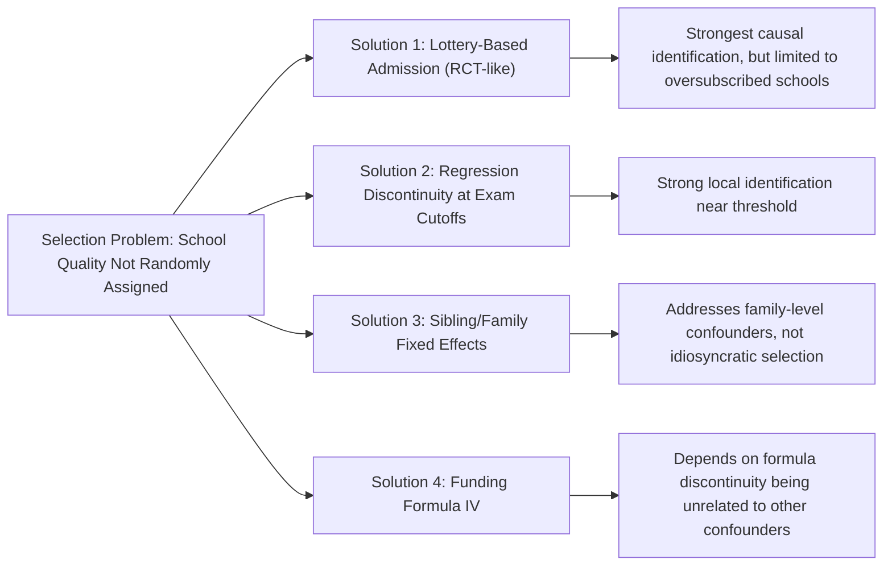

## School Quality and Labor Market Outcomes

### Overview

While the standard Mincer framework and much of the signaling/screening literature focus on *quantity* of schooling (years completed, credentials attained), a distinct and substantial literature examines how variation in school *quality* — resources, teacher effectiveness, peer composition, institutional characteristics — translates into differences in labor market outcomes conditional on years of schooling. This item surveys the theoretical channels linking school quality to earnings, the major empirical identification strategies used (given that school quality is itself endogenously chosen/sorted), and how this literature connects to and complicates both human capital and signaling interpretations of education's labor market value.

### Defining and Measuring School Quality

**Key Points**

- School quality is a multidimensional construct, commonly proxied in the empirical literature by:
  - **Resource inputs**: pupil-teacher ratios, per-pupil expenditure, teacher salaries, facility quality
  - **Teacher characteristics**: teacher experience, credentials, and (in more recent literature) estimated teacher "value-added" based on student test-score gains
  - **Peer/student body composition**: average incoming student ability or socioeconomic composition of the school
  - **Output-based measures**: average standardized test scores or test-score gains ("value-added") at the school level, increasingly preferred over simple input measures since they more directly capture the school's actual contribution to learning
- The shift in the literature from input-based to output/value-added-based quality measures reflects a broader recognition that resource inputs alone are often weakly correlated with actual learning gains — a key finding associated with the "does money matter?" debate in education economics (Hanushek's early work questioning simple resource-outcome links, subsequently qualified and refined by later research using more credible identification strategies) [documented ongoing debate in the education economics literature]

### Theoretical Channels: How School Quality Affects Earnings

**Key Points**

1. **Direct human capital channel**: higher-quality schooling produces more cognitive skill (as measured by test scores) per year of schooling, which then translates into higher productivity and earnings via the same mechanism as quantity-of-schooling in the standard Mincer framework — this is the most straightforward extension of human capital theory to incorporate quality
2. **Signaling/sorting channel**: attending a higher-quality or more selective school may itself serve as an additional signal of underlying ability, distinct from years of schooling completed (e.g., a degree from a highly selective university may signal ability beyond what the degree credential alone conveys) — connecting school quality to the signaling debate discussed elsewhere in this chapter
3. **Network/peer effects channel**: higher-quality schools, particularly selective universities, may provide access to valuable social/professional networks (alumni networks, recruiting relationships with high-paying employers) that independently raise earnings beyond any pure skill or signaling effect
4. **Complementarity with later human capital investment**: consistent with the Cunha-Heckman dynamic complementarity framework discussed in the Health as Human Capital item, higher-quality early schooling may raise the *productivity* of subsequent educational and on-the-job training investments, generating compounding effects over the life cycle

### The Identification Challenge: School Quality Is Not Randomly Assigned

**Key Points**

- Students (or their families) typically choose or are sorted into schools based on factors correlated with both unobserved ability/motivation and family resources — students attending higher-quality schools often differ systematically from those who do not, independent of the school's causal effect
- This is directly analogous to the ability bias problem in the basic returns-to-schooling literature (see Ability Bias and Instrumental Variable Approaches), but compounded by an additional layer: not only is the *decision to attend school* endogenous, but *which* school is attended is also endogenous, generating a more complex selection problem
- Naive comparisons of earnings across graduates of different-quality schools, without addressing this selection, will generally overstate the causal effect of school quality on earnings

### Empirical Identification Strategies

**Key Points**

1. **Value-added models with student/family fixed effects**: comparing outcomes for the same student or siblings from the same family across different school quality exposures, differencing out family-level unobserved heterogeneity — used extensively in K-12 teacher/school value-added research
2. **Regression discontinuity at admissions/enrollment thresholds**: exploiting sharp cutoffs in school admission (e.g., exam-score cutoffs for selective public schools, "exam schools") to compare students just above and just below the threshold, who are otherwise similar in observed and plausibly unobserved characteristics
3. **Lottery-based identification**: school choice lotteries (common in oversubscribed charter schools or selective programs) provide random assignment among applicants, offering some of the cleanest identification available in this literature, since lottery losers and winners are ex-ante comparable by design
4. **Twin/sibling comparisons**: similar to the twin studies used in the schooling-quantity literature, comparing siblings who attended different-quality schools due to family relocation or other quasi-random timing factors
5. **Instrumental variables using school funding formula discontinuities**: exploiting arbitrary cutoffs or formula changes in school funding allocation as a source of quasi-random variation in school resources

### Key Findings: Elite/Selective School Attendance

**Key Points**

- A particularly well-studied application concerns whether attending a more selective or elite university/school causally raises earnings, beyond what the student's own ability/preparation would have achieved at a less selective institution
- **Dale & Krueger (2002, 2011)**, using a matching strategy comparing students admitted to selective colleges who chose to attend a less selective one against those who attended the more selective institution, found that for most students, the earnings effect of attending a more selective college largely disappears once selection on observed characteristics (including which schools a student applied to and was accepted at) is accounted for — suggesting the ability/preparation of the student, not the marginal effect of the more selective institution itself, drives most of the observed selective-college earnings premium [influential and widely cited finding, though methodology and interpretation of the matching approach have been debated in subsequent literature]
- However, Dale & Krueger also found that selective college attendance mattered more for students from **disadvantaged backgrounds** (first-generation college students, lower-income families), suggesting heterogeneous returns to school quality/selectivity that vary by student background — a nuance often lost in summary characterizations of the "selective colleges don't matter" finding [documented heterogeneity finding from the same research]
- **Regression discontinuity studies of exam schools** (e.g., Abdulkadiroğlu, Angrist & Pathak's work on Boston/New York exam schools) have similarly found limited or no causal effect of attending a more selective exam school on test scores or, in some studies, subsequent outcomes for marginal admits near the cutoff, reinforcing the finding that student-level selection, not the school's causal "value-added," may explain much of the raw selective-school earnings/achievement gap [documented finding, though this literature spans multiple cities/contexts with some variation in findings]

### Key Findings: Teacher Quality and Value-Added

**Key Points**

- A separate but related literature (Chetty, Friedman & Rockoff 2014, among others) uses teacher value-added measures (estimated contribution to student test-score gains) and links these to long-run adult outcomes using large-scale administrative data
- This research has found that **assignment to higher value-added teachers in early grades is associated with improved long-run outcomes**, including higher earnings in adulthood, college attendance rates, and reduced teenage birth rates, using quasi-experimental identification strategies (e.g., exploiting teacher turnover across cohorts within the same school as a source of identifying variation) [documented finding from an influential and widely cited study; magnitude estimates and identification strategy have generated substantial subsequent methodological discussion and some critique regarding the specific identifying assumptions used]
- This finding is notable for connecting *early-childhood* school quality specifically (rather than terminal degree-level school selectivity) to long-run labor market outcomes, and is often cited in policy discussions of teacher evaluation and compensation reform

### Worked Numerical Illustration: Decomposing a Raw School Quality Earnings Gap

Suppose graduates of a selective university earn on average $\$75{,}000$, while graduates of a comparable non-selective university earn $\$55{,}000$ — a raw gap of $\$20{,}000$.

Suppose a matching/selection-on-observables analysis (following a Dale-Krueger-style approach) finds that after conditioning on the set of schools each student applied to and was admitted to (a proxy for underlying unobserved ability/preparation), the residual earnings gap attributable to actually attending the more selective school (versus a comparably-admitted-but-differently-chosen peer) shrinks to approximately $\$3{,}000$.

**Interpretation**: under this hypothetical decomposition, roughly $85\%$ of the raw selective-school earnings premium reflects pre-existing student characteristics (selection), while only about $15\%$ reflects a genuine causal "value-added" effect of the selective institution itself — consistent with the qualitative pattern (though not necessarily the precise magnitude) reported in the Dale-Krueger literature for the average student.

*[Unverified/illustrative]: Numbers are constructed for pedagogical demonstration and do not represent specific published figures; consult Dale & Krueger (2002, 2011) directly for their actual reported estimates and methodology.*

### Diagram: School Quality — Raw Gap vs. Causal Effect (svg_diagram)

<svg xmlns="http://www.w3.org/2000/svg" viewBox="0 0 700 380">
<rect width="700" height="380" fill="#ffffff" />
<text x="350" y="25" font-size="16" font-weight="bold" text-anchor="middle" fill="#1a1a1a">Decomposing the School Quality Earnings Gap (svg_diagram)</text>
<rect x="100" y="60" width="200" height="200" fill="#dbeafe" stroke="#2563eb" stroke-width="2" />
<text x="200" y="45" font-size="12" font-weight="bold" text-anchor="middle" fill="#1e3a8a">Raw Earnings Gap</text>
<text x="200" y="270" font-size="10" text-anchor="middle" fill="#1e3a8a">Selective vs. Non-Selective</text>
<rect x="400" y="60" width="200" height="200" fill="#f3f4f6" stroke="#6b7280" stroke-width="2" />
<rect x="400" y="230" width="200" height="30" fill="#dc2626" />
<rect x="400" y="60" width="200" height="170" fill="#dcfce7" />
<text x="500" y="45" font-size="12" font-weight="bold" text-anchor="middle" fill="#374151">Decomposed</text>

<text x="500" y="145" font-size="11" font-weight="bold" text-anchor="middle" fill="`#064e3b`">Selection on</text>

<text x="500" y="160" font-size="11" font-weight="bold" text-anchor="middle" fill="`#064e3b`">Ability/Preparation</text>

<text x="500" y="175" font-size="10" text-anchor="middle" fill="`#064e3b`">(~85% of raw gap)</text>

<text x="500" y="250" font-size="10" font-weight="bold" text-anchor="middle" fill="`#ffffff`">Causal School Effect (~15%)</text>

<line x1="300" y1="160" x2="400" y2="160" stroke="#333" stroke-width="1" stroke-dasharray="4,4" />
</svg>

### School Quality, Signaling, and the Broader Chapter Themes

**Key Points**

- The school quality literature adds nuance to the signaling-versus-human-capital debate: even after controlling for years of schooling and credential completion, *which* school one attended may carry independent signaling value (elite institution attendance as an additional, finer-grained signal of ability beyond the degree credential alone)
- This suggests a **layered signaling structure**: degree completion (sheepskin effect) functions as one coarse signal, while institutional selectivity functions as a finer, more continuous signal layered on top — both potentially operating simultaneously alongside genuine human capital differences in educational quality
- The Dale-Krueger and exam-school RD findings, showing limited causal effects of institutional selectivity for most students, provide some of the most direct evidence *against* a strong independent signaling role for elite institution attendance specifically (as opposed to degree completion generally), though the heterogeneous effects for disadvantaged students suggest this conclusion is not universal across the student population [Inference: this synthesis connecting school-quality findings to the broader signaling debate is drawn from the general thrust of the cited literature, not a single unified finding]

### Applications and Policy Relevance

**Key Points**

- Teacher value-added research has directly informed teacher evaluation and compensation policy debates, including performance-pay systems and value-added-based teacher retention/dismissal policies, though implementation has generated substantial controversy regarding measurement reliability and unintended incentive effects
- The relatively limited causal effect of elite college attendance found in the Dale-Krueger literature has informed public discourse pushing back against overemphasis on college selectivity/prestige in college choice decisions, particularly for well-prepared students who have multiple viable options
- Heterogeneous effects for disadvantaged students support targeted policy interventions (e.g., "match" programs encouraging high-achieving, low-income students to apply to selective institutions they are academically qualified for but might not otherwise consider) as a more evidence-based use of limited selective-school capacity than blanket assumptions about universal selective-school benefits
- School funding equity litigation and policy debates draw on the broader school-quality-outcomes literature, though the specific "does money matter" question remains genuinely contested and highly sensitive to identification strategy and how funding is actually deployed [documented ongoing debate]

### Limitations and Open Questions

**Key Points**

- Even the strongest identification strategies (lotteries, RD) in this literature typically estimate **local** effects for specific student populations (e.g., marginal exam-school admits, lottery applicants to oversubscribed schools) that may not generalize to the full population of students or to different types of school quality variation
- Distinguishing the human capital, signaling, network, and complementarity channels through which school quality might affect earnings remains difficult with any single identification strategy — most studies estimate a reduced-form total effect without cleanly decomposing the underlying mechanism
- Measurement of "quality" itself remains contested, with ongoing debate about whether test-score-based value-added measures adequately capture the full range of skills and outcomes that matter for later labor market success, or whether they risk narrowing educational priorities toward easily tested domains
- The generalizability of U.S.-centric findings (Dale-Krueger, Chetty-Friedman-Rockoff, exam-school RD studies) to other countries' educational and labor market institutions has not been comprehensively established, and cross-country school quality research faces its own distinct data and identification challenges [Inference: general caveat regarding external validity across institutional/national contexts, consistent with broader concerns about generalizability raised elsewhere in the empirical education economics literature]

**Next Steps**

- Spence's Job Market Signaling Model (layered signaling extension)
- Credentialism and Sheepskin Effects (degree-level versus institution-level signaling)
- Estimating Returns to Schooling (parallel identification challenges)
- Health as Human Capital (dynamic complementarity connection, Cunha-Heckman)
- Teacher Labor Markets and Value-Added Measurement
- School Choice, Vouchers, and Charter School Research
- Regression Discontinuity Design: Theory and Applications
- Peer Effects in Education