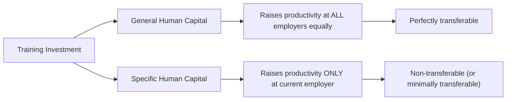
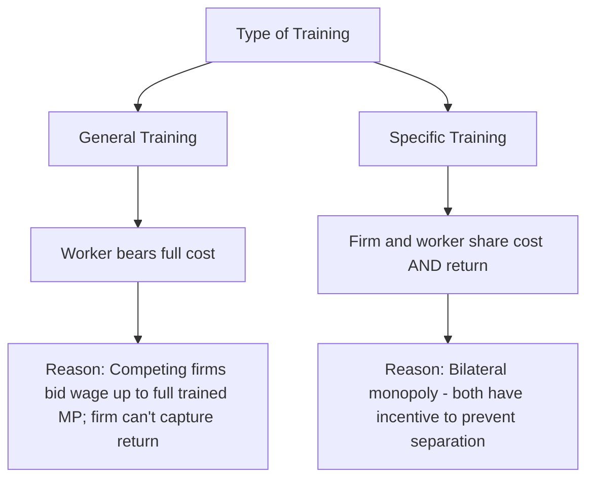
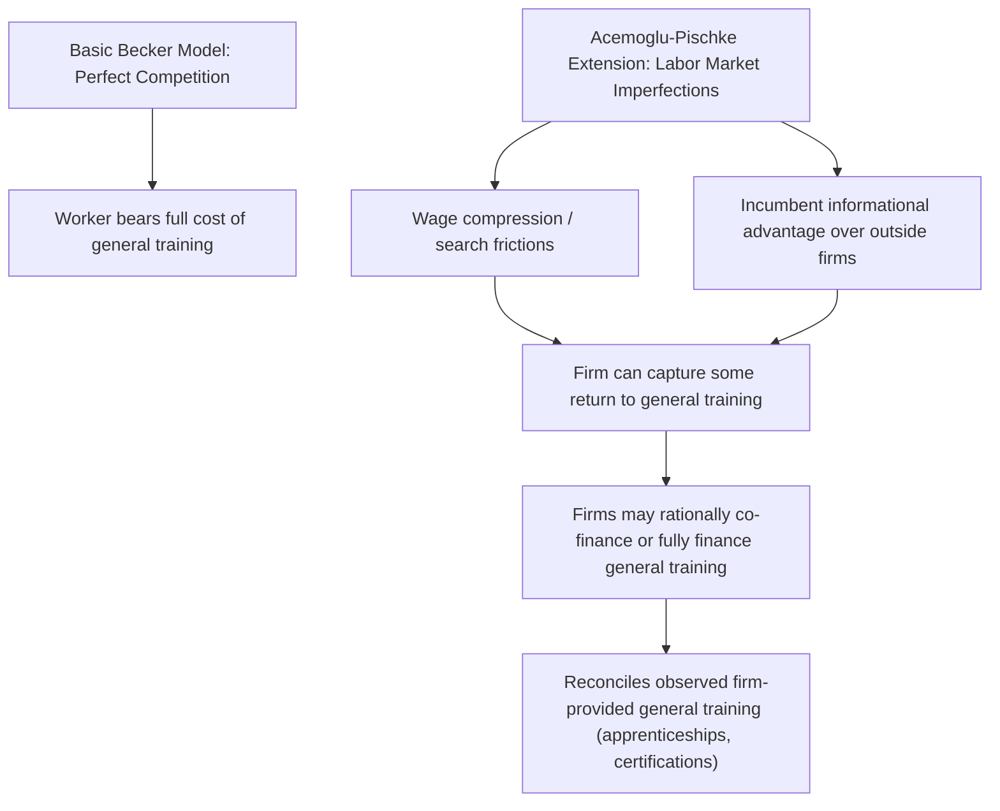

## General Versus Specific Human Capital

### Overview

Gary Becker's (1962, 1964) distinction between general and specific human capital is foundational to understanding on-the-job training investment decisions, firm-worker attachment, wage-tenure profiles, and labor turnover. The distinction hinges on **transferability**: general human capital raises a worker's productivity equally across all employers, while specific human capital raises productivity only at the current employer (or a narrow set of employers). This distinction generates sharply different predictions about who pays for training, how wages evolve with tenure, and why long-term employment relationships form.

### Defining the Two Types of Human Capital

**Key Points**

- **General human capital**: skills, knowledge, or training that increase a worker's marginal product **identically at the current firm and at all alternative employers** — e.g., basic literacy, general computer literacy, widely applicable professional certifications, broadly transferable technical skills
- **Specific human capital**: skills, knowledge, or relationships that increase a worker's marginal product **only at the current employer**, with little or no value if the worker moves to another firm — e.g., knowledge of a firm's idiosyncratic internal systems, firm-specific software, relationships with specific colleagues/supervisors, familiarity with firm-specific processes and institutional knowledge
- In practice, most real-world training investments combine both general and specific components in varying proportions — the pure dichotomy is a theoretical benchmark rather than a strict empirical categorization [Inference: this is the standard caveat noted in most treatments of the Becker framework, reflecting that real-world skills training is rarely purely one type or the other]

### The Core Theoretical Result: Who Pays for Training?

**Key Points**

This is the central and most consequential result of Becker's framework, derived from competitive labor market logic:

#### General Training

- Since general training raises productivity equally at all firms, competing employers would bid up the wage of a generally-trained worker to match their now-higher marginal product — the current employer captures **none** of the return to having provided the training, because the worker can costlessly extract the full value by threatening to leave for a competing offer
- Therefore, in a competitive labor market, **the worker must bear the full cost of general training** (through accepting a lower wage during the training period, or paying directly for training), since the firm has no incentive to invest in training whose returns it cannot capture
- Formally: if $MP_t^{general}$ is the trained marginal product, competition ensures $w_t = MP_t^{general}$ post-training, leaving zero surplus for the firm to recoup its training investment unless the wage was set below marginal product during the training period itself (financed by the worker)

#### Specific Training

- Since specific training raises productivity only at the current firm, if the worker leaves, they lose the entire value of the specific investment (their outside wage offer reflects only their general, transferable productivity, not their firm-specific productivity)
- This creates a **bilateral monopoly** situation: neither the firm nor the worker can unilaterally extract the full specific-capital-related surplus by threatening exit/dismissal, because both parties have something to lose from severing the relationship
- The standard result is that **firm and worker share the cost and the return** to specific training, since this sharing arrangement gives both parties an incentive to maintain the employment relationship (reducing costly turnover) — a fully firm-financed specific investment would leave the firm vulnerable to worker quits, while a fully worker-financed investment would leave the worker vulnerable to firm-initiated layoffs

### Formal Wage-Tenure Implications

**Key Points**

For a worker receiving specific training, the standard Becker model predicts a **wedge** between the wage and marginal product that creates mutual incentive to maintain the match:

$$MP_t > w_t > w_t^{alt}$$

where $w_t^{alt}$ is the worker's best outside alternative wage (reflecting only general human capital). The gap $MP_t - w_t$ represents the firm's quasi-rent from retaining the trained worker (an incentive against firing/layoff), while the gap $w_t - w_t^{alt}$ represents the worker's quasi-rent from staying (an incentive against quitting).

**Key Points on Predictions**

- Firms have an incentive to **retain** specifically-trained workers even during temporary demand downturns, since firing would forfeit the firm's specific-capital-related quasi-rent — this predicts that firms with more specifically-trained workforces should exhibit **smoother employment/layoff patterns** over the business cycle relative to firms relying more heavily on general-skill workers (labor hoarding behavior)
- Workers with substantial firm-specific human capital face a **wage premium relative to their outside option**, generating an additional prediction: quit rates should be lower among workers with more tenure/specific capital, since $w_t > w_t^{alt}$ makes quitting individually costly

### Empirical Predictions and Tests

| Prediction | Mechanism | Empirical Support |
| --- | --- | --- |
| Wage-tenure profiles slope upward within firms, even controlling for experience | Reflects growing specific capital and quasi-rent sharing | Broadly documented, though magnitude debated and partly attributed to other mechanisms (e.g., deferred compensation/incentive models) |
| Quit rates decline with tenure | Growing wedge between $w_t$ and $w_t^{alt}$ makes quitting costlier over time | Robustly documented empirical regularity across many datasets [well-established labor market stylized fact] |
| Layoff rates lower for workers with more specific capital/tenure, especially during downturns | Firms protect their specific-capital investment | Broadly consistent with observed "last in, first out" layoff patterns and labor hoarding behavior, though also explainable by seniority-based union contract provisions in some contexts |
| Firms invest more in training for jobs/industries with lower expected turnover | Specific investment only pays off if the worker stays long enough to amortize the cost | Documented pattern across industries with varying turnover rates [general finding, magnitude and precise causal mechanism debated] |
| General training should be observed less often provided directly by firms (worker bears cost) | Firms have no incentive to subsidize fully general training | More nuanced empirically — apprenticeship systems and some general training programs are firm-provided, motivating extensions (see below) |

### Complications and Extensions to the Basic Framework

**Key Points**

1. **Imperfect competition/labor market frictions**: if labor markets are not perfectly competitive (search frictions, monopsony power, imperfect information about worker quality across firms), firms *can* capture some return even from general training, since workers cannot costlessly and instantaneously find alternative offers at their full trained marginal product — this weakens the sharp Becker prediction that firms never finance general training
2. **Acemoglu & Pischke (1998, 1999)**: developed models showing that under labor market imperfections (e.g., wage compression due to minimum wages, collective bargaining, or asymmetric information about worker ability that gives incumbent firms an informational advantage over outside firms), **firms may rationally finance general training**, since imperfect competition allows them to capture some of the return even for transferable skills — this reconciles the empirical observation that firms do sometimes pay for seemingly general training (e.g., apprenticeship programs, professional certification sponsorship) with the theoretical framework
3. **Asymmetric information between incumbent and outside firms**: an incumbent firm may have better information about a worker's true (general) ability/productivity than outside firms, who face an adverse selection problem in poaching (a worker willing to leave for a given outside wage might be a below-average performer at their current job, a "lemons"-style signal) — this incumbent informational advantage can dampen wage competition for generally-trained workers, again allowing firms to partially capture general training returns
4. **Training subsidies and apprenticeship system design**: institutional features like German-style dual apprenticeship systems, which combine substantial firm-provided general training with formal wage-setting institutions, are often analyzed through the lens of these labor market imperfection extensions to the basic Becker model [Inference: this connects the theoretical extension to a widely cited real-world institutional example, consistent with the broader literature's use of this case]

### Worked Numerical Example: Sharing Rule for Specific Training

Suppose a worker's marginal product without firm-specific training is $\$40{,}000$ (equal to their outside wage option $w^{alt}$), and specific training raises marginal product at the current firm to $\$60{,}000$, at a one-time training cost of $\$8{,}000$ (borne jointly).

**Illustrative 50-50 sharing arrangement:**

- Post-training wage: $w = 40{,}000 + 0.5 \times (60{,}000 - 40{,}000) = 40{,}000 + 10{,}000 = \$50{,}000$
- Firm's quasi-rent: $MP - w = 60{,}000 - 50{,}000 = \$10{,}000$
- Worker's quasi-rent (incentive to stay vs. outside option): $w - w^{alt} = 50{,}000 - 40{,}000 = \$10{,}000$

**Interpretation**: both the firm and worker have a $\$10{,}000$ incentive to maintain the match rather than separate — the firm would lose its quasi-rent if it laid off the worker, and the worker would lose their wage premium over the outside option if they quit. This symmetric exposure is what sustains the relationship absent a formal long-term contract.

*[Unverified/illustrative]: Figures and the 50-50 split are a simplified illustrative parameterization; the actual division of quasi-rents in real bargaining situations depends on relative bargaining power and is not generally predicted to be exactly equal by the basic theory, which primarily predicts *some* sharing rather than a specific split ratio.*

### Diagram: The Quasi-Rent Wedge in Specific Human Capital (svg_diagram)

<svg xmlns="http://www.w3.org/2000/svg" viewBox="0 0 700 380">
<rect width="700" height="380" fill="#ffffff" />
<text x="350" y="25" font-size="16" font-weight="bold" text-anchor="middle" fill="#1a1a1a">Quasi-Rent Sharing in Specific Human Capital (svg_diagram)</text>
<line x1="100" y1="330" x2="600" y2="330" stroke="#333" stroke-width="2" />
<text x="350" y="360" font-size="12" text-anchor="middle" fill="#333">Value Scale</text>
<rect x="250" y="280" width="200" height="30" fill="#dcfce7" stroke="#059669" />
<text x="350" y="300" font-size="11" text-anchor="middle" fill="#064e3b">Outside Option (w_alt): $40,000</text>
<rect x="250" y="230" width="200" height="30" fill="#dbeafe" stroke="#2563eb" />
<text x="350" y="250" font-size="11" text-anchor="middle" fill="#1e3a8a">Actual Wage (w): $50,000</text>
<rect x="250" y="180" width="200" height="30" fill="#fee2e2" stroke="#dc2626" />
<text x="350" y="200" font-size="11" text-anchor="middle" fill="#7f1d1d">Marginal Product (MP): $60,000</text>
<line x1="470" y1="295" x2="490" y2="245" stroke="#666" stroke-width="1" />
<text x="500" y="270" font-size="10" fill="#666">Worker's quasi-rent</text>
<text x="500" y="283" font-size="10" fill="#666">($10,000)</text>
<line x1="470" y1="245" x2="490" y2="195" stroke="#666" stroke-width="1" />
<text x="500" y="220" font-size="10" fill="#666">Firm's quasi-rent</text>
<text x="500" y="233" font-size="10" fill="#666">($10,000)</text>
</svg>

### Related Contract-Theoretic Extensions

**Key Points**

- The specific-human-capital sharing problem is closely related to the broader **hold-up problem** in contract theory: since the specific investment cannot be fully protected by enforceable long-term contracts in many labor market contexts (contracts specifying exact future wages contingent on all future states of the world are typically infeasible), the sharing arrangement functions as an implicit, self-enforcing agreement sustained by the mutual threat of losing quasi-rents
- This connects the general/specific human capital framework to the broader implicit contracts literature (Azariadis 1975; Baily 1974) examining how firms and workers sustain long-term relationships without complete formal contracts, particularly relevant for understanding wage rigidity and employment stability patterns
- **Efficiency wage models** (Shapiro & Stiglitz 1984, and others) offer a related but analytically distinct explanation for above-market wages and employment stability, based on effort/shirking incentives rather than specific human capital retention — in practice these mechanisms may operate simultaneously and are not always empirically distinguishable [Inference: the potential empirical overlap/confounding between specific-human-capital-based wage premiums and efficiency-wage-based premiums is a recognized challenge in interpreting observed wage-tenure patterns]

### Applications and Policy Relevance

**Key Points**

- The general/specific human capital distinction underlies firm decisions about training program design, apprenticeship investment, and internal promotion/development policies
- Understanding which skills are general versus specific informs firm human resources strategy regarding retention risk: heavy investment in highly general, easily transferable skills without accompanying retention incentives (competitive compensation, career development) creates higher poaching/turnover risk
- Public policy debates about subsidizing employer-provided training (tax credits for training expenditures, apprenticeship program subsidies) are directly informed by this framework — since firms underinvest in general training relative to the socially efficient level (due to the hold-up/poaching problem), there is a theoretical efficiency rationale for public subsidization of general skills training, distinct from the case for specific training where private incentives are already reasonably well-aligned
- International comparisons of training systems (e.g., the German dual apprenticeship system versus more market-based training systems in other countries) are frequently analyzed through this theoretical lens, examining how different labor market institutions address the general-training-financing problem

### Limitations and Open Questions

**Key Points**

- The strict general/specific dichotomy is a theoretical idealization; most real-world skills exist on a continuum with partial transferability, making the framework's sharp predictions (worker bears 100% of general training cost, firm and worker share specific training cost) an approximation rather than an exact empirical description
- Empirically measuring the "specificity" of any given training investment or skill is difficult, since transferability depends on the broader labor market structure (how many other firms use similar systems/processes) rather than being an intrinsic, directly observable property of the training itself
- The basic model's clean predictions rely on perfect competition assumptions that the Acemoglu-Pischke extensions show do not hold in many real labor markets, meaning applied predictions about training-financing patterns should account for the specific market's competitive structure rather than applying the basic Becker framework uncritically
- Disentangling specific-human-capital-based wage premiums from efficiency-wage-based premiums and other explanations for wage-tenure profiles (deferred compensation/Lazear-style incentive contracts) remains an ongoing empirical challenge, since multiple theories predict similar reduced-form wage-tenure patterns [Inference: general characterization of the identification challenge shared across several competing labor economics theories of wage-tenure profiles]

**Next Steps**

- Wage-Tenure Profiles and Labor Turnover
- The Hold-Up Problem and Implicit Contracts (Azariadis, Baily)
- Efficiency Wage Theory (Shapiro-Stiglitz)
- Acemoglu-Pischke Labor Market Imperfections Model
- Apprenticeship Systems: Comparative Institutional Analysis
- Labor Hoarding and Cyclical Employment Patterns
- The Mincer Earnings Function (experience-earnings profile connection)
- Firm-Provided Training: Empirical Evidence and Policy Subsidies