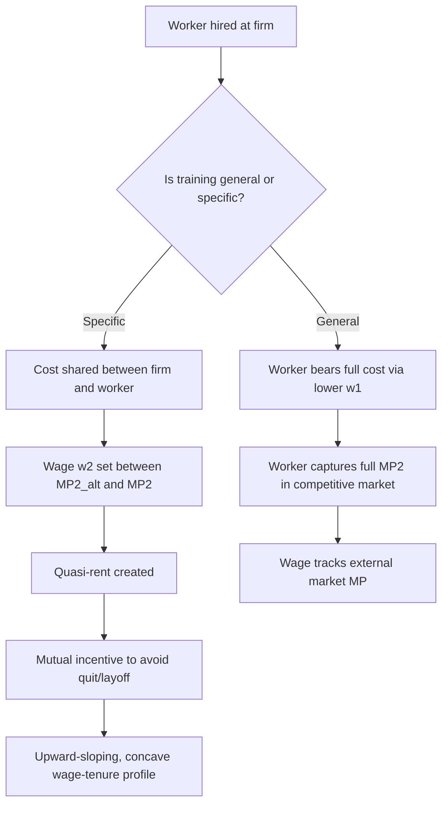

## Training Investment and Wage Tenure Profiles

### Theoretical Foundation

The wage-tenure profile is the relationship between a worker's wage and their duration of employment with a single firm. The canonical framework explaining the shape of this profile is Gary Becker's human capital theory of on-the-job training (OJT), which distinguishes training investments by whether the resulting skills are usable at other firms.

**Key Points**

- Wages rise with tenure primarily because of accumulated human capital, not merely because of aging or seniority rules per se
- The steepness of the wage-tenure profile depends on who pays for training and who captures the returns
- Firm-specific human capital is the central mechanism generating upward-sloping, concave wage-tenure profiles within firms

### General vs. Specific Human Capital

**General human capital** raises a worker's marginal product equally at the current firm and at all other firms. Examples include literacy, general problem-solving, and widely transferable software skills (e.g., basic spreadsheet proficiency).

**Firm-specific human capital** raises marginal product only (or predominantly) at the current employer. Examples include knowledge of a firm's proprietary systems, familiarity with idiosyncratic team routines, or relationships with specific colleagues and clients.

Under perfect competition in the labor market:

- Firms will not pay for general training because a trained worker could be poached by competitors at the full value of their new marginal product, leaving the training firm with no return
- Workers bear the cost of general training, typically by accepting a lower wage during the training period (below their current marginal product)
- Firms are willing to pay for firm-specific training because the worker cannot capture its full value elsewhere, reducing the risk of poaching
- Specific training costs and returns tend to be shared between firm and worker to create mutual incentives against turnover

### Formal Model Setup

Consider a two-period model. Let $MP_1$ and $MP_2$ denote the worker's marginal product in periods 1 and 2, and $w_1$, $w_2$ the corresponding wages. Let $C$ be the training investment cost incurred in period 1.

For **general training**:

$$w_1 = MP_1 - C$$

$$w_2 = MP_2$$

The worker pays the full cost $C$ upfront through a depressed period-1 wage, then captures the full post-training marginal product $MP_2$ in period 2, since competing firms would bid the wage up to $MP_2$ regardless.

For **specific training**, since the trained marginal product $MP_2$ exceeds what the worker would earn elsewhere ($MP_2^{alt} < MP_2$), a surplus exists that must be allocated. A common assumption is equal cost- and return-sharing:

$$w_1 = MP_1 - \frac{C}{2}$$

$$w_2 = MP_2^{alt} + \frac{1}{2}(MP_2 - MP_2^{alt})$$

Here the worker's period-2 wage sits between the outside-option marginal product and the full firm-specific marginal product, meaning $w_2 < MP_2$. This wedge is what discourages firm-initiated layoffs and worker-initiated quits alike — both parties would lose part of the quasi-rent from the specific investment.

### Why Sharing Occurs

[Inference] The precise 50/50 split is a modeling convenience rather than a derived necessity; the actual division depends on relative bargaining power, labor market institutions, and the degree of contract enforceability. What is robust across bargaining specifications is the qualitative result: whenever training is even partially specific, equilibrium wages during the post-training period will lie strictly below marginal product, and equilibrium wages during the training period will lie strictly above what a spot-market wage would imply (since the firm needs to also invest, they will not pass 100% of the cost onto the worker, or turnover risk destroys the specific capital's value for the firm too).

This sharing arrangement solves a **hold-up problem**:

- If the firm paid 100% of specific training costs, the worker could quit immediately after training and force the firm to sunk-cost the investment with no return
- If the worker paid 100% of specific training costs, the firm could fire the worker immediately after training and capture the entire surplus
- Bilateral cost-sharing creates bilateral incentives to maintain the employment relationship, reducing both quit and layoff probabilities

### The Shape of the Wage-Tenure Profile

Aggregating the two-period logic into a continuous-tenure setting produces several stylized empirical predictions:

1. **Upward slope**: Wages rise with tenure as specific capital accumulates and the wage moves closer to (but typically remains below) marginal product
2. **Concavity**: The rate of wage growth decelerates with tenure, consistent with diminishing returns to continued accumulation of firm-specific skill and with most specific human capital being acquired early in a match
3. **Wage growth exceeds productivity growth early, understates it later**: Since firms partially "front-load" wages relative to a pure marginal-product schedule to protect workers from opportunistic firing risk, and back-load some returns to discourage quitting

A widely used empirical specification (Mincer-style, tenure-augmented) is:

$$\ln(w_{it}) = \beta_0 + \beta_1 S_i + \beta_2 X_{it} + \beta_3 X_{it}^2 + \beta_4 T_{it} + \beta_5 T_{it}^2 + \varepsilon_{it}$$

where $S_i$ is years of schooling, $X_{it}$ is potential labor market experience, $T_{it}$ is tenure with the current employer, and the quadratic terms capture the concave profile. $\beta_4 > 0$ and $\beta_5 < 0$ is the standard expected pattern.

### Diagram: Wage and Marginal Product Paths Over Tenure

<svg xmlns="http://www.w3.org/2000/svg" viewBox="0 0 720 460" font-family="Helvetica, Arial, sans-serif">
<text x="360" y="28" text-anchor="middle" font-size="17" font-weight="bold" fill="#1a1a1a">Wage vs. Marginal Product Over Tenure (svg_diagram)</text>

<line x1="80" y1="400" x2="670" y2="400" stroke="#333" stroke-width="2" />
<line x1="80" y1="400" x2="80" y2="60" stroke="#333" stroke-width="2" />
<text x="375" y="435" text-anchor="middle" font-size="13" fill="#333">Tenure (years)</text>
<text x="30" y="230" text-anchor="middle" font-size="13" fill="#333" transform="rotate(-90 30 230)">Value ($)</text>

<line x1="260" y1="60" x2="260" y2="400" stroke="#999" stroke-width="1" stroke-dasharray="4,4" />
<text x="170" y="80" font-size="12" fill="#666">Training Period</text>
<text x="420" y="80" font-size="12" fill="#666">Post-Training Period</text>

<line x1="80" y1="300" x2="670" y2="300" stroke="#8888ff" stroke-width="2" stroke-dasharray="6,3" />
<text x="540" y="292" font-size="12" fill="#5555dd">MP (alternative firm)</text>

<path d="M 80 260 L 260 340 L 420 200 L 670 130" fill="none" stroke="#cc4444" stroke-width="3" />
<text x="560" y="120" font-size="12" fill="#aa2222" font-weight="bold">Marginal Product (this firm)</text>

<path d="M 80 260 L 260 300 L 420 250 L 670 175" fill="none" stroke="#228833" stroke-width="3" />
<text x="440" y="245" font-size="12" fill="#116622" font-weight="bold">Wage</text>

<circle cx="80" cy="260" r="4" fill="#333" />
<circle cx="260" cy="340" r="4" fill="#cc4444" />
<circle cx="260" cy="300" r="4" fill="#228833" />
<circle cx="670" cy="130" r="4" fill="#cc4444" />
<circle cx="670" cy="175" r="4" fill="#228833" />

<text x="85" y="250" font-size="11" fill="#333">t=0</text>

<text x="600" y="440" font-size="11" fill="#333">Late tenure</text>

</svg>

### Empirical Evidence

**Example**

Consider two workers hired at the same firm with identical starting wages of $20/hour. Worker A receives substantial firm-specific training (e.g., mastering a proprietary manufacturing process); Worker B receives purely general training (e.g., a widely recognized safety certification). After five years:

- Worker A's wage may have risen to $28/hour, but their outside-market offer might only be $24/hour — the $4 gap reflects captured firm-specific rents that would be lost upon separation
- Worker B's wage may have risen to $25/hour, closely tracking what any competing firm would offer, since the certification is fully portable

[Unverified] Precise magnitudes vary enormously by industry, occupation, and time period; the numbers above are illustrative constructs, not empirical estimates from a specific study.

Classic empirical work (Topel 1991; Altonji and Shakotko 1987) attempted to separately identify tenure effects from experience effects, since tenure and experience are collinear for workers who have not switched jobs. This is known in the literature as the **tenure-experience identification problem**:

- Topel used a two-step estimator exploiting within-job wage growth and found sizable tenure returns (roughly 10% wage growth for the first 10 years of tenure, though estimates are contested)
- Altonji and Shakotko argued Topel's estimates were biased upward due to measurement error and job-shopping selection, and produced considerably smaller tenure coefficients using instrumental variables based on deviations of tenure from its job-mean
- [Inference] The persistent disagreement in this literature stems largely from the difficulty of finding valid instruments for tenure that are uncorrelated with unobserved match quality or worker ability

### Selection and Matching Confounds

A major empirical challenge is distinguishing genuine human capital accumulation from **sorting/selection effects**:

- Workers who remain longer at a firm may simply be higher-ability workers or better job-matches (survivorship bias), producing an upward-sloping wage-tenure profile even absent any true OJT effect
- **Jovanovic's (1979) job matching model** offers a competing explanation: wages rise with tenure because poor matches are revealed and dissolved early, leaving only high-quality matches to survive to high tenure, and match quality itself (not accumulated capital) drives the wage-tenure correlation
- Distinguishing "human capital accumulation" from "match quality revelation" empirically requires panel data with multiple job spells per worker and remains an active area of debate

### Institutional and Policy Implications

**Key Points**

- Firm-specific human capital models imply that both parties have incentive-compatible reasons to reduce turnover, providing a partial equilibrium explanation for internal labor markets, seniority-based promotion ladders, and long-term implicit contracts
- Deferred compensation schemes (wages below marginal product early, above it late) can serve a similar incentive function as specific-capital sharing, complicating clean empirical separation between human capital and incentive/agency explanations (see Lazear's delayed-payment contract theory)
- Mandated severance pay, minimum notice periods, or restrictions on at-will employment can be interpreted through this lens as attempts to protect specific-capital quasi-rents when private contracts are incomplete
- Declining unionization and increased at-will employment prevalence may flatten wage-tenure profiles over time by shifting bargaining power and reducing the credibility of long-term implicit contracts [Inference — this is a commonly proposed explanation in the literature for observed flattening of tenure profiles in some economies, but causal attribution is contested]

### Interaction with Layoffs and Recessions

Because the wage during high-tenure periods sits below marginal product (worker "owes" the firm quasi-rent) while the training-period wage sits above marginal product (firm "owes" the worker), the specific human capital model generates asymmetric predictions about **layoff order** during downturns:

$$\text{Layoff probability is decreasing in } (MP_t - w_t)$$

Since $(MP_t - w_t)$ tends to be largest for high-tenure workers under long-term implicit contracts, this model predicts **last-in-first-out (LIFO)** layoff patterns, which is broadly consistent with observed seniority-based layoff practices in many unionized and large-firm settings.

### Model Diagram: Decision Flow for Training Investment

### Related Topics

- Becker's Theory of Human Capital and the General/Specific Training Dichotomy
- Jovanovic Job Matching Model and Match Quality
- The Tenure-Experience Identification Problem (Topel vs. Altonji-Shakotko)
- Deferred Compensation and Lazear's Incentive Contract Model
- Internal Labor Markets and Seniority Systems
- Turnover Costs and Efficient Layoff/Quit Decisions
- Minimum Wage and Training Investment Distortions
- Apprenticeship Systems as Institutionalized Specific Training