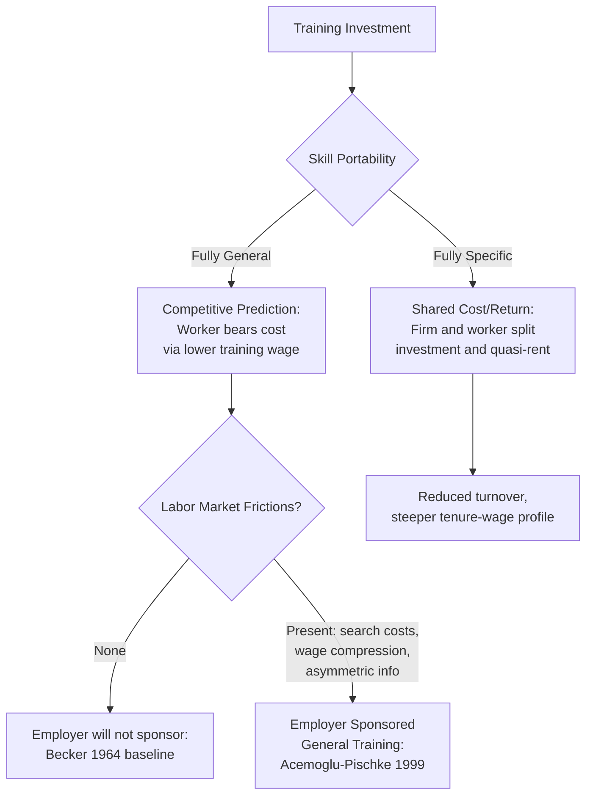

## Employer Sponsored Training

### Definition and Scope

Employer sponsored training refers to investment in worker skills that is financed, organized, or facilitated by the firm rather than the worker acting independently in the market for education. It encompasses formal classroom instruction, structured on-the-job training (OJT) programs, apprenticeships, tuition reimbursement, and informal skill transmission through supervision and mentoring. In the Becker (1964) framework, employer sponsored training is a special case of the general human capital investment problem in which the firm, rather than (or in addition to) the worker, bears part of the cost and captures part of the return.

The defining analytical question is not who administers the training but who pays for it and who appropriates the resulting productivity gain. This is what separates employer sponsored training from general education purchased by the worker in a competitive schooling market.

### The Becker Framework: General vs. Specific Training

Becker's foundational distinction rests on the portability of the skill produced.

**General training** raises a worker's marginal product by the same amount at the training firm and at all other firms. Standard competitive labor market theory implies:

- Under a competitive labor market with no mobility frictions, firms cannot recoup investment in general training because a trained worker can be bid away by outside firms at a wage equal to the new (higher) marginal product.
- The equilibrium prediction is that **workers pay for general training**, either through explicit tuition-like fees or, more commonly, by accepting a wage below their marginal product during the training period (an implicit wage cut that finances the investment).
- Firms are willing to provide the training technology (classrooms, instructors, machines) but do not bear the net cost.

**Specific training** (treated in detail in the companion topic on firm-specific human capital) raises marginal product only at the training firm, or raises it more at the training firm than at outside firms. Because the skill is non-portable:

- Neither the firm nor the worker can unilaterally hold up the other for the full quasi-rent, so the standard prediction is that firm and worker **share** both the cost and the return, which creates a mutual incentive to maintain the employment relationship.
- This sharing is what generates the classic Becker predictions of reduced turnover and wage growth steeper than marginal-product growth for specifically trained workers.

$$w_1 = MP_1 - k, \quad w_2 = MP_2 + \alpha(MP_2 - MP_2^{OM})$$

where $w_1$ is the training-period wage, $MP_1$ is training-period marginal product, $k$ is the per-period cost of training borne by the worker via a wage cut, $w_2$ is the post-training wage, $MP_2$ is post-training marginal product at the incumbent firm, $MP_2^{OM}$ is the worker's outside-market marginal product, and $\alpha \in [0,1]$ is the share of the specific quasi-rent captured by the worker.

### Why Employer Sponsored (General) Training Exists Despite Becker's Prediction

A long empirical and theoretical literature documents that firms *do* pay for training that looks general in content (e.g., computer skills, communication skills, generic management training), which is a puzzle under the pure competitive model. Several classes of explanation have been developed:

- **Labor market frictions / monopsony power.** Search frictions, compensating differentials, and imperfect information mean workers cannot instantaneously and costlessly move to the firm offering the highest wage for their new skill. This creates a wedge (a "rent") that lets the training firm partially retain the return, so it becomes privately profitable to subsidize training the firm calls general. This is the Acemoglu-Pischke (1999) model of training under imperfect competition.
- **Compressed wage structures.** If institutional forces (minimum wages, unions, internal equity norms, or monopsony wage-setting) compress the wage distribution so that post-training wages rise by less than post-training marginal product, the firm captures a rent on general skills even though those skills are portable. Acemoglu and Pischke show this compression is itself often a *consequence* of the same frictions that generate monopsony power.
- **Asymmetric information about worker ability.** If the training firm learns the worker's true ability or fit during training but outside firms do not observe this directly (Katz and Ziderman, 1990; Acemoglu and Pischke, 1998), outside firms discount their wage offers relative to true marginal product, again allowing the incumbent firm to retain part of the surplus without inducing turnover.
- **Complementarity between general and specific human capital.** General training may be jointly produced with, or a prerequisite for, specific human capital, so its return is partly appropriable even though the skill content per se is portable.
- **Signaling and screening motives.** The firm may sponsor training partly to screen for unobserved traits (motivation, learning ability, reliability), a use-value distinct from the human capital produced.
- **Tied to retention devices.** Firms frequently pair training with explicit repayment clauses, deferred compensation, vesting benefits, or bonding contracts requiring reimbursement if the worker leaves within a specified period — a direct contractual solution to the poaching externality.

### Empirical Regularities

- Employer sponsored training incidence rises sharply with **education level**: more educated workers receive more, not less, firm-sponsored training, a pattern inconsistent with a naive substitutes view of formal schooling and OJT, but consistent with complementarity between cognitive skill and trainability.
- Incidence is strongly increasing in **firm size**: larger establishments are more likely to offer formal training programs, partly reflecting scale economies in training technology and lower per-worker fixed costs of administration.
- Training incidence and intensity decline sharply with **worker age and tenure remaining**, consistent with a shorter payback horizon over which to amortize the investment (a standard human capital life-cycle prediction).
- Workers on **temporary or fixed-term contracts** receive substantially less employer sponsored training than otherwise comparable permanent workers, consistent with firms and workers under-investing when the horizon for capturing returns is contractually truncated.
- Cross-country studies (e.g., using data comparable to the OECD Adult Education Survey or the European Continuing Vocational Training Survey) show large differences in employer sponsored training incidence linked to institutional features: coordinated wage-bargaining systems and apprenticeship traditions (Germany, Austria, Switzerland) show systematically higher incidence of structured employer sponsored training than liberal market economies.

### Measurement Challenges

Employer sponsored training is notoriously difficult to measure cleanly, which weakens tests of the underlying theory:

- **Recall and reporting bias.** Household and worker surveys ask retrospectively about training receipt and hours, producing noisy and likely biased measures, especially for informal or unstructured training.
- **Blurred general/specific boundary.** Almost no real-world training is purely general or purely specific; most surveys cannot classify training content along this dimension, forcing researchers to use proxies (firm-reported "general skill" vs. "job-specific skill" categories, which are themselves imperfect).
- **Endogeneity of training receipt.** Workers selected into training are typically already higher-ability or higher-motivation, biasing simple cross-sectional wage-growth comparisons between trained and untrained workers upward (an ability-bias problem structurally analogous to the schooling-return literature).
- **Employer vs. worker-financed ambiguity.** Even when a firm organizes and delivers training, the true financing split can be implicit in the wage profile rather than observed as an explicit fee, making direct measurement of "who paid" nearly impossible without structural estimation.

### Institutional Forms

- **Formal internal training programs**: corporate universities, structured onboarding curricula, rotational management-trainee programs.
- **Apprenticeships**: a hybrid institutional form combining structured employer sponsored training with formal certification, most developed in the German dual system, where firms bear substantial net training costs during the apprenticeship period in exchange for a probationary screening period and reduced post-training turnover (Wolter and Ryan, 2011).
- **Tuition assistance / educational reimbursement**: employer subsidy for worker-initiated external education, often structured with retention clauses (repayment if the worker separates within a set window).
- **Mandated training levies**: some countries (France's historical *taxe d'apprentissage*/training levy system, several Latin American countries) impose payroll-based training levies or "train-or-pay" mandates to correct for underinvestment predicted by the poaching externality.

### Policy Implications

- If the Acemoglu-Pischke frictions story is correct, policies that increase labor market competitiveness (better job-matching information, portable certification) can *reduce* employer willingness to sponsor general training by eroding the retention rents that make it profitable — a genuine policy trade-off between market efficiency and training investment.
- Training subsidies and tax credits aimed at correcting the poaching externality are a standard policy response, though their efficacy depends on whether the underlying constraint is truly a market failure (externality) or simply a distributional dispute over training costs.
- Portable, third-party-certified training (as opposed to firm-idiosyncratic, uncertified training) is more resistant to being under-provided, since certification reduces the informational rent that would otherwise justify employer capture; this is part of the rationale behind formal apprenticeship credentialing systems.

### Diagram: Cost and Return Allocation Under General vs. Specific Training

### Diagram: Wage and Marginal Product Profiles Under Employer Sponsored General Training

<svg xmlns="http://www.w3.org/2000/svg" viewBox="0 0 700 420">
<text x="350" y="24" text-anchor="middle" font-size="16" font-weight="bold" fill="#1a1a1a">Wage vs. Marginal Product Profiles (svg_diagram)</text>
<line x1="70" y1="370" x2="650" y2="370" stroke="#333" stroke-width="2" />
<line x1="70" y1="370" x2="70" y2="50" stroke="#333" stroke-width="2" />
<text x="360" y="400" text-anchor="middle" font-size="13" fill="#333">Tenure / Time</text>
<text x="30" y="210" text-anchor="middle" font-size="13" fill="#333" transform="rotate(-90 30 210)">Wage / MP ($)</text>
<line x1="200" y1="370" x2="200" y2="50" stroke="#999" stroke-width="1" stroke-dasharray="4,4" />
<text x="200" y="390" text-anchor="middle" font-size="12" fill="#555">Training ends (t*)</text>
<path d="M70,300 L200,340 L400,180 L650,110" fill="none" stroke="#2563eb" stroke-width="3" />
<text x="500" y="150" font-size="13" fill="#2563eb" font-weight="bold">Marginal Product (MP)</text>
<path d="M70,300 L200,340 L400,260 L650,200" fill="none" stroke="#dc2626" stroke-width="3" stroke-dasharray="6,3" />
<text x="500" y="230" font-size="13" fill="#dc2626" font-weight="bold">Wage (compressed under frictions)</text>
<path d="M70,300 L200,340 L400,340 L650,340" fill="none" stroke="#16a34a" stroke-width="2" stroke-dasharray="2,3" />
<text x="500" y="330" font-size="12" fill="#16a34a">Outside offer (imperfect info discount)</text>

<text x="90" y="290" font-size="11" fill="#333">Training-period wage cut (worker-financed portion)</text>

<line x1="90" y1="300" x2="90" y2="340" stroke="#333" stroke-width="1" />

<text x="420" y="195" font-size="11" fill="#333">Retained rent (firm captures MP−wage gap)</text>

</svg>

### Key Points

- Under the frictionless Becker (1964) model, workers finance general training via a wage cut and firms finance only specific training in proportion to their share of the retained quasi-rent.
- Real-world employer sponsorship of ostensibly general training is a documented anomaly, explained primarily by labor market imperfections (Acemoglu and Pischke, 1999) that compress wages below marginal product and create firm-appropriable rents.
- Empirical incidence patterns (rising in education and firm size, falling in age, tenure remaining, and contract impermanence) are broadly consistent with a human-capital-investment-under-imperfect-competition framework. [Inference: the "broadly consistent" characterization reflects the balance of the empirical literature rather than a single definitive test, since general/specific content is imperfectly measured in most datasets]
- Institutional design (apprenticeship systems, training levies, certification requirements) can be understood as policy responses to the poaching externality implied by this framework.

**Related Topics**

- Firm-Specific Human Capital and the Becker Sharing Model
- The Acemoglu-Pischke Model of Training Under Imperfect Competition
- Apprenticeship Systems and the German Dual Training Model
- Monopsony Power and Wage Compression in Labor Markets
- Turnover Costs and Retention Contracts (Bonding, Clawbacks)
- Signaling vs. Human Capital in the Returns to Employer-Provided Training
- Training Levies and "Train-or-Pay" Mandates