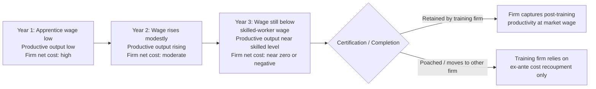

## Apprenticeships and Vocational Training

### Definition and Scope

Apprenticeships and vocational training constitute a class of institutionally structured human capital investment that combines on-the-job training with formal, often standardized, instruction and certification. Unlike unstructured OJT, apprenticeship systems specify a defined curriculum, a fixed duration, formal assessment, and a recognized credential upon completion. Vocational training more broadly includes apprenticeships as well as school-based vocational education (vocational high schools, technical colleges) that may involve little or no employer sponsorship. The analytical core of this topic is how these institutions solve, partially solve, or fail to solve the training-investment problems identified in the general/specific human capital literature (Becker, 1964).

### Theoretical Positioning Within Human Capital Theory

Apprenticeships occupy an interesting middle ground in the general-versus-specific taxonomy:

- The **skill content** is often substantially general or industry-general (a certified electrician's or machinist's skills transfer across many employers), which under the pure Becker model implies the apprentice, not the firm, should bear the cost.
- Yet apprenticeship systems, particularly in coordinated market economies, routinely show **firms bearing substantial net training costs**, especially in the early phase of the apprenticeship when the trainee's output is below their wage plus training cost.
- Reconciling this observation with theory motivates several extensions:
  - **Production-based apprenticeship models** (Wolter and Ryan, 2011): the apprentice's productive output during training itself partially offsets training costs, so what looks like a large employer subsidy in accounting terms is smaller in net economic terms; firms in the German system, for example, often recoup most or all training costs through apprentice productive contribution before the training period ends.
  - **Retention and matching-quality rents**: apprenticeship functions as an extended, low-cost screening and matching mechanism (Acemoglu and Pischke, 1998); the firm learns match-specific and ability information over the apprenticeship period, information the outside market does not fully observe, generating an asymmetric-information rent that finances part of the "general" training cost.
  - **Occupational (industry-specific) labor markets** (Acemoglu and Pischke, 1999): where entire industries or regions coordinate on training content and wage-setting institutions compress wages relative to marginal product economy-wide, individual firms do not face the standard poaching threat because *all* firms in the relevant labor market pay similarly compressed wages, reducing the return to poaching trained apprentices.

$$\pi_{firm} = \sum_{t=0}^{T} \frac{MP_t^{app} - w_t^{app} - c_t^{training}}{(1+r)^t}$$

where $MP_t^{app}$ is the apprentice's productive contribution in period $t$, $w_t^{app}$ is the (typically sub-market) apprentice wage, $c_t^{training}$ is the direct cost of instruction and supervision, and $T$ is the apprenticeship duration; the German evidence suggests $\pi_{firm} \geq 0$ over the training period itself for a large share of training firms, even before accounting for post-training retention value.

### Institutional Variants

- **Dual system apprenticeships** (Germany, Austria, Switzerland): apprentices split time between firm-based training and public vocational schools, with content standardized nationally by employer associations, unions, and the state; completion yields a portable, nationally recognized occupational credential.
- **Employer-led apprenticeships with lighter standardization** (UK Apprenticeship Levy system, US registered apprenticeships administered via the Department of Labor): typically shorter formal-schooling components, more employer discretion over curriculum, and historically lower aggregate participation rates than the dual system countries.
- **School-based vocational education**: full-time vocational secondary or post-secondary schooling with limited or no employer involvement (common in France's *lycée professionnel* track and much of US career-and-technical education); trades off weaker firm-specific screening and workplace-relevant skill for lower risk of exploitation and easier scaling independent of employer training capacity.
- **Sectoral/collectively bargained training funds**: multi-employer training levies or funds (construction-industry joint apprenticeship programs in the US, French *taxe d'apprentissage*) that pool training costs across firms, directly addressing the poaching externality by making all firms in the sector co-financiers rather than competitors for trained labor.

### The German Dual System as Reference Case

The German dual system is the most heavily studied and is treated in the literature as an institutional benchmark:

- Roughly half of a birth cohort historically enters the dual system, spanning several hundred nationally standardized occupations (*Ausbildungsberufe*).
- Wages during apprenticeship are set well below the wage of a fully qualified worker (often 25-35% of the skilled wage), and this discount, combined with substantial apprentice productive contribution in later training years, is the primary mechanism by which firms recoup training costs (Wolter and Ryan, 2011).
- Post-apprenticeship retention by the training firm is common but far from universal; a substantial share of apprentices move to other firms after certification, meaning training firms in equilibrium are still financing training whose returns partly accrue elsewhere — consistent with the occupational-labor-market and reputational/CSR-style explanations rather than a pure firm-specific-capital story.
- The system is credited in the literature with contributing to Germany's historically low youth unemployment rate relative to countries without comparable vocational tracks, though causal identification of this link versus confounding macroeconomic and labor-market institutional factors is contested. [Inference: the youth-unemployment linkage is a widely cited empirical association in the comparative literature, not a fully settled causal estimate]

### Empirical Returns to Apprenticeship and Vocational Training

- Studies using registered apprenticeship data (e.g., US Department of Labor administrative data, analyzed by Reed et al. and related work) generally find **positive and economically meaningful earnings returns** to apprenticeship completion relative to comparable non-completers, with completers earning substantially more, on average, several years after program completion.
- Returns tend to be **occupation-specific and heterogeneous**: apprenticeships in electrical, plumbing, and other skilled-trade occupations with strong licensing/credentialing regimes show more robust and persistent wage premia than apprenticeships in occupations lacking formal credential recognition.
- A recurring finding in the comparative vocational-education literature (Hanushek, Woessmann, and Zhang, 2017) is a **trade-off over the life cycle**: vocationally trained workers show higher employment rates and earnings shortly after schooling completion (better initial job matching, direct skill relevance) but this advantage narrows or reverses at older ages relative to general-education-track workers, plausibly because vocational skills depreciate faster or are more vulnerable to technological displacement while general education provides more adaptable human capital.
- Non-completion rates in apprenticeship programs are non-trivial and represent a substantial cost, both to the individual (foregone alternative schooling or work experience) and to sponsoring firms; this is a key policy design concern distinct from the returns-conditional-on-completion literature.

### Policy Rationale and Design Issues

- **Market failure rationale**: without coordination, individual firms underprovide apprenticeship training in occupations with substantial general-skill content because of the poaching externality; multi-employer levies, subsidies, or mandates (UK Apprenticeship Levy, sectoral training funds) are designed to internalize this externality.
- **Credential portability vs. firm capture tension**: highly standardized, portable credentials increase worker mobility and reduce individual firm incentive to sponsor training (reinforcing the poaching problem), while firm-specific, non-portable training content increases the firm's willingness to invest but reduces the worker's outside option value and the economy-wide transferability of the skill — a direct design trade-off with no dominant solution.
- **Youth transition and NEET (not in education, employment, or training) reduction** is a commonly cited policy objective in OECD contexts, motivating public subsidization of apprenticeship places, particularly for at-risk youth populations.
- **Technological change and curriculum obsolescence risk**: because apprenticeship curricula are typically slower to update than firm-specific informal training, there is an ongoing policy design tension between standardization (needed for credential portability and quality assurance) and responsiveness to rapidly changing skill demand, particularly in digitally intensive trades. [Speculation: the magnitude of this obsolescence risk for specific occupations is not well quantified in the literature and is more often asserted than measured]

### Diagram: Apprenticeship Cost-Recoupment Timeline (Production-Based Model)

### Diagram: Comparative Institutional Structure of Vocational Training Systems

<svg xmlns="http://www.w3.org/2000/svg" viewBox="0 0 700 380">
<text x="350" y="24" text-anchor="middle" font-size="16" font-weight="bold" fill="#1a1a1a">Vocational Training Institutional Spectrum (svg_diagram)</text>
<line x1="70" y1="180" x2="630" y2="180" stroke="#333" stroke-width="2" />
<polygon points="630,180 618,174 618,186" fill="#333" />
<text x="350" y="210" text-anchor="middle" font-size="12" fill="#555">Employer Involvement / Firm Cost-Sharing →</text>
<circle cx="130" cy="180" r="8" fill="#2563eb" />
<text x="130" y="150" text-anchor="middle" font-size="12" font-weight="bold">School-Based</text>
<text x="130" y="165" text-anchor="middle" font-size="11">Vocational Ed.</text>
<text x="130" y="235" text-anchor="middle" font-size="10" fill="#555">e.g. French lycée</text>
<text x="130" y="248" text-anchor="middle" font-size="10" fill="#555">professionnel</text>
<circle cx="320" cy="180" r="8" fill="#7c3aed" />
<text x="320" y="150" text-anchor="middle" font-size="12" font-weight="bold">Sectoral / Levy-Funded</text>
<text x="320" y="165" text-anchor="middle" font-size="11">Apprenticeships</text>
<text x="320" y="235" text-anchor="middle" font-size="10" fill="#555">e.g. UK Levy,</text>
<text x="320" y="248" text-anchor="middle" font-size="10" fill="#555">US Building Trades</text>
<circle cx="500" cy="180" r="8" fill="#dc2626" />
<text x="500" y="150" text-anchor="middle" font-size="12" font-weight="bold">Dual System</text>
<text x="500" y="165" text-anchor="middle" font-size="11">Apprenticeships</text>
<text x="500" y="235" text-anchor="middle" font-size="10" fill="#555">e.g. Germany,</text>
<text x="500" y="248" text-anchor="middle" font-size="10" fill="#555">Switzerland, Austria</text>
<circle cx="600" cy="180" r="8" fill="#16a34a" />
<text x="600" y="150" text-anchor="middle" font-size="12" font-weight="bold">Firm-Specific</text>
<text x="600" y="165" text-anchor="middle" font-size="11">Internal Training</text>
<text x="600" y="235" text-anchor="middle" font-size="10" fill="#555">Non-credentialed,</text>
<text x="600" y="248" text-anchor="middle" font-size="10" fill="#555">no portability</text>

<text x="130" y="300" text-anchor="middle" font-size="10" fill="#333">Low firm cost,</text>

<text x="130" y="313" text-anchor="middle" font-size="10" fill="#333">low poaching risk</text>

<text x="500" y="300" text-anchor="middle" font-size="10" fill="#333">High firm cost,</text>

<text x="500" y="313" text-anchor="middle" font-size="10" fill="#333">moderated by occupational</text>

<text x="500" y="326" text-anchor="middle" font-size="10" fill="#333">labor market wage compression</text>

<text x="600" y="300" text-anchor="middle" font-size="10" fill="#333">Highest capture,</text>

<text x="600" y="313" text-anchor="middle" font-size="10" fill="#333">lowest portability</text>

</svg>

### Key Points

- Apprenticeships combine general or industry-general skill content with substantial employer cost-bearing, an apparent tension with the pure Becker model resolved primarily through production-based cost recoupment, screening/matching rents, and occupational labor market wage compression.
- The German dual system is the canonical empirical reference case, showing firms recouping most training costs through below-market apprentice wages and rising apprentice productivity over the training period.
- Empirical returns to apprenticeship completion are generally positive but occupation-specific, with a documented life-cycle pattern of stronger early-career returns relative to general education that narrows over time.
- Policy design for apprenticeship systems faces an inherent trade-off between credential portability (worker mobility, economy-wide efficiency) and employer training incentives (which are strengthened by capturable, less portable rents).

**Related Topics**

- Firm-Specific Human Capital and the Becker Sharing Model
- The Acemoglu-Pischke Model of Training Under Imperfect Competition
- Occupational Labor Markets and Wage Compression
- Screening, Signaling, and Employer Learning Models
- School-to-Work Transition Policy and Youth Unemployment
- Training Levies and Multi-Employer Cost-Sharing Mechanisms
- Skill Depreciation and Technological Displacement in Vocational Occupations