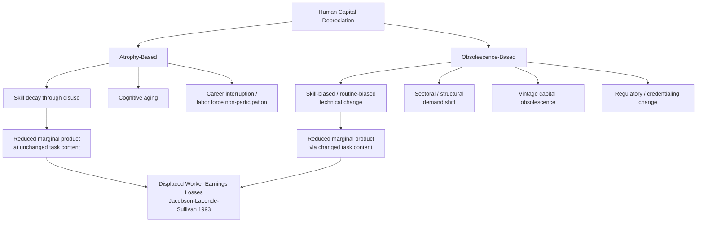

## Human Capital Depreciation and Obsolescence

### Definition and Scope

Human capital depreciation refers to the decline over time in the productive value of a worker's accumulated skills and knowledge. The literature distinguishes two conceptually distinct sources of this decline:

- **Biological/atrophy depreciation**: skills and knowledge decay through disuse, cognitive aging, or physical decline, independent of any change in the external economic environment. This is analogous to physical capital depreciation through wear.
- **Economic obsolescence**: skills lose value not because the worker has forgotten them but because technological change, shifts in production methods, or changes in product/output demand reduce the market value of what the worker knows, even if the worker's command of that knowledge is unchanged. This is depreciation driven by a shift in the *demand* for a given skill rather than decay of the *stock* itself.

Both mechanisms reduce the present value of human capital investment and are central to explaining wage-tenure and wage-age profiles, especially their eventual flattening and decline late in careers, and to explaining the labor market difficulties of displaced workers.

### Formal Treatment in the Human Capital Investment Framework

In the standard Ben-Porath (1967) life-cycle human capital production framework, human capital $H_t$ evolves as:

$$\dot{H}_t = I_t - \delta H_t$$

where $I_t$ is gross investment in human capital at time $t$ (time and resources devoted to skill acquisition) and $\delta$ is the depreciation rate. This is formally identical to the physical capital accumulation equation, and $\delta$ plays the same structural role as depreciation in a Solow-style capital stock.

- A **higher $\delta$** reduces the optimal rate of investment late in the life cycle because the payback horizon over which returns can be captured shrinks, reinforcing the standard prediction that human capital investment (and therefore observed training incidence and formal schooling enrollment) declines with age even absent any change in ability to learn.
- Obsolescence-type depreciation is often modeled as **skill-biased or vintage-specific**, where $\delta$ is not a constant but increases with the pace of technological change in the worker's specific occupation or the vintage of technology embodied in the worker's training (vintage human capital models, paralleling vintage physical capital models).

### Sources and Mechanisms of Obsolescence

- **Technological change (skill-biased and routine-biased technical change)**: new technologies can render entire task bundles obsolete (Autor, Levy, and Murnane, 2003, on routine-biased technical change), disproportionately displacing workers whose human capital was built around routine cognitive and manual tasks now performed by computers or automation.
- **Sectoral/structural shift**: demand reallocation across industries (manufacturing decline, services expansion) devalues human capital specific to declining sectors even without any change in the technology used within those sectors.
- **Vintage capital effects**: workers trained under an earlier production paradigm (a specific software system, a now-superseded engineering standard, a discontinued regulatory regime) hold human capital tied to that "vintage," which loses value as the vintage is replaced economy-wide, independent of the worker's individual learning capacity.
- **Regulatory and credentialing change**: shifts in licensing requirements, safety standards, or professional certification regimes can obsolete previously valuable, formally certified human capital.
- **Non-use / labor market withdrawal**: periods out of the labor force (unemployment spells, career interruptions, notably associated with childbearing and caregiving in the gender-wage-gap literature) are associated with skill atrophy distinct from technological obsolescence, sometimes termed "the depreciation of experience."

### Empirical Evidence

- **Displaced worker literature** (Jacobson, LaLonde, and Sullivan, 1993, and the extensive follow-on literature): workers displaced from stable, long-tenure jobs via mass layoffs suffer large and highly persistent earnings losses — commonly estimated in the range of 15-25% of pre-displacement earnings, with substantial persistence for many years after re-employment — a pattern widely interpreted as evidence that a meaningful share of accumulated human capital (both firm-specific and industry/occupation-specific) is destroyed or rendered non-transferable by displacement, rather than being fully portable to the new job.
- **Unemployment duration and wage scarring**: longer unemployment spells are associated with larger wage losses upon re-employment, consistent with skill atrophy compounding over the duration of non-use, though disentangling atrophy from negative signaling/stigma effects of long unemployment spells is econometrically difficult (both mechanisms predict the same reduced-form pattern).
- **Age-earnings profile flattening and decline**: the well-documented concavity of age-earnings profiles, and outright decline late in careers in some occupations, is consistent with depreciation dominating investment once net human capital investment turns negative, though the same pattern is also consistent with declining physical productivity, cohort effects, or selective retirement of high earners, so this evidence is suggestive rather than a clean identification of depreciation per se. [Inference: attributing age-earnings concavity specifically to human capital depreciation versus alternative explanations (cohort effects, declining hours, selective retirement) requires additional identifying assumptions not always present in the underlying studies]
- **Occupation-specific obsolescence risk estimates**: studies building on the Autor-Levy-Murnane task-content framework and subsequent work (e.g., Frey and Osborne-style automation-susceptibility estimates) attempt to quantify occupation-level exposure to technological displacement, though these estimates carry substantial [Unverified] uncertainty regarding actual realized displacement, since task-susceptibility to automation does not mechanically translate into realized job loss at the estimated pace.
- **Gender and career-interruption literature**: research on the motherhood wage penalty and related career-interruption effects finds earnings losses associated with time out of the labor force that are larger than can be explained by lost tenure alone, a pattern often partly attributed to skill atrophy during the interruption, alongside selection into lower-hours or lower-training-intensity jobs upon return.

### Interaction with Firm-Specific and General Human Capital

- Firm-specific human capital is particularly vulnerable to a **discrete, total obsolescence event** at separation: because by definition it has no value outside the firm, involuntary separation (layoff, plant closure) destroys the entire specific-capital stock instantly, which is the theoretical mechanism most directly implicated in the large earnings losses found in the displaced-worker literature.
- General human capital is more robust to firm-level shocks but remains fully exposed to **economy-wide or industry-wide technological obsolescence**, meaning the general/specific distinction does not map cleanly onto vulnerability to depreciation; the relevant distinction for obsolescence risk is closer to *task content* and *technology vintage* than to firm-specificity per se.
- This has led some of the literature (building on Gibbons and Waldman, 2004, task-based human capital models) to reframe human capital accumulation and depreciation jointly around task-specific rather than firm-specific or general skill categories, since task content, not employer identity, is what technological change directly devalues.

### Policy and Firm-Level Implications

- **Retraining and active labor market policy**: the displaced-worker earnings-loss evidence is a central empirical motivation for retraining programs, wage insurance, and other active labor market policies aimed at restoring displaced workers' human capital value, though evaluation evidence on the effectiveness of retraining programs specifically is mixed and program-dependent.
- **Firm incentives for continuous training**: to the extent obsolescence risk is foreseeable, firms and workers both have an incentive toward continuous, incremental retraining rather than front-loaded initial training, since continuous updating reduces the total depreciation-driven capital loss relative to allowing skills to become fully obsolete before retraining.
- **Implications for optimal retirement timing and pension design**: rising depreciation rates late in career interact with the standard human capital investment life-cycle model to influence optimal retirement age, since declining net human capital value reduces the return to continued labor force participation at the margin, independent of pure leisure-preference explanations for retirement timing.

### Diagram: Human Capital Stock Over the Life Cycle Under Depreciation

<svg xmlns="http://www.w3.org/2000/svg" viewBox="0 0 700 400">
<text x="350" y="24" text-anchor="middle" font-size="16" font-weight="bold" fill="#1a1a1a">Human Capital Stock Trajectory (svg_diagram)</text>
<line x1="70" y1="350" x2="650" y2="350" stroke="#333" stroke-width="2" />
<line x1="70" y1="350" x2="70" y2="50" stroke="#333" stroke-width="2" />
<text x="360" y="380" text-anchor="middle" font-size="13" fill="#333">Age / Career Stage</text>
<text x="30" y="200" text-anchor="middle" font-size="13" fill="#333" transform="rotate(-90 30 200)">Human Capital Stock $H_t$</text>
<path d="M70,320 C150,180 250,100 350,80 C450,90 500,130 560,220" fill="none" stroke="#2563eb" stroke-width="3" />
<text x="200" y="70" font-size="12" fill="#2563eb" font-weight="bold">No displacement: gradual decline as</text>
<text x="200" y="85" font-size="12" fill="#2563eb" font-weight="bold">investment falls below depreciation</text>
<path d="M70,320 C150,180 250,100 350,80" fill="none" stroke="#2563eb" stroke-width="3" stroke-dasharray="0" />
<line x1="350" y1="80" x2="350" y2="230" stroke="#dc2626" stroke-width="2" stroke-dasharray="5,3" />
<text x="360" y="150" font-size="11" fill="#dc2626" font-weight="bold">Displacement event:</text>
<text x="360" y="165" font-size="11" fill="#dc2626" font-weight="bold">discrete loss of firm-specific</text>
<text x="360" y="180" font-size="11" fill="#dc2626" font-weight="bold">and non-portable capital</text>
<path d="M350,230 C420,250 480,290 560,320" fill="none" stroke="#dc2626" stroke-width="3" />
<text x="420" y="310" font-size="11" fill="#dc2626">Post-displacement path,</text>
<text x="420" y="323" font-size="11" fill="#dc2626">partial rebuild via retraining</text>
<line x1="560" y1="220" x2="650" y2="200" stroke="#2563eb" stroke-width="3" stroke-dasharray="4,3" />
<line x1="560" y1="320" x2="650" y2="310" stroke="#dc2626" stroke-width="3" stroke-dasharray="4,3" />

<text x="70" y="345" font-size="10" fill="#555">Entry</text>

<text x="600" y="345" font-size="10" fill="#555">Retirement</text>

</svg>

### Diagram: Sources of Human Capital Depreciation

### Key Points

- Human capital depreciation combines biological/atrophy decay and economic obsolescence driven by technological and structural change; the two are conceptually distinct but often observationally similar in reduced-form earnings data.
- The Ben-Porath framework formalizes depreciation with a rate parameter $\delta$ structurally analogous to physical capital depreciation, with $\delta$ rising over the life cycle in vintage/obsolescence-augmented extensions.
- Displaced-worker studies provide the most robust empirical evidence of large, persistent earnings losses consistent with substantial destruction of non-portable human capital upon involuntary separation.
- Firm-specificity and obsolescence vulnerability are conceptually distinct axes; task-based human capital models increasingly treat task content, rather than firm-specificity per se, as the relevant unit exposed to technological depreciation.

**Related Topics**

- The Ben-Porath Life-Cycle Human Capital Investment Model
- Displaced Worker Earnings Losses and Job Displacement Literature
- Routine-Biased and Skill-Biased Technical Change
- Task-Based Models of the Labor Market (Autor-Acemoglu Framework)
- Active Labor Market Policy and Retraining Program Evaluation
- Career Interruptions, Motherhood Penalty, and Skill Atrophy
- Vintage Human Capital and Technology-Embodied Skill