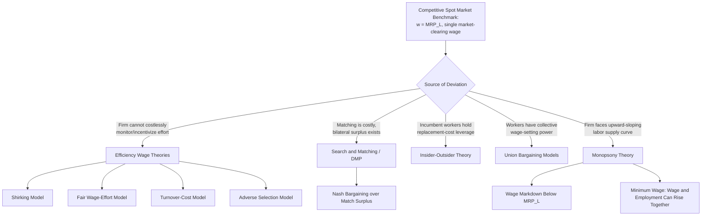

## Theories of Wage Setting

### Definition and Scope

Theories of wage setting address the central positive question in labor economics: how is the price of labor determined, and why does it deviate from the simplest textbook prediction of a single market-clearing wage equating labor supply and labor demand for homogeneous labor. The competitive spot-market model is the analytical benchmark against which every alternative theory is defined; the theories surveyed here differ primarily in *what they identify as the binding constraint or friction* that prevents the simple competitive outcome, and in the resulting empirical predictions each generates for wage dispersion, wage rigidity, and the relationship between wages and marginal product.

### The Competitive Benchmark

In the frictionless competitive model, the wage is determined by the intersection of a downward-sloping labor demand curve (derived from firms' profit maximization, where labor is hired up to the point where marginal revenue product equals the wage) and an upward-sloping labor supply curve (derived from worker utility maximization over consumption and leisure):

$$MRP_L = w = MC_L$$

where $MRP_L$ is the marginal revenue product of labor and $MC_L$ is the marginal cost of labor to the firm (equal to $w$ under perfect competition in the labor market). This model predicts:

- A single market-clearing wage for homogeneous labor, with no involuntary unemployment in equilibrium.
- Wages fully and instantaneously reflecting changes in marginal product.
- No role for firm identity, since identical workers earn identical wages regardless of employer (the "law of one price" for labor).

The persistent empirical failure of this last prediction — substantial, systematic **employer-specific wage variation for observably identical workers** (Krueger and Summers, 1988; and the more recent AKM-style variance decomposition literature, Abowd, Kramarz, and Margolis, 1999) — is the central empirical anomaly that most alternative wage-setting theories are built to explain.

### Efficiency Wage Theories

Efficiency wage models posit that a firm's paid wage causally affects worker productivity, so firms may find it profit-maximizing to pay above the market-clearing wage.

- **Shirking model** (Shapiro and Stiglitz, 1984): if effort cannot be perfectly monitored and workers who are caught shirking are fired, a firm can deter shirking by paying a wage premium that makes the cost of job loss (and hence the deterrent) large. In equilibrium, this generates **involuntary unemployment as a discipline device**: unemployment must be positive so that job loss carries a real cost, which is what makes the wage premium an effective shirking deterrent.

$$w^* = w_{alt} + \frac{c}{q} + \frac{c \cdot r}{q \cdot b}$$

where $w_{alt}$ is the alternative (reservation) wage, $c$ is the cost of effort, $q$ is the probability of detection if shirking, $r$ is the discount rate, and $b$ is the job separation rate; the no-shirking condition requires the wage to exceed the market-clearing level by an amount that varies inversely with monitoring intensity and the job-loss rate.

- **Nutritional efficiency wage models** (Leibenstein; relevant primarily in developing-economy and historical contexts): wages affect worker health and caloric intake, which in turn affects productivity, creating a direct physiological channel from wage to output independent of effort/incentive considerations.
- **Turnover-cost models** (Salop, 1979; Stiglitz, 1974): higher wages reduce voluntary quits, and if hiring and training new workers is costly, firms may find it optimal to pay above market-clearing wages to economize on turnover costs.
- **Fair wage-effort models** (Akerlof and Yellen, 1990): workers' effort depends on the gap between the wage they receive and a subjectively perceived "fair" wage (often anchored to relative pay comparisons, e.g., relative to co-workers, past wages, or industry norms); firms pay above market-clearing wages to avoid the productivity loss from perceived unfairness, connecting wage-setting theory directly to behavioral/reciprocity considerations in labor supply.
- **Adverse selection models** (Weiss, 1980): if worker quality is not directly observable and better workers have higher reservation wages, cutting wages below a threshold can lower the average quality of the applicant pool, making wage cuts unprofitable even in the presence of excess labor supply — a distinct mechanism from moral hazard/shirking but yielding similarly rigid, above-clearing wages.

### Search and Matching Theory (Diamond-Mortensen-Pissarides)

The DMP framework replaces the frictionless spot market with explicit search frictions: workers and firms must expend time and resources to find each other, generating a **matching function** and equilibrium unemployment even without efficiency-wage-style incentive problems.

$$M(u, v) = A \cdot u^{\alpha} v^{1-\alpha}$$

where $M$ is the flow of new matches (hires), $u$ is unemployment, $v$ is vacancies, $A$ is matching efficiency, and $\alpha \in (0,1)$ is the elasticity of matches with respect to unemployment.

- Because matches are costly to form and destroy, they generate a **bilateral monopoly / match surplus** once formed: the worker cannot instantly find an identical outside job and the firm cannot instantly replace the worker, so there is a range of wages both parties would prefer to the outside option, and the wage is **indeterminate without an additional bargaining assumption**.
- **Nash bargaining** is the standard closure: the wage splits the match surplus according to a bargaining-power parameter $\beta$:

$$w = \beta (MRP_L + \theta \cdot c) + (1-\beta) \cdot b$$

where $\theta = v/u$ is labor market tightness, $c$ is the vacancy-posting cost, and $b$ is the worker's outside/reservation value; higher labor market tightness raises equilibrium wages by strengthening the worker's bargaining position (fewer alternative workers available to the firm relative to job openings).

- Search-and-matching theory is the dominant modern framework for **unemployment dynamics** (distinguishing frictional, structural, and cyclical unemployment) and underlies the Beveridge curve relationship between unemployment and vacancy rates.
- A well-known internal critique (Shimer, 2005, "the unemployment volatility puzzle") notes that the standard DMP model with Nash bargaining generates far less cyclical volatility in unemployment and vacancies than observed empirically, motivating extensions such as wage rigidity assumptions (Hall, 2005) and alternative bargaining protocols to better match business-cycle facts.

### Insider-Outsider Theory

Insider-outsider models (Lindbeck and Snower, 1988) emphasize that **incumbent employed workers ("insiders")** have market power relative to unemployed "outsiders" because of firm-specific human capital, turnover costs, and (in unionized settings) collective bargaining institutions that represent incumbents' interests.

- Insiders can extract wage premia because replacing them with outsiders is costly (hiring, firing, and retraining costs create a wedge that insiders can exploit in wage negotiation, even when outsiders would willingly work at a lower wage).
- This generates **wage rigidity and hysteresis in unemployment**: adverse shocks that reduce insider employment do not fully reverse when conditions improve, because the remaining insiders have no incentive to moderate wage demands to help re-employ outsiders, a mechanism proposed to explain persistently high European unemployment following the shocks of the 1970s-1980s.
- The theory is closely related to, but analytically distinct from, pure union bargaining models: insider power can exist without formal union representation, arising purely from the cost structure of hiring and firing.

### Bargaining and Institutional Wage-Setting Models

- **Monopoly union model**: a union sets the wage unilaterally, and the firm then chooses employment along its labor demand curve given that wage, generating a wage above the competitive level and employment below the competitive level, analogous to standard monopoly output restriction.
- **Right-to-manage model**: the union and firm bargain over the wage, but the firm retains unilateral control over employment given the negotiated wage (a partial relaxation of the monopoly union assumption).
- **Efficient bargaining model** (McDonald and Solow, 1981): wage and employment are jointly negotiated to lie on the labor demand curve's contract curve, which can in principle deliver efficient (Pareto-optimal) outcomes for the negotiating parties, though not necessarily competitive-market employment levels.
- **Corporatist/coordinated bargaining systems**: economy-wide or sector-wide wage coordination (Nordic and continental European systems) is argued in the comparative institutions literature (Calmfors and Driffill, 1988) to produce a **hump-shaped relationship** between the degree of bargaining centralization and real wage restraint/unemployment outcomes: both highly centralized (national-level) and highly decentralized (firm-level) bargaining are associated with better macroeconomic wage outcomes than intermediate (industry-level) centralization, because both extremes internalize externalities that intermediate bargaining does not.

### Monopsony Theories of Wage Setting

Modern monopsony theory (surveyed extensively in Manning, 2003, and revitalized empirically by Card, Cardoso, Heining, and Kline, 2018, and related work) treats the firm as facing an **upward-sloping labor supply curve** rather than a perfectly elastic one, due to search frictions, worker heterogeneity in preferences over non-wage job attributes, and imperfect information about outside options.

$$w = MRP_L \cdot \left(\frac{\varepsilon_{LS}}{1+\varepsilon_{LS}}\right)$$

where $\varepsilon_{LS}$ is the firm-level elasticity of labor supply; as $\varepsilon_{LS} \to \infty$ (the competitive limit), $w \to MRP_L$, while finite elasticity implies wages persistently below marginal revenue product — a direct, testable monopsony wage markdown.

- This framework directly explains firm-specific wage variation for identical workers (the Krueger-Summers/AKM anomaly) without appeal to efficiency-wage incentive stories: firms with lower labor supply elasticity (due to concentrated local labor markets, differentiated job amenities, or worker search frictions) can sustain larger wage markdowns.
- Monopsony wage-setting theory has become central to the **minimum wage literature**: under monopsony, a minimum wage increase up to the competitive wage level can raise both wages and employment simultaneously (a directly counter-textbook prediction relative to the competitive model), providing a theoretical rationale consistent with the Card-Krueger (1994) empirical finding of no significant negative, and in that specific study a small positive, employment effect from a minimum wage increase in New Jersey fast food restaurants.

### Comparative Summary of Mechanisms

| Theory | Core Friction | Wage vs. Competitive Level | Primary Empirical Target |
| --- | --- | --- | --- |
| Efficiency Wage (Shirking) | Imperfect effort monitoring | Above | Involuntary unemployment, wage rigidity |
| Efficiency Wage (Fair Wage) | Reciprocity/perceived fairness | Above | Wage compression, downward rigidity |
| Search and Matching (DMP) | Costly search/matching | Indeterminate (bargained) | Unemployment/vacancy dynamics |
| Insider-Outsider | Turnover cost asymmetry | Above (for insiders) | Wage rigidity, unemployment hysteresis |
| Union Bargaining Models | Collective wage-setting power | Above | Union wage premium, employment restriction |
| Monopsony | Upward-sloping firm labor supply | Below | Employer-specific wage variation, minimum wage effects |

### Diagram: Taxonomy of Wage-Setting Theories by Deviation Source

### Diagram: Monopsony Wage Markdown Relative to Competitive and Efficiency Wage Outcomes

<svg xmlns="http://www.w3.org/2000/svg" viewBox="0 0 700 420">
<text x="350" y="24" text-anchor="middle" font-size="16" font-weight="bold" fill="#1a1a1a">Wage Outcomes Across Theories (svg_diagram)</text>
<line x1="80" y1="360" x2="620" y2="360" stroke="#333" stroke-width="2" />
<line x1="80" y1="360" x2="80" y2="60" stroke="#333" stroke-width="2" />
<text x="350" y="390" text-anchor="middle" font-size="13" fill="#333">Employment (L)</text>
<text x="40" y="210" text-anchor="middle" font-size="13" fill="#333" transform="rotate(-90 40 210)">Wage (w)</text>
<line x1="150" y1="330" x2="580" y2="110" stroke="#555" stroke-width="2" />
<text x="560" y="100" font-size="11" fill="#555">Labor Demand (MRP_L)</text>
<line x1="80" y1="220" x2="620" y2="220" stroke="#16a34a" stroke-width="2" stroke-dasharray="6,3" />
<text x="600" y="215" font-size="11" fill="#16a34a" font-weight="bold">Competitive w*</text>
<line x1="80" y1="160" x2="620" y2="160" stroke="#dc2626" stroke-width="2" stroke-dasharray="6,3" />
<text x="600" y="155" font-size="11" fill="#dc2626" font-weight="bold">Efficiency Wage (above w*)</text>
<line x1="80" y1="280" x2="620" y2="280" stroke="#2563eb" stroke-width="2" stroke-dasharray="6,3" />
<text x="590" y="295" font-size="11" fill="#2563eb" font-weight="bold">Monopsony Markdown (below w*)</text>
<circle cx="365" cy="220" r="5" fill="#16a34a" />
<circle cx="330" cy="160" r="5" fill="#dc2626" />
<circle cx="400" cy="280" r="5" fill="#2563eb" />

<text x="330" y="140" font-size="10" fill="`#dc2626`">Employment below</text>

<text x="330" y="152" font-size="10" fill="`#dc2626`">competitive level</text>

<text x="400" y="300" font-size="10" fill="`#2563eb`">Employment can be below</text>

<text x="400" y="312" font-size="10" fill="`#2563eb`">competitive level too</text>

</svg>

### Key Points

- Every major wage-setting theory is defined by the specific friction it substitutes for the frictionless competitive assumption; the choice of friction determines whether the theory predicts wages above (efficiency wage, insider-outsider, unions), below (monopsony), or indeterminate-but-bargained (search and matching) relative to the competitive benchmark.
- The persistent empirical finding of substantial employer-specific wage variation among observably identical workers is the central anomaly motivating the modern revival of monopsony and efficiency wage theories over the pure competitive model.
- Search and matching theory (DMP) is the dominant modern framework for unemployment dynamics specifically, complementary to rather than a full substitute for the wage-level theories (efficiency wage, monopsony, bargaining) that determine the wage conditional on a match being formed.
- Monopsony-based wage-setting theory provides a coherent theoretical account of minimum wage increases raising both wages and employment, directly informing the interpretation of the Card-Krueger empirical tradition. [Inference: the applicability of the monopsony account to any *specific* labor market requires evidence of low labor supply elasticity in that market; monopsony is a general theoretical possibility, not a universal empirical finding across all labor markets]

**Related Topics**

- Search and Matching Theory: The Diamond-Mortensen-Pissarides Model in Depth
- Monopsony Power in Labor Markets and the Card-Krueger Minimum Wage Debate
- Efficiency Wages and the Shapiro-Stiglitz Shirking Model
- The AKM Framework and Firm-Specific Wage Variance Decomposition
- Union Bargaining Models: Monopoly Union vs. Efficient Bargaining
- Insider-Outsider Theory and Unemployment Hysteresis
- Wage Rigidity: Nominal and Real Rigidity in Macro-Labor Models