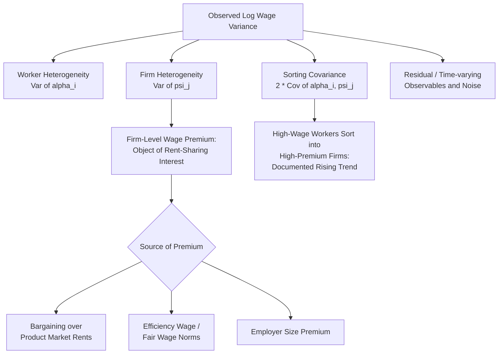

## Rent Sharing and Firm Level Wage Premiums

### Definition and Scope

Rent sharing refers to the phenomenon in which firms that generate economic rents (profits above the competitive normal return, arising from product market power, productivity advantages, or scarcity rents) pass a portion of those rents to their workers in the form of wages above what an observably identical worker would earn at a firm without such rents. The firm-level wage premium is the empirical object of measurement: the component of a worker's wage attributable to employer identity after controlling for worker characteristics (education, experience, occupation) and, ideally, worker unobserved ability. This topic is the direct empirical and theoretical counterpart to the "single wage for homogeneous labor" prediction of the competitive model discussed in wage-setting theory, and provides much of the modern motivation for monopsony and bargaining-based wage theories.

### Theoretical Rationale for Rent Sharing

Under a strictly competitive labor market, product market rents accrue entirely to shareholders; workers are paid their competitive opportunity cost regardless of firm profitability, since any firm attempting to pay less would lose its workforce to competitors, and any firm paying more would be unprofitable relative to competitors who do not. Rent sharing requires a labor market friction that breaks this arbitrage:

- **Bargaining power** (from search and matching theory): once a worker-firm match is formed, search frictions create a bilateral bargaining situation over the match surplus, and if part of that surplus derives from firm-specific product market rents, standard Nash bargaining implies the wage rises with the size of the rent (Blanchflower, Oswald, and Sanfey, 1996, is an early direct empirical test of this channel).
- **Union bargaining power**: unions, where present, can directly bargain for a share of firm rents as part of collective wage negotiation, an extension of the standard monopoly union/efficient bargaining framework to firm-level rather than industry-level heterogeneity in rents.
- **Efficiency wage / fair wage considerations**: workers may perceive firm profitability as relevant to a "fair" wage benchmark (Akerlof and Yellen, 1990), so profitable firms pay more to sustain effort norms even without formal bargaining power.
- **Monopsony power interacting with rents**: firms with product market rents and low labor supply elasticity can simultaneously extract monopsony markdowns *and* share a portion of rents, meaning observed wage premia reflect a net effect of two offsetting forces rather than a clean test of either mechanism in isolation.

### The Canonical Bargaining Formalization

A standard reduced-form rent-sharing wage equation, following the Nash bargaining tradition, expresses the firm-level wage premium as increasing in the ratio of quasi-rents to some scale variable (value added or the wage bill):

$$\ln w_{ijt} = X_{it}'\beta + \gamma \cdot \ln\left(\frac{VA_{jt}}{L_{jt}}\right) + \alpha_i + \psi_j + \epsilon_{ijt}$$

where $X_{it}$ are time-varying observable worker characteristics, $VA_{jt}/L_{jt}$ is value added per worker at firm $j$ (a standard rent proxy), $\alpha_i$ is a worker fixed effect capturing time-invariant unobserved ability, $\psi_j$ is a firm fixed effect capturing the pure firm-level wage premium net of both observable and unobservable worker sorting, and $\gamma$ is the rent-sharing elasticity — the coefficient of central empirical interest.

### The AKM Framework: Isolating the Firm Wage Premium

The dominant empirical methodology for estimating firm-level wage premiums separately from worker sorting is the two-way fixed effects framework of Abowd, Kramarz, and Margolis (1999), commonly termed AKM, applied to matched employer-employee longitudinal data.

$$\ln w_{it} = \alpha_i + \psi_{J(i,t)} + X_{it}'\beta + \epsilon_{it}$$

- $\alpha_i$ (the worker fixed effect) captures the portion of the wage attributable to the worker's own time-invariant characteristics (ability, credentials, negotiating skill) that travels with the worker across employers.
- $\psi_{J(i,t)}$ (the firm fixed effect) captures the portion of the wage attributable purely to current employer identity — the object identified as the firm-level wage premium.
- Identification of $\psi_j$ separately from $\alpha_i$ requires **worker mobility between firms** (the "connected set" of firms linked by worker moves); firms with no worker mobility into or out of them cannot have their premium separately identified from time-invariant worker composition.
- The AKM variance decomposition typically finds that both worker heterogeneity and firm heterogeneity contribute substantially to overall wage variance, and that a meaningful share of variance is attributable to **sorting** — the covariance between $\alpha_i$ and $\psi_j$, reflecting high-ability workers systematically matching to high-wage-premium firms — a finding with direct implications for inequality decomposition (Card, Heining, and Kline, 2013, for Germany; Song, Price, Guvenen, Bloom, and von Wachter, 2019, for the US).
- A well-documented econometric concern is **limited mobility bias**: with finite worker mobility, sampling variation in observed job moves generates spurious variance in estimated $\psi_j$, upward-biasing naive estimates of the firm-effect variance component; recent methodological work (Kline, Saggio, and Sølvsten, 2020; Bonhomme, Lamadon, and Manresa, 2019, using grouped/clustering approaches) develops bias-corrected estimators and alternative approaches to this problem. [Unverified: the precise magnitude of bias correction varies substantially by dataset and estimator choice across the literature, so specific numerical bias-correction results are not treated as generalizable point estimates here]

### Empirical Findings

- Rent-sharing elasticities ($\gamma$ in the reduced-form specification above) are consistently estimated as **positive and statistically significant but well below unity** across countries and time periods, typically in a range where a 10% increase in firm profitability or value added per worker is associated with a wage increase on the order of 1-2%, indicating workers capture a modest but non-trivial share of firm-level rents (surveyed in Card, Cardoso, Heining, and Kline, 2018).
- Firm-level wage premiums are a substantial contributor to **overall wage inequality**, and the trend in most studied economies (Germany, the US, several other OECD countries) over recent decades has been **rising dispersion in firm-level wage premiums**, contributing to rising between-firm wage inequality even holding worker composition fixed (Card, Heining, and Kline, 2013; Song et al., 2019, document this for the US alongside a broader finding of increasing sorting of similar-wage workers into the same firms, i.e., rising workplace segregation by pay level).
- Firm-level wage premiums are strongly correlated with **firm size** (the well-documented "employer size-wage premium," Brown and Medoff, 1989), though the relationship between firm size and rent sharing specifically versus other size-correlated factors (efficiency wage motives, better worker-firm matching at larger firms, compensating differentials for job characteristics) remains a subject of ongoing decomposition efforts.
- **Multinational and exporting firms** tend to show larger wage premiums than domestic non-exporting firms, consistent with rent-sharing from trade-related productivity or markup advantages (a substantial literature within international trade and labor economics, e.g., Frías, Kaplan, and Verhoogen on Mexican manufacturing).
- Displacement and mobility studies find that workers moving from a high-premium to a low-premium firm (or vice versa) experience wage changes consistent with the AKM decomposition's implied firm effects, providing a form of external validation for the fixed-effects approach (Card, Heining, and Kline, 2013, event-study analysis around job changes).

### Rent Sharing and the Gender Wage Gap

A specific and policy-relevant application of the rent-sharing literature examines whether men and women capture rents at different rates within the same firms or sort differentially into high-premium versus low-premium firms:

- Several studies find women capture a **smaller share of firm-level rents than men**, even within the same establishment, contributing to the residual (within-job) gender wage gap not explained by occupation or hours differences (Card, Cardoso, and Kline, 2016, for Portugal is a widely cited example, finding both a lower bargaining-power-implied elasticity for women and differential sorting into lower-premium firms).
- This finding connects rent-sharing theory directly to the broader gender-gap and monopsony literature, since lower female bargaining power or higher female labor supply elasticity (potentially reflecting compensating preferences for job amenities, commuting constraints, or search intensity differences) are both consistent explanations within the wage-setting-theory taxonomy covered previously.

### Policy and Interpretive Implications

- Rent-sharing evidence complicates simple **"pay reflects productivity" interpretations** of wage inequality: a substantial share of between-firm wage variance appears to reflect firm profitability and bargaining position rather than differences in worker human capital, implying that policies aimed purely at worker skill-building (education, training subsidies) may not fully address wage inequality driven by employer heterogeneity.
- The finding of **rising firm-level wage premium dispersion and worker sorting** has been proposed as a contributor to aggregate wage inequality trends independent of, and in addition to, the skill-biased technical change and returns-to-education channels more traditionally emphasized.
- Rent-sharing considerations are directly relevant to **antitrust and labor market concentration policy**: if labor market concentration increases employer bargaining/monopsony power at the expense of rent-sharing toward workers, competition policy interventions in labor markets (as opposed to only product markets) become a coherent policy lever, an active area of applied and policy-oriented research as of recent years.

### Diagram: Decomposing Wage Variance in the AKM Framework

### Diagram: Rent-Sharing Elasticity Concept

<svg xmlns="http://www.w3.org/2000/svg" viewBox="0 0 700 400">
<text x="350" y="24" text-anchor="middle" font-size="16" font-weight="bold" fill="#1a1a1a">Firm Profitability and Wage Premium (svg_diagram)</text>
<line x1="80" y1="340" x2="620" y2="340" stroke="#333" stroke-width="2" />
<line x1="80" y1="340" x2="80" y2="60" stroke="#333" stroke-width="2" />
<text x="350" y="370" text-anchor="middle" font-size="13" fill="#333">log(Value Added per Worker)</text>
<text x="35" y="200" text-anchor="middle" font-size="13" fill="#333" transform="rotate(-90 35 200)">log(Wage)</text>
<line x1="80" y1="240" x2="620" y2="240" stroke="#999" stroke-width="1" stroke-dasharray="4,4" />
<text x="590" y="235" font-size="10" fill="#666">Competitive wage floor (no rent sharing)</text>
<path d="M120,300 L620,120" fill="none" stroke="#2563eb" stroke-width="3" />
<text x="400" y="150" font-size="12" fill="#2563eb" font-weight="bold">Fitted slope = gamma (rent-sharing elasticity)</text>
<circle cx="150" cy="290" r="4" fill="#555" />
<circle cx="220" cy="270" r="4" fill="#555" />
<circle cx="300" cy="250" r="4" fill="#555" />
<circle cx="380" cy="220" r="4" fill="#555" />
<circle cx="450" cy="200" r="4" fill="#555" />
<circle cx="520" cy="170" r="4" fill="#555" />
<circle cx="580" cy="150" r="4" fill="#555" />

<text x="150" y="320" font-size="10" fill="#555">Low-rent firms:</text>

<text x="150" y="333" font-size="10" fill="#555">wage near competitive floor</text>

<text x="480" y="130" font-size="10" fill="#555">High-rent firms:</text>

<text x="480" y="143" font-size="10" fill="#555">wage premium above floor</text>

</svg>

### Key Points

- Rent sharing requires a labor market friction (bargaining power, monopsony interaction, efficiency wage/fairness norms) to break the competitive prediction that product market rents accrue only to shareholders.
- The AKM two-way fixed effects framework is the dominant empirical tool for isolating the firm-level wage premium from worker-level unobserved heterogeneity, requiring worker mobility for identification and subject to well-documented limited-mobility bias in finite samples.
- Estimated rent-sharing elasticities are consistently positive but substantially below unity, and firm-level wage premium dispersion, combined with rising worker sorting into similarly-paying firms, is a documented contributor to rising between-firm wage inequality in several studied economies.
- Differential rent capture by gender within firms is an active and policy-relevant extension of the literature, linking rent-sharing directly to the within-job gender wage gap and to monopsony-based explanations of gender pay differences.

**Related Topics**

- The AKM Model and Two-Way Fixed Effects Wage Decomposition
- Monopsony Power and Labor Market Concentration
- The Employer Size-Wage Premium (Brown-Medoff)
- Gender Wage Gaps and Differential Bargaining Power
- Trade, Multinational Firms, and Wage Premiums
- Labor Market Concentration and Antitrust Policy
- Worker Sorting and Assortative Matching Between Firms and Workers