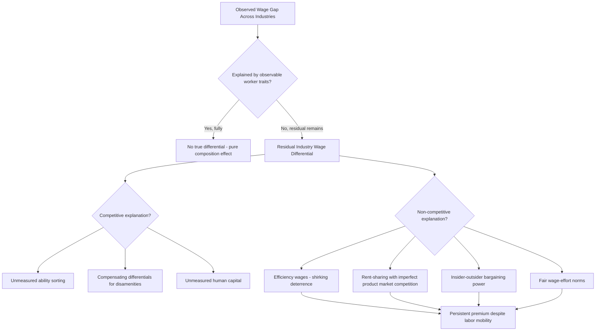

## Interindustry Wage Differentials

### Definitional Overview

Interindustry wage differentials (IWDs) refer to the persistent, systematic variation in wages paid to observably similar workers across different industries, after controlling for measurable worker characteristics (education, experience, occupation, region, and demographic traits). A worker with identical human capital may earn substantially more in, for example, petroleum refining than in retail apparel — this residual gap is the object of study.

**Key Points**

- IWDs are measured as the residual industry effect in a Mincer-style wage regression after conditioning on observable worker characteristics
- The central puzzle is that competitive labor market theory predicts these differentials should not exist (or should not persist) if labor is freely mobile and workers are homogeneous conditional on observables
- IWDs are remarkably stable across countries, time periods, and business cycles, which is itself a major empirical finding

### Empirical Regularities

The foundational empirical work (Krueger and Summers 1988; Dickens and Katz 1987) established several stylized facts:

1. **Cross-country stability**: The rank ordering of industry wage premiums (e.g., mining and utilities near the top; apparel and retail trade near the bottom) is highly correlated across countries with very different labor market institutions
2. **Temporal stability**: Industry wage rankings are highly correlated across decades, even through recessions and expansions
3. **Occupational stability**: The same industry effects appear when looking within narrow occupational categories, ruling out occupation-mix as the explanation
4. **Magnitude**: Estimated premiums for high-wage industries relative to low-wage industries commonly range from roughly 20% to 40% log-points in U.S. data after controlling for observables [Unverified — exact magnitude is sensitive to specification, time period, and dataset]

### Formal Regression Framework

The standard specification decomposes log wages as:

$$\ln(w_{ij}) = X_i \beta + \sum_{k=1}^{K} \delta_k D_{ik} + \varepsilon_i$$

where $X_i$ is a vector of observable worker characteristics (education, experience, experience-squared, gender, race, region, union status, occupation), $D_{ik}$ is a dummy variable equal to 1 if worker $i$ is employed in industry $k$, and $\delta_k$ is the estimated wage premium associated with industry $k$ relative to a reference industry.

The **industry wage differential** for industry $k$ is $\hat{\delta}_k$. The variance of these estimated $\hat{\delta}_k$ coefficients across industries, after conditioning on rich observable controls, is the key object of interest — a large and statistically significant variance constitutes the empirical puzzle.

### Explanations: Standard Competitive Theory

Competitive theory offers several explanations that attempt to preserve market-clearing without invoking rents:

**1. Unmeasured Worker Heterogeneity (Ability Sorting)**

[Inference] High-ability or unobservably more productive workers may sort into high-wage industries, meaning the "premium" is not a pure industry effect but reflects unobserved ability that standard controls fail to capture. Panel-data studies using worker fixed effects (Abowd, Kramarz, and Margolis 1999; Krueger and Summers 1988) find that controlling for individual fixed effects reduces but does not eliminate the estimated industry differentials substantially — a large residual premium (often argued to be more than half the raw differential) survives even after netting out person-specific heterogeneity.

**2. Compensating Differentials**

High-wage industries might involve worse working conditions (physical risk, unpleasant environments, irregular hours), and the wage premium compensates workers for these disamenities per standard Rosen-style hedonic wage theory. Empirical tests generally find this explains only a modest share of the variance, since some high-wage industries (e.g., utilities, finance) do not have obviously worse working conditions than low-wage industries (e.g., retail, apparel).

**3. Human Capital Not Captured by Standard Controls**

[Speculation] Industries may differ in the amount of implicit, hard-to-measure training or skill-development embedded in jobs, such that observationally similar education/experience workers are not economically similar. This explanation is difficult to test directly because it is nearly unfalsifiable without direct skill measures.

### Explanations: Non-Competitive Theories

**1. Efficiency Wage Theory**

Firms in certain industries may pay above-market-clearing wages to reduce shirking, reduce turnover, or attract higher-quality applicants from an unobservably heterogeneous applicant pool. The Shapiro-Stiglitz shirking model formalizes this:

$$w^* = w_a + \frac{c}{p \cdot q} \left[r + s + p \cdot q\right]$$

where $w^*$ is the no-shirking wage, $w_a$ is the alternative (competitive) wage, $c$ is the cost of effort, $p$ is the probability of detection, $q$ is the probability of job loss upon detection, $r$ is the discount rate, and $s$ is the exogenous separation rate. Industries where monitoring is difficult or the cost of shirking (e.g., safety failures, product defects) is high would rationally pay wages above $w_a$ to deter shirking, generating persistent industry-level premiums unrelated to worker characteristics.

**2. Rent-Sharing and Insider-Outsider Models**

Where product markets are imperfectly competitive (oligopoly, high concentration, high profitability), firms may share monopoly/oligopoly rents with employees, particularly where unions or implicit bargaining norms exist. This is the leading explanation favored by much of the literature:

- Industries with higher concentration ratios, higher profit margins, and higher unionization rates tend to exhibit higher estimated wage premiums (Katz and Summers 1989)
- Rent-sharing models predict that IWDs should correlate with firm/industry profitability — a correlation that is robustly found empirically
- Insider-outsider models (Lindbeck and Snower) suggest incumbent workers ("insiders") can extract rents from firms due to turnover costs, hiring/firing costs, and coordination advantages over outsiders, independent of pure competitive pressures

**3. Fair Wage-Effort Hypothesis (Akerlof and Yellen)**

Workers' effort depends on the wage relative to a perceived "fair" reference wage, which may be tied to firm/industry profitability or to wages paid to comparable workers elsewhere in the same industry. If firms in profitable industries pay wages below what workers perceive as fair given that profitability, effort and morale suffer, providing another rent-sharing-adjacent mechanism for the persistence of premiums.

### Why Competitive Forces Do Not Erode These Differentials

**Key Points**

- If low-wage-industry workers are homogeneous with high-wage-industry workers, we would expect queuing for high-wage jobs (excess applicants), which is empirically observed — industries with high estimated premiums do have longer applicant queues and lower quit rates
- Long queues combined with employer-side screening/rationing (rather than wage-bidding-down by desperate applicants) can sustain a non-market-clearing wage indefinitely if firms have no incentive to lower wages (efficiency wage / rent-sharing logic) and workers cannot credibly underbid due to firm-side screening frictions
- Job rationing implies involuntary "wait unemployment" in the queuing sense, distinct from classical frictional unemployment

### Diagram: Sources of Interindustry Wage Differentials

### Illustrative Example

**Example**

Suppose a regression using matched worker-industry panel data finds that a machine operator in petroleum refining earns a residual industry premium of $\hat{\delta} = 0.28$ (approximately 28% log-points) relative to a machine operator with identical education, experience, gender, and region working in the apparel industry, both after controlling for occupation. If a fixed-effects specification using workers who *switch* from apparel to petroleum refining shows their wages rise by approximately 18 percentage points upon the switch (holding their unobserved ability fixed by construction), this is read as evidence that roughly 18 of the 28 percentage points reflect a genuine industry effect, with the remaining ~10 points attributable to selection on unobserved ability. [Unverified — these figures are a stylized illustration of the identification strategy, not results from a specific cited study]

### Measurement and Identification Challenges

- **Selection bias**: Cross-sectional OLS estimates conflate true industry effects with unobserved ability sorting; longitudinal/panel methods with worker and firm fixed effects (Abowd-Kramarz-Margolis "AKM" decomposition) are the standard modern remedy
- **The AKM decomposition** splits log wages into a person fixed effect, a firm/industry fixed effect, and a residual: $\ln(w_{it}) = \alpha_i + \psi_{J(i,t)} + X_{it}\beta + \varepsilon_{it}$, where $\alpha_i$ absorbs time-invariant worker heterogeneity and $\psi_{J(i,t)}$ is the firm/industry effect of interest
- **Limited mobility bias**: AKM-style estimates can be biased when few workers switch between industry pairs, since the industry fixed effects are only identified through the "connected set" of movers — this is an active area of ongoing econometric refinement [Inference] and remains one of the more technical caveats in modern applications of this framework

### Policy and Broader Implications

- IWDs imply that industry of employment, not just human capital, is a first-order determinant of individual wages, complicating simple "get more education" prescriptions for reducing wage inequality
- Rising wage inequality in many advanced economies has been partly attributed to *between-industry* wage divergence (some industries pulling away from others) as opposed to purely *within-industry* skill-premium effects — the relative contribution of each is debated in the inequality literature
- Trade and technology shocks that shrink high-premium industries (e.g., manufacturing decline in the U.S.) can reduce aggregate wages for displaced workers by more than human capital models alone would predict, since displaced workers lose access to the rent-sharing/efficiency-wage premium specific to their former industry, not just their occupation-specific skills

### Related Topics

- Efficiency Wage Models (Shapiro-Stiglitz Shirking Model)
- Rent-Sharing and Firm Profitability Pass-Through to Wages
- The Abowd-Kramarz-Margolis (AKM) Wage Decomposition
- Insider-Outsider Theory of Wage Determination
- Compensating Wage Differentials and Hedonic Wage Theory
- Job Displacement and the Cost of Losing Industry-Specific Rents
- Union Wage Premiums and Collective Bargaining Effects
- Between- vs. Within-Industry Contributions to Rising Wage Inequality