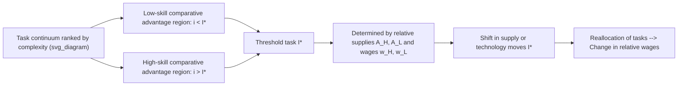
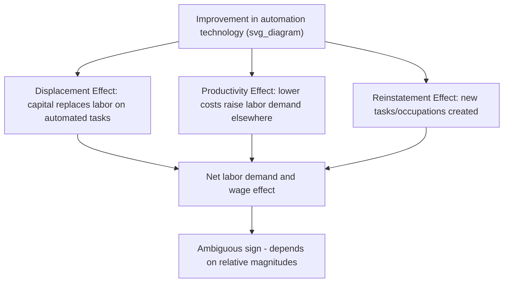

## Task-Based Models of the Labor Market

### Overview and Motivation

Task-based models represent a shift away from treating labor as a homogeneous or purely skill-differentiated input, instead conceptualizing production as a set of discrete **tasks** that must be allocated across factors of production — workers of different skill types and, increasingly, capital/automation technologies. The foundational insight is that skills (durable worker attributes) and tasks (units of work activity) are analytically distinct, and the assignment of skills to tasks is itself an equilibrium outcome determined by comparative advantage, relative factor supplies, and technology.

This framework was developed primarily by Daron Acemoglu and David Autor, building on earlier Ricardian trade-style assignment models (notably Sattinger, 1975, and Teulings, 1995), and has become the dominant framework for analyzing wage polarization, automation, and the labor market effects of technologies such as robotics and, more recently, artificial intelligence.

### Core Distinction: Skills vs. Tasks

**Key Points**

- A **skill** is a worker's stock of capabilities (cognitive, manual, interpersonal) that can be deployed across many tasks.
- A **task** is a unit of work activity that produces output, e.g., "welding a joint," "diagnosing a patient," "processing a loan application."
- Traditional human capital models (Mincer, Becker) treat skill and its market price (the wage) as the primary object of analysis, implicitly assuming a fixed, one-to-one mapping between skill types and job types.
- Task-based models instead treat the assignment of skills to tasks as an equilibrium variable that responds to relative supplies, technology, and trade — meaning the same worker skill can be allocated to different tasks depending on market conditions.

### The Ricardian Assignment Framework

#### Basic Setup

Consider a continuum of tasks indexed by $i \in [0, 1]$ (or, in some formulations, ranked by complexity). Two factors — for example, high-skill labor $H$ and low-skill labor $L$, or labor $L$ and capital/automation $K$ — can perform these tasks with different relative productivities across the task spectrum.

Output for task $i$ is produced according to:

$$y(i) = A_L(i) \cdot l(i) \quad \text{or} \quad y(i) = A_H(i) \cdot h(i)$$

depending on which factor is assigned to task $i$, where $A_L(i)$ and $A_H(i)$ are factor-specific productivity schedules across the task space.

#### Comparative Advantage and the Assignment Margin

The key equilibrium condition is a **comparative advantage** cutoff: there exists a threshold task $I^*$ such that low-skill labor is assigned to tasks $i < I^*$ and high-skill labor is assigned to tasks $i > I^*$ (or vice versa, depending on how tasks are ordered by complexity). This threshold is determined by relative factor supplies and relative productivity schedules, analogous to the Ricardian model of comparative advantage in international trade, where "countries" are replaced by "factor types" and "goods" are replaced by "tasks."

$$\frac{A_H(I^*)}{A_L(I^*)} = \frac{w_H}{w_L}$$

This condition states that at the marginal task $I^*$, the relative productivity of high-skill to low-skill labor exactly equals the relative wage — the factor with comparative advantage at each task is assigned to that task in equilibrium.

**Key Points**

- Wages are determined by the entire equilibrium assignment, not simply by a worker's exogenous skill level.
- A change in relative factor supplies (e.g., an increase in the supply of high-skill workers) shifts the assignment threshold $I^*$, reallocating tasks and changing relative wages — even with no change in technology.
- A change in technology (e.g., automation displacing labor from certain tasks) shifts the productivity schedules $A_L(i)$ or $A_H(i)$, likewise reallocating tasks and wages.

### Diagram: Task Assignment Threshold

### Acemoglu-Autor Canonical Task Model

#### Extension to Three Factors: Low, Middle, High Skill

Acemoglu and Autor (2011) extend the two-factor assignment model to three skill groups — low, middle, and high skill — assigned across a task continuum, allowing the model to generate **wage polarization**: simultaneous wage growth at the top and bottom of the distribution with stagnation or decline in the middle.

The intuition: middle-skill workers historically performed tasks characterized by well-defined, routine, codifiable procedures (e.g., bookkeeping, assembly-line work, routine clerical tasks). These routine tasks are disproportionately susceptible to automation because their explicit, rule-based structure makes them replicable by computer capital. As automation technology improves and its relative cost falls, capital displaces middle-skill labor from routine tasks, and:

- Middle-skill workers are pushed either **down** into low-skill, manual, non-routine tasks (many personal service occupations) or **up** into high-skill, cognitive, non-routine tasks (to the extent they have the requisite human capital).
- This bidirectional displacement produces a hollowing-out of middle-wage occupations, consistent with observed employment polarization in the US and other advanced economies since the 1980s.

#### Routine vs. Non-Routine, Cognitive vs. Manual Taxonomy

| Task Type | Description | Automation Susceptibility | Example Occupations |
| --- | --- | --- | --- |
| Routine cognitive | Codifiable, rule-based mental tasks | High | Bookkeeping, basic accounting, data entry |
| Routine manual | Codifiable, repetitive physical tasks | High | Assembly-line work, machine operation |
| Non-routine cognitive analytical | Complex problem-solving, abstract reasoning | Low (historically) | Engineering, management, scientific research |
| Non-routine cognitive interpersonal | Persuasion, negotiation, care | Low (historically) | Sales management, therapy, teaching |
| Non-routine manual | Situational adaptability, fine motor/physical flexibility | Low (historically) | Food service, cleaning, personal care aides |

**Key Points**

- This taxonomy, developed by Autor, Levy, and Murnane (2003) — the "ALM" framework — is the empirical predecessor to the formal Acemoglu-Autor task model.
- Automation susceptibility is not fixed: advances in AI/machine learning have begun to erode the historical safety of some non-routine cognitive tasks (e.g., certain diagnostic, drafting, and pattern-recognition tasks), an active area of ongoing task reclassification research. [Inference: the pace and ultimate scope of this erosion for specific occupations is uncertain and subject to differing projections across studies]

### Automation as a Task Reallocation Process

#### Formal Treatment: Acemoglu and Restrepo (2018, 2019)

Acemoglu and Restrepo formalize automation explicitly within the task framework by allowing capital to perform tasks previously performed exclusively by labor. Let tasks be indexed on $[N-1, N]$ where $N$ represents the endogenous technology frontier of automatable tasks. Production combines labor-performed tasks and capital-performed (automated) tasks:

$$Y = \left( \int_0^N y(i)^{\frac{\sigma-1}{\sigma}} di \right)^{\frac{\sigma}{\sigma-1}}$$

where $\sigma$ is the elasticity of substitution across tasks, and $y(i)$ is produced either by labor or, for tasks below the automation frontier, by capital, whichever is cheaper.

This model decomposes the labor market impact of automation into distinct, sometimes offsetting channels:

1. **Displacement effect** — automation of a task directly reduces labor demand for that task, since capital now performs it.
2. **Productivity effect** — automation lowers overall production costs, raising demand for labor in non-automated tasks through scale/income effects.
3. **Task reinstatement effect** — technological change can also create entirely new tasks that did not previously exist (e.g., new occupational categories tied to designing, maintaining, or supervising new technologies), reinstating labor demand.
4. **Capital accumulation / deepening effect** — as automated tasks become cheaper, capital investment may rise further, with ambiguous net effects.

**Key Points**

- Whether automation is labor-displacing or labor-augmenting in net terms depends on the relative magnitude of the displacement effect versus the productivity and reinstatement effects — this is an empirical, not purely theoretical, question.
- The framework explicitly rejects the older "capital-skill complementarity" model's implicit assumption that automation only ever complements skilled labor uniformly; instead, automation's effects are task-specific and can hurt or help workers of a given skill level depending on which tasks are automated.

### Diagram: Automation Effects Decomposition

### Wage Determination in Task-Based Models

#### General Equilibrium Wage Effects

Wages in task-based models are not set by a worker's marginal product in a fixed job; instead, wages emerge from the equilibrium clearing of task markets given factor supplies and productivity schedules. This yields several results distinct from the standard human capital model:

- **Between-group wage inequality** responds to relative supply shifts even without any change in individual skill, because supply shifts alter the task assignment threshold.
- **Task displacement can lower wages for a skill group without any decline in that group's underlying human capital**, purely because the group has lost comparative advantage over a range of tasks due to automation — a result that standard skill-based technical change (SBTC) models cannot generate, since SBTC assumes a fixed skill-task mapping and only shifts the relative productivity of skill types uniformly across all their tasks.

#### Comparison: SBTC vs. Task-Based Models

| Feature | Skill-Biased Technical Change (SBTC) | Task-Based Model |
| --- | --- | --- |
| Unit of analysis | Skill group | Task |
| Skill-to-job mapping | Fixed | Endogenous/reallocated |
| Technology effect | Uniformly raises high-skill relative productivity | Task-specific; can displace any skill group from specific tasks |
| Predicts wage polarization | Not directly (predicts monotonic wage-skill relationship) | Yes (via routine task displacement mechanism) |
| Key mechanism | Relative demand shift for skill | Comparative advantage reassignment across tasks |

### Empirical Applications

#### Wage Polarization Evidence

Autor, Katz, and Kearney (2006, 2008) document that US wage growth from the 1980s onward exhibited a polarized, U-shaped pattern across the wage/occupation distribution — with strong wage growth at both the top (professional, managerial, technical occupations) and bottom (service occupations) and weaker growth in the middle (production, clerical, sales occupations) — consistent with the routinization hypothesis embedded in the task model.

#### Trade and Offshoring

Grossman and Rossi-Hansberg (2008) extend the task framework to international trade, modeling **offshoring** as a form of "task trade" — tasks, rather than entire goods or occupations, can be relocated abroad if they are sufficiently codifiable to be performed remotely. This generates a "productivity effect" of offshoring analogous to the productivity effect of automation, potentially benefiting domestic labor in non-offshored tasks even as some tasks are lost.

#### AI and the Expanding Task Frontier

Recent literature applies the task framework to generative AI and large language models, examining whether AI primarily displaces or augments task performance across cognitive, non-routine domains previously considered immune to automation (e.g., writing, coding, basic legal drafting). [Speculation: the long-run classification of which cognitive tasks remain complementary to versus substitutable by AI systems is unsettled, and current empirical estimates are based on early-stage adoption data that may not generalize to mature technology diffusion]

### Worked Example: Simple Two-Task, Two-Factor Assignment

Suppose there are two factors, low-skill labor $L$ and high-skill labor $H$, and two tasks, $i=1$ (simple) and $i=2$ (complex), with productivity schedules:

|  | Task 1 (simple) | Task 2 (complex) |
| --- | --- | --- |
| Low-skill labor | $A_L(1) = 10$ | $A_L(2) = 4$ |
| High-skill labor | $A_H(1) = 12$ | $A_H(2) = 20$ |

Low-skill labor has comparative advantage in Task 1: $\frac{A_L(1)}{A_H(1)} = \frac{10}{12} = 0.83$ versus $\frac{A_L(2)}{A_H(2)} = \frac{4}{20} = 0.20$. Since $0.83 > 0.20$, low-skill labor is relatively more productive (compared to high-skill labor) at Task 1 than at Task 2, so equilibrium assignment places low-skill labor on Task 1 and high-skill labor on Task 2, even though high-skill labor has an absolute productivity advantage at both tasks.

**Example**

This mirrors the Ricardian trade result: absolute advantage does not determine assignment; comparative advantage does. If a wave of automation now allows capital to perform Task 1 at a cost equivalent to $A_K(1) = 15$, capital displaces low-skill labor entirely from Task 1, and low-skill labor must either exit the labor force, retrain, or shift to a newly created task $i=0$ (if the reinstatement effect generates one) — illustrating the displacement/reinstatement tension central to the Acemoglu-Restrepo extension.

### Critiques and Limitations

- **Identification challenges** — separating the task-reallocation channel from concurrent changes in trade exposure, unionization, minimum wage policy, and macroeconomic shocks is empirically difficult, and most reduced-form polarization studies rely on correlational rather than fully structural identification. [Inference]
- **Task measurement** — task content is typically inferred from occupational surveys (e.g., O*NET, the Dictionary of Occupational Titles) rather than observed directly, introducing measurement error into empirical applications of the framework.
- **Static task boundaries** — many empirical applications treat task content within an occupation as fixed over time, whereas in practice occupations evolve and absorb new tasks continuously, which some argue understates the reinstatement effect.
- **Elasticity of substitution uncertainty** — results are sensitive to the assumed elasticity of substitution across tasks ($\sigma$) and across skill types, and estimates of these parameters vary across studies. Behavior of the model under alternative parameterizations may differ substantially from baseline calibrations.

### Related Topics

- Skill-Biased Technical Change (SBTC) and the Canonical Model
- Routine-Biased Technical Change and Job Polarization
- Automation, Robots, and Labor Demand (Acemoglu-Restrepo Empirics)
- Offshoring and Task Trade (Grossman-Rossi-Hansberg Model)
- Comparative Advantage and Ricardian Assignment Models
- O*NET Task Content Measurement Methodology
- Artificial Intelligence and the Future of Work
- Superstar Effects and Winner-Take-All Markets