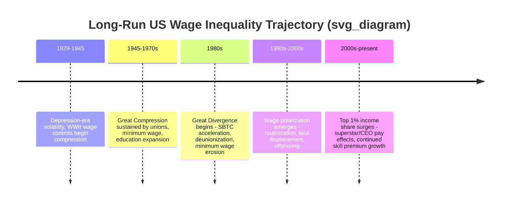

## Long Run Trends in Wage Inequality

### Overview and Periodization

Long-run wage inequality in advanced economies, particularly the United States, follows a well-documented **U-shaped or "Great U-Turn"** pattern over the twentieth and twenty-first centuries: a period of compression (the "Great Compression") from roughly the late 1920s through the 1970s, followed by a sustained and substantial widening from approximately 1980 onward (the "Great Divergence" or "Great Reversal"). Understanding this trajectory requires integrating evidence on multiple distinct margins of inequality — between education groups, within education groups, across the top of the income distribution, by gender, and by race — since these margins have not always moved together.

**Key Points**

- Wage inequality is not a single monotonic trend; it has a documented reversal in direction around 1980.
- Different inequality margins (between-group, within-group, top-tail, gender, racial) can diverge even within the same broad period, requiring decomposition rather than a single aggregate statistic.
- The primary data sources for this literature are the Current Population Survey (CPS), the Census/American Community Survey, and administrative Social Security earnings records, each with distinct strengths and top-coding/measurement limitations.

### The Great Compression (1929–1970s)

#### Wartime Wage Controls and Institutional Compression

Goldin and Margo (1992) documented a sharp narrowing of the US wage structure during the 1940s, driven substantially by World War II-era wage and price controls (the National War Labor Board), rapid demand for less-skilled labor in wartime production, and a surge in unionization. This compression persisted for roughly three decades after the war, a phenomenon they termed the "Great Compression."

#### Sustaining Forces Through the 1970s

Several institutional and macroeconomic forces sustained low wage inequality through the postwar period:

- **High and rising unionization rates**, which compressed within-firm and within-industry wage dispersion through collective bargaining norms.
- **A rising real minimum wage** relative to median wages, which put a floor under the bottom of the distribution.
- **Continued expansion of educational attainment**, which kept the relative supply of skilled labor growing roughly in step with, or ahead of, relative demand — consistent with Tinbergen's "race between education and technology" framing later formalized by Goldin and Katz.
- **Relatively stable trade exposure** for the US economy prior to major globalization waves.

### The Great Divergence (1980–Present)

#### Timing and Magnitude

Beginning around 1980, the college/high-school wage premium, within-group wage dispersion, and top-income shares all began rising simultaneously, reversing the prior compression trend. The magnitude has been substantial: the college wage premium roughly doubled between 1980 and the 2000s in the US, and the share of total income accruing to the top 1% of earners rose sharply over the same period.

#### Canonical Explanations

**1. Skill-Biased Technical Change (SBTC) and the Race Between Education and Technology**

The dominant explanation in labor economics, formalized by Katz and Murphy (1992) and later extended by Goldin and Katz (2008) in *The Race between Education and Technology*, models relative wages as determined by the interaction of relative supply and relative demand for skilled versus unskilled labor:

$$\ln\left(\frac{w_H}{w_L}\right) = \frac{1}{\sigma}\left[D_t - \ln\left(\frac{H_t}{L_t}\right)\right]$$

where $\sigma$ is the elasticity of substitution between skill types, $D_t$ is a time-varying relative demand shifter (attributed to skill-biased technology), and $\frac{H_t}{L_t}$ is the relative supply of skilled to unskilled labor. Under this framework, wage inequality rises when demand for skill grows faster than supply — and the slowdown in the growth rate of college-educated labor supply after 1980 (relative to the rapid expansion of earlier decades) is a central part of the explanation, combined with accelerating computerization raising $D_t$.

**2. Task-Based Models and Routinization**

As covered in the task-based models framework, Autor, Levy, and Murnane (2003) and Acemoglu and Autor (2011) reframe the demand shift as task-specific rather than uniformly skill-biased: computerization primarily displaced routine tasks (disproportionately middle-wage), producing wage and employment **polarization** rather than a simple monotonic skill-wage relationship. This explains a pattern the basic SBTC model struggles with directly: simultaneous real wage growth at the top and bottom of the distribution with stagnation in the middle, observed in the US especially from the 1990s onward.

**3. Deunionization and Institutional Change**

The sharp decline in US private-sector unionization (from roughly a third of the private workforce in the 1950s to under 10% by the 2010s) is estimated to account for a meaningful share of the rise in within-group male wage inequality, since unions historically compressed pay dispersion both within and across establishments. [Inference: precise decomposition estimates of the union contribution to inequality vary by study and time period, generally ranging from a notable minority share to a substantial share of the total rise in male wage variance, depending on methodology]

**4. Erosion of the Real Minimum Wage**

The federal minimum wage's real (inflation-adjusted) value declined substantially from its late-1960s peak through the 1980s and has not been consistently indexed since, contributing to widening lower-tail wage inequality, particularly for women and low-wage workers, as documented by DiNardo, Fortin, and Lemieux (1996) using quantile decomposition methods.

**5. Globalization and Trade Exposure**

Increased trade with lower-wage countries (China's WTO accession in 2001 being a heavily studied shock via Autor, Dorn, and Hanson's "China Syndrome" literature) reduced demand for labor in import-competing manufacturing sectors, contributing to both regional and occupational wage effects, though its aggregate contribution to national-level inequality trends is generally estimated as smaller than SBTC/task-based mechanisms for the US as a whole. [Inference: this relative ranking of magnitude is a synthesis across multiple empirical studies rather than a single consensus estimate]

**6. Superstar and Winner-Take-All Effects at the Top**

As covered in the superstar effects framework, technology-enabled scale (broadcast, digital platforms) and market widening have contributed disproportionately to the growth of top-percentile incomes, a distinct mechanism from the broader college/non-college wage gap driving the middle-to-bottom portion of the distribution.

**7. Executive Pay and Corporate Governance**

Rising CEO-to-worker pay ratios, discussed in the superstar/Gabaix-Landier framework, are a specific and heavily studied contributor to top-1% income share growth, though the degree to which this reflects productivity scaling versus governance/rent-extraction dynamics remains contested.

### Diagram: Decomposing Long-Run Wage Inequality Drivers

### Decomposition Methodology

#### Between-Group vs. Within-Group Inequality

The literature standardly decomposes total wage variance into a between-group component (e.g., variance attributable to differences in mean wages across education/experience groups) and a within-group component (variance among observationally similar workers). Juhn, Murphy, and Pierce (1993) show that within-group (residual) inequality growth has been at least as important as between-group (e.g., college premium) growth in explaining the overall rise in US wage inequality since 1980, suggesting that unobserved skill, ability, or task-assignment heterogeneity plays a substantial role.

$$\text{Var}(\ln w) = \text{Var}(\text{Between-group}) + \text{Var}(\text{Within-group})$$

#### Quantile Regression and RIF Decomposition Methods

DiNardo, Fortin, and Lemieux (1996) and later Firpo, Fortin, and Lemieux (2009, the "RIF regression" or recentered influence function method) extend inequality decomposition beyond means to the full wage distribution, allowing researchers to attribute changes at specific quantiles (e.g., the 10th, 50th, and 90th percentiles) to specific covariates such as unionization, minimum wage, and education composition. This methodology is central to identifying, for instance, that minimum wage erosion specifically affected the lower tail (10th–50th percentile gap) while SBTC-related mechanisms primarily affected the upper tail (50th–90th percentile gap).

### Diagram: Between vs Within Group Variance Decomposition

<svg xmlns="http://www.w3.org/2000/svg" viewBox="0 0 500 300">
<text x="250" y="20" font-size="14" text-anchor="middle" font-weight="bold">Wage Variance Decomposition Over Time (svg_diagram)</text>
<line x1="60" y1="250" x2="460" y2="250" stroke="black" stroke-width="1.5" />
<line x1="60" y1="250" x2="60" y2="40" stroke="black" stroke-width="1.5" />
<text x="260" y="280" font-size="12" text-anchor="middle">Year (1970-2020)</text>
<text x="25" y="150" font-size="12" text-anchor="middle" transform="rotate(-90 25 150)">Variance of ln(wage)</text>
<path d="M 80 220 L 180 215 L 280 170 L 380 130 L 440 100" fill="none" stroke="#1f6feb" stroke-width="2.5" />
<text x="440" y="90" font-size="10" fill="#1f6feb">Within-group</text>
<path d="M 80 235 L 180 225 L 280 200 L 380 175 L 440 160" fill="none" stroke="#d1242f" stroke-width="2.5" />
<text x="440" y="150" font-size="10" fill="#d1242f">Between-group</text>
</svg>

### Cross-National Comparison

Long-run wage inequality trends are not uniform across advanced economies. Card, Lemieux, and Riddell (2004) and related comparative work show that Canada, the UK, and continental European countries experienced inequality rises of varying magnitude and timing relative to the US, correlated with cross-country differences in union density, minimum wage policy, and collective bargaining coverage — supporting the institutional (rather than purely technological) component of the explanation, since technology shocks were broadly similar across these economies while institutional structures differed substantially.

**Key Points**

- The US experienced one of the largest rises in wage inequality among OECD countries since 1980.
- Countries with more centralized wage-bargaining institutions (e.g., several Nordic and continental European economies) experienced smaller increases in wage dispersion over the same period, despite facing similar technological and trade shocks — a key piece of evidence for the institutional explanation's independent contribution alongside SBTC.

### Gender and Racial Wage Gap Trends

#### Gender Wage Gap

The raw gender wage gap narrowed substantially from the 1980s through the 2000s, driven by rising female educational attainment, occupational upgrading, and declining labor market discrimination, though convergence has slowed markedly since the 1990s-2000s. Blau and Kahn's decomposition work attributes a shrinking but persistent unexplained residual gap partly to differential penalties associated with career interruptions, occupational segregation, and remaining discrimination.

#### Racial Wage Gap

The Black-white wage gap narrowed substantially during the Civil Rights era (1960s–1970s), coincident with anti-discrimination legislation and enforcement, but progress on convergence has stalled or partially reversed since the 1980s in a pattern that broadly tracks overall inequality trends, since Black workers are disproportionately represented in the lower and middle portions of the wage distribution affected by deunionization, minimum wage erosion, and routine task displacement.

### Contemporary Developments and Open Questions

#### Post-2010 Moderation and Compression Signals

Some evidence suggests a partial moderation or even mild reversal of within-group inequality growth in the tightest pre-pandemic US labor markets (approximately 2015–2019), and notably, wage growth for lower-wage workers outpaced higher-wage workers during the 2021–2023 post-pandemic labor market tightening, a pattern some researchers have described as a partial "unwinding" of decades of divergence. [Inference: whether this represents a durable structural reversal or a temporary cyclical tightness effect remains an open empirical question, and subsequent data will be needed to distinguish between these interpretations]

#### The AI and Automation Question

An active frontier of the literature asks whether generative AI will replicate the routinization/polarization pattern of the computer era (potentially compressing inequality by automating some high-wage cognitive tasks) or instead reinforce it (by complementing already-high-skill workers). [Speculation: given the very early stage of adoption data available, current studies offer preliminary and divergent projections rather than a settled consensus on directional effects]

### Related Topics

- Skill-Biased Technical Change and the Race Between Education and Technology
- Task-Based Models of the Labor Market and Routinization
- Superstar Effects and Winner-Take-All Markets
- Union Decline and Its Wage Effects
- Minimum Wage Policy and Lower-Tail Wage Inequality
- Gender Wage Gap Decomposition (Blau-Kahn Framework)
- Trade, Offshoring, and the "China Syndrome" Literature
- Top Income Shares and the Piketty-Saez-Zucman Data Series
- Quantile Regression and RIF Decomposition Methods