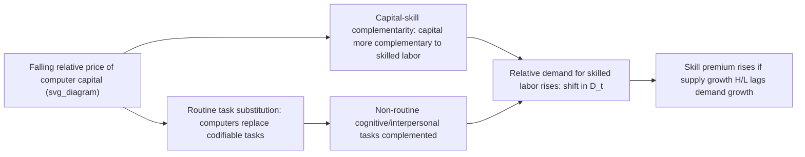

## Skill-Biased Technical Change

### Overview and Definition

Skill-biased technical change (SBTC) refers to technological developments that increase the relative productivity of, and therefore relative demand for, skilled labor compared to unskilled labor. Unlike neutral technical change — which raises the productivity of all factors proportionally — skill-biased change disproportionately raises the marginal product of skilled workers, shifting the relative labor demand curve and, absent offsetting supply changes, raising the skill premium (the wage gap between skilled and unskilled workers).

SBTC is the dominant canonical explanation in labor economics for the rise in wage inequality observed in the United States and other advanced economies since approximately 1980, and it forms the theoretical core of what is often called the "canonical model" of the labor market, formalized primarily by Katz and Murphy (1992) and extended comprehensively by Goldin and Katz (2008).

### The Canonical Model: Supply, Demand, and Institutions

#### Basic Framework

The canonical model represents the labor market for two skill types — college-educated ($H$) and non-college-educated ($L$) labor — using an aggregate production function with imperfect substitutability between skill types, typically a constant elasticity of substitution (CES) form:

$$Y_t = \left[ \alpha_t (A_{Ht} H_t)^{\frac{\sigma-1}{\sigma}} + (1-\alpha_t)(A_{Lt} L_t)^{\frac{\sigma-1}{\sigma}} \right]^{\frac{\sigma}{\sigma-1}}$$

where $H_t$ and $L_t$ are the quantities of skilled and unskilled labor, $A_{Ht}$ and $A_{Lt}$ are factor-augmenting technology terms, $\alpha_t$ is a time-varying relative demand-shift (bias) parameter, and $\sigma$ is the elasticity of substitution between skill types.

Under competitive labor markets, profit maximization yields the relative wage equation:

$$\ln\left(\frac{w_{Ht}}{w_{Lt}}\right) = \frac{\sigma - 1}{\sigma}\ln\left(\frac{\alpha_t}{1-\alpha_t}\right) - \frac{1}{\sigma}\ln\left(\frac{H_t}{L_t}\right)$$

which is commonly simplified in empirical work to:

$$\ln\left(\frac{w_{Ht}}{w_{Lt}}\right) = \frac{1}{\sigma}\left[D_t - \ln\left(\frac{H_t}{L_t}\right)\right]$$

where $D_t$ is a reduced-form relative demand index capturing the net effect of skill-biased technology (and any other demand shifters, such as trade) over time.

**Key Points**

- The skill premium rises when relative demand growth ($D_t$) outpaces relative supply growth ($H_t/L_t$); it falls when supply growth outpaces demand growth.
- The elasticity of substitution $\sigma$ governs how sensitive relative wages are to relative supply changes — a higher $\sigma$ means skilled and unskilled labor are closer substitutes, so a given supply shift produces a smaller wage response.
- Estimates of $\sigma$ for college/non-college labor in the US literature commonly cluster in the range of approximately 1.4 to 2.5, though the precise value varies by study, time period, and estimation methodology. [Inference: given the range of estimates across studies, this should be treated as an approximate empirical range rather than a settled point estimate]

### The "Race Between Education and Technology"

#### Goldin and Katz's Framing

Goldin and Katz (2008), in *The Race between Education and Technology*, reframe the entire twentieth-century US wage structure as a race between the growth rate of relative skill supply (driven primarily by educational attainment, especially the high school and college movements) and the growth rate of skill-biased relative demand (driven by technology). Under this framing:

- **1915–1980**: The supply of educated workers grew rapidly (the "human capital century"), generally keeping pace with or outpacing skill-biased demand growth, which kept the college wage premium relatively stable or declining over long stretches, including the Great Compression period.
- **Post-1980**: The growth rate of the college-educated labor supply slowed markedly (a deceleration in educational attainment growth relative to earlier decades), even as skill-biased demand — driven by computerization — continued to accelerate, causing supply growth to fall behind demand growth and the skill premium to rise sharply.

**Key Points**

- This framework treats SBTC not as a single one-time event but as an ongoing, roughly continuous process whose visible wage effects depend critically on the contemporaneous rate of educational supply growth.
- The slowdown in US educational attainment growth after 1980 is itself a significant, partially independent empirical puzzle in the literature (linked to rising college costs, K-12 quality issues, and other factors), distinct from the technology side of the race. [Inference: the relative importance of these supply-side frictions versus demand-side technology acceleration in driving the post-1980 premium rise is a matter of ongoing empirical debate rather than settled consensus]

### Mechanisms Linking Technology to Skill Bias

#### Computerization and Capital-Skill Complementarity

Griliches (1969) originally proposed the **capital-skill complementarity hypothesis** — that physical capital (and later, computer capital specifically) is more complementary with skilled labor than with unskilled labor. As the relative price of computer capital fell dramatically from the 1970s onward (driven by semiconductor cost declines), firms substantially increased their capital-to-labor ratios, and because this capital was disproportionately complementary to skilled labor, relative demand for skilled labor rose.

#### Routine Task Displacement as a Microfoundation

Autor, Levy, and Murnane (2003) provide a more granular microfoundation for SBTC: computers do not uniformly complement "skill" in the abstract; rather, they substitute for labor performing routine, codifiable tasks (disproportionately middle-skill) while complementing labor performing non-routine analytical and interpersonal tasks (disproportionately high-skill). This task-based reframing, covered in depth under task-based models of the labor market, explains empirical patterns — notably wage and employment polarization — that the basic two-factor SBTC model cannot generate directly, since basic SBTC predicts a roughly monotonic relationship between skill level and wage growth rather than a polarized, U-shaped one.

**Key Points**

- The task-based reframing is often described as a refinement or "second generation" of SBTC theory rather than a wholesale rejection of it, since it retains the core mechanism (technology altering relative factor demand) while adding task-level granularity.
- Direct-vs-indirect bias distinction: technology can be skill-biased "directly" (a specific innovation raises skilled workers' productivity) or "indirectly" through reorganization of production processes and firm structure that accompanies new technology adoption (e.g., flatter management hierarchies, decentralized decision-making requiring more autonomous skilled judgment).

### Diagram: SBTC Mechanism Chain

### Empirical Evidence and Testing Strategies

#### Time-Series Evidence

Katz and Murphy (1992) show that the US college wage premium's fluctuations from 1963–1987 can be well fit by a model with a smoothly, roughly linearly trending relative demand shifter $D_t$ combined with observed relative supply changes, implying a persistent secular demand shift consistent with ongoing technical change rather than one-time shocks.

#### Cross-Industry and Cross-Firm Evidence

Berman, Bound, and Griliches (1994) and Autor, Katz, and Krueger (1998) document that within-industry (rather than between-industry) shifts toward skilled labor account for the majority of the aggregate shift in employment composition toward skilled workers, and that this within-industry skill upgrading is correlated with industry-level computer investment intensity — evidence interpreted as supporting a technology-driven (rather than purely trade-driven) explanation, since a pure trade/composition story would predict the shift occurring primarily between industries as resources reallocate toward skill-intensive sectors.

#### Cross-Country Evidence

Berman and Machin (2000) and related studies find that skill upgrading within industries occurred similarly across multiple advanced economies over the same period, even those with very different trade exposure profiles — used as evidence that a common technology shock (rather than country-specific trade shocks) is a more plausible unifying explanation, since trade patterns differed substantially across these countries while the within-industry skill-upgrading pattern did not.

### Diagram: Between vs Within Industry Skill Upgrading

<svg xmlns="http://www.w3.org/2000/svg" viewBox="0 0 500 280">
<text x="250" y="20" font-size="14" text-anchor="middle" font-weight="bold">Decomposition of Skill Upgrading (svg_diagram)</text>
<rect x="80" y="60" width="140" height="180" fill="#e8f0fe" stroke="#1f6feb" />
<text x="150" y="55" font-size="12" text-anchor="middle">Within-Industry</text>
<text x="150" y="150" font-size="28" text-anchor="middle" font-weight="bold" fill="#1f6feb">~70%</text>
<text x="150" y="175" font-size="11" text-anchor="middle">of skill shift</text>
<rect x="280" y="140" width="140" height="100" fill="#fde8e8" stroke="#d1242f" />
<text x="350" y="135" font-size="12" text-anchor="middle">Between-Industry</text>
<text x="350" y="195" font-size="28" text-anchor="middle" font-weight="bold" fill="#d1242f">~30%</text>
<text x="350" y="215" font-size="11" text-anchor="middle">of skill shift</text>
</svg>

### Worked Example

Suppose relative supply $\ln(H_t/L_t)$ grows by 0.30 log points over a decade while the elasticity of substitution $\sigma = 1.6$, and the observed college wage premium rises by 0.10 log points over the same decade. Using the reduced-form relative wage equation:

$$\Delta \ln\left(\frac{w_H}{w_L}\right) = \frac{1}{\sigma}\left[\Delta D_t - \Delta \ln\left(\frac{H}{L}\right)\right]$$

$$0.10 = \frac{1}{1.6}\left[\Delta D_t - 0.30\right]$$

Solving for the implied demand shift:

$$0.16 = \Delta D_t - 0.30 \implies \Delta D_t = 0.46$$

**Example**

The implied relative demand shift of 0.46 log points exceeds the relative supply growth of 0.30 log points, which is why the skill premium rose despite substantial growth in the relative supply of skilled labor — illustrating the "race" logic: it is the differential between demand and supply growth, not the sign of supply growth alone, that determines the direction of the premium.

### Critiques and Alternative Explanations

#### The "Fall and Rise" Puzzle

Card and DiNardo (2002) raise an influential critique: if SBTC (specifically, computerization) is the primary driver of rising inequality, the timing is puzzling, since computer adoption accelerated fairly steadily from the 1970s through the 2000s, while wage inequality growth in the US was concentrated disproportionately in the 1980s and then slowed or plateaued in certain dimensions during the 1990s (before resuming growth at the top later) — a pattern not obviously matched by a smoothly accelerating technology story. [Inference: this timing critique remains actively debated; task-based and polarization-focused responses argue the apparent mismatch dissolves once routine-task displacement and its distinct within-decade timing are modeled explicitly, rather than treating "skill" as a single undifferentiated demand shifter]

#### Institutional and Alternative Explanations

Card and DiNardo, along with related work by Lee (1999) on the minimum wage and Card (2001) on unionization, argue that institutional changes — deunionization, real minimum wage erosion, and changes in labor market norms — can account for a substantial portion of the inequality rise usually attributed to SBTC, particularly at the lower tail of the wage distribution, which a pure relative-demand-and-supply skill model does not naturally explain.

#### Directed/Endogenous Technical Change

Acemoglu (1998, 2002) develops a model of **endogenous** or **directed** technical change, in which the direction of technological innovation (whether it is skill-biased or not) is itself a market response to relative factor supplies and market size — a large supply of skilled workers can induce firms and innovators to develop skill-complementary technologies, because a larger market for skill-complementary products raises the profitability of innovating in that direction. This reframes causality: rather than technology being an exogenous force acting on the labor market, the labor market (via relative factor supplies) partly determines the direction of technology itself. [Inference: whether the direction of causality runs primarily from supply to technology-bias, as this model emphasizes, or from technology-bias to relative wages, as the basic canonical model emphasizes, is difficult to identify empirically and is treated in the literature as bidirectional/simultaneous rather than fully resolved in either direction]

### Distinguishing SBTC from Related Concepts

| Concept | Core Mechanism | Predicts Polarization? |
| --- | --- | --- |
| Basic SBTC / Canonical Model | Uniform relative demand shift toward "skill" | No — predicts monotonic skill-wage relationship |
| Task-Based / Routinization Model | Task-specific substitution and complementarity | Yes |
| Directed Technical Change | Endogenous innovation direction responding to factor supply | Depends on model specification |
| Capital-Skill Complementarity | Capital deepening complements skilled labor specifically | No, in its original formulation |

### Related Topics

- Task-Based Models of the Labor Market and Routinization
- Long-Run Trends in Wage Inequality
- Directed and Endogenous Technical Change (Acemoglu Framework)
- Capital-Skill Complementarity (Griliches Hypothesis)
- Union Decline and Minimum Wage Erosion as Alternative Explanations
- CES Production Functions and Elasticity of Substitution Estimation
- Educational Attainment Trends and the Supply of Skilled Labor
- Superstar Effects and Winner-Take-All Markets