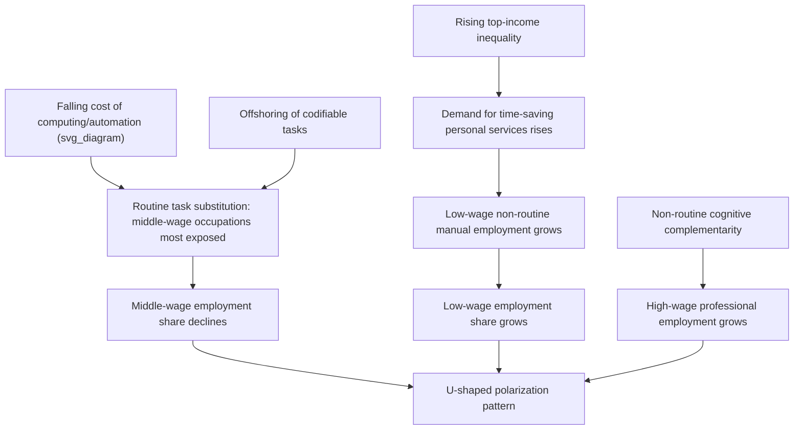

## Polarization of Employment and Wages

### Overview and Definition

Polarization refers to a distinctive pattern in labor market outcomes — observed across many advanced economies since roughly the 1990s — in which employment shares and wage growth rise at both the top and bottom of the occupational/wage distribution while declining or stagnating in the middle. This produces a characteristic **U-shaped** (or "hollowed-out") pattern when employment growth or wage growth is plotted against initial occupational wage or skill rank, in contrast to the monotonic pattern predicted by the basic skill-biased technical change (SBTC) model, in which the entire distribution should shift roughly uniformly.

Polarization was first systematically documented by Autor, Katz, and Kearney (2006, 2008) for the United States and by Goos and Manning (2007) for the United Kingdom, and has since been confirmed across most OECD economies with variation in timing and magnitude.

### Empirical Signature

#### The Employment Polarization Pattern

When occupations are ranked by their initial (base-period) median wage or skill level and plotted against subsequent employment share growth, the resulting scatter typically traces a **U-shape**: high employment growth in low-wage service occupations (e.g., food service, personal care, security), high employment growth in high-wage professional/managerial/technical occupations, and comparatively flat or negative employment growth in middle-wage occupations (production, administrative support, sales, clerical work).

**Key Points**

- The pattern is typically most visible when occupations are binned into deciles or similar groups by initial wage rank and average employment growth is computed within each bin.
- It is a *relative* employment share pattern, not necessarily an absolute decline in every middle-wage occupation — some middle-wage occupations grow in absolute terms but shrink as a share of total employment.
- The pattern has been documented as intensifying particularly during and after recessions in the US, since middle-wage, routine-task jobs are disproportionately lost during downturns and are not fully recovered during subsequent recoveries — a phenomenon termed "jobless recoveries" concentrated in routine occupations by Jaimovich and Siu (2020).

#### Wage Polarization vs. Employment Polarization

Wage polarization refers to the analogous U-shaped pattern in wage growth by occupation rank, and is conceptually distinct from employment polarization, though the two are often correlated. It is possible, in principle, for employment to polarize without wages polarizing (if middle-wage jobs disappear but the wages of remaining workers in various occupations do not follow a U-shaped pattern), and empirical work generally examines both margins separately.

### Diagram: The Polarization U-Shape

<svg xmlns="http://www.w3.org/2000/svg" viewBox="0 0 520 320">
<text x="260" y="20" font-size="14" text-anchor="middle" font-weight="bold">Employment Growth by Occupational Wage Rank (svg_diagram)</text>
<line x1="60" y1="270" x2="480" y2="270" stroke="black" stroke-width="1.5" />
<line x1="60" y1="270" x2="60" y2="50" stroke="black" stroke-width="1.5" />
<line x1="60" y1="200" x2="480" y2="200" stroke="#ccc" stroke-dasharray="3" />
<text x="270" y="300" font-size="12" text-anchor="middle">Occupation Rank by Initial Wage (Low to High)</text>
<text x="25" y="150" font-size="12" text-anchor="middle" transform="rotate(-90 25 150)">Employment Share Growth</text>
<path d="M 70 100 Q 150 220 260 235 Q 370 220 460 90" fill="none" stroke="#1f6feb" stroke-width="2.5" />
<text x="90" y="90" font-size="11">Low-wage service</text>
<text x="230" y="255" font-size="11">Middle-wage routine</text>
<text x="370" y="80" font-size="11">High-wage professional</text>
<circle cx="90" cy="105" r="4" fill="#d1242f" />
<circle cx="260" cy="232" r="4" fill="#d1242f" />
<circle cx="450" cy="95" r="4" fill="#d1242f" />
</svg>

### Theoretical Mechanisms

#### 1. Routine Task Displacement (Primary Mechanism)

As developed in the task-based models framework, the dominant explanation is that computerization since the 1980s has been most effective at substituting for **routine tasks** — codifiable, rule-based work characteristic of many middle-wage clerical, administrative, and production occupations — while being far less effective at substituting for either non-routine manual tasks (concentrated in low-wage service occupations, e.g., food preparation, cleaning, personal care) or non-routine cognitive tasks (concentrated in high-wage professional and managerial occupations, e.g., abstract problem-solving, complex communication, creative work).

This asymmetric substitutability generates the U-shape directly: labor demand falls in the middle (where computers substitute for workers) while remaining robust or growing at both extremes (where computers complement rather than substitute for labor, or where automation is technically infeasible or uneconomical).

#### 2. Consumption Complementarities and Rising Demand for Low-Wage Services

Mazzolari and Ragusa (2013) and Autor and Dorn (2013) propose a complementary demand-side mechanism: as high-skill, high-wage workers' incomes rise (partly due to the demand and superstar mechanisms discussed elsewhere), their demand for time-saving personal and household services (food preparation, cleaning, childcare, personal care) rises, since these workers have higher time value and lower marginal utility of income. This income-driven demand shift increases employment in low-wage, non-routine manual service occupations, reinforcing the low end of the U-shape independently of the routinization mechanism operating in the middle.

**Key Points**

- This mechanism implies that rising income inequality at the top can itself be a *cause* of low-wage service employment growth, not merely a coincidental parallel trend — a feedback loop distinct from the technology-substitution channel.
- It also implies that polarization intensity should be correlated with local labor market inequality and local high-skill employment concentration, a prediction tested and generally supported in metropolitan-level US data by Autor and Dorn (2013).

#### 3. Offshoring of Routine-Codifiable Tasks

As discussed under task-based models, Grossman and Rossi-Hansberg's (2008) task-trade framework implies that offshoring, like automation, disproportionately affects routine and codifiable tasks (which can be performed remotely and coordinated at low communication cost), contributing an additional, empirically distinguishable channel reinforcing middle-wage occupational decline, particularly in manufacturing and some clerical/back-office service functions.

#### 4. Occupational Task Reorganization Within Firms

Some literature emphasizes that polarization partly reflects firms reorganizing internal task allocation — reassigning routine sub-tasks previously performed by middle-skill workers to a combination of software/automation and either lower-skill workers (for residual manual components) or higher-skill workers (for residual judgment-intensive components) — rather than simple occupation-level elimination. [Inference: the relative empirical importance of this within-firm reorganization channel versus pure occupation-level employment shifts is less precisely quantified in the literature than the routinization and offshoring channels]

### Diagram: Polarization Mechanism Map

### Cross-National Evidence

#### United Kingdom and Continental Europe

Goos and Manning (2007) document a similar U-shaped pattern for the UK ("lovely jobs and lousy jobs"), and Goos, Manning, and Salomons (2009, 2014) extend the finding across sixteen European countries, showing that routine-task-intensive occupation share declines are broadly correlated with each country's exposure to computerization and, to a lesser extent, offshoring, though the magnitude of polarization varies considerably by country, partly reflecting differing labor market institutions and the pace of technology adoption. [Inference: the precise cross-country ranking of polarization intensity is sensitive to the time period and occupational classification scheme used, and different studies do not always agree on relative country rankings]

#### Timing Differences

Some European countries exhibit a delayed or muted polarization pattern relative to the US, which several studies attribute to differences in minimum wage levels, employment protection legislation, and collective bargaining coverage — institutions that can slow the reallocation of labor away from routine occupations even when the underlying technological substitutability is similar. [Inference: this institutional-delay interpretation is a common explanation offered in the comparative literature but is difficult to fully separate from other cross-country differences such as industrial composition]

### Job Polarization and the Business Cycle

#### "Jobless Recoveries" and Routine Job Loss

Jaimovich and Siu (2020) document that US recessions since the mid-1980s have been characterized by disproportionate job losses in routine occupations, and that these routine jobs largely fail to return during subsequent recoveries — instead, recoveries are increasingly characterized by employment growth concentrated in non-routine occupations at both tails of the distribution. This pattern helps explain why aggregate "jobless recovery" dynamics have become more pronounced in recent US business cycles relative to earlier postwar cycles, since the occupational structure of job losses and job gains has become increasingly asymmetric across the cycle.

**Key Points**

- This creates a compounding, ratchet-like pattern: each recession disproportionately destroys middle-wage routine jobs, and the recovery does not restore them, meaning polarization advances in discrete steps concentrated around business cycle downturns rather than as a smooth continuous trend.
- This has significant implications for displaced-worker adjustment costs, since routine-occupation workers displaced during a recession face a structurally shrinking set of similar re-employment opportunities during the recovery, increasing the likelihood of long-term wage losses or occupational downgrading. [Inference: the magnitude of these long-term displacement costs varies by study and worker demographic, and precise point estimates should not be treated as uniform across all displaced routine workers]

### Worked Example

Consider an economy with three occupational groups at time $t_0$: Low-wage services (median wage $\$25{,}000$, 25% of employment), Middle-wage routine (median wage $\$45{,}000$, 50% of employment), and High-wage professional (median wage $\$85{,}000$, 25% of employment). Suppose over a decade, routine task automation reduces demand for Middle-wage routine labor, while rising top-income inequality increases demand for Low-wage services, and non-routine cognitive complementarity increases demand for High-wage professional labor, producing new employment shares of 32%, 36%, and 32% respectively.

**Example**

Plotting the employment share change (Low: +7pp, Middle: −14pp, High: +7pp) against initial wage rank produces the canonical polarization U-shape: symmetric growth at both tails financed by a proportionally larger contraction in the middle, illustrating how routine task displacement, offshoring, and service-demand complementarities can jointly generate the empirically observed pattern even though each mechanism operates on a different segment of the distribution independently.

### Distinguishing Polarization from Related Concepts

| Concept | Distribution Shape Predicted | Primary Mechanism |
| --- | --- | --- |
| Basic SBTC | Monotonic (skill and wages move together) | Uniform relative demand shift toward skill |
| Polarization / Routinization | U-shaped (both tails gain, middle declines) | Task-specific substitutability (routine vs. non-routine) |
| Pure Winner-Take-All / Superstar | Extreme right-tail concentration only | Joint consumption technology, market widening |
| Deunionization-Driven Inequality | Primarily affects lower/middle-tail dispersion | Institutional wage-setting compression removed |

### Critiques and Open Questions

- **Occupational classification sensitivity** — polarization findings can be sensitive to how occupations are aggregated and ranked (by initial wage level vs. education vs. a constructed routine-task-intensity index), and results are not perfectly robust across all classification choices. [Inference]
- **Continued relevance of the routine/non-routine binary** — some recent literature questions whether the routine/non-routine task taxonomy remains the most useful organizing framework as automation technology (particularly machine learning and AI) begins to affect tasks previously classified as non-routine cognitive, potentially altering or reversing aspects of the polarization pattern going forward. [Speculation: whether AI-driven automation will extend the U-shape further, compress it, or produce a qualitatively different distributional pattern is unresolved and subject to active, differing projections in the emerging literature]
- **Interaction with demographic and geographic factors** — polarization intensity varies substantially across US commuting zones and demographic groups, and disentangling the causal role of local industry composition, exposure to trade/automation, and pre-existing local labor market institutions remains methodologically challenging. [Inference]

### Related Topics

- Task-Based Models of the Labor Market
- Skill-Biased Technical Change
- Long-Run Trends in Wage Inequality
- Offshoring and Task Trade (Grossman-Rossi-Hansberg Model)
- Jobless Recoveries and Cyclical Routine Job Loss
- Local Labor Markets and the China Syndrome Literature
- Consumption Complementarities and Service-Sector Employment Growth
- Superstar Effects and Winner-Take-All Markets