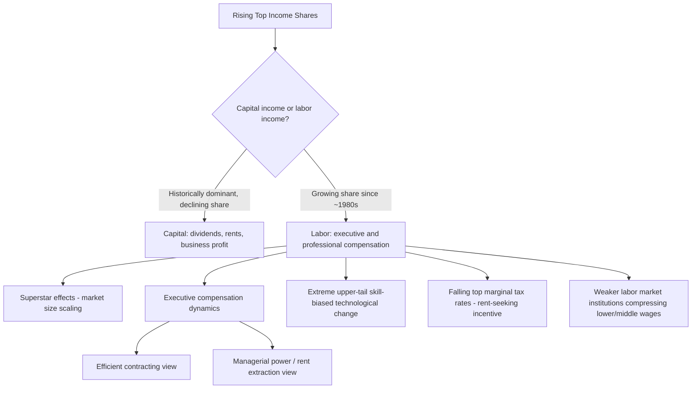

## Top Income Shares and the Labor Market

### Definitional Overview

Top income shares measure the fraction of total income (or total labor earnings) accruing to the highest percentiles of the income distribution — commonly the top 10%, top 1%, and top 0.1%. Unlike the standard Gini coefficient or 90/10 wage ratio, top-share measures are specifically designed to capture dynamics occurring far in the upper tail, which have historically driven much of the recent rise in aggregate inequality in many advanced economies.

**Key Points**

- Top income share estimates are constructed primarily from income tax record data (following the methodology pioneered by Piketty and Saez), which captures the extreme upper tail far better than household survey data
- A defining empirical fact is that in the U.S. and several other Anglophone countries, top income shares fell during the mid-20th century ("The Great Compression") and rose sharply from roughly the late 1970s/early 1980s onward
- A central labor-economics debate is how much of the rise in top shares reflects labor income (executive/professional compensation) versus capital income (dividends, capital gains), since the policy implications differ substantially

### Data and Measurement Methodology

The standard approach (Piketty and Saez 2003, updated by the World Inequality Database) uses tax-return microdata rather than household survey data because:

- Household surveys top-code income (truncate reported values above a threshold) to protect respondent privacy, which severely understates true concentration at the top
- Household surveys suffer from higher non-response and under-reporting rates among high-income households
- Tax records allow long historical time series (often back to the early 20th century in the U.S., U.K., and France) since income tax systems predate modern household surveys

The top income share for group $p$ (e.g., top 1%) is calculated as:

$$S_p = \frac{\sum_{i \in \text{top } p\%} Y_i}{\sum_{i=1}^{N} Y_i}$$

where $Y_i$ is total income (sometimes decomposed into $Y_i^{labor}$ and $Y_i^{capital}$) for tax unit $i$.

[Unverified] Methodological choices such as whether to use tax units or equal-split households, whether to include or exclude capital gains, and how to treat transfer income and taxes paid substantially affect the level (though generally not the broad time trend) of estimated top shares — this is a recurring point of technical controversy between different research teams (e.g., Piketty-Saez-Zucman vs. Auten-Splinter).

### Composition Shift: From Capital to Labor Income at the Top

A striking historical finding is that the *composition* of top incomes has shifted substantially over the 20th century:

- In the early-to-mid 20th century, the top 1% (particularly the top 0.1%) derived the overwhelming majority of their income from capital (dividends, interest, rents, business profits) — the classic image of the "rentier" elite
- By the late 20th and early 21st century, a majority of top 1% income in the U.S. is labor income (wages, salaries, bonuses, and exercised stock options classified as compensation) — Piketty, Saez, and Stantcheva (2014) term this the rise of the "working rich"
- This shift is central to why top income shares fall partly under the purview of labor economics rather than purely capital/wealth economics: understanding *why* labor compensation at the very top has grown so dramatically is a labor market question

### Leading Explanations for Rising Top Labor Income Shares

**1. Superstar Effects (Rosen 1981)**

Where technology allows the most talented individuals to serve a much larger market at near-zero marginal cost of replication (e.g., media, entertainment, and increasingly management via digital coordination of large multinational firms), small differences in talent translate into enormous differences in earnings. Formally, if consumer utility from quality $q$ is convex and the top performer can serve the entire market:

$$\text{Earnings} \propto f(q) \cdot M$$

where $M$ is market size — as $M$ grows (due to globalization, digital distribution, or firm scale), the earnings of the top performer are magnified disproportionately relative to the second-best.

**2. Executive Compensation and Corporate Governance**

- Rising CEO pay relative to median worker pay (from roughly 20-to-1 in the 1960s–70s to several hundred-to-1 in recent decades in large U.S. firms, per various compensation surveys) [Unverified — exact ratios vary considerably by methodology, firm-size sample, and year] is a major and controversial component of top labor income growth
- Two competing camps: (a) the **efficient contracting view** holds that CEO pay growth reflects legitimate scaling of firm size and the value of managerial talent (Gabaix and Landier 2008 model CEO pay as proportional to firm value, scaling with the six-power law of firm size distribution), and (b) the **managerial power / rent extraction view** (Bebchuk and Fried) holds that weak corporate governance allows executives to extract pay in excess of their marginal product, particularly through captured or complicit boards
- The rise of stock-based compensation (options, restricted stock) as a share of executive pay ties top income growth partly to stock market returns, complicating clean separation from capital income

**3. Skill-Biased and Task-Biased Technological Change at the Extreme Upper Tail**

While standard SBTC models explain the general rise in the college wage premium (see the broader wage-inequality literature), some researchers argue an extension is needed to explain the *extreme* top-tail divergence specifically — ordinary skill-premium models predict a smoothly rising upper tail, not the sharp acceleration observed specifically above the 99th or 99.9th percentile. This has led to specialized "superstar-technology" and "scalable-skill" extensions of standard human capital models.

**4. Decline in Top Marginal Tax Rates (Rent-Seeking Channel)**

Piketty, Saez, and Stantcheva (2014) propose that reductions in top marginal tax rates (from roughly 70%+ in the U.S. in the 1960s–70s down to 35–39.6% in subsequent decades) increased the *incentive* for executives and highly compensated employees to bargain aggressively for higher pre-tax pay, since more of any successfully negotiated increase is retained after tax. This is framed as a rent-seeking/bargaining-effort channel rather than a pure incentive-to-produce channel, and the authors present cross-country correlational evidence (countries with larger tax-rate cuts show larger top-share increases) as supportive, though this evidence is correlational rather than fully causal. [Inference — this remains one of the more contested claims in the literature, since reverse causality (successful rent-seekers lobbying for lower taxes) and confounding institutional changes are difficult to fully rule out]

**5. Decline of Labor Market Institutions**

Declining unionization, reduced real minimum wages, and weaker labor-standard enforcement in many economies since the 1980s are argued to have primarily compressed the *bottom and middle* of the wage distribution relative to the top, indirectly raising top income shares as a residual/relative phenomenon rather than directly inflating top pay.

### Diagram: Channels Linking Labor Markets to Top Income Shares

### Illustrative Example

**Example**

Suppose in Year 1 the top 1% of tax units in a country receive 10% of total national income, of which 70% derives from capital sources (dividends, business income) and 30% from labor compensation. By Year 40, the top 1% share rises to 20% of national income, but the composition has flipped: 60% is now labor compensation (salaries, bonuses, and realized stock-option income) and 40% is capital income. A labor economist would interpret this shift as evidence that understanding the rise in top income shares increasingly requires labor market tools — executive labor markets, superstar/task-based wage-setting models, and corporate governance — rather than purely capital-accumulation or wealth-inequality frameworks (e.g., those emphasizing $r > g$ dynamics). [Unverified — this is a stylized numerical illustration for pedagogical purposes, not a specific country's actual data series]

### Cross-Country Variation

- The rise in top income shares has been substantially larger in Anglophone countries (U.S., U.K., Canada, Australia) than in Continental Europe and Japan over the same period, despite similar exposure to globalization and technological change
- This cross-country divergence is frequently cited as evidence against purely technological (SBTC/superstar) explanations in isolation, since technology shocks were broadly global, while institutional and policy differences (top tax rates, corporate governance norms, union density, minimum wage policy) varied substantially by country — supporting institutional/policy-channel explanations as at least partially responsible
- [Inference] The relative weight assigned to technological versus institutional explanations remains one of the more actively debated questions in this literature, and most researchers now favor some interacting combination of both channels rather than a single dominant cause

### Measurement Controversies

A notable and ongoing academic dispute (Auten and Splinter vs. Piketty, Saez, and Zucman, roughly 2018–present) concerns whether top income share increases in the U.S. are as large as originally estimated once adjustments are made for underreported transfer income, changing household definitions, and tax-base changes following tax reforms (e.g., the U.S. Tax Reform Act of 1986, which caused significant income re-classification between corporate and individual tax bases). [Unverified] This dispute affects estimated *magnitudes and trend slope* substantially in some specifications, though most parties in the debate still agree the qualitative direction (some rise in top shares since the 1970s–80s) is robust.

### Related Topics

- Superstar Markets and the Economics of Winner-Take-All Compensation (Rosen 1981)
- Executive Compensation, Corporate Governance, and the Managerial Power Hypothesis
- Skill-Biased Technological Change and the College Wage Premium
- Piketty-Saez-Zucman vs. Auten-Splinter Measurement Debate
- Top Marginal Tax Rates and Rent-Seeking Behavior
- Decline of Unions and Labor Market Institutions
- Wealth Inequality and the $r > g$ Framework (Piketty)
- Cross-Country Comparative Inequality Trends