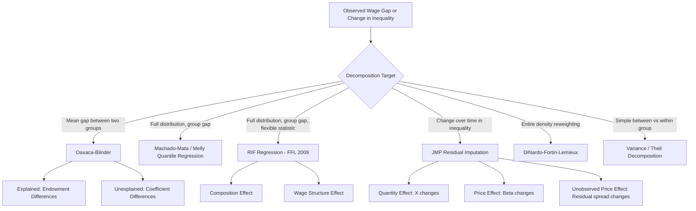

## Decomposing Sources of Wage Inequality

### Overview

Wage inequality decomposition is the methodological toolkit labor economists use to partition observed differences or changes in wages into attributable components — such as differences in worker characteristics (education, experience, occupation) versus differences in how those characteristics are *priced* (returns to skill), or into within-group versus between-group variance. These methods answer questions like: "How much of the gender wage gap is due to differences in qualifications versus discrimination?" or "How much of rising wage inequality since 1980 is due to rising returns to education versus rising residual/unexplained inequality?"

### Conceptual Foundations

**Key Points**

- Wage inequality can be measured at a point in time (cross-sectional decomposition, e.g., male-female gap) or over time (decomposition of changes in inequality, e.g., rise in variance of log wages 1980–2020).
- Two broad decomposition families exist: (1) **mean decompositions** (Oaxaca-Blinder and extensions), which explain gaps in average wages between groups, and (2) **distributional decompositions** (variance decompositions, quantile methods, RIF regressions), which explain gaps or changes across the entire wage distribution, not just the mean.
- The fundamental identity underlying most decompositions is that observed wage inequality reflects a combination of:
  - **Composition effects** (also called "quantity effects" or "characteristics effects"): differences in the distribution of observable characteristics ($X$) across groups or time.
  - **Price/structure effects** (also called "coefficient effects" or "returns effects"): differences in the wage-setting function ($\beta$) that maps characteristics into wages.
  - **Unexplained/residual component**: variation not accounted for by observed characteristics — sometimes interpreted as returns to unobserved skill, measurement error, or (in group-gap contexts) potential discrimination.

$$W_i = X_i \beta + \varepsilon_i$$

where $W_i$ is log wage, $X_i$ is a vector of observable characteristics, $\beta$ is the vector of returns, and $\varepsilon_i$ is the residual.

### Mincer Wage Equation as the Starting Point

Most decomposition exercises are built on the Mincerian earnings function:

$$\ln W_i = \beta_0 + \beta_1 S_i + \beta_2 X_i + \beta_3 X_i^2 + \varepsilon_i$$

where $S_i$ is years of schooling and $X_i$ is potential labor market experience. The decomposition question becomes: how much of the gap or change in $\ln W$ is due to $S$, $X$, the returns $\beta_1, \beta_2$, or the residual $\varepsilon$?

### Oaxaca-Blinder Decomposition

**Key Points**

- The canonical method (Oaxaca 1973; Blinder 1973) for decomposing a **mean** wage gap between two groups (e.g., group A and group B) into an "explained" (endowments) portion and an "unexplained" (coefficients) portion.
- Given separate OLS wage regressions for each group:

$$\ln \bar{W}_A - \ln \bar{W}_B = \underbrace{(\bar{X}_A - \bar{X}_B)\hat{\beta}_A}_{\text{explained (endowments)}} + \underbrace{\bar{X}_B(\hat{\beta}_A - \hat{\beta}_B)}_{\text{unexplained (coefficients)}}$$

- This is the "threefold" decomposition when a third interaction term is added; the two-fold version above uses group A's coefficients as the reference (non-discriminatory) structure — a choice that is not innocuous.
- **Index number problem**: The decomposition is not unique. Using group A's $\beta$ as the reference versus group B's $\beta$ versus a pooled/weighted $\beta$ (Reimers, Cotton, Neumark weighting schemes) yields different splits between explained and unexplained shares. This is directly analogous to the Laspeyres/Paasche index ambiguity in price index theory.
- **Neumark (1988)** and **Reimers (1983)** propose using a pooled regression (including both groups, sometimes with a group indicator omitted) as the non-discriminatory benchmark $\beta^*$:

$$\ln \bar{W}_A - \ln \bar{W}_B = (\bar{X}_A - \bar{X}_B)\hat{\beta}^* + [\bar{X}_A(\hat{\beta}_A - \hat{\beta}^*) + \bar{X}_B(\hat{\beta}^* - \hat{\beta}_B)]$$

**Example**

Suppose average log wages: men $\ln \bar{W}_M = 3.20$, women $\ln \bar{W}_W = 3.00$ (raw gap = 0.20 log points ≈ 22%).

A Mincer regression run separately by sex yields:

- Men: $\hat{\beta}_{educ} = 0.09$, $\bar{S}_M = 14$ years
- Women: $\hat{\beta}_{educ} = 0.09$, $\bar{S}_W = 14.5$ years (women slightly more educated on average, common in many recent cohorts)

If education were the only regressor, the "explained" component from education would be *negative* (since $\bar{S}_W > \bar{S}_M$), meaning education differences work to *narrow*, not widen, the raw gap — implying an even larger "unexplained" component once other characteristics are controlled. This illustrates why decompositions with multiple correlated regressors (education, experience, occupation, industry) require care in interpreting each component's sign and magnitude — the sum of "explained" contributions across variables can partially offset.

### Interpreting the Unexplained Component

**Key Points**

- The unexplained/residual term is frequently — but imprecisely — labeled a measure of "discrimination." This interpretation requires the strong assumption that $X$ fully captures all legitimate productivity-relevant differences between groups.
- [Inference] In practice, the unexplained component also absorbs: unobserved skill differences (ability, unmeasured human capital), unobserved job-specific compensating differentials, monopsony effects, occupational sorting driven by preferences rather than discrimination, and measurement error in $X$ or $W$. Because of this, labor economists increasingly treat the unexplained residual as an *upper bound* on discrimination rather than a direct estimate.
- Adding more controls (occupation, industry, firm) shrinks the unexplained gap, but this is contested: if occupational sorting is itself partly a *result* of discrimination (e.g., "occupational crowding" or statistical discrimination in hiring), controlling for occupation can understate true discrimination — a version of "bad control" bias in the sense of Angrist and Pischke.

### Beyond the Mean: Distributional Decomposition Methods

**Key Points**

- Mean decompositions miss important patterns: two groups can have identical mean wage gaps but very different gaps at the top versus bottom of the distribution (e.g., "glass ceiling" vs. "sticky floor" patterns). Distributional methods address this.

#### Juhn-Murphy-Pierce (JMP) Decomposition

- Juhn, Murphy, and Pierce (1993) decompose changes in wage inequality (typically over time, but also applicable across groups) into three components using the **residual imputation** approach:
  1. **Quantity effect**: changes in observable characteristics ($X$).
  2. **Price effect**: changes in the returns to observable characteristics ($\beta$), including changing returns to skill/education.
  3. **Residual/unobserved-price effect**: changes in the price of *unobserved* skill, proxied by changes in the distribution (typically the spread) of residuals from the wage regression.
- Mechanics: estimate $\ln W_{it} = X_{it}\beta_t + \sigma_t \theta_{it}$, where $\theta_{it}$ is the percentile rank of individual $i$'s residual in year $t$'s residual distribution and $\sigma_t$ is the standard deviation of residuals in year $t$. Counterfactual wage distributions are constructed by substituting base-year $\beta$, base-year $\sigma$, or base-year $X$ into other years' formulas, holding the others fixed, and re-computing the counterfactual variance.
- **Widely cited finding** [Unverified — specific magnitudes vary by dataset/period]: JMP-style decompositions applied to the U.S. from the 1970s–1990s attribute a substantial share of the rise in wage inequality to increased *within-group* (residual) inequality — i.e., wage dispersion among workers with observably similar education, experience, and occupation — rather than solely to rising between-group returns to education (the "college premium").

#### Machado-Mata / Melly Decomposition

- Extends Oaxaca-Blinder logic to the full distribution using **quantile regression**. Rather than decomposing the mean, it decomposes each quantile of the wage distribution.
- Procedure: estimate separate quantile regressions $Q_\tau(\ln W | X) = X\beta(\tau)$ for group A and group B at each quantile $\tau$; simulate counterfactual distributions by combining group A's $X$ with group B's $\beta(\tau)$ (or vice versa) via simulation/bootstrap; the difference between actual and counterfactual quantiles at each $\tau$ gives the composition vs. price effect *at that point in the distribution*.
- Melly (2005) provides a computationally simpler, asymptotically equivalent estimator to the original Machado-Mata (2005) simulation-based approach.

#### RIF (Recentered Influence Function) Regression — Firpo, Fortin, Lemieux (2009)

**Key Points**

- The most widely used modern distributional decomposition tool. Extends Oaxaca-Blinder to *any distributional statistic* (quantiles, variance, Gini coefficient, interquantile range) rather than only the mean, while preserving the simple linear regression machinery.
- The **Recentered Influence Function** for a distributional statistic $\nu(F_W)$ (e.g., the $\tau$-th quantile $q_\tau$) is:

$$RIF(w; q_\tau) = q_\tau + \frac{\tau - \mathbb{1}\{w \le q_\tau\}}{f_W(q_\tau)}$$

where $f_W(q_\tau)$ is the density of wages at the quantile of interest.

- The key insight: regressing $RIF(w; \nu)$ on $X$ via OLS gives coefficients that, in expectation, describe the marginal effect of a small change in the distribution of $X$ on the statistic $\nu$ — allowing a standard Oaxaca-Blinder decomposition to be applied *quantile-by-quantile* or to *any inequality measure* (variance, Gini, 90-10 ratio), not just the mean.
- **RIF decomposition** for a gap in statistic $\nu$ between groups A, B:

$$\Delta\nu = \underbrace{(\bar{X}_A - \bar{X}_B)\hat{\beta}_{RIF,B}}_{\text{composition effect}} + \underbrace{\bar{X}_A(\hat{\beta}_{RIF,A} - \hat{\beta}_{RIF,B})}_{\text{structure/wage effect}}$$

- Advantages over JMP: RIF regression does not require the assumption that the conditional wage distribution is only shifted (location-scale model); it directly targets the statistic of interest without needing residual imputation assumptions. Advantages over quantile-regression decomposition (Machado-Mata/Melly): computationally simpler (single OLS regression per quantile rather than a full simulated counterfactual distribution), and more easily extended to non-quantile statistics like the variance or Gini coefficient.
- [Inference] RIF regression has become close to the standard tool in applied labor economics papers on wage inequality decomposition published in the 2010s–2020s, particularly in studies of the gender wage gap and skill-biased technical change, though quantile regression decomposition remains common as a robustness check.

### DiNardo-Fortin-Lemieux (DFL) Reweighting Decomposition

**Key Points**

- An alternative to regression-based decomposition. DFL (1996) reweight the empirical wage distribution using inverse probability weights so that the distribution of characteristics $X$ in one group/period matches that of the other, then compares the actual vs. reweighted *density* of wages.
- The reweighting factor is built from a probability model (e.g., logit) of group/period membership conditional on $X$:

$$\Psi_X(X) = \frac{\Pr(T=0 | X)}{\Pr(T=1 | X)} \cdot \frac{\Pr(T=1)}{\Pr(T=0)}$$

where $T$ indexes the group or time period.

- Advantage: entirely nonparametric with respect to the wage equation itself — no linearity assumption on $\ln W = X\beta$ is required, only a correctly specified model for the probability of group membership given $X$. This makes DFL well suited to studying changes across the *entire density* (e.g., visualizing how the wage density would look if 1979 workers had 2019's demographic composition).
- Commonly used to decompose the role of **de-unionization**, **minimum wage erosion**, and **changing labor supply composition** in the rise of U.S. wage inequality since the late 1970s, since each of these can be modeled as a reweighting factor applied sequentially.

### Composition vs. Price Effects — Skill-Biased Technical Change (SBTC) Context

**Key Points**

- A dominant substantive application of these decomposition methods is testing the SBTC hypothesis: that rising wage inequality since ~1980 reflects rising *returns* to skill/education (a price effect) driven by technology complementing skilled labor, rather than merely rising *supply* of skilled workers (a composition effect).
- Standard "relative supply and demand" framework (Katz-Murphy 1992; Card-Lemieux 2001) models the college wage premium as a function of the relative supply of college-equivalent to non-college-equivalent labor:

$$\ln\left(\frac{W_{c,t}}{W_{h,t}}\right) = \frac{1}{\sigma}\left[\ln\left(\frac{D_{c,t}}{D_{h,t}}\right) - \ln\left(\frac{N_{c,t}}{N_{h,t}}\right)\right]$$

where $\sigma$ is the elasticity of substitution between college ($c$) and high-school ($h$) equivalent labor, $D$ represents relative demand shifts (often treated as a residual/trend term), and $N$ is relative labor supply.

- [Unverified — magnitude is estimate/period-dependent] Estimates of $\sigma$ in the literature commonly fall in the range of roughly 1.4 to 2.9 depending on data, period, and specification; this parameter is central to how much of the rising college premium is attributed to demand shifts versus supply growth slowing (the "deceleration of the supply of college graduates" story of Goldin and Katz, *The Race Between Education and Technology*).

### Between-Group vs. Within-Group Inequality: Variance Decomposition

A simpler additive decomposition of total wage variance can be written using the law of total variance, splitting the population into $K$ mutually exclusive groups (e.g., education-experience cells):

$$Var(\ln W) = \underbrace{\sum_k p_k (\bar{\ln W}_k - \bar{\ln W})^2}_{\text{between-group variance}} + \underbrace{\sum_k p_k Var(\ln W | k)}_{\text{within-group variance}}$$

where $p_k$ is the population share in group $k$.

**Key Points**

- This is the simplest possible decomposition and requires no regression — only grouping the data into cells.
- [Inference] Empirical work applying this decomposition to the U.S. since 1980 typically finds that within-group (residual) variance accounts for a substantial share — commonly cited as roughly half or more in several studies — of the total increase in wage variance, motivating the "residual inequality" literature and the JMP/RIF methods discussed above.
- **Theil index** and **mean log deviation (MLD)** are alternative inequality measures that are *exactly* decomposable into between-group and within-group components (unlike the Gini coefficient, which is only approximately decomposable when groups' wage ranges overlap):

$$Theil = \sum_k p_k \frac{\bar{W}_k}{\bar{W}} \ln\left(\frac{\bar{W}_k}{\bar{W}}\right) + \sum_k p_k \frac{\bar{W}_k}{\bar{W}} \cdot Theil_k$$

### Decomposition Method Comparison

| Method | Target Statistic | Key Assumption | Handles Full Distribution? | Typical Use Case |
| --- | --- | --- | --- | --- |
| Oaxaca-Blinder | Mean gap | Linear wage equation; index number choice for reference $\beta$ | No | Gender/race mean wage gap |
| JMP (1993) | Variance / any quantile via residual imputation | Location-scale shift of residual distribution | Yes (via residual ranks) | Time-series rise in inequality |
| Machado-Mata/Melly | Any quantile | Correctly specified quantile regression at each $\tau$ | Yes | Quantile-specific gender/race gaps |
| RIF Regression (FFL 2009) | Any distributional statistic (quantile, variance, Gini) | Linear approximation of RIF around $X$ | Yes | Modern standard; flexible statistic choice |
| DFL Reweighting | Entire density | Correctly specified propensity model $\Pr(T=1 | X)$ | Yes |
| Variance/Theil decomposition | Between vs. within group variance | Mutually exclusive, exhaustive grouping | Partially (group-level only) | Simple between/within skill-group split |

### Worked Numerical Illustration — Simple Two-Group Oaxaca-Blinder

Consider synthetic data:

| Group | $\bar{\ln W}$ | $\bar{S}$ (years educ.) | $\hat{\beta}_{educ}$ |
| --- | --- | --- | --- |
| A | 3.50 | 16 | 0.08 |
| B | 3.30 | 13 | 0.07 |

Raw gap: $3.50 - 3.30 = 0.20$

Using group A's coefficient as reference:

- Explained: $(16-13) \times 0.08 = 0.24$
- Unexplained: $13 \times (0.08 - 0.07) = 0.13$
- Sum: $0.24 + 0.13 = 0.37 \neq 0.20$ (discrepancy arises because a full model includes an intercept and other covariates; in a single-covariate illustration this simplification is only schematic — a real decomposition must include all regressors, including the constant, for the components to sum exactly to the raw gap).

This illustrates a common pitfall: **partial (single-variable) decompositions do not isolate a variable's "true" contribution** unless computed within the full multivariate regression framework, since $\bar{X}$ differences interact with all included covariates simultaneously.

### Data and Estimation Considerations

**Key Points**

- **Selection bias**: Wage decompositions using observed wages only include *employed* individuals. If group A and group B have different labor force participation rates correlated with unobserved wage potential (e.g., due to selection into employment), Heckman (1979) selection correction is often applied before decomposition to avoid biased $\hat{\beta}$ estimates.
- **Top-coding and censoring**: Many household survey datasets (e.g., CPS) top-code high earners, which can distort variance-based decompositions unless corrected (e.g., using Pareto imputation for top-coded values, following Autor, Katz, and Kearney 2008 methodology).
- **Choice of wage measure**: hourly wage vs. weekly/annual earnings materially changes results, since annual earnings decompositions conflate wage-rate inequality with hours/employment inequality.
- Standard errors for Oaxaca-Blinder and RIF decompositions require either the delta method or bootstrap resampling, since the components are nonlinear functions of estimated parameters from potentially two separate regressions.

### Software Implementation Notes

- Stata: the `oaxaca` command (Jann 2008) implements two-fold and three-fold Oaxaca-Blinder with multiple weighting schemes (Reimers, Cotton, Neumark); `rifreg` and user-written `oaxaca_rif` implement RIF-based decomposition (Firpo-Fortin-Lemieux); the `mmsel` or manual quantile regression loops implement Machado-Mata.
- R: the `oaxaca` package implements Blinder-Oaxaca; the `RIF` and `Counterfactual` packages implement RIF regression and DFL reweighting respectively.
- [Behavior may vary by package version] Exact default reference-group weighting and standard error computation differ across implementations, so results should be checked against the specific package's documentation rather than assumed to follow a single universal default.

### Wage Decomposition Flow (svg_diagram)

### Related Topics

- Gender Wage Gap: Empirical Estimates and Explanatory Factors
- Skill-Biased Technical Change and the College Wage Premium
- Union Decline and Its Contribution to Rising Wage Inequality
- Minimum Wage Effects on the Lower Tail of the Wage Distribution
- Task-Based Models of the Labor Market and Job Polarization
- Superstar Firms and Between-Firm Wage Inequality
- Immigration and Wage Structure: Supply-Side Decomposition Approaches
- Top Income Inequality and the Role of Executive Compensation
- Monopsony Power and Its Role in Wage Setting