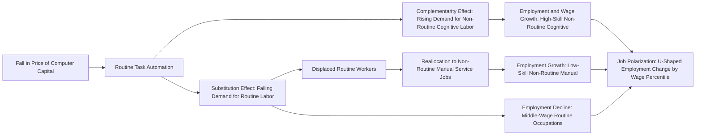

## Routine Biased Technical Change

### Overview

Routine-Biased Technical Change (RBTC) is a theoretical and empirical framework in labor economics explaining that technological change — particularly computerization — does not uniformly favor skilled over unskilled labor (as in the older Skill-Biased Technical Change model), but instead substitutes for labor performing **routine tasks** (tasks that can be codified into explicit rules and programmed) while complementing labor performing **non-routine tasks**. This reframes wage and employment effects along a task dimension rather than a simple skill-level dimension, and is the leading explanation for job polarization — the simultaneous growth of high-wage and low-wage employment with a hollowing-out of middle-wage jobs.

### Theoretical Foundations: The Task-Based Framework

**Key Points**

- RBTC emerged from Autor, Levy, and Murnane (2003, "ALM"), who reconceptualize the production process as a bundle of **tasks** rather than treating labor as a single homogeneous or two-tiered (skilled/unskilled) input.
- Tasks are classified along two orthogonal dimensions:
  1. **Routine vs. non-routine**: whether the task follows explicit, codifiable, rule-based procedures.
  2. **Cognitive vs. manual**: whether the task is primarily mental or physical.
- This yields a four-way task taxonomy:

|  | Cognitive | Manual |
| --- | --- | --- |
| **Routine** | Bookkeeping, calculation, repetitive clerical filing | Assembly-line, repetitive machine operation |
| **Non-routine** | Problem-solving, persuasion, managing, creativity | Driving (historically), food service, janitorial, personal care |

- **Core hypothesis (Autor-Levy-Murnane 2003)**: computers substitute for labor in tasks that can be described as a fixed set of "if-then-do" rules — i.e., **routine tasks** — while computers complement labor in tasks requiring flexibility, judgment, and problem-solving — **non-routine cognitive tasks**. Computers have limited substitutability for **non-routine manual tasks** (e.g., driving, physical dexterity, in-person service), which historically resisted automation despite being low-skill, because they require situational adaptability that was hard to codify.

### Formal Production Framework

**Key Points**

- Autor and colleagues formalize the task-based model with a production function combining routine and non-routine inputs, where capital (computerization) is a near-perfect substitute for routine labor input:

$$Y = \left[ (A_R \cdot (L_R + \gamma K))^{\rho} + (A_{NR} \cdot L_{NR})^{\rho} \right]^{1/\rho}$$

where $L_R$ is routine labor, $L_{NR}$ is non-routine labor, $K$ is computer capital (a substitute for $L_R$ with substitution parameter $\gamma$), $A_R$ and $A_{NR}$ are task-specific productivity terms, and $\rho$ governs the elasticity of substitution between routine and non-routine task bundles.

- Acemoglu and Autor (2011) generalize this into a **task-assignment model** in the spirit of Roy (1951) / Ricardo trade models, where workers of different skill levels are assigned comparative-advantage tasks along a task continuum indexed $i \in [0,1]$ ordered from most routine/manual to most abstract/non-routine. Technology shocks that reduce the cost of automating tasks up to some threshold $I^*$ shift the assignment margins, displacing labor previously performing those tasks and reallocating it to adjacent tasks.
- A central implication: falling prices of computing capital ($p_K \downarrow$) reduce demand for routine labor ($L_R$) directly (a **substitution effect**), while simultaneously raising the marginal product and demand for non-routine labor via task complementarities and productivity/scale effects (a **complementarity effect**).

### Job Polarization: The Empirical Signature

**Key Points**

- The RBTC hypothesis predicts and is supported by a **U-shaped** or "polarized" pattern of employment growth across the wage/skill distribution: employment shares grow at the top (high-wage, non-routine cognitive) and bottom (low-wage, non-routine manual) of the occupational wage distribution, while shrinking in the middle (routine cognitive and routine manual — e.g., clerical workers, machine operators, assembly workers).
- [Unverified — magnitude and dating are country/period-specific] This polarization pattern has been documented across the U.S. and much of Western Europe from roughly the 1980s/1990s onward, with studies by Autor, Katz, and Kearney (2006, 2008) and Goos, Manning, and Salomons (2009, 2014) as key empirical references; exact turning points and magnitudes vary across datasets (CPS, ACS, EU-LFS) and time windows used.
- Contrast with **Skill-Biased Technical Change (SBTC)**: SBTC predicts a monotonic relationship between skill/education and wage/employment growth (more skill = more growth). RBTC/job polarization predicts a **non-monotonic, U-shaped** relationship when occupations are ranked by initial wage/skill level, because the routine/non-routine axis does not map monotonically onto the skill axis — some middle-skill jobs (clerical, production) are highly routine and therefore vulnerable, while some low-skill jobs (personal care, food service) are non-routine and therefore resilient.

### Routine Task Intensity (RTI) Index

**Key Points**

- Autor and Dorn (2013) construct a widely used **Routine Task Intensity (RTI)** measure at the occupation level, combining task-content data (originally from the Dictionary of Occupational Titles, later O*NET) into a single index:

$$RTI_j = \ln(T^{Routine}_j) - \ln(T^{NRC}_j) - \ln(T^{NRM}_j)$$

where $T^{Routine}$, $T^{NRC}$, and $T^{NRM}$ are occupation $j$'s intensity of routine, non-routine cognitive, and non-routine manual task content respectively.

- Occupations are then typically sorted into deciles or percentiles by their initial-period RTI, and employment/wage growth is plotted against this ranking — the empirical basis for the polarization "smile curve" found in numerous studies.
- **Autor-Dorn (2013) "hollowing out of the middle" mechanism**: workers displaced from routine occupations do not fall uniformly into unemployment; many are pushed into **low-skill, non-routine manual service occupations** (a "polarization by displacement" channel), which is offered as an explanation for the simultaneous growth of low-wage service employment alongside declining middle-wage routine employment — distinct from pure labor demand growth in services.

### Wage Effects and Task Prices

**Key Points**

- Because RBTC operates through task-level substitution rather than skill-level substitution, its wage predictions differ from SBTC: RBTC predicts declining relative wages for occupations with high routine content **regardless of the formal education level typically associated with that occupation**, and can predict wage growth for some low-education, non-routine manual occupations even as median wages stagnate.
- Firpo, Fortin, and Lemieux (2011) apply RIF-regression decomposition (see prior decomposition literature) specifically to task measures, finding that changes in the task content of jobs — particularly declining routine task intensity — account for a meaningful share of the changing shape of the U.S. wage distribution, particularly wage polarization/compression in the lower-middle of the distribution.
- [Inference] The task framework also helps explain apparent contradictions in earlier SBTC-only models, such as why wage growth at the very bottom of the distribution (non-routine manual, e.g., personal care aides) sometimes outpaced wage growth in the lower-middle (routine, e.g., machine operators) despite similar formal education requirements.

### Offshoring and RBTC: Complementary Explanations

**Key Points**

- Blinder (2009) and later Blinder and Krueger (2013) note that "routine" and "offshorable" are correlated but conceptually distinct task properties — a task can be routine and automatable, offshorable and non-automatable (e.g., some call-center or data-entry work moved abroad rather than automated directly), or both.
- Because routine tasks are often also codifiable enough to specify in a contract or perform remotely, RBTC and offshoring/globalization are frequently treated as **complementary and overlapping** explanations for the decline of middle-wage domestic employment, and empirical work often needs to separate the automation channel from the trade/offshoring channel using industry-level import competition exposure (e.g., in the spirit of Autor-Dorn-Hanson's China trade shock literature) alongside RTI measures.

### Geographic and Local Labor Market Effects

**Key Points**

- Autor and Dorn (2013) show that RBTC effects are not uniform across space: local labor markets (commuting zones) with historically higher routine-task specialization in 1980 experienced disproportionately larger employment polarization and larger relative growth in low-skill service employment in subsequent decades — an early example of using cross-sectional variation in initial task exposure as a "shift-share" style identification strategy, later extended by numerous papers studying robotics exposure (Acemoglu and Restrepo 2020) using similar local-labor-market designs.

### Extensions: From RBTC to AI and Robotics

**Key Points**

- The task framework generalizes naturally beyond "computerization" of the 1980s–2000s to later waves of technology:
  - **Industrial robotics**: Acemoglu and Restrepo (2020) extend the task-displacement/reinstatement logic explicitly to robots, finding negative effects on employment and wages in commuting zones more exposed to robot adoption, operating through a similar task-displacement channel as RBTC, but concentrated in manufacturing routine-manual tasks.
  - **AI and machine learning**: [Speculation] A growing literature (e.g., Brynjolfsson, Felten and colleagues on "Suitability for Machine Learning" indices) attempts to extend the task taxonomy to ask whether modern AI, particularly large language models, primarily automates *non-routine cognitive* tasks previously thought resistant to computerization — which would represent a departure from the original RBTC prediction that non-routine cognitive tasks are relatively technology-complementary; this remains an active and unsettled area of research as of the current literature, since the empirical wage and employment consequences of generative AI are still being measured.
- **Acemoglu-Restrepo (2018, 2019) "task displacement vs. reinstatement" framework**: formalizes automation as removing tasks from the human task set (displacement effect, reducing labor demand) while technology can simultaneously create *new* tasks in which labor has a comparative advantage (reinstatement effect, increasing labor demand) — providing a dynamic extension of the static RBTC task model, useful for explaining why labor's task share has not monotonically collapsed despite continuous automation.

### Critiques and Open Questions

**Key Points**

- **Polarization stalling/reversal**: [Unverified] Some studies note that the clean U-shaped polarization pattern observed for the U.S. in the 1990s–2000s appears less pronounced or possibly reversed in some datasets/periods since the 2010s, raising questions about whether RBTC dynamics are period-specific (tied to the particular computerization wave of that era) rather than a permanent structural feature of technology-labor interaction.
- **Endogenous task classification**: RTI and similar measures are typically constructed once (often using a base-year O*NET/DOT snapshot) and held fixed, which may understate task content changes *within* occupations over time (occupations can become more or less routine as technology and job design evolve, independent of employment share shifts across occupations).
- **General equilibrium and demand-side channels**: Critics note that pure supply-side task-substitution models can understate the role of demand shifts (e.g., rising demand for personal services from an aging population, or trade-driven demand shifts) that also affect the occupational wage/employment distribution independent of any automation channel — meaning polarization patterns attributed to RBTC may be partly confounded with other simultaneous secular trends (aging population, rising services consumption share, trade).

### RBTC Task Substitution Mechanism (svg_diagram)

### Related Topics

- Skill-Biased Technical Change and the College Wage Premium
- Task-Based Models: Acemoglu-Restrepo Displacement-Reinstatement Framework
- Robotics Exposure and Local Labor Market Outcomes
- Offshoring, Trade Exposure, and the China Shock Literature
- Job Polarization: Cross-Country Evidence (US vs. EU)
- Artificial Intelligence and the Future of Non-Routine Cognitive Work
- Occupational Licensing and Barriers to Task Reallocation
- Decomposing Sources of Wage Inequality (RIF Regression Applications to Task Measures)