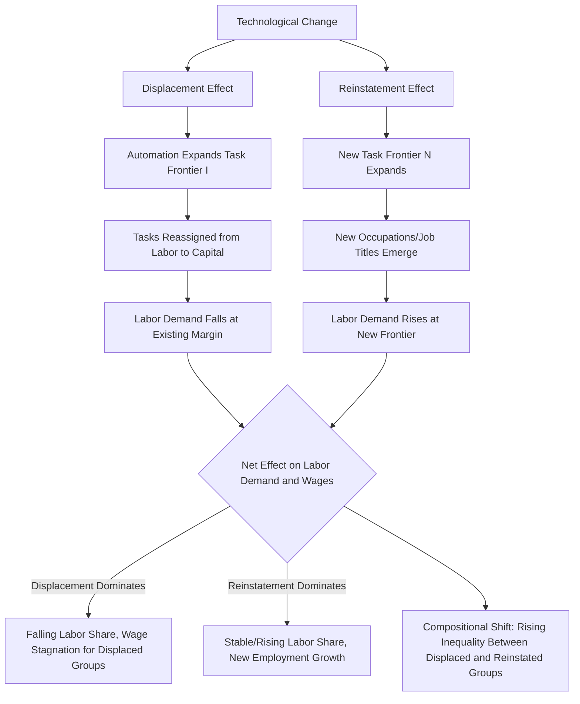

## Task Displacement and Reinstatement Effects

### Overview

The Task Displacement and Reinstatement framework, developed primarily by Daron Acemoglu and Pascual Restrepo (2018, 2019), formalizes automation's labor market effects as the net outcome of two opposing forces operating on the set of tasks used in production: a **displacement effect**, in which automation removes tasks previously performed by labor and reassigns them to capital, reducing labor demand; and a **reinstatement effect**, in which technological change creates new tasks in which labor holds a comparative advantage, increasing labor demand. This dynamic extension of the static task-based model (Autor-Levy-Murnane 2003; Acemoglu-Autor 2011) explains why continuous automation has not produced monotonically declining labor demand or a secular collapse in labor's share of income, while also providing a framework for when automation *does* generate adverse aggregate labor market outcomes.

### Motivation: Limits of the Static Task Model

**Key Points**

- The original RBTC/task-assignment models (Autor-Levy-Murnane 2003; Acemoglu-Autor 2011) are essentially **comparative statics**: a single technology shock shifts the automation threshold once, and the model characterizes the new equilibrium — but does not explain the empirical fact that labor's aggregate task share and income share have been fairly stable over the long run (roughly two-thirds) despite two centuries of continuous automation.
- Acemoglu and Restrepo motivate the reinstatement concept by asking: if automation continually displaces labor from an ever-expanding set of routine tasks, what stops labor demand from asymptoting to zero? Their answer: technological change is not purely displacing — it also continually generates **new tasks and job titles** (e.g., "software developer," "MRI technician," "data analyst," "wind turbine technician") that did not previously exist and in which labor initially has comparative advantage over capital.

### Formal Task-Continuum Model

**Key Points**

- Building on the Acemoglu-Autor (2011) Roy-model task continuum indexed $i \in [N-1, N]$, where $N$ represents the endogenously evolving frontier of tasks, the production function aggregates a continuum of tasks:

$$\ln Y = \frac{1}{N} \int_{N-1}^{N} \ln y(i)\, di$$

where each task $y(i)$ can be produced by either labor or capital, depending on relative unit costs and technology.

- **Automation threshold** $I \in [N-1, N]$: tasks below $I$ are automated (produced by capital); tasks above $I$ are performed by labor. A rise in $I$ (automation frontier expanding) is the **displacement effect** — it shrinks the range of tasks performed by labor.
- **New task frontier** $N$: an increase in $N$ itself — the creation of entirely new tasks beyond the previous frontier, which by construction begin as labor-intensive (since capital has not yet been adapted to perform them) — is the **reinstatement effect**.
- The model's key equilibrium condition determines labor demand and wages as a function of the balance between $\Delta I$ (automation) and $\Delta N$ (new task creation):

$$w = \frac{(1-\alpha)}{L} \int_{I}^{N} y(i)\, di \cdot \left(\text{relative task prices}\right)$$

[Inference — precise functional form varies by paper version] The exact closed-form expressions differ across the 2018 NBER working paper, the 2019 AER Insights piece, and later extensions; the qualitative structure — labor demand and wages depend on the *net* effect of automation and reinstatement — is the stable, load-bearing result across versions.

### Decomposing the Net Effect on Labor Demand

**Key Points**

- The central analytical contribution is an **accounting decomposition** of the change in labor's share of value added (or the labor demand elasticity) into components attributable to:
  1. **Displacement**: task reassignment from labor to capital at the existing task margin — unambiguously reduces labor demand, holding other things constant.
  2. **Reinstatement**: new tasks created at the frontier where labor has comparative advantage — unambiguously increases labor demand.
  3. **Productivity effect**: automation of existing tasks lowers the cost of producing those tasks, which (via standard general-equilibrium scale effects) can raise demand for the *complementary* remaining labor-intensive tasks — this is conceptually related to, but analytically separated from, the reinstatement effect above.
- A widely cited implication: **whether automation raises or lowers wages and labor share depends on whether displacement or reinstatement dominates** in a given period — this is presented as an empirically open, not theoretically predetermined, question, distinguishing the Acemoglu-Restrepo framework from more deterministic "robots will/won't destroy jobs" narratives.

### Empirical Implementation: "New Work" Measurement

**Key Points**

- Acemoglu and Restrepo (and related work with Autor) operationalize the reinstatement effect empirically using **new job title emergence** in Census/BLS occupational classification systems as a proxy for new task creation — e.g., counting occupation titles that appear in a given decade's Census occupation codes that did not exist in the prior decade's classification (such as "wind turbine service technician," "data scientist," "biomedical engineer").
- [Unverified — specific point estimates are paper/period-specific] Their empirical work finds that new-task/new-job-title creation has historically accounted for a meaningful share of aggregate employment growth in the U.S. over the 20th century, but that the *rate* of new task creation appears to have slowed in recent decades relative to the rate of automation-driven displacement — offered as a candidate explanation for weak wage growth and declining labor share since the 1980s–2000s, though this remains a debated empirical claim rather than a settled consensus finding.
- Robotics-specific empirical test (Acemoglu-Restrepo 2020, "Robots and Jobs"): using variation in robot exposure across U.S. commuting zones (based on each region's industry mix and the industry-level pace of robot adoption, a "Bartik" shift-share design), they estimate the local labor market employment and wage effects of robot adoption, interpreting negative estimated effects as evidence that in the robotics case specifically, displacement has outweighed reinstatement/productivity effects in the affected local labor markets.

### Relationship to Automation vs. Innovation More Broadly

**Key Points**

- The framework explicitly distinguishes **automation technologies** (which directly substitute capital for labor in existing tasks — industrial robots, software automating clerical work, self-checkout) from **labor-augmenting** or **task-creating innovations** (which increase the productivity of labor in tasks it already performs, or open entirely new tasks — new industries, new product varieties, new occupations).
- [Inference] A key normative implication drawn by Acemoglu and Restrepo in later work (including popular-audience writing) is that the *direction* of innovation is not technologically predetermined but responds to incentives (relative factor prices, tax treatment of capital vs. labor, R&D subsidies), implying that policy — not just technology — shapes whether future automation waves skew toward pure displacement or toward balanced displacement-and-reinstatement; this is a normative/policy argument built on top of the positive economic model rather than a directly tested empirical claim.

### Contrast with Prior Frameworks

| Framework | Core Mechanism | Prediction for Aggregate Labor Demand | Treatment of New Technology |
| --- | --- | --- | --- |
| SBTC (Skill-Biased Technical Change) | Technology raises relative productivity of skilled labor | Monotonic rise in skill premium | Technology treated as uniformly skill-complementary |
| RBTC / Task-Based (Autor-Levy-Murnane, Acemoglu-Autor) | Technology substitutes for routine tasks, complements non-routine tasks | U-shaped/polarized employment change by task-routineness | Single comparative-static automation shock |
| Displacement-Reinstatement (Acemoglu-Restrepo) | Net effect of task automation (displacement) vs. new task creation (reinstatement) | Ambiguous — depends on relative pace of displacement vs. reinstatement | Explicitly dynamic; technology can be displacing, reinstating, or both over time |

### Implications for Wage Inequality

**Key Points**

- The displacement-reinstatement framework offers a mechanism for **rising wage inequality alongside stable-ish long-run labor share**: if reinstatement (new task creation) systematically favors high-skill workers (e.g., new tasks tend to require the skills complementary to the new technology, such as programming or data analysis), displacement can concentrate losses among mid- and low-skill routine workers while reinstatement concentrates gains among high-skill workers — producing rising between-group inequality even when the *aggregate* labor share is relatively stable.
- This connects directly to the broader wage inequality decomposition literature: displacement effects are a candidate driver of falling relative demand (and hence falling relative wages/employment) for routine-task occupations, while reinstatement effects are a candidate driver of rising relative demand for occupations tied to emerging technology-complementary tasks — providing a structural, task-based "price effect" story consistent with RIF/JMP-style empirical decompositions of the wage distribution.

### Policy and Measurement Challenges

**Key Points**

- **Measurement difficulty**: reinstatement is inherently harder to measure than displacement because it involves counting the emergence of *previously nonexistent* tasks/occupations, which requires researchers to rely on periodic revisions to standardized occupational classification systems (e.g., the U.S. Census Bureau's occupation codes, O*NET updates) that may lag actual labor market changes by years.
- **Excessive automation concern**: [Inference — this is a normative argument advanced by the authors, not a directly tested empirical result] Acemoglu and Restrepo argue in subsequent work that current tax and subsidy structures in some economies may favor capital over labor investment (e.g., accelerated depreciation for equipment vs. payroll taxes on labor), potentially inducing "excessive automation" — automation adopted even where its productivity gains are too small to offset displacement costs — a claim that has informed policy discussions around capital taxation and automation but remains contested among economists.

### Task Displacement-Reinstatement Balance (svg_diagram)

### Related Topics

- Routine Biased Technical Change and Job Polarization
- Robotics Exposure: Local Labor Market Effects (Acemoglu-Restrepo 2020)
- Capital-Labor Tax Distortions and "Excessive Automation"
- Occupational Classification Systems and Measuring New Work
- Artificial Intelligence, Task Creation, and Future Labor Demand
- Decomposing Sources of Wage Inequality (Task-Based Price Effects)
- Labor Share of Income: Long-Run Trends and Explanations
- Comparative Advantage and the Roy Model in Labor Economics