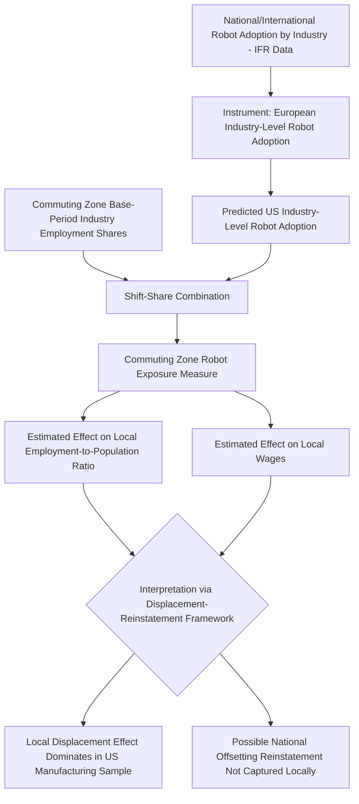

## Robots and Local Labor Markets

### Overview

The "Robots and Local Labor Markets" literature applies quasi-experimental, regional-variation research designs to estimate the causal effect of industrial robot adoption on employment and wages, using geographic differences in local industry composition to translate national/international robot adoption trends into local exposure measures. The foundational study is Acemoglu and Restrepo (2020, "Robots and Jobs: Evidence from US Labor Markets," *Journal of Political Economy*), which adapts the local-labor-market shift-share design pioneered in the trade literature (notably Autor, Dorn, and Hanson's "China Shock" studies) to the context of automation.

### Motivation and Research Design Logic

**Key Points**

- Estimating the causal effect of robots on labor markets at the national level is difficult because national robot adoption is confounded with simultaneous macroeconomic trends (trade, other technology, business cycles), and national employment is a single time-series observation, giving no cross-sectional variation to identify effects.
- The **local labor market design** solves this by exploiting the fact that robot adoption is heavily concentrated in specific industries (e.g., automotive manufacturing, electronics), and different U.S. commuting zones have different initial industry mixes. This creates geographic variation in "exposure to robots" even though the underlying technology shock is national or global in origin.
- This design mirrors the logic of Bartik/shift-share instruments broadly used in labor economics: a local area's predicted exposure is constructed by combining (a) national/international trends in an outcome (robot adoption by industry) with (b) local initial conditions (each area's employment share in each industry), producing local-level variation that is plausibly less endogenous to local labor market conditions than actual local robot adoption would be.

### Constructing the Robot Exposure Measure

**Key Points**

- Acemoglu and Restrepo (2020) construct a commuting-zone-level exposure measure using data from the **International Federation of Robotics (IFR)**, which reports robot shipments/stocks by country and industry (based on standard industrial classifications).
- The exposure measure for commuting zone $c$ is typically constructed as:

$$Exposure_c = \sum_{j} \frac{L_{cj}}{L_j} \times \frac{\Delta M_j}{L_j}$$

where $L_{cj}$ is commuting zone $c$'s employment in industry $j$ in a base period, $L_j$ is total U.S. employment in industry $j$, and $\Delta M_j$ is the change in the stock of robots in industry $j$ (often measured using European industry-level robot adoption as an instrument for U.S. industry-level adoption, addressing reverse-causality concerns — the "instrumented" version of the shift-share design).

- The use of **European robot adoption patterns as an instrument** for U.S. industry-level robot adoption is a key identification strategy: the logic is that robot adoption patterns across industries are driven by common technological factors (e.g., robots becoming cheaper/better suited to certain tasks) that are similar across advanced economies, but region-specific U.S. local labor market shocks are unlikely to drive robot adoption trends in Europe — reducing (though not eliminating) concerns that local demand shocks are driving both local employment outcomes and local robot adoption simultaneously.

### Headline Empirical Findings

**Key Points**

- [Unverified — specific point estimates should be checked against the original paper's exact specification and sample period] Acemoglu and Restrepo (2020) report that increased robot exposure is associated with statistically significant reductions in both employment-to-population ratios and wages within affected commuting zones, with commonly cited estimates suggesting that each additional robot per thousand workers reduces the employment-to-population ratio by a small but economically meaningful amount and reduces wages by a comparable order of magnitude — the exact numerical coefficients (often cited in the range of several tenths of a percentage point per robot) vary depending on the specification, control set, and time period examined, and should be sourced directly from the paper rather than assumed.
- The estimated effects are found to be concentrated in **manufacturing employment** specifically, with some estimated spillover/reallocation to other sectors that is smaller in magnitude and, in some specifications, statistically insignificant — consistent with a **local demand multiplier** story in which manufacturing job losses reduce local demand for other goods and services, partially transmitting negative effects beyond the directly automated sector.
- The paper also finds heterogeneous effects by demographic group: [Unverified] estimated negative employment effects are often reported as larger for workers without a college degree, for males, and for individuals in blue-collar and routine manual occupations — consistent with the routine-biased technical change (RBTC) prediction that automation-vulnerable tasks are concentrated among specific worker groups.

### Interpretation Through the Displacement-Reinstatement Framework

**Key Points**

- The robotics local-labor-market results are frequently interpreted through the Acemoglu-Restrepo (2018, 2019) task displacement-reinstatement framework (see prior item): the negative local employment/wage effects found in the robotics studies are interpreted as evidence that, in the specific context of industrial robots in the sample period studied, the **displacement effect dominated the reinstatement/productivity effect** within the directly affected local labor markets.
- This is explicitly framed as **not** a claim that automation is always net-negative for aggregate employment; national/aggregate reinstatement effects (new task creation elsewhere in the economy, general equilibrium price effects, productivity gains passed through to consumers) may offset local losses at the national level even when local, partial-equilibrium estimates are negative — the local labor market design by construction cannot fully capture national general-equilibrium reinstatement effects that are not geographically concentrated.

### International Evidence

**Key Points**

- [Unverified — findings are heterogeneous across studies and should be treated as illustrative rather than a settled consensus] Subsequent studies applying similar local-labor-market or industry-level designs to other countries have found mixed results: some studies of German manufacturing (e.g., Dauth, Findeisen, Suedekum, and Woessner) find that while robot adoption reduces manufacturing employment in exposed regions, it does not reduce *total* regional employment because of offsetting employment gains in the service sector, and does not reduce individual worker wages for incumbent workers protected by German labor market institutions (though it does reduce wages and job opportunities for new labor market entrants).
- This divergence between U.S. and German findings is often attributed to differing labor market institutions — [Inference] stronger employment protection, apprenticeship systems, and worker codetermination in Germany are hypothesized to channel displaced routine manufacturing workers into within-firm reallocation or retraining rather than unemployment or wage cuts, though this remains an area of ongoing comparative research rather than a definitively established causal mechanism.

### Methodological Critiques and Robustness Concerns

**Key Points**

- **Measurement of "robots"**: IFR data on robot stocks/shipments by industry does not capture the full range of automation technologies (e.g., software automation, AI-based systems), so estimated effects specifically reflect *industrial/physical robots* and should not be generalized as estimates of "automation" broadly, a distinction sometimes blurred in popular discussion of the findings.
- **Shift-share instrument validity**: as with the broader Bartik/shift-share literature (Goldsmith-Pinkham, Sorkin, and Swift 2020; Borusyak, Hull, and Jaravel 2022), the validity of the identification strategy depends on assumptions about the exogeneity of either the industry shares or the industry-level shocks; subsequent methodological work in the broader shift-share literature has scrutinized these assumptions in ways relevant to interpreting robot-exposure estimates, though this critique is general to the shift-share design class rather than specific to the robots papers.
- **General equilibrium spillovers across commuting zones**: local labor market designs implicitly assume limited migration/spillover between treated and untreated regions; if displaced workers migrate to less-exposed commuting zones, this could bias local estimates (typically toward finding smaller negative effects in the exposed region, since some adjustment occurs via out-migration rather than local wage/employment changes, while spreading effects to comparison regions).

### Comparison Table: Robots vs. Related Local-Labor-Market Automation/Trade Studies

| Study | Shock Studied | Identification Strategy | Headline Direction of Local Effect |
| --- | --- | --- | --- |
| Autor, Dorn, Hanson (2013) — "China Shock" | Import competition from China | Shift-share using industry trade exposure | Negative employment/wage effects in exposed regions |
| Acemoglu, Restrepo (2020) — "Robots and Jobs" | Industrial robot adoption | Shift-share using IFR robot data, instrumented via European adoption | Negative employment/wage effects in exposed commuting zones |
| Dauth et al. — German robots | Industrial robot adoption (Germany) | Similar shift-share design, German administrative data | Negative manufacturing employment, offset by service-sector gains; incumbent wages largely protected |
| Autor, Dorn (2013) — RBTC/polarization | Routine task computerization | Cross-sectional variation in initial routine task specialization | Polarization: employment growth at top and bottom, decline in middle |

### Policy Implications Discussed in the Literature

**Key Points**

- [Inference — these are policy positions advanced in follow-on work and commentary by the authors and others, not directly tested empirical claims] Findings of localized negative effects from robot exposure have informed policy discussions around place-based labor market policy (retraining programs targeted at exposed regions), the taxation of capital versus labor (addressing the "excessive automation" concern raised in the displacement-reinstatement framework), and the design of social insurance systems to handle geographically concentrated job displacement, though the appropriate policy response remains a subject of active debate rather than a conclusion the empirical papers themselves establish.

### Robot Exposure Identification Design (svg_diagram)

### Related Topics

- Task Displacement and Reinstatement Effects
- Routine Biased Technical Change and Job Polarization
- The China Shock: Import Competition and Local Labor Markets
- Shift-Share (Bartik) Instruments: Identification and Critiques
- Labor Market Institutions and Adjustment to Automation (Cross-Country Comparison)
- Place-Based Policy and Regional Labor Market Adjustment
- Artificial Intelligence Exposure Measures and Emerging Local Labor Market Studies
- Decomposing Sources of Wage Inequality (Task-Based and Geographic Approaches)