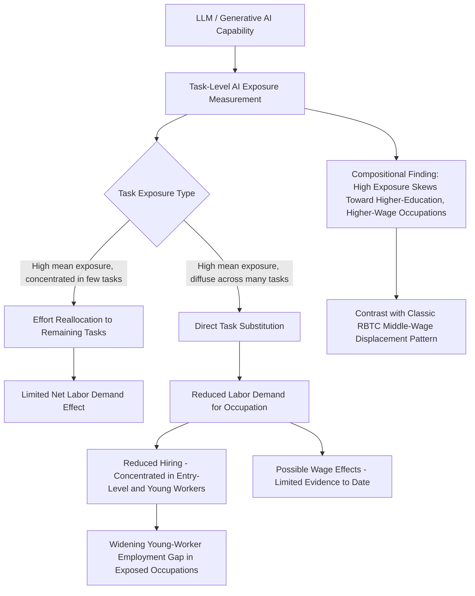

## Artificial Intelligence and Labor Demand

### Overview

The study of Artificial Intelligence and Labor Demand extends the task-based automation framework (RBTC, task displacement-reinstatement) to modern machine learning and generative AI systems, particularly large language models (LLMs). Unlike industrial robotics, which primarily automated **routine manual** and **routine cognitive** tasks, AI — especially generative AI since the 2022 release of ChatGPT — is theorized and empirically investigated as a technology capable of automating or augmenting **non-routine cognitive** tasks, a category the earlier RBTC framework treated as largely technology-complementary. This represents a potential departure from prior automation waves and is an active, rapidly evolving area of empirical labor economics research.

### Conceptual Distinction from Prior Automation Waves

**Key Points**

- Industrial robots (see prior item) and earlier computerization (RBTC) primarily substituted capital for labor in tasks describable as explicit, codifiable rules — routine tasks. Non-routine cognitive tasks (judgment, persuasion, complex problem-solving, writing, analysis) were, under the Autor-Levy-Murnane (2003) taxonomy, presumed relatively resistant to automation.
- Modern AI systems, particularly LLMs, are argued by a growing body of research to have expanded the automatable task frontier into **non-routine cognitive** domains — tasks involving language generation, synthesis, coding, and pattern-based reasoning — without necessarily requiring the explicit rule-codification that defined "routine" in the earlier framework.
- This motivates a shift in exposure measurement away from the older Routine Task Intensity (RTI) index toward newer **AI exposure indices** that attempt to directly measure how much of an occupation's task content overlaps with current or near-future AI capability, rather than routineness per se.

### Measuring AI Exposure at the Occupation/Task Level

**Key Points**

- Several distinct methodologies for constructing AI exposure measures have emerged, differing in whether they rely on expert/model judgment about theoretical capability versus observed real-world usage data:
  - **Eloundou, Manning, Mishkin, and Rock (2023, updated 2024)** — often cited as "GPTs are GPTs" — use human and GPT-4-assisted ratings of the share of an occupation's tasks that could see reduced time-to-completion of at least 50% using LLMs and LLM-powered software, producing an occupation-level "beta" exposure score.
  - **Webb (2019)** — an earlier text-based approach measuring overlap between patent text (for AI specifically, as distinct from software/robotics) and O*NET task descriptions, predating the generative AI wave but frequently used as a baseline comparison measure.
  - A more recent approach introduces a measure of AI displacement risk termed "observed exposure," which combines theoretical LLM capability with real-world usage data, weighting automated (rather than augmentative) and work-related uses more heavily. This work finds that AI is far from reaching its theoretical capability, with actual coverage remaining a fraction of what is technically feasible. [anthropic](https://anthropic.com/research/labor-market-impacts)[anthropic](https://anthropic.com/research/labor-market-impacts)
  - Other approaches construct a dynamic Occupational AI Exposure Score based on task-level assessments using large language models themselves, tracking capability progression across a staged framework from traditional machine learning through agentic AI systems. [arxiv](https://arxiv.org/pdf/2507.08244)
- [Inference] The methodological divergence between "theoretical capability" measures (what AI *could* do to a task, based on model/expert assessment) and "observed usage" measures (what AI is *actually* being used for in practice, based on real conversation/query data) is an important and unresolved distinction in this literature, since the two can produce different rankings of which occupations are most exposed and different predictions about near-term labor market impact.

### Direct Substitution vs. Indirect Reallocation: A Formal Framework

**Key Points**

- Recent NBER-affiliated work constructs task-level measures of workers' exposure to AI and machine learning spanning 2010 to 2023, using natural language processing methods to capture variation across firms, occupations, and time, finding that tasks with higher AI exposure subsequently experience reduced labor demand. [NBER](https://www.nber.org/papers/w33509)
- This research develops a model that explicitly separates the direct substitution effect of AI (capital replacing labor at the task level, analogous to the displacement effect in the Acemoglu-Restrepo framework) from indirect reallocative effects, in which labor-saving technology shifts worker effort toward other tasks within the same job. [NBER](https://www.nber.org/papers/w33509)
- Two summary variables are proposed to characterize within-firm labor demand effects: the mean exposure of an occupation's tasks, which depresses labor demand, and the concentration of that exposure in a small number of tasks (rather than spread evenly across many tasks), which can offset losses by enabling workers to reallocate effort toward the less-exposed remaining tasks within their job. [NBER](https://www.nber.org/papers/w33509)
- This concentration-versus-diffusion distinction is a novel theoretical contribution relative to the earlier RBTC/displacement-reinstatement literature: it suggests that *within-occupation task structure*, not just an occupation's average exposure level, determines whether AI adoption primarily displaces workers or primarily reallocates their effort toward surviving tasks.

### Early Empirical Evidence on Aggregate Employment Effects

**Key Points**

- Multiple independent empirical approaches — using online job postings, payroll microdata, and household survey data — have examined labor market outcomes since the late-2022 release of ChatGPT, with a broadly recurring theme: **limited evidence of widespread, economy-wide AI-driven job displacement**, alongside **more consistent evidence of a labor market disadvantage specifically for young/entry-level workers in AI-exposed occupations**.
- Analysis using job postings data finds that while overall hiring has slowed since the release of ChatGPT, evidence from job postings provides little indication of a distinct AI-driven decline in labor demand overall. AI exposure remains relatively limited in scope: less than 10 percent of workers and vacancies are in occupations with high measured AI exposure, and roughly 40 percent of workers are in jobs with zero measured AI exposure. While postings for more AI-exposed occupations show a relative decline, that divergence began before ChatGPT's release, and no divergence is observed between junior and senior positions within highly exposed occupations — making it difficult to attribute the recent slowdown in entry-level hiring to AI alone using this data source. [Do Job Postings Show Early Labor-Market Effects of AI? - Liberty Street Economics +2](https://libertystreeteconomics.newyorkfed.org/2026/05/do-job-postings-show-early-labor-market-effects-of-ai/)
- In contrast, other work using different data and methods reports more pronounced effects. A study using a dynamic Occupational AI Exposure Score linked to Current Population Survey microdata, comparing October 2022–March 2023 to October 2024–March 2025, finds that rising occupational AI exposure is associated with a decline in total employment, a rise in unemployment, and a reduction in hours worked at primary jobs. The authors suggest 2025 may mark a turning point where labor market disruptions from AI, previously masked by firms' experimentation phase, become more visible. [arxiv](https://arxiv.org/pdf/2507.08244)[arxiv](https://arxiv.org/pdf/2507.08244)
- Payroll-data-based research finds no widespread, economy-wide job displacement associated with AI, but reports that the employment gap for young workers in highly AI-exposed occupations has continued to widen through mid-2026. By one measure, employment among workers ages 22–25 in highly AI-exposed occupations stood about 19 percent below where it would be had it kept pace with employment among similarly aged workers in less-exposed occupations, a gap that has widened steadily from roughly 15 percent in mid-2025. This adjustment appears to operate primarily through reduced hiring of young workers rather than increased separations from employment, and the declines are concentrated in occupations where AI usage tends to automate rather than complement human tasks — in occupations where AI is used more to complement workers, employment among young workers is flat or rising. So far, adjustment is showing up primarily in employment rather than in base pay. [No Widespread Displacement, but the AI Employment Gap for Young Workers Has Widened to 19% - Stanford Digital Economy Lab +3](https://digitaleconomy.stanford.edu/news/canariesaug26/)
- Regional analysis of Texas labor markets reports a related pattern: after the release of ChatGPT, job openings fell for occupations whose tasks are automatable by generative AI, and existing firms more exposed to AI reduced job postings by approximately 5 to 6 percent by the middle of 2024 and by 8 to 9 percent by early 2026. [Dallas Fed](https://www.dallasfed.org/research/economics/2026/0901)
- Household survey evidence specifically for young workers finds a similar but modest pattern: the share of employment for young workers in the most AI-exposed occupations slipped from 16.4 percent in November 2022 to 15.5 percent in September 2025, though because workers aged 20 to 24 represent only about 9 percent of the labor force, this decline likely explains little of the broader increase in the aggregate unemployment rate, and there has been no clear increase in young workers transitioning from employment into unemployment in high-exposure occupations. [Dallas Fed](https://www.dallasfed.org/research/economics/2026/0106)

### The "Young Worker Gap" as an Emerging Stylized Fact

**Key Points**

- [Inference] Across several independent data sources and methodologies (ADP payroll data, CPS, Lightcast job postings), a recurring — though not universal — empirical pattern as of 2025–2026 is that AI's clearest observable labor market signature to date is concentrated among **young/entry-level workers in highly AI-exposed occupations**, operating primarily through **reduced hiring** rather than mass layoffs or aggregate wage declines, rather than the broad-based, economy-wide displacement scenario sometimes discussed in popular commentary.
- The mechanism appears concentrated in occupations where AI is used to automate tasks rather than to complement worker effort, consistent with the direct-substitution channel described in the formal task-exposure models above; in complement-heavy occupations, employment among young and experienced workers alike is flat or rising. [Stanford](https://digitaleconomy.stanford.edu/news/canariesaug26/)
- This pattern is consistent with a "low-experience-task overlap" hypothesis: entry-level roles have historically served as a training ground for tasks (routine drafting, first-pass analysis, junior coding, basic research synthesis) that overlap heavily with current LLM capability, potentially removing early-career workers' traditional task-learning ladder even where aggregate employment for the occupation as a whole is not visibly shrinking.

### Compositional and Demographic Findings on Exposure

**Key Points**

- Contrary to some earlier assumptions that automation primarily threatens lower-wage, less-educated workers (as under classic RBTC), workers in the professions with the highest observed AI exposure are found to be more likely to be older, female, more educated, and higher-paid. [anthropic](https://anthropic.com/research/labor-market-impacts)
- Occupations with higher observed AI exposure are also projected by official Bureau of Labor Statistics employment projections (covering 2024 to 2034) to grow less than lower-exposure occupations; a regression at the occupation level weighted by current employment finds that for every 10-percentage-point increase in AI coverage, projected occupational growth drops by roughly 0.6 percentage points, though the relationship is described as slight. Notably, this correlation with official BLS projections does not hold using at least one alternative, earlier exposure measure alone, highlighting sensitivity of findings to the specific exposure methodology used. [anthropic](https://anthropic.com/research/labor-market-impacts)[anthropic](https://anthropic.com/research/labor-market-impacts)
- This demographic pattern — AI exposure skewing toward higher-education, higher-wage occupations — is a meaningful contrast with the RBTC-era finding that routine-task automation was concentrated in middle-wage, often less-educated occupational categories, and is central to ongoing debate about whether AI will compress or widen wage inequality along the education dimension (as distinct from the age/experience dimension, where the "young worker gap" evidence above is more consistent across studies).

### Relationship to the Displacement-Reinstatement Framework

**Key Points**

- [Inference] The AI labor demand literature is generally understood as testing whether the Acemoglu-Restrepo displacement-reinstatement logic (see prior item) extends to a technology whose comparative advantage lies in non-routine cognitive tasks rather than routine tasks, and whether new "AI-complementary" tasks and occupations (analogous to historical new-task creation such as "software developer" following computerization) emerge quickly enough to offset displacement — a question the current evidence base described above cannot yet definitively answer given the technology's recency.
- The observed pattern of concentrated effects on young/entry-level workers with limited aggregate employment or wage disruption is consistent with an early-stage, partial-displacement equilibrium in the model's terms — where displacement is occurring at the margin (entry-level task assignment) faster than large-scale reinstatement (new AI-complementary occupations at meaningful employment scale) has had time to develop, though this interpretation should be treated as a plausible reading of early evidence rather than an established finding.

### Methodological Cautions Specific to This Literature

**Key Points**

- A body of critical methodological work argues that occupational AI exposure should be measured from direct evidence of AI usage and capability rather than inferred purely from theoretical model priors or expert judgment about what AI plausibly could do, given the gap this can create between predicted and actual displacement risk. [arxiv](https://arxiv.org/pdf/2605.15474)
- **Rapid capability change**: because underlying AI model capabilities have advanced substantially within the same short window these studies cover (2022–2026), exposure measures constructed at a single point in time may understate current capability by the time studies are published — a measurement instability not present in the more mature robotics/RTI literatures, where task codifiability changes far more slowly.
- **Short post-treatment window**: with generative AI's mass release dating only to late 2022, all empirical studies to date necessarily rely on a relatively short post-treatment period, limiting the ability to distinguish a temporary adjustment/experimentation phase from a durable structural shift in labor demand — a concern raised explicitly in some of the literature itself regarding whether 2025–2026 represents an inflection point or continued gradual adjustment.
- **Confounding with the broader post-pandemic hiring slowdown**: several studies explicitly note the difficulty of separating AI-specific effects from a general slowdown in hiring (particularly at entry level) that has coincided with, but is not necessarily caused by, AI adoption, given simultaneous macroeconomic and labor market normalization trends following the 2021–2022 hiring boom.

### AI Exposure and Labor Demand Channels (svg_diagram)

### Related Topics

- Task Displacement and Reinstatement Effects
- Routine Biased Technical Change and Job Polarization
- Robots and Local Labor Markets
- Decomposing Sources of Wage Inequality (Applications to AI Exposure)
- Entry-Level Labor Markets and School-to-Work Transitions
- Human Capital Investment Under Rapid Technological Change
- Occupational Employment Projections and Forecasting Methods
- Policy Responses to AI-Driven Labor Market Disruption