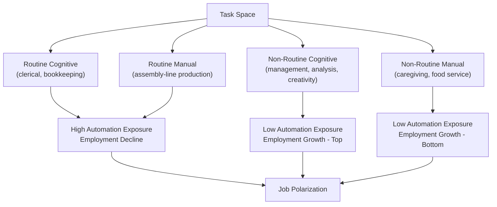

## Automation and Occupational Change

### Definition and Scope

Automation refers to the substitution of capital (machines, software, algorithms) for human labor in the performance of specific work tasks. Occupational change refers to the resulting shifts in the composition of jobs, the tasks performed within jobs, and the skill requirements demanded by the labor market. These two phenomena are studied jointly because automation rarely eliminates entire occupations outright; rather, it typically alters the task content of occupations, which in turn drives workers to reallocate across occupations, industries, and skill levels.

The economic analysis of automation sits at the intersection of labor economics, growth theory, and the economics of technological change. It asks: which tasks get automated, why, what happens to the workers who performed those tasks, and how does the occupational structure of the economy evolve as a result.

### The Task-Based Framework

#### From "Jobs" to "Tasks"

Traditional labor demand models treated an occupation or a skill group (e.g., "high school graduates," "college graduates") as the basic unit of analysis, with capital and labor as more or less substitutable aggregates. The **task-based framework**, developed principally by Daron Acemoglu and David Autor, reframes the analysis around the **task**, defined as a unit of work activity that produces output.

In this framework:

- Occupations are bundles of tasks.
- Workers have skills that are allocated to tasks based on comparative advantage.
- Technology (automation) does not compete with "labor" in the abstract; it competes with labor at the level of specific tasks.
- Automation occurs when a task that was previously performed by labor can be performed by capital (machines, software, algorithms) at lower cost or higher reliability.

This reframing matters because it explains why automation can simultaneously destroy demand for labor in some tasks while increasing demand for labor in others, even within the same occupation.

#### The Ricardian Task Allocation Model

The canonical formalization (Acemoglu & Autor, 2011; Acemoglu & Restrepo, 2018) models production as a continuum of tasks indexed by $i \in [0, N]$, each combining labor and capital according to a task-specific production function. Output for task $i$ is:

$$y(i) = \alpha_L(i)l(i) + \alpha_K(i)k(i)$$

where $\alpha_L(i)$ and $\alpha_K(i)$ are the productivity of labor and capital, respectively, in task $i$, and $l(i)$, $k(i)$ are labor and capital allocated to that task. Final output aggregates tasks, often via a constant elasticity of substitution (CES) or Cobb-Douglas structure:

$$Y = \left(\int_0^N y(i)^{\frac{\sigma-1}{\sigma}}di\right)^{\frac{\sigma}{\sigma-1}}$$

Tasks are allocated to whichever factor is relatively cheaper per unit of effective output. **Automation** is modeled as an expansion of the set of tasks that capital can perform — i.e., an increase in the threshold task index $I^*$ below which capital can substitute for labor.

#### Displacement and Reinstatement Effects

Acemoglu and Restrepo (2019) decompose the net labor-market effect of automation into two countervailing forces:

- **Displacement effect**: Automation of a task directly reduces labor demand for that task, holding output constant, because capital replaces labor in production. This effect is unambiguously negative for labor demand and labor's share of income in the automated tasks.
- **Reinstatement effect**: Technological change also creates *new* tasks in which labor has a comparative advantage (new job titles, new industries, new complementary activities). These new tasks reinstate labor into the production process, offsetting displacement.

The net employment and wage effect of automation depends on the relative magnitude of these two effects. Historically, reinstatement has often (though not always, and not for every worker group) offset displacement over sufficiently long horizons, but the composition of *who* benefits from reinstatement need not match *who* was displaced.

### Historical Perspective

#### The Long Arc of Mechanization

- **First Industrial Revolution (late 18th–19th century)**: Mechanized textile production (power looms, spinning jennies) displaced skilled artisanal weavers, giving rise to the **Luddite movement**. This is the historical origin case for concerns about technological unemployment.
- **Second Industrial Revolution (late 19th–early 20th century)**: Electrification and mass production (assembly lines) reorganized manufacturing tasks, contributing to the rise of the semi-skilled factory operative and a relative decline in the demand for artisanal skill.
- **Post-WWII to 1970s**: Continued mechanization in agriculture and manufacturing, accompanied by rapid growth in mass secondary and tertiary education that kept skill supply roughly in step with skill demand (the "race between education and technology," per Goldin & Katz, 2008).
- **Late 20th century (1980s onward)**: The shift from mechanization of physical tasks to computerization of *routine cognitive and manual* tasks — the era most directly studied by modern automation economics.

#### [Inference] Historical Pattern of Net Effects

Historically, mechanical and computer-based automation has not produced sustained aggregate technological unemployment; instead it has been associated with occupational recomposition and, in most historical episodes, rising average living standards over multi-decade horizons. This is a pattern observed across past technology waves rather than a guaranteed law, since it depends on the pace of automation relative to the pace of reinstatement and human capital adjustment, and past patterns do not guarantee the same outcome for future automation waves involving broader cognitive substitution.

### The Routine-Task-Intensity Hypothesis

#### Core Argument (Autor, Levy, and Murnane, 2003)

Computer-based automation is not skill-neutral. It substitutes for labor in tasks that follow explicit, codifiable, rule-based procedures — **routine tasks** — while complementing labor in tasks requiring flexibility, creativity, and interpersonal skill — **non-routine tasks**. Tasks are cross-classified along two dimensions:

|  | **Cognitive** | **Manual** |
| --- | --- | --- |
| **Routine** | Bookkeeping, repetitive clerical calculation | Repetitive assembly-line production |
| **Non-routine** | Abstract problem-solving, persuasion, creativity | Flexible physical tasks (driving irregular terrain, in-person caregiving) |

Computers historically automated *routine* tasks (both cognitive and manual) most easily, because these tasks can be reduced to explicit rules. Non-routine cognitive tasks (management, scientific reasoning) and non-routine manual tasks (janitorial work, personal care) resisted automation because they require either abstract reasoning that is hard to codify, or situational adaptability that is hard to codify.

#### Job Polarization

The routine-task-intensity hypothesis predicts, and empirical work confirms (Autor, Katz & Kearney, 2006; Goos & Manning, 2007), a **polarized** pattern of employment change:

- Employment growth concentrated at the **top** of the wage/skill distribution (non-routine cognitive: managers, professionals, analysts).
- Employment growth concentrated at the **bottom** of the wage/skill distribution (non-routine manual: personal services, food service, care work).
- Employment *decline* in the **middle** of the wage/skill distribution (routine cognitive and routine manual: clerical workers, machine operators, assembly workers).

This is the "hollowing out of the middle class" pattern frequently cited in policy discussions and is one of the most robust stylized facts in modern labor economics.

### Skill-Biased Technical Change (SBTC) and Its Successors

#### Canonical SBTC

Prior to the task framework, the dominant model was **skill-biased technical change**: technology is modeled as complementary to skilled (typically college-educated) labor and a substitute for unskilled labor, captured in a nested CES production function:

$$Y = \left[(A_L L)^{\frac{\sigma-1}{\sigma}} + (A_H H)^{\frac{\sigma-1}{\sigma}}\right]^{\frac{\sigma}{\sigma-1}}$$

where $H$ and $L$ are high-skill and low-skill labor, and $A_H$ rises relative to $A_L$ over time. SBTC explains the secular rise in the **college wage premium** through the late 20th century but cannot, by itself, explain job polarization, since it predicts monotonic skill-upgrading rather than a U-shaped employment pattern across the wage distribution.

#### Why the Task Framework Superseded Pure SBTC

The task framework nests SBTC as a special case but adds the crucial insight that the relevant margin is *task routineness*, not *educational skill level* per se. This resolves the empirical anomaly that some high-routine jobs (e.g., bookkeeping) require moderate education while some low-routine jobs (e.g., skilled trades, technical repair) also require moderate education, yet the two have diverged sharply in automation exposure and wage trajectories.

### Modern Automation: Robotics, Software, and AI

#### Industrial Robotics

Acemoglu and Restrepo's empirical work on industrial robots (2020, using data on robot adoption across U.S. local labor markets) finds that each additional robot per thousand workers is associated with measurable reductions in the employment-to-population ratio and wages in directly exposed commuting zones, with **effects concentrated in manufacturing-intensive routine-task occupations** and among workers without a college degree. [Unverified: precise point estimates vary across studies and specifications; the direction and general magnitude are well-replicated but exact coefficients should be treated as specification-dependent.]

#### Software and Algorithmic Automation

Beyond physical robotics, software automation (RPA — robotic process automation, ERP systems, algorithmic decision tools) has automated many routine cognitive tasks in finance, insurance, and administrative support. This channel is harder to measure directly (no physical "robot count") but is captured indirectly through occupational task-content measures (e.g., the O*NET-derived Routine Task Intensity index used in Autor & Dorn, 2013).

#### Artificial Intelligence and the "New Wave"

Generative AI and large language models represent a potential extension of automation into **non-routine cognitive tasks** long thought resistant to codification — tasks involving language generation, synthesis, and pattern-based judgment. This is an active and unsettled area of research.

- **[Speculation]** Some economists (e.g., work associated with Acemoglu's more recent writing, and Eloundou, Manning, Mishkin & Rock's 2023 "GPTs are GPTs" exposure study) argue that AI's task exposure profile differs qualitatively from robotics: it appears to expose higher-wage, higher-education occupations (legal research, coding, writing, analysis) rather than concentrating on manual middle-skill work, which would imply a different polarization pattern than the 1990s–2000s computer-automation wave.
- **[Unverified]** The magnitude of net employment displacement from generative AI, and the extent to which reinstatement effects (new task creation) will offset displacement, remains empirically unresolved as of the most recent research, given the short time series available for study.
- Standard economic frameworks would predict that even substantial AI-driven task automation need not produce net job loss if it lowers costs enough to expand output and demand (a **productivity effect**) and creates new complementary tasks, but this outcome is not guaranteed and depends on the elasticity of product demand and the speed of reinstatement.

### General Equilibrium Effects: Beyond Direct Displacement

Automation's labor-market effects operate through several general equilibrium channels beyond the direct displacement of automated workers:

- **Productivity/output effect**: Automation lowers production costs, which can raise output, lower prices, and increase demand for labor in complementary tasks and in downstream/upstream industries — an effect first formalized in this context as the "capital accumulation effect" and closely related to Nordhaus's and Aghion's work on automation and growth.
- **Between-sector spillovers**: A sector that automates intensively may shrink in employment share even as it expands in output, while labor reallocates to less-automated sectors (often services), a pattern consistent with structural transformation more broadly.
- **Local labor market effects**: Because automation (particularly robotics) is often geographically concentrated (e.g., automotive manufacturing regions), effects can be highly localized, producing regional divergence even when national aggregate employment is stable.
- **Monopsony and bargaining power**: Some literature (e.g., work connecting automation to declining labor share) argues automation can also alter *bargaining power* between capital and labor independent of task substitution, by increasing the credibility of employers' threat to automate (a channel sometimes called "automation as a bargaining chip").

### Occupational Change: Measurement Approaches

#### Task-Content Measures

- **O*NET database**: A U.S. Department of Labor-maintained repository of detailed occupational task descriptors (e.g., "Get Information," "Interacting With Computers," physical dexterity requirements). Widely used to construct Routine Task Intensity (RTI) indices at the occupation level.
- **Autor-Dorn RTI Index**: Combines O*NET measures of routine cognitive, routine manual, and non-routine task intensity into a single scalar summarizing an occupation's automation exposure.
- **Frey and Osborne (2017) "Susceptibility to Computerisation"**: Estimates occupation-level probabilities of automation based on expert assessment of nine bottleneck task categories (e.g., "originality," "manual dexterity," "social perceptiveness"), producing the widely cited claim that roughly 47% of U.S. employment was in occupations at "high risk" of automation. [Unverified: this figure is frequently cited in policy discourse but is based on an engineering-feasibility judgment about which tasks *could* be automated, not an economic forecast of net employment loss, and has been critiqued for overstating displacement by ignoring task reallocation within occupations.]

#### Occupational Transition/Flow Analysis

Labor economists also study occupational change by tracking worker flows: which occupations workers exit, which they enter, and how transition patterns correlate with automation exposure. This reveals that many displaced routine-task workers do not exit the labor force but transition into non-routine service occupations, often at lower wages — a key mechanism behind wage polarization, not just employment polarization.

### Key Points

- Automation is best modeled at the level of **tasks**, not occupations or broad skill categories; occupations are bundles of tasks with heterogeneous automation exposure.
- The net labor-market effect of automation reflects a race between the **displacement effect** (direct task substitution) and the **reinstatement effect** (creation of new labor-intensive tasks).
- The **routine-task-intensity hypothesis** explains **job polarization**: growth at the top and bottom of the wage distribution, decline in the middle.
- Historically, mechanization has not produced sustained mass unemployment, but has consistently produced significant **distributional** effects and required costly worker reallocation.
- Modern robotics evidence shows localized, occupation-specific negative employment and wage effects concentrated among non-college workers in manufacturing.
- AI-driven automation may extend task substitution into historically automation-resistant non-routine cognitive tasks, with net effects still empirically unresolved.
- Measurement of automation exposure relies on task-content databases (O*NET) and engineering-feasibility studies, both of which carry methodological caveats.

### Example

Consider a mid-sized regional bank in the 1990s employing loan processing clerks (routine cognitive task: verifying application data against lending criteria) and loan officers (non-routine cognitive task: assessing borderline cases, negotiating terms with business clients).

- **Displacement**: The bank adopts automated underwriting software that applies coded credit-scoring rules. Loan-processing clerk positions are reduced by 60% over five years — a direct displacement effect on a routine cognitive task.
- **Reinstatement**: The bank simultaneously creates a new "credit risk analytics" team to build, validate, and maintain the underwriting algorithms — a new non-routine cognitive task that did not exist before, absorbing some (but not all) of the displaced labor, typically at a *higher* skill and wage tier than the jobs eliminated.
- **Net occupational change**: Aggregate bank employment may be roughly stable, but occupational composition shifts from routine clerical work toward analytics and customer-relationship roles — illustrating polarization *within* a single firm.

### Related Topics

- Skill-biased technical change and the college wage premium
- Job polarization and wage inequality
- Capital-skill complementarity
- Structural transformation and sectoral labor reallocation
- Monopsony power and automation as a bargaining threat
- Active labor market policies and retraining program design
- Universal basic income as a policy response to technological displacement
- The economics of artificial intelligence and generative AI labor market exposure
- Regional/local labor market effects of trade and technology shocks
- Human capital theory and the returns to STEM versus vocational education