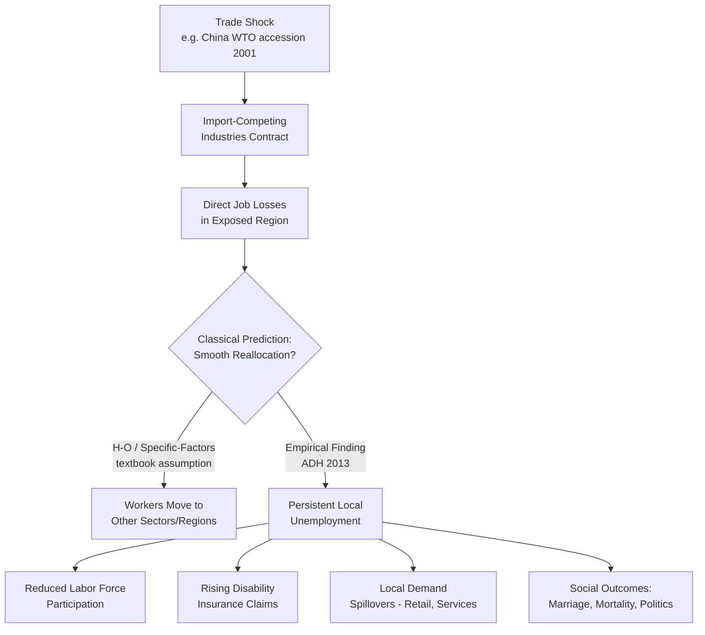

## Trade Theory and Labor Market Outcomes

### Scope and Framing

Trade theory and labor market outcomes examines how international trade in goods and services affects wages, employment, income distribution, and occupational structure within trading economies. The field spans several distinct theoretical traditions — each built on different assumptions about factor mobility, production technology, and market structure — which yield different and sometimes conflicting predictions about *who* gains and *who* loses from trade. Modern empirical work, particularly the "China shock" literature, has substantially revised how labor economists interpret these classical models.

### Classical and Neoclassical Trade Models

#### Ricardian Model (Comparative Advantage)

The Ricardian model explains trade patterns through cross-country differences in labor productivity (technology) across goods, with labor as the only factor of production. A country specializes in and exports the good in which it has a **comparative advantage** — i.e., the good for which its productivity disadvantage (or advantage) relative to trading partners is smallest (or largest), not necessarily the good it produces most efficiently in absolute terms.

$$\text{Comparative advantage in good } X \iff \frac{a_{LX}}{a_{LY}} < \frac{a^*_{LX}}{a^*_{LY}}$$

where $a_{LX}$ is the labor required per unit of good $X$ domestically and $a^*_{LX}$ is the foreign equivalent.

- **Labor market implication**: Because labor is the only factor and is assumed perfectly mobile *between* sectors within a country, the Ricardian model predicts that trade raises the real wage of *all* domestic workers (aggregate gains from specialization), with no within-country distributional conflict. This is the model's key limitation for labor economics: it cannot generate winners and losers within a country, only between countries.

#### Heckscher-Ohlin (H-O) Model

The H-O model introduces two factors of production (typically capital and labor, or skilled and unskilled labor) and explains trade patterns via cross-country differences in **factor endowments** rather than technology. A country exports the good that intensively uses its relatively abundant factor.

- **Stolper-Samuelson Theorem** (the model's central labor-market result): Trade liberalization raises the real return to the factor used intensively in the export sector and lowers the real return to the factor used intensively in the import-competing sector — in absolute terms, not just relative to the other good's price.

$$\hat{w} > \hat{p}_X > \hat{p}_Y > \hat{r} \quad \text{(if } X \text{ is labor-intensive and its price rises)}$$

This is the theoretical foundation for the prediction that, in a skill-scarce, capital-abundant advanced economy, trade with a labor-abundant developing country should lower wages (or wage share) for the scarce factor — historically invoked to explain rising skill premia in the U.S. as a *trade*-driven phenomenon (competing with the SBTC and automation explanations discussed in prior technology-focused analysis).

- **Rybczynski Theorem**: A companion result stating that, at fixed goods prices, an increase in the endowment of one factor leads to a more-than-proportional increase in output of the good that uses that factor intensively, and an absolute decline in output of the other good. This underlies predictions about how labor supply shocks (e.g., immigration) interact with trade-exposed sectors.
- **Factor Price Equalization Theorem**: Under free trade, identical technology, and no factor-market distortions, factor prices (wages, rental rates) converge *across countries* engaged in free trade, even without factor mobility, because goods trade substitutes for factor trade. This is a strong theoretical benchmark rarely satisfied empirically, given real-world differences in technology and trade barriers.

#### Specific-Factors Model

An intermediate model (Jones, 1971) in which one factor (labor) is mobile across sectors while other factors (capital, land) are sector-specific and immobile in the short run. This model is often preferred in labor economics for **short- and medium-run analysis** because it captures the empirically realistic feature that capital cannot instantly relocate across industries.

- **Labor market implication**: Trade liberalization benefits the specific factor in the export sector, harms the specific factor in the import-competing sector, and has an *ambiguous* effect on the mobile factor (labor), whose real wage change depends on consumption patterns across the two goods. This generates a much richer and more empirically tractable set of predictions about sector-specific labor market adjustment than the H-O model's clean factor-content prediction.

### The Factor-Content Approach and Its Critiques

The classical framework was long applied empirically via the **factor-content of trade** approach: computing the amount of skilled and unskilled labor "embodied" in a country's exports versus imports, and inferring implied factor-price changes. This approach (prominently used in the "trade versus technology" wage-inequality debates of the 1990s, e.g., Krugman 1995, Wood 1995) generally found that trade's estimated contribution to rising skill premia in advanced economies was modest relative to SBTC — a conclusion later revisited and partly overturned by the China-shock literature.

### Modern Empirical Trade Labor Economics: The "China Shock" Literature

#### Core Contribution (Autor, Dorn, and Hanson, 2013 et seq.)

The rapid rise of China's share of world manufacturing exports after its 2001 WTO accession provided a large, plausibly exogenous trade shock, exploited by comparing U.S. **local labor markets (commuting zones)** with differing initial exposure to Chinese import competition, based on their pre-existing industry mix.

**Empirical strategy**: Construct a commuting-zone-level measure of import exposure:

$$\Delta IP_{uzt} = \sum_j \frac{L_{ijt_0}}{L_{it_0}} \cdot \frac{\Delta M_{ucjt}}{L_{ujt_0}}$$

where the exposure of commuting zone $z$ is the industry-employment-share-weighted growth in Chinese imports per worker across industries $j$, typically instrumented using other high-income countries' import exposure to China to isolate supply-driven (Chinese productivity/WTO-accession) shocks from U.S. demand-driven shocks.

**Key findings**:

- Commuting zones more exposed to Chinese import competition experienced significantly larger declines in manufacturing employment, lower overall employment-to-population ratios, and lower wages, relative to less-exposed zones.
- Effects were **persistent** and did not fully dissipate through worker reallocation to other industries or geographic mobility within a decade or more — a sharp contrast to the textbook Ricardian/H-O prediction of smooth, low-cost factor reallocation.
- Displaced manufacturing workers frequently exited the labor force entirely or moved onto disability insurance rolls rather than transitioning smoothly into other employment, indicating substantial **adjustment frictions** and low geographic/occupational mobility.
- The shock had significant knock-on effects on **non-employment outcomes**: reduced marriage rates, rising "deaths of despair" in the hardest-hit areas (Autor, Dorn, Hanson & Majlesi and related work), and demonstrable political economy effects (documented association with shifts in voting patterns in the most exposed regions).

#### Why This Overturned Prior Consensus

Pre-2013 trade economists generally assumed the specific-factors/H-O adjustment story: capital and labor reallocate across sectors and regions in response to trade shocks, generating short-run pain but efficient long-run reallocation, consistent with the **Heckscher-Ohlin-Vanek** aggregate prediction that trade gains, even if unevenly distributed, would materialize at the national level with limited persistent regional harm. The China Shock literature found that reallocation frictions — due to firm-specific human capital, housing market lock-in, occupational specificity of skills, and local demand spillovers (when a factory closes, local retail and services also contract) — were far larger and more persistent than the classical model assumed. [Inference] This body of work is widely regarded as the most influential revision to trade labor economics in the past two decades, though the precise magnitude of the aggregate national welfare effect (as opposed to the well-documented distributional and regional effect) of Chinese import competition remains subject to ongoing debate among trade economists, since national aggregate welfare-gains calculations depend on modeling assumptions (love of variety, terms-of-trade effects) not directly tested by the local-labor-market design.

### Trade in Tasks and Offshoring

#### Grossman-Rossi-Hansberg Model (2008)

An extension of the task framework (parallel to the automation literature) applies the same task-based logic to **offshoring**: rather than trading finished goods, firms can relocate specific *tasks* within a production process to lower-wage countries while keeping other tasks domestic. This is distinct from classical trade theory, which treats goods (not tasks) as the tradable unit.

- **Productivity effect**: Offshoring low-wage-country-suitable tasks lowers production costs, which (similar to automation's productivity effect) can raise demand for the remaining domestic tasks and domestic labor overall — a countervailing force to the direct displacement of offshored-task workers.
- **Labor market implication**: Offshoring's effect on domestic wages depends on which tasks are moved. If low-skill tasks are offshored, domestic low-skill wages may fall (via a relative-supply-like mechanism) while domestic high-skill wages may rise (via the productivity effect), generating within-country wage-inequality effects structurally similar to those from automation — a key reason trade and technology explanations are often observationally difficult to fully disentangle empirically.

#### Global Value Chains and Task Trade

Contemporary international production is increasingly organized around fragmented **global value chains (GVCs)**, where a single final good embodies inputs and tasks performed across many countries. This has shifted empirical trade labor economics toward measures like:

- **Value-added trade** (as opposed to gross trade flows), which better isolates a country's genuine domestic labor content in exports.
- **GVC participation measures**, used to study how deeper integration into fragmented production networks affects domestic employment composition and volatility (exposure to foreign demand and supply shocks propagating through the chain).

### Trade and Labor Market Institutions

Trade theory's labor-market predictions interact with domestic labor market institutions:

- **Wage rigidity and unemployment**: In models with downward wage rigidity (e.g., due to minimum wages or union contracts), Stolper-Samuelson-type relative price effects can manifest as *unemployment* of the losing factor rather than a wage cut, a point emphasized in trade-and-unemployment models (e.g., Davidson, Martin & Matusz).
- **Unions and rent-sharing**: Trade exposure can weaken union bargaining power by increasing the credibility of firms' outsourcing/relocation threats, a mechanism structurally analogous to automation's bargaining-power channel.
- **Trade Adjustment Assistance (TAA)**: A U.S. policy example of an institutional response designed to address the specific-factors/China-shock finding that displaced trade-affected workers face unusually costly and slow reallocation, providing extended unemployment benefits, retraining subsidies, and wage insurance for qualifying workers.

### Reconciling Trade and Technology Explanations

A persistent methodological challenge in this literature is that trade exposure and automation exposure are correlated at the industry and regional level (import-competing industries often had high routine-task content and also faced strong incentives to automate in response to competition), making it difficult to cleanly separate "trade caused this" from "technology caused this" in observational data. [Unverified] The consensus among trade and labor economists is that both channels have contributed meaningfully to manufacturing employment decline and wage-structure changes in advanced economies since the 1980s, but the precise decomposition of relative contributions varies substantially across studies depending on time period, country, and identification strategy, and should not be treated as a settled point estimate.

### Key Points

- Different trade models make sharply different labor-market predictions depending on assumptions about **factor mobility** (Ricardian: full mobility, no within-country losers; H-O: mobile factors, Stolper-Samuelson winners/losers; specific-factors: sector-locked factors, richer short-run predictions).
- The **Stolper-Samuelson theorem** is the central classical result linking trade liberalization to factor-price changes and predicts scarce-factor income losses from trade with labor-abundant partners.
- The **"China shock" literature** substantially revised trade labor economics by documenting large, persistent, geographically concentrated employment and wage losses that resist the classical model's smooth-reallocation assumption.
- **Offshoring/task-trade models** parallel the automation task framework and generate similar within-country distributional predictions via productivity and displacement effects operating on tasks rather than goods.
- Trade and automation/technology effects are empirically correlated and difficult to fully disentangle, complicating simple causal attribution of manufacturing decline to either channel alone.

### Example

Consider a U.S. furniture-manufacturing commuting zone in North Carolina in the early 2000s.

- **Pre-shock**: The region specializes in furniture manufacturing (labor-intensive, moderately skilled), consistent with the U.S.'s historical comparative advantage in this sector relative to very-low-wage countries prior to China's WTO accession.
- **Shock**: Following China's 2001 WTO accession, Chinese furniture exports surge due to dramatically lower labor costs, shifting comparative advantage.
- **Stolper-Samuelson prediction**: The scarce factor in the U.S. context (relatively low-skill labor, abundant in China) should see real income declines as furniture import competition intensifies — consistent with directional theory.
- **China-shock empirical finding**: Rather than smooth reallocation into other regional industries, the commuting zone experiences a decade-plus decline in manufacturing employment, a fall in overall employment-to-population ratio (not just manufacturing), increased receipt of disability insurance, and knock-on declines in local retail employment as furniture-worker income and spending contract — illustrating the gap between the classical adjustment story and the observed persistence of local labor-market damage.

### Related Topics

- Stolper-Samuelson theorem and general equilibrium trade models
- The "China shock" empirical literature (Autor, Dorn, Hanson)
- Offshoring, global value chains, and task trade
- Trade Adjustment Assistance and displaced-worker policy
- Skill-biased technical change versus trade as explanations for wage inequality
- Regional labor market adjustment costs and geographic mobility frictions
- Immigration and factor-endowment effects on wages (Rybczynski applications)
- Political economy of trade policy and voting behavior in exposed regions
- Deaths of despair and non-employment outcomes from local economic shocks
- Comparative advantage dynamics under automation-driven reshoring