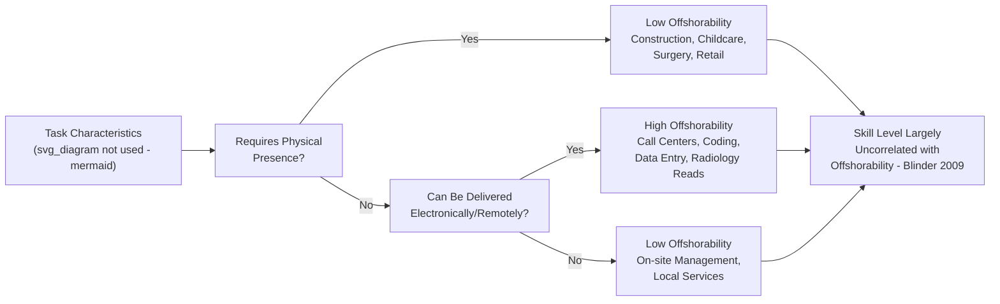

## Offshoring and Domestic Employment

### Definition and Scope

Offshoring refers to the relocation of specific production stages, business functions, or tasks from a domestic economy to a foreign location, typically to exploit lower labor costs, while the relocating firm retains ownership and control (distinguishing it from arm's-length outsourcing to an unaffiliated foreign firm, though the labor-market literature often treats the two together under the broader heading of "foreign outsourcing"). Offshoring's effect on domestic employment is a central topic in modern labor economics because, unlike classical trade in finished goods, it operates at the level of the **task** or **production stage** within a firm or industry, generating within-industry and within-occupation labor market effects that classical trade models were not designed to capture.

### Distinguishing Offshoring from Related Concepts

| Concept | Definition | Key Distinction |
| --- | --- | --- |
| **Offshoring** | Relocating production/tasks abroad, typically retaining firm ownership (FDI-based) or via arm's-length contracting | Focus on *geographic* relocation of activity |
| **Outsourcing** | Contracting out an activity to another firm, which may be domestic or foreign | Focus on *organizational* boundary (make vs. buy); can occur without any offshoring |
| **Foreign Direct Investment (FDI)** | Cross-border ownership stake enabling control over foreign production | The financial/ownership mechanism that often enables offshoring |
| **Import Competition** | Domestic firms losing market share to foreign competitors' finished-good imports | Firm-to-firm competition, not necessarily involving the same firm relocating its own production |
| **Reshoring** | Relocating previously offshored production back to the domestic economy | The reverse flow, motivated by rising foreign costs, supply-chain risk, or automation making domestic production cost-competitive again |

### Theoretical Framework: Trade in Tasks

#### The Grossman-Rossi-Hansberg (2008) Model

The dominant modern framework treats production as a continuum of tasks, each of which can be performed domestically or offshored, generalizing Ricardian comparative advantage to the task level rather than the finished-good level. A task $i$ is offshored if the cost of performing it abroad (foreign wage times a task-specific "offshorability" factor, reflecting communication/coordination costs) falls below the cost of performing it domestically.

This model decomposes the labor market effect of a fall in offshoring costs (e.g., due to improved communications technology or trade liberalization) into two channels, directly analogous to the automation displacement/reinstatement framework:

1. **Productivity effect**: Offshoring low-wage-country-suitable tasks to cheaper foreign labor lowers the firm's overall marginal cost of production. This raises the effective productivity of the remaining domestic factors, which — holding the relative price of domestic labor's tasks fixed — increases labor demand and can raise domestic wages, analogous to a positive, labor-augmenting technology shock.
2. **Relative-labor-supply effect**: Offshoring a task is functionally equivalent to an increase in the effective domestic supply of the type of labor that competes with the offshored task (because foreign labor now substitutes for it). This tends to depress the wage of the domestic factor whose tasks are being offshored, holding the productivity effect fixed.

The **net effect on domestic wages** of a given skill/task group is theoretically ambiguous and depends on which effect dominates — this ambiguity is a central reason offshoring's employment effects require empirical rather than purely theoretical resolution.

$$\hat{w}_L = \underbrace{\theta \cdot \hat{A}}_{\text{productivity effect (+)}} - \underbrace{(1-\theta) \cdot \hat{L}^{eff}}_{\text{effective labor supply effect (-)}}$$

where $\theta$ captures the relative weight of the productivity channel and $\hat{L}^{eff}$ is the increase in effective labor supply from offshored tasks.

#### Task Offshorability and Occupational Exposure

Offshorability of a task depends primarily on whether the task requires **face-to-face interaction or physical presence** rather than on skill level per se — a key departure from the routine/non-routine dichotomy used in the automation literature (Blinder, 2009). This produces a different exposure ranking than automation:

- **Highly offshorable**: data entry, call-center support, basic computer programming, financial analysis reports, radiology image reading, transcription — many of which require *moderate-to-high* skill, contradicting the intuition that offshoring only threatens low-skill work.
- **Not offshorable regardless of skill**: surgery, construction, in-person retail, childcare, most personal services, on-site management — because they inherently require physical co-location.

Blinder's (2009) key insight, often cited as a corrective to purely education-based predictions of "who is safe from globalization," is that the offshorability of a job is largely **uncorrelated with its educational or skill requirements**, meaning some highly educated professional jobs (radiologists, software engineers, financial analysts) can be as exposed as, or more exposed than, many low-skill jobs that require physical presence.

### Empirical Evidence on Domestic Employment Effects

#### Industry- and Firm-Level Studies

- **Feenstra and Hanson (1996, 1999)**: Among the earliest empirical work quantifying offshoring's contribution to the rising skill premium in the U.S., finding that increased imported-input use (a proxy for offshoring intermediate production stages) explained a meaningful share of the shift in U.S. labor demand toward more-skilled workers in the 1980s–1990s, working through a mechanism similar to the productivity/relative-supply decomposition above.
- **Firm-level evidence (e.g., Hummels, Jørgensen, Munch & Xiang, 2014, using Danish matched worker-firm data)**: Offshoring by a firm is associated with job loss and wage declines for the firm's low-skilled workers performing offshorable tasks, but *wage gains* for the firm's high-skilled workers, consistent with the within-firm polarization prediction of the task-trade model — i.e., offshoring's effects are visible not just across firms/industries but *within* the same firm simultaneously.
- **U.S. multinational firm studies**: Evidence on whether offshoring by U.S. multinationals to affiliates abroad substitutes for or complements domestic employment is mixed; some studies find offshoring of *production* tasks reduces domestic manufacturing employment at the parent firm, while offshoring associated with expanding *foreign sales* (market-seeking FDI, as opposed to cost-seeking FDI) can be complementary to domestic employment, particularly in headquarters, R&D, and managerial functions.

#### Service-Sector and White-Collar Offshoring

Offshoring's expansion into IT services, business process outsourcing (BPO), and professional services (accounting, legal research, radiology) starting in the 2000s — enabled by internet infrastructure and digitization — extended the phenomenon beyond manufacturing. This sub-literature finds:

- Occupations with high electronic offshorability (per Blinder-type indices) show measurably slower employment and wage growth in exposed advanced-economy labor markets, though effects are generally found to be smaller in magnitude than the manufacturing "China shock" effects, reflecting continued growth in overall demand for many of these services domestically even as some tasks are offshored.
- [Inference] The overall consensus in this sub-literature is that service-sector offshoring has thus far produced more gradual and diffuse labor-market effects than goods-trade shocks, plausibly because service offshoring has often been accompanied by simultaneous growth in higher-value-added domestic service tasks (a reinstatement-like effect), though this remains an active area of study given the continually evolving scope of what can be delivered electronically.

### Interaction with Automation

Offshoring and automation are often studied as *substitute or complementary* margins of adjustment available to firms facing rising labor costs or competitive pressure:

- A firm facing high domestic labor costs for a routine task can choose to **offshore** the task (moving it to cheaper foreign labor) or **automate** the task (replacing labor with capital) — the choice between these margins depends on relative costs, task codifiability, and the fixed costs of each option.
- **[Speculation]** Some researchers argue that rising foreign wages (e.g., in China, as its economy has developed) and falling automation technology costs have shifted this margin over time, making automation relatively more attractive than offshoring for some routine tasks — a dynamic sometimes invoked to explain **reshoring** trends, though rigorous causal attribution of reshoring specifically to this substitution (as opposed to supply-chain risk management, tariffs, or geopolitical considerations) is not yet well established in the empirical literature.

### Policy Responses

- **Trade Adjustment Assistance (TAA)**: In the U.S., TAA eligibility was extended over time to cover certain categories of service-sector and offshoring-displaced workers, reflecting recognition that offshoring-driven displacement, like import-competition-driven displacement, generates costly and slow worker reallocation requiring policy support (retraining, wage insurance, extended benefits).
- **Corporate tax policy debates**: Offshoring is frequently central to policy debates over corporate tax treatment of foreign versus domestic profits and production (e.g., debates over "inversion," deferral of foreign earnings, and incentives for domestic investment), which sit at the intersection of labor economics and public finance.
- **"Buy domestic" and reshoring incentives**: Some governments have used procurement rules, subsidies, or tariffs to encourage reshoring, motivated partly by the persistent regional/local labor-market damage documented in the broader trade-shock literature (see the "China shock" findings on adjustment frictions), though the aggregate employment effectiveness of such policies is a contested empirical question.

### Key Points

- Offshoring operates at the level of **tasks within a production process**, not finished goods, requiring a different theoretical apparatus (Grossman-Rossi-Hansberg task-trade model) than classical Ricardian/H-O trade theory.
- The net domestic wage/employment effect of offshoring is theoretically ambiguous, resulting from a **productivity effect** (raises domestic labor demand) working against a **relative-labor-supply effect** (lowers demand for the offshored task's domestic substitute).
- **Task offshorability** depends primarily on whether physical presence is required, largely independent of skill level — a key distinction from the routine/non-routine automation framework, meaning offshoring and automation can expose different (though sometimes overlapping) sets of occupations.
- Firm-level empirical evidence shows offshoring can simultaneously reduce low-skill domestic employment/wages and increase high-skill domestic wages *within the same firm*, consistent with within-firm labor market polarization.
- Offshoring and automation are related margins of adjustment for firms, and relative cost shifts between them may help explain contemporary reshoring trends, though this causal link is not yet firmly established.

### Example

Consider a U.S. financial services firm handling mortgage-backed securities analysis in the early 2010s.

- **Task decomposition**: The firm's work includes routine data verification and document processing (highly codifiable, electronically deliverable), quantitative risk modeling (requires specialized skill, electronically deliverable), and client relationship management (requires in-person trust-building, not offshorable).
- **Offshoring decision**: The firm offshores document processing to a lower-wage-country back office, consistent with the task's high offshorability (electronically deliverable, low face-to-face requirement) regardless of the moderate skill level the task required domestically.
- **Domestic labor market effect**: Domestic document-processing clerks experience job loss (relative-labor-supply effect dominates for this task group), while the firm's cost savings enable it to expand its quantitative risk modeling team domestically (productivity effect dominates for this task group, which is not offshored due to its need for close coordination with in-house trading strategy).
- **Net outcome**: Within the same firm, offshoring simultaneously displaces lower-tier domestic clerical labor and expands higher-tier domestic analytical labor — a microcosm of the polarization pattern found in matched firm-level datasets.

### Related Topics

- Grossman-Rossi-Hansberg trade-in-tasks model
- Blinder's offshorability index and service-sector globalization
- Trade Adjustment Assistance and displaced-worker policy
- Reshoring trends and the automation-offshoring substitution margin
- Multinational firms, FDI, and domestic employment effects
- Within-firm wage polarization and matched employer-employee data methods
- The "China shock" literature and regional labor market adjustment
- Global value chains and value-added trade measurement
- Skill-biased technical change versus offshoring as inequality drivers
- Corporate tax policy and incentives for domestic production