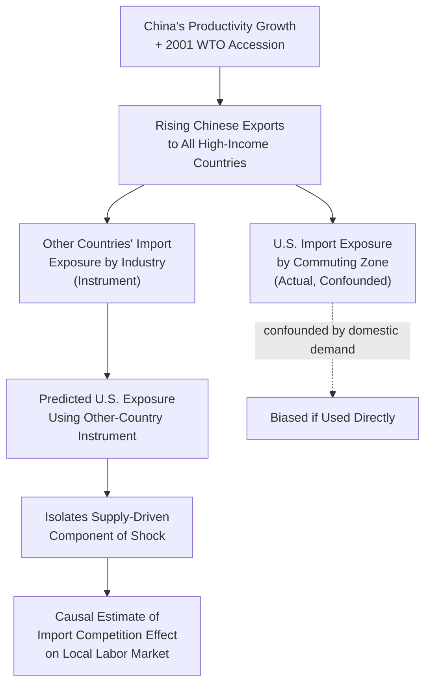

## Import Competition and Local Labor Markets

### Definition and Scope

Import competition and local labor markets is the subfield of labor and trade economics studying how increased penetration of foreign-produced goods into a domestic market affects employment, wages, and broader socioeconomic outcomes at the level of **geographically defined local labor markets** (commuting zones, metropolitan areas, or regions), rather than at the national aggregate level. This spatial-equilibrium approach emerged as a response to the observation that classical trade models, which predict smooth national-level factor reallocation, poorly describe the highly uneven, geographically concentrated realities of how trade shocks actually propagate through an economy.

### Why the Local Labor Market Matters

#### Limitations of the National Aggregate Approach

Traditional trade theory (Heckscher-Ohlin, specific-factors) predicts that a country's aggregate factor prices adjust to import competition, implicitly assuming labor and capital can costlessly reallocate across regions and industries within the country. This assumption implies that estimating trade's effect solely at the national level (e.g., aggregate manufacturing wage/employment trends) should be sufficient to capture trade's labor-market consequences.

The **local labor market approach** instead recognizes that:

- Industries are **geographically concentrated** (e.g., furniture manufacturing clustered in North Carolina, automotive in the Midwest), so a national industry-level shock translates into highly *uneven* regional shocks.
- Labor mobility across regions is empirically limited, especially for older, less-educated, or homeowner workers (due to housing lock-in, family ties, and job-search frictions), meaning displaced workers frequently do not relocate to more prosperous regions.
- Local economies exhibit **general equilibrium spillovers**: a manufacturing plant closure reduces local household income, which reduces demand for local retail, restaurants, and services, generating employment losses well beyond the directly affected industry (a local demand multiplier effect).

#### The Commuting Zone as Unit of Analysis

U.S.-focused empirical work (following Tolbert and Sizer's Commuting Zone definitions, widely adopted after Autor, Dorn & Hanson, 2013) typically defines the local labor market as a **commuting zone (CZ)**: a cluster of counties with strong internal commuting ties and weak commuting ties to adjacent clusters, intended to approximate a self-contained local labor market where most workers both live and work.

### The Canonical Empirical Design: Autor, Dorn, and Hanson (2013)

#### Import Exposure Measure

The central empirical innovation is a commuting-zone-level measure of exposure to import competition, constructed as:

$$\Delta IP_{uzt} = \sum_j \frac{L_{ijt_0}}{L_{it_0}} \times \frac{\Delta M_{ucjt}}{L_{ujt_0}}$$

where:

- $\frac{L_{ijt_0}}{L_{it_0}}$ is commuting zone $z$'s share of national industry $j$'s employment at baseline (capturing local industry specialization)
- $\frac{\Delta M_{ucjt}}{L_{ujt_0}}$ is the change in imports from China (country $c$) in industry $j$, normalized by U.S. industry employment (capturing the magnitude of the shock)

This measure captures how exposed a given commuting zone is to rising Chinese imports **based purely on its pre-existing industrial composition** — a region heavily specialized in furniture manufacturing at baseline will show high exposure if Chinese furniture imports surge nationally, regardless of anything specific to that region's own subsequent behavior.

#### Identification Strategy: Instrumental Variables

Because a region's own import exposure could be confounded by domestic demand shocks correlated with import growth (e.g., a U.S. recession simultaneously reducing domestic demand and coinciding with import share changes), the literature instruments for a commuting zone's exposure using the **contemporaneous import exposure of other high-income countries** (e.g., Australia, Japan, or several European countries) to the same Chinese industries. The logic: these countries' import growth from China reflects China's supply-side productivity growth and trade liberalization (common across all importers), but is plausibly uncorrelated with idiosyncratic U.S. regional demand shocks, isolating the supply-driven component of the shock.

### Key Empirical Findings

#### Employment and Wage Effects

- Commuting zones with higher exposure to Chinese import competition experienced significantly larger declines in manufacturing employment relative to less-exposed zones, with effects concentrated among workers directly employed in the exposed industries.
- These employment losses were **not fully offset** by employment gains in other local industries; overall commuting-zone employment-to-population ratios declined, contradicting the classical prediction of smooth intersectoral reallocation absorbing the shock.
- Wage effects were negative and persistent, particularly for non-college-educated workers in the most exposed regions, with effects lasting well over a decade in the original study's sample period.

#### Adjustment Frictions and Non-Employment Outcomes

- Displaced workers in high-exposure commuting zones showed **low rates of out-migration**: rather than relocating to less-exposed regions as classical models would predict, many remained in place, consistent with housing lock-in and other geographic mobility frictions well-documented in urban and labor economics.
- A significant share of displaced workers transitioned onto **disability insurance** and other transfer programs rather than into new employment, representing a permanent exit from the labor force rather than reallocation.
- Follow-up work (Autor, Dorn, Hanson & Majlesi, 2020, and related studies) linked commuting-zone trade exposure to **non-economic outcomes**: declining marriage rates, rising rates of children born to unmarried mothers, and — in the most severely affected areas — increases in "deaths of despair" (suicide, drug overdose, alcohol-related mortality), suggesting the local labor-market shock propagated into broader social and health outcomes.
- Politically, more historically exposed commuting zones have been found to exhibit measurably different shifts in voting patterns relative to less-exposed zones in subsequent elections, a finding widely cited in the political economy literature on trade and populism. [Unverified: the precise causal channel — economic anxiety versus other correlated regional factors — remains debated, and this finding is specific to the studied elections and should not be generalized as a universal law of trade-exposed voting behavior.]

#### General Equilibrium / Local Multiplier Effects

Beyond the directly affected manufacturing sector, high-exposure commuting zones experienced secondary employment declines in **non-tradable local services** (retail, restaurants, personal services) that depend on local household spending — consistent with a **local demand multiplier**: when manufacturing income falls, spending on locally-provided services falls too, amplifying the initial shock's local employment impact beyond the directly traded-goods sector.

### Theoretical Reconciliation: Why Classical Models Under-Predicted Persistence

The persistence and severity of local effects motivated theoretical refinements to reconcile the empirical findings with trade theory:

- **Dynamic/spatial trade models** (e.g., Caliendo, Dvorkin & Parro, 2019) extend the Eaton-Kortum trade framework with costly labor and capital mobility across regions and sectors, explicit dynamics, and input-output linkages, allowing the model to generate the kind of slow, incomplete adjustment observed empirically, rather than assuming instantaneous reallocation.
- These models allow for **welfare heterogeneity**: while trade may still generate positive *aggregate national* welfare gains (through lower consumer prices and efficiency gains), the *regional distribution* of those gains and losses can be highly unequal and can leave specific commuting zones as long-run net losers even when the nation as a whole gains — a result invisible in models without a spatial dimension.
- [Inference] This reconciliation is generally interpreted as showing that the *national aggregate* welfare-gains conclusion of classical trade theory need not be wrong, but that it is an incomplete description of trade's consequences on its own, since it can coexist with substantial, concentrated, long-lasting harm to specific places and populations — a distinction increasingly treated as essential for trade policy analysis rather than merely of academic interest.

### Policy Relevance

- **Trade Adjustment Assistance (TAA)** and other displaced-worker programs are the direct policy response motivated by these findings, though evaluations of TAA's effectiveness at reversing local labor market decline have generally found modest effects relative to the scale of documented harm, suggesting a gap between the severity of the local shock and the scale of existing adjustment policy.
- The local labor market findings have informed broader **place-based policy** debates (as opposed to purely person-based transfer policy), including proposals for regional investment tax credits, infrastructure spending targeted at high-exposure areas, and relocation-assistance programs aimed at reducing geographic mobility frictions directly.
- These findings are frequently cited in policy debates over trade agreement design and tariff policy, though economists differ on the appropriate policy response — ranging from stronger domestic adjustment assistance while maintaining open trade, to more protectionist measures aimed at preventing similar future shocks. [Note: this is a genuinely contested normative/policy question among economists, distinct from the largely uncontested empirical finding of persistent local harm itself.]

### Key Points

- The local labor market approach shifts trade-labor analysis from national aggregates to geographically defined regions (commuting zones), motivated by industry geographic concentration and limited worker mobility.
- The **Autor-Dorn-Hanson (2013)** research design uses commuting-zone-level industry composition combined with an other-country instrument to isolate the causal effect of Chinese import competition on U.S. local labor markets.
- Key findings show persistent employment and wage declines, low geographic mobility/out-migration among displaced workers, increased reliance on disability insurance, and significant local demand multiplier effects on non-tradable services.
- Follow-up work links local trade exposure to social outcomes (marriage rates, mortality) and political outcomes (voting behavior shifts), broadening the scope of the literature beyond narrow labor market metrics.
- Dynamic spatial trade models have been developed to theoretically reconcile these findings with the classical result that trade can still generate positive national aggregate welfare gains despite substantial concentrated regional harm.

### Example

Consider two hypothetical U.S. commuting zones in the early 2000s: Zone A, specialized in furniture manufacturing (high exposure to rising Chinese furniture imports), and Zone B, specialized in higher-education and healthcare services (low exposure to Chinese import competition, given the non-tradable nature of these services).

- **Direct effect**: Zone A's furniture plants face intensifying price competition from Chinese imports, leading to plant closures and direct job losses among furniture-manufacturing workers, while Zone B experiences no comparable direct shock.
- **Classical prediction**: Displaced Zone A workers should relocate to Zone B (or another growing region) or transition into different local industries, restoring near-full employment in Zone A within a few years.
- **Observed pattern**: A large share of displaced Zone A workers remain in Zone A (limited out-migration, consistent with housing lock-in), local retail and service employment in Zone A also decline (demand multiplier effect as furniture-worker household income falls), and a nontrivial share of displaced workers transition onto disability insurance rather than into new employment — producing a persistent, multi-year regional employment and income gap between Zone A and Zone B that classical reallocation assumptions do not predict.

### Related Topics

- Autor, Dorn, and Hanson's China shock research design and instrumental variable strategy
- Commuting zones and the geography of local labor markets
- Trade Adjustment Assistance and place-based versus person-based policy
- Deaths of despair and the social consequences of regional economic decline
- Dynamic spatial general equilibrium trade models (Caliendo-Dvorkin-Parro)
- Housing lock-in and geographic labor mobility frictions
- Local fiscal multipliers and regional demand spillovers
- Political economy of trade exposure and voting behavior
- Offshoring and its interaction with import competition
- Stolper-Samuelson theorem and factor-price predictions versus empirical local effects