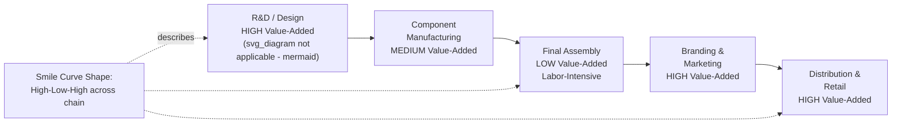

## Global Value Chains and Wages

### Definition and Scope

A global value chain (GVC) refers to the full range of activities — design, production of inputs, assembly, marketing, distribution, and after-sales service — involved in bringing a product or service from conception to end use, where these stages are geographically fragmented across multiple countries rather than performed within a single national economy. The study of GVCs and wages examines how this fragmentation of production affects wage levels, wage inequality, and wage-setting dynamics for workers at different positions along the chain, in both advanced and developing economies. This is a distinct analytical lens from classical trade theory (which treats countries as trading finished goods) and from simple offshoring analysis (which typically considers a single firm relocating a single task); GVC analysis instead treats production itself as an internationally distributed network with its own internal wage structure.

### Conceptual Foundations

#### From Goods Trade to Trade in Value-Added

Classical trade statistics record **gross trade flows**: the total value of a good crossing a border, including all imported intermediate inputs embedded in it. This substantially overstates the domestic value added by the exporting country when production is fragmented. GVC analysis instead uses **trade in value-added (TiVA)** accounting, which decomposes gross exports into the value actually contributed by each country in the chain.

$$\text{Gross Exports} = \text{Domestic Value Added} + \text{Foreign Value Added (embedded imports)}$$

This distinction matters for wage analysis because a country's *measured* export success (gross export value) can substantially overstate the domestic labor income actually generated, if a large share of that export value merely passes through re-exported foreign inputs (a phenomenon prominently illustrated by "Factory Asia" electronics assembly, where a country's export statistics can appear large while retaining only a thin slice of value-added, and therefore wage income, domestically).

#### The Smile Curve

A widely used (though stylized, and empirically debated in its precise shape) heuristic in GVC economics is the **"smile curve"**: plotting value-added captured per stage of a product's value chain (research & design, component manufacturing, final assembly, branding & marketing, distribution & retail) typically shows high value-added at the pre-production (R&D, design) and post-production (branding, marketing, retail) ends of the chain, with a trough of low value-added at the middle assembly/manufacturing stage.

**Wage implication**: Because value-added and wages are closely linked at the task level (higher value-added activities generally command higher wages, reflecting higher skill requirements and firm/task-level bargaining position), the smile curve implies that workers performing assembly-stage tasks — disproportionately located in developing-country "factory" economies (China, Vietnam, Bangladesh, Mexico) — tend to capture a comparatively small share of a final product's total value, and correspondingly a smaller share of the wage income generated across the entire chain, relative to workers in design and branding functions concentrated in lead-firm headquarters countries.

### GVC Governance and Wage-Setting Power

#### Lead Firms and Bargaining Position

GVCs are typically organized around **lead firms** (often headquartered in advanced economies) that coordinate and govern the chain — setting product specifications, quality standards, and, critically, exerting substantial bargaining power over the prices paid to their (often geographically distant, and often in developing countries) supplier firms. This governance structure has direct wage implications:

- Lead firms can exert downward pressure on the prices paid to suppliers, which suppliers often pass through, at least partially, to their workforce in the form of lower wages, longer hours, or weaker labor standards — a dynamic central to critiques of GVCs from labor-standards and development economics perspectives.
- **Supplier squeeze dynamics**: Because suppliers in labor-intensive assembly stages often compete against many other potential suppliers (a highly competitive, low-differentiation segment of the smile curve), and because switching costs for lead firms are often lower than switching costs for suppliers (who may have made supplier-specific investments), bargaining power in GVC relationships is frequently asymmetric in favor of the lead firm — a mechanism analyzed in the GVC governance literature (Gereffi, Humphrey & Sturgeon, 2005) as a determinant of how gains from trade are distributed along the chain.

#### Upgrading and Wage Growth for Developing-Country Participants

The GVC development literature also studies **economic upgrading**: the process by which a developing-country supplier moves from low-value-added assembly tasks toward higher-value-added activities (component design, branding, direct retail relationships), which is generally associated with rising wages for the domestic workforce as the country's participation shifts along the smile curve.

- **Process upgrading**: Improving production efficiency within the same task (does not necessarily raise wages proportionally, since gains may be captured by the lead firm through lower negotiated prices).
- **Product upgrading**: Moving to higher-value products within the same function.
- **Functional upgrading**: Moving to a different, higher-value-added function within the chain (e.g., from assembly to component design) — this is generally the upgrading path most directly associated with sustained wage growth, since it changes the worker's/firm's position on the smile curve itself.
- **Inter-chain upgrading**: Using competencies gained in one chain to enter a different, higher-value chain.

[Inference] The empirical GVC-upgrading literature broadly finds that countries and firms achieving functional upgrading (e.g., South Korea and Taiwan's historical move from apparel/electronics assembly toward component design and, eventually, own-brand manufacturing) experienced substantially faster wage growth than countries that remained concentrated in low-value assembly tasks over multi-decade horizons, though isolating GVC participation *specifically* as the causal driver of wage growth (as opposed to concurrent domestic education investment, macroeconomic policy, and institutional development) is methodologically difficult and the subject of ongoing research rather than settled consensus.

### GVC Participation and Wage Effects: Advanced Economies

#### Fragmentation and Domestic Wage Structure

For advanced-economy workers, GVC integration has effects that echo both the offshoring and automation literatures already covered:

- Workers in **GVC-exposed occupations** (i.e., occupations whose tasks are candidates for relocation to lower-wage GVC participants) tend to experience wage and employment pressure similar to the offshoring "relative-labor-supply effect," while workers in complementary, non-relocatable functions (design, marketing, high-skill engineering, management coordinating the chain) tend to benefit from the "productivity effect" of lower-cost global sourcing.
- **GVC participation intensity measures** (e.g., the share of a country's or industry's gross exports accounted for by foreign value-added, or backward GVC participation) are used empirically to relate the *degree* of fragmentation to domestic wage-inequality outcomes, generally finding that deeper GVC integration is associated with wage polarization patterns structurally similar to those documented in the offshoring and automation literatures.

#### Volatility and Wage Risk

A distinct wage-relevant consequence of GVC integration, separate from the level or distribution of wages, is increased **earnings volatility**: workers and firms embedded in long, complex GVCs are exposed to shocks originating anywhere along the chain (a natural disaster disrupting a supplier in one country, a demand shock in the lead firm's home market, a geopolitical disruption to a shipping route), which can propagate through the chain and generate employment and hours volatility for workers far removed from the shock's origin. This has become a prominent research and policy concern following high-profile GVC disruptions (e.g., COVID-19-era supply chain disruptions), which exposed the extent to which local wage and employment stability had become linked to conditions in geographically distant, functionally unrelated parts of the global economy.

### Labor Standards, Compliance, and Wages in GVCs

A substantial applied literature examines whether **private governance mechanisms** — corporate codes of conduct, third-party factory audits, and buyer-driven labor standards programs — imposed by lead firms on their GVC suppliers succeed in raising supplier-level wages and working conditions.

- Evidence on the wage effectiveness of private compliance programs is decidedly mixed: some studies find measurable improvements in safety and compliance with legally mandated minimum wages following audit programs, while others find limited or no effect on wages *above* legal minimums, and persistent evidence of audit gaming, sub-supplier non-compliance ("shadow" subcontracting to unaudited facilities), and enforcement gaps. [Unverified: the magnitude and persistence of private-governance wage effects vary substantially by country, sector, and specific program design, and should not be generalized from any single study to GVC labor standards programs as a whole.]
- This literature has motivated interest in complementary approaches such as binding international framework agreements, strengthened domestic labor law enforcement in supplier countries, and worker-voice mechanisms, as alternatives or complements to purely buyer-driven private compliance.

### Measurement Tools

- **OECD TiVA (Trade in Value Added) database**: The primary cross-country data source for decomposing gross trade flows into value-added components, widely used to construct GVC participation indices.
- **World Input-Output Database (WIOD)**: Provides internationally harmonized input-output tables used to trace value-added and, by extension, implicit labor income flows through global production networks.
- **GVC participation indices**: Typically decomposed into "backward participation" (foreign value-added embodied in a country's exports) and "forward participation" (a country's domestic value-added embodied in other countries' exports), used to characterize a country's or sector's position and depth of integration in global chains.

### Key Points

- GVC analysis studies wages within internationally fragmented production networks, requiring value-added (not gross trade) accounting to correctly attribute domestic labor income.
- The **smile curve** heuristic captures the general (though debated in precise shape) pattern that assembly-stage tasks, concentrated in developing-country "factory" economies, tend to capture lower value-added and correspondingly lower wage shares than design, branding, and marketing functions.
- **Lead-firm governance power** in GVCs creates asymmetric bargaining dynamics that can transmit downward price pressure into lower supplier wages, a central concern in the GVC labor-standards literature.
- **Economic upgrading** — particularly functional upgrading to higher-value-added activities — is the primary mechanism by which developing-country GVC participants achieve sustained wage growth, though causal attribution is methodologically challenging.
- Advanced-economy GVC integration echoes offshoring/automation wage-polarization patterns and introduces additional wage-relevant **earnings volatility** from shocks propagating through geographically dispersed chains.
- Private labor-standards compliance programs imposed by lead firms show mixed and context-dependent effectiveness at raising supplier-country wages.

### Example

Consider the global smartphone value chain, spanning chip design (United States), component manufacturing (South Korea, Japan, Taiwan), final assembly (China or Vietnam), and branding/retail (United States).

- **Value-added and wage distribution**: Chip designers and brand/marketing employees in the U.S. capture high value-added per worker and correspondingly high wages, consistent with the smile curve's high points; assembly-line workers in the Vietnamese or Chinese final-assembly factory capture comparatively low value-added per worker and lower wages, consistent with the curve's trough.
- **Governance dynamics**: The U.S. lead brand firm sets stringent price and delivery terms with its assembly-stage supplier, which — facing competition from other potential assembly suppliers — has limited bargaining power to negotiate higher per-unit prices, constraining its capacity to raise assembly-worker wages without eroding its margin.
- **Upgrading pathway**: Over a multi-decade horizon, if the assembly-stage supplier country successfully moves toward domestic component design and eventually its own-brand products (functional upgrading, as historically occurred in South Korea's electronics sector), average wages in that country's electronics workforce rise substantially, reflecting the shift toward the smile curve's higher-value segments.
- **Volatility exposure**: A semiconductor shortage originating from a natural disaster affecting a Taiwanese chip fabrication plant can disrupt assembly-line hours and pay in Vietnam and marketing/sales staffing decisions in the U.S. simultaneously, illustrating GVC-linked wage and hours volatility propagating across otherwise unrelated national labor markets.

### Related Topics

- Trade-in-value-added (TiVA) accounting and gross versus value-added trade measurement
- Smile curve dynamics and value-added distribution across production stages
- Economic upgrading (process, product, functional, inter-chain) in developing economies
- GVC governance typologies (Gereffi, Humphrey & Sturgeon)
- Private labor standards, factory audits, and buyer-driven compliance programs
- Offshoring and the Grossman-Rossi-Hansberg trade-in-tasks model
- Supply chain disruption and cross-border wage/employment volatility
- Foreign direct investment and multinational production networks
- Development economics and export-led industrialization strategies
- Comparative advantage dynamics in fragmented global production