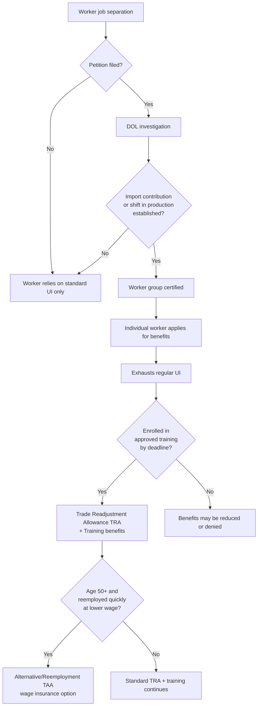

## Trade Adjustment Assistance

### Definition and Scope

Trade Adjustment Assistance (TAA) is a federal program designed to provide compensation, retraining, and re-employment services to workers, firms, farmers, and communities that suffer job losses or economic harm as a direct result of increased import competition or the shifting of production to foreign countries. TAA operates on the economic rationale that trade liberalization generates aggregate welfare gains for a country, but the distribution of those gains is uneven: consumers and import-competing industries' downstream users benefit broadly, while workers and firms in import-competing sectors bear concentrated losses. TAA is a form of compensatory redistribution intended to offset the losses of a small, identifiable group so that the broader efficiency gains from trade can proceed with less political resistance.

The program in the United States traces back to the Trade Expansion Act of 1962 and was substantially restructured under the Trade Act of 1974. It has been reauthorized, expanded, and allowed to lapse multiple times, most notably expiring on July 1, 2021, after Congress did not renew it. [Unverified: subsequent legislative action may have altered this status; program rules should be verified against current Department of Labor guidance.]

### Theoretical Foundation: The Compensation Principle

TAA is grounded in the Kaldor-Hicks compensation criterion. A policy change (trade liberalization) is judged welfare-improving if the winners could, in principle, compensate the losers and still remain better off — even if that compensation does not actually occur.

$$\text{Net Welfare Gain} = \Delta CS + \Delta PS_{exporters} - \Delta PS_{import\text{-}competing}$$

Where $\Delta CS$ is the change in consumer surplus, and the two $\Delta PS$ terms represent producer surplus changes in exporting versus import-competing sectors. Standard trade theory (Stolper-Samuelson, specific-factors models) predicts that owners of factors intensive in the import-competing sector suffer real income losses even as national income rises. TAA is a policy instrument that attempts to convert the *potential* Pareto improvement implied by the compensation principle into something closer to an *actual* Pareto improvement, by taxing the diffuse winners (via general revenue) to fund transfers to the concentrated losers.

This distinguishes TAA conceptually from generic unemployment insurance (UI): UI is triggered by job separation for any cause, while TAA is triggered specifically by a documented causal link between the job loss and import competition or offshoring, making it a "trade-contingent" safety net.

### Program Structure and Components

TAA in the U.S. historically consisted of several parallel tracks:

- **TAA for Workers**: The core program, offering income support, training, job search allowances, relocation allowances, and healthcare tax credits to individually certified workers.
- **TAA for Firms**: Cost-shared technical assistance to trade-affected businesses to help them develop and implement adjustment strategies (diversification, productivity improvement, market repositioning).
- **TAA for Farmers**: Cash benefits and technical assistance to agricultural producers facing import-induced price declines.
- **TAA for Communities** (added in later reauthorizations): Grants to regions with concentrated trade-related job losses to support economic diversification.

**Worker-level benefit components** typically include:

1. **Trade Readjustment Allowances (TRA)**: Income support paid after regular UI benefits are exhausted, conditional on enrollment in an approved training program.
2. **Training benefits**: Tuition and related costs for occupational retraining, often capped at a fixed dollar amount and duration.
3. **Job Search Allowances**: Reimbursement for costs of searching for work outside the worker's normal commuting area.
4. **Relocation Allowances**: Lump-sum and moving-cost reimbursement for workers who secure employment outside the local labor market.
5. **Health Coverage Tax Credit (HCTC)**: A subsidy (historically covering a substantial share of premiums) for maintaining health insurance during the transition.
6. **Wage Insurance / Alternative TAA (ATAA) / Reemployment TAA (RTAA)**: For workers over 50, a supplement covering a portion of the wage gap between the old and new job, capped annually, available in lieu of TRA for those who reemploy quickly at lower pay.

### Certification and Eligibility Mechanics

Eligibility is not automatic; it requires a formal **petition and certification process**:

1. A group of three or more workers, a company official, a union, or a state workforce agency files a petition with the Department of Labor (DOL).
2. DOL's Office of Trade Adjustment Assistance investigates whether the job losses satisfy statutory criteria — typically requiring a showing that:
   - A significant number or proportion of the workers in the firm (or subdivision) were separated or face threat of separation, **and**
   - Increased imports of articles "like or directly competitive" with those produced by the firm contributed importantly to the separations, **or**
   - The firm shifted production of the article to a foreign country, **or**
   - The firm is a supplier or downstream producer to a firm already certified.
3. If certified, **all** workers in the covered worker group become eligible to apply for individual benefits — certification is at the firm/worker-group level, not the individual level.

This creates a two-stage eligibility filter: macro-level certification (is this industry/firm trade-impacted?) followed by micro-level individual benefit application (did this specific worker separate from the certified employment and meet program requirements, such as enrolling in training by a deadline?).

### Formal Model: TAA as Insurance Against a Trade Shock

Consider a worker whose expected utility without TAA, facing probability $p$ of trade-induced job loss, is:

$$EU_{no-TAA} = (1-p)\,U(w) + p\,U(w_{UI})$$

Where $w$ is the current wage and $w_{UI} < w$ is UI-replacement income. With TAA providing extended income support $w_{TRA}$ and a training-augmented reemployment wage $w'$ (where $w' > w_{UI}$ due to human capital investment), expected utility becomes:

$$EU_{TAA} = (1-p)\,U(w) + p\left[\theta\,U(w_{TRA}) + (1-\theta)\,U(w')\right]$$

where $\theta$ is the share of the adjustment period spent under income support versus reemployed post-training. TAA is welfare-improving for risk-averse workers if:

$$EU_{TAA} - EU_{no-TAA} > \text{Program Cost (tax incidence borne by worker)}$$

This framing highlights TAA's dual function: **consumption smoothing** (like UI) and **human capital re-investment** (unlike standard UI, which has weaker training linkages in most U.S. states).

### Empirical Evidence on Program Effectiveness

Research on TAA effectiveness is mixed and represents a canonical case study in active labor market policy (ALMP) evaluation:

- **Reemployment and earnings**: Multiple DOL-commissioned evaluations (e.g., the Mathematica Policy Research studies of the mid-2000s to 2010s) found that TAA participants, particularly those in training, often had *lower* short-run earnings than comparison groups (due to foregone earnings while in training and time out of the labor force), but the earnings gap narrowed or reversed over longer horizons (3+ years).
- **Training take-up and quality**: A persistent finding is that many TAA-eligible workers do not complete or fully utilize training benefits, and training program quality varies substantially, affecting return on investment.
- **Targeting concerns**: Because certification depends on establishing "import contribution," workers in industries facing decline for other reasons (automation, domestic demand shifts) may be excluded even though their labor market experience is observationally similar to trade-displaced workers — a critique raised prominently by labor economists studying the "China shock" literature (Autor, Dorn, and Hanson).
- **Interaction with the China Shock literature**: Research on the post-2001 surge in Chinese import competition (following China's WTO accession) found that TAA caseloads and local labor market adjustment costs were large relative to program capacity, and that the pace of TAA certification lagged the pace of job displacement, raising questions about whether the program's scale matched the shock's magnitude. [Inference: the precise elasticity of TAA caseload response to import penetration varies by study specification and time period.]

### Comparative and International Context

Analogous programs exist across OECD countries, though architecture varies:

| Country/Region | Approach | Key Distinction from U.S. TAA |
| --- | --- | --- |
| European Union | European Globalisation Adjustment Fund (EGF) | Co-financed with member states; broader triggers including "unforeseen major restructuring events," not solely trade |
| Canada | Employment Insurance (EI) + sector-specific programs | No dedicated trade-contingency requirement; relies more on general ALMP |
| Denmark | "Flexicurity" model | High general UI generosity plus mandatory activation/retraining, reducing need for a trade-specific carve-out |

[Inference] The relative absence of a trade-specific eligibility gate in flexicurity-style systems suggests these systems substitute broad-based labor market security for narrowly targeted compensation — a design choice with different political-economy implications (less need to "prove" trade causation, but higher aggregate fiscal cost).

### Political Economy Rationale

TAA plays a strategic role beyond direct worker welfare: it functions as a **side payment mechanism** that reduces protectionist political pressure and can be understood through median-voter and interest-group models of trade policy formation.

- **Median voter framing**: If displaced workers are geographically concentrated (as in manufacturing-dependent regions), their political voice in favor of tariffs or trade restrictions is amplified. TAA is a lower-deadweight-loss substitute for protection, since tariffs generate their own distortions (Harberger triangles) whereas direct transfers, in the simplest models, do not distort the trade decision itself.
- **Legislative bundling**: TAA has historically been passed or reauthorized alongside trade liberalization bills (e.g., NAFTA implementation, Trade Promotion Authority renewals) as a deliberate political bargain to secure votes from legislators representing import-competing constituencies.

### Diagram: TAA Certification and Benefit Flow

### Illustration: Welfare Effects of Trade with and without Compensation (svg_diagram)

<svg xmlns="http://www.w3.org/2000/svg" viewBox="0 0 640 380">
<text x="320" y="24" text-anchor="middle" font-size="15" font-weight="bold" fill="#1a1a1a">Distribution of Trade Gains: With vs Without TAA (svg_diagram)</text>

<line x1="70" y1="330" x2="590" y2="330" stroke="#333" stroke-width="1.5" />
<line x1="70" y1="330" x2="70" y2="50" stroke="#333" stroke-width="1.5" />
<text x="330" y="360" text-anchor="middle" font-size="12" fill="#333">Economic Agent Group</text>
<text x="30" y="190" text-anchor="middle" font-size="12" fill="#333" transform="rotate(-90 30 190)">Net Welfare Change</text>

<line x1="70" y1="230" x2="590" y2="230" stroke="#999" stroke-width="1" stroke-dasharray="4,4" />
<text x="60" y="234" text-anchor="end" font-size="10" fill="#666">0</text>

<rect x="110" y="90" width="60" height="140" fill="#2b7a78" opacity="0.85" />
<text x="140" y="80" text-anchor="middle" font-size="11" fill="#1a1a1a">Consumers</text>
<text x="140" y="245" text-anchor="middle" font-size="10" fill="#1a1a1a">+large</text>

<rect x="200" y="150" width="60" height="80" fill="#3aafa9" opacity="0.85" />
<text x="230" y="140" text-anchor="middle" font-size="11" fill="#1a1a1a">Exporters</text>
<text x="230" y="245" text-anchor="middle" font-size="10" fill="#1a1a1a">+moderate</text>

<rect x="300" y="230" width="60" height="90" fill="#d64550" opacity="0.85" />
<text x="330" y="223" text-anchor="middle" font-size="10" fill="#1a1a1a">Displaced workers</text>
<text x="330" y="335" text-anchor="middle" font-size="10" fill="#1a1a1a">(no TAA)</text>
<text x="330" y="347" text-anchor="middle" font-size="9" fill="#1a1a1a">large loss</text>

<rect x="390" y="230" width="60" height="35" fill="#f2a541" opacity="0.9" />
<text x="420" y="223" text-anchor="middle" font-size="10" fill="#1a1a1a">Displaced workers</text>
<text x="420" y="280" text-anchor="middle" font-size="10" fill="#1a1a1a">(with TAA)</text>
<text x="420" y="292" text-anchor="middle" font-size="9" fill="#1a1a1a">partial offset</text>

<rect x="480" y="70" width="60" height="160" fill="#264653" opacity="0.85" />
<text x="510" y="60" text-anchor="middle" font-size="11" fill="#1a1a1a">National Net</text>
<text x="510" y="245" text-anchor="middle" font-size="10" fill="#1a1a1a">+net gain</text>

<text x="330" y="365" text-anchor="middle" font-size="9" fill="#555">TAA narrows the loss borne by concentrated losers without eliminating aggregate gains</text>

</svg>

### Common Critiques and Limitations

1. **Causation requirement is administratively difficult**: Distinguishing job loss "caused by" trade from job loss caused by automation, domestic demand shifts, or general business cycle downturns is econometrically and legally contestable, producing horizontal inequity (similarly situated workers treated differently based on the source of displacement).
2. **Delay between shock and certification**: The petition-investigation-certification pipeline introduces lags, during which workers may exhaust standard UI without yet qualifying for TRA.
3. **Training benefit underutilization and mismatch**: Training slots may not align with regional labor demand, and completion rates are often low, particularly for older or lower-skilled workers.
4. **Program lapses create policy uncertainty**: Since TAA requires periodic reauthorization (unlike UI, which is a permanent program), gaps in authorization (such as the 2021 lapse) create discontinuities in worker protection.
5. **Scale relative to shock size**: Studies of large trade shocks (e.g., the 2000s China import surge) suggest TAA caseloads and funding levels were not commensurate with the scale of regional labor market disruption.

### Key Points

- TAA is a trade-contingent, compensatory ALMP grounded in the Kaldor-Hicks compensation principle.
- Eligibility requires two-stage certification: group/firm-level trade-causation certification, then individual benefit application.
- Core worker benefits: TRA (extended income support), training, job search/relocation allowances, HCTC, and wage insurance (RTAA) for older workers.
- Empirical evidence on earnings effects is mixed, with short-run earnings losses during training but ambiguous to positive long-run effects.
- The program is politically significant as a vote-buying/side-payment mechanism to reduce protectionist pressure and sustain trade liberalization coalitions.
- Persistent critiques center on causal attribution difficulty, benefit lag, training mismatch, and programmatic scale relative to shock magnitude.

**Related Topics**

- Stolper-Samuelson theorem and factor-price effects of trade
- The "China Shock" literature (Autor, Dorn, Hanson) and local labor market adjustment
- Active Labor Market Policies (ALMPs) and training program evaluation methods
- Unemployment insurance design and optimal UI theory
- European Globalisation Adjustment Fund (EGF) comparative case study
- Political economy of trade policy: median voter and interest-group (protection-for-sale) models
- Wage insurance design and the RTAA program mechanics
- Regional economic diversification grants and place-based policy