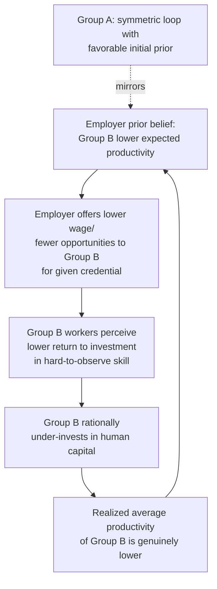

## Statistical Discrimination

### Definition and Origin

Statistical discrimination is a theory of labor market discrimination developed independently by Kenneth Arrow (1973) and Edmund Phelps (1972). Unlike Becker's taste-based theory, statistical discrimination does not require any prejudice, animus, or subjective disutility toward a group. Instead, it arises as a **rational, profit-maximizing response to imperfect and costly information** about individual worker productivity. Employers, unable to perfectly observe an individual applicant's true productivity, use observable group membership (race, sex, age, etc.) as a proxy or signal for unobserved characteristics, because group averages are believed to be informative about individual expectations under uncertainty.

This makes statistical discrimination a fundamentally different theoretical object from taste-based discrimination: it is discrimination that can persist in a perfectly competitive market populated entirely by rational, non-prejudiced profit-maximizers, since it generates no self-imposed cost to the discriminator that competition could erode.

### Core Mechanism: Screening Under Uncertainty

**Setup**: An employer observes an imperfect signal $s$ of a worker's true productivity $q$, along with the worker's group membership $g \in \{A, B\}$. The employer forms an expectation of productivity conditional on both the signal and group:

$$E[q \mid s, g]$$

If the **signal-productivity relationship differs by group** — either because the signal is a noisier predictor for one group (differential signal reliability) or because the underlying group-conditional productivity distributions differ (differential group means) — then a rational, non-prejudiced employer will optimally weight the signal differently by group, or set different hiring/wage thresholds by group, even absent any taste for discrimination.

Formally, under a Bayesian updating framework, if the prior distribution of productivity for group $A$ is $f_A(q)$ and for group $B$ is $f_B(q)$, and the signal $s$ has group-specific noise variance $\sigma_A^2 \neq \sigma_B^2$, then:

$$E[q \mid s, g=A] \neq E[q \mid s, g=B] \quad \text{even when } s \text{ is identical}$$

This produces group-differentiated hiring and wage outcomes purely as an artifact of differential information precision or differential prior beliefs, not preference.

### Phelps (1972) Model: Group Variance in Signal Noise

Phelps's original formulation emphasizes that if the employer's screening test (interview performance, credential, test score) is a **less reliable predictor of true productivity** for group $B$ than for group $A$ — for instance, because historical data used to validate the test was disproportionately drawn from group $A$, or because group $B$ candidates have less standardized signal-generating institutions (e.g., unfamiliar credentialing systems) — then under Bayesian shrinkage, the employer optimally regresses group $B$ signals more heavily toward the group $B$ mean.

If group $B$'s prior mean productivity is perceived as lower, this shrinkage systematically penalizes **high-ability group $B$ workers** more than high-ability group $A$ workers, because their individual signal is discounted more heavily toward a lower group average. This is a key micro-mechanism: statistical discrimination does not merely discriminate against the group on average — it disproportionately harms the most qualified members of the disadvantaged group, since their true ability is least well captured by a group-mean-anchored assessment.

### Arrow (1973) Model: Group Differences in Perceived Mean Productivity

Arrow's variant focuses on differences in the **believed mean** of the productivity distribution across groups, independent of signal noise:

$$\mu_A \neq \mu_B \quad (\text{perceived, not necessarily actual})$$

If employers hold beliefs (accurate or not) that $\mu_B < \mu_A$, they will set a higher hiring bar or offer lower expected wages to group $B$ applicants with identical observable credentials, since the observable credential is combined with the (lower) group prior to produce a lower posterior productivity estimate for group $B$.

### Self-Fulfilling Prophecy / Multiple Equilibria

A critical extension of statistical discrimination theory shows that beliefs about group productivity can become **self-fulfilling**, generating multiple stable equilibria even when the two groups are ex ante identical in their true productivity distributions. This result is central to the theory's normative significance, because it implies statistical discrimination can be inefficient and non-benign despite requiring no prejudice.

**Mechanism**:

1. Employers believe group $B$ has lower average productivity/returns to investment (e.g., in education or training).
2. Because of this belief, employers offer group $B$ workers lower wages or fewer promotion/training opportunities for a given observable credential.
3. Anticipating lower returns to investment (since the market will not fully reward it), group $B$ workers rationally invest less in costly, hard-to-observe human capital (e.g., unmeasured effort, informal skill acquisition) than group $A$ workers.
4. Group $B$'s realized average productivity ends up genuinely lower — **confirming** the employer's original (arbitrary) prior belief.

$$\text{Belief} \to \text{Differential Treatment} \to \text{Differential Investment Incentive} \to \text{Realized Outcome Confirms Belief}$$

This generates **two stable equilibria** from identical underlying populations: a "high" equilibrium (group treated as high-productivity, invests heavily, confirms belief) and a "low" equilibrium (group treated as low-productivity, under-invests, confirms belief) — with the assignment of groups to equilibria being essentially arbitrary or historically contingent (path-dependent), not grounded in any true underlying difference.

### Diagram: Self-Fulfilling Statistical Discrimination Loop

### Illustration: Bayesian Signal Shrinkage by Group (svg_diagram)

<svg xmlns="http://www.w3.org/2000/svg" viewBox="0 0 640 380">
<text x="320" y="24" text-anchor="middle" font-size="15" font-weight="bold" fill="#1a1a1a">Statistical Discrimination: Differential Signal Shrinkage (svg_diagram)</text>
<line x1="80" y1="320" x2="580" y2="320" stroke="#333" stroke-width="1.5" />
<line x1="80" y1="320" x2="80" y2="50" stroke="#333" stroke-width="1.5" />
<text x="330" y="350" text-anchor="middle" font-size="12" fill="#333">Individual signal s (test score / credential)</text>
<text x="35" y="185" text-anchor="middle" font-size="12" fill="#333" transform="rotate(-90 35 185)">Employer posterior E[q|s,g]</text>

<line x1="80" y1="320" x2="560" y2="70" stroke="#999" stroke-width="1.5" stroke-dasharray="5,4" />
<text x="565" y="66" font-size="10" fill="#666">45° (no shrinkage, perfect signal)</text>

<path d="M 80 300 Q 300 200 560 100" fill="none" stroke="#2b7a78" stroke-width="2.5" />
<text x="440" y="130" font-size="11" fill="#2b7a78">Group A posterior (low signal noise → mild shrinkage)</text>

<path d="M 80 300 Q 300 270 560 220" fill="none" stroke="#d64550" stroke-width="2.5" />
<text x="420" y="245" font-size="11" fill="#d64550">Group B posterior (high signal noise → heavy shrinkage toward lower group mean)</text>

<line x1="420" y1="320" x2="420" y2="50" stroke="#264653" stroke-width="1" stroke-dasharray="3,3" />
<text x="425" y="65" font-size="9" fill="#264653">Identical signal s*</text>
<circle cx="420" cy="152" r="4" fill="#2b7a78" />
<circle cx="420" cy="238" r="4" fill="#d64550" />
<line x1="425" y1="152" x2="425" y2="238" stroke="#000" stroke-width="1" />
<text x="435" y="198" font-size="9" fill="#000">gap despite identical s</text>

<text x="330" y="365" text-anchor="middle" font-size="9" fill="#555">High-ability Group B applicants are penalized most, since their true signal is most heavily discounted toward the group mean</text>

</svg>

### Statistical vs. Taste-Based Discrimination: Comparative Framework

| Dimension | Taste-Based (Becker) | Statistical (Arrow/Phelps) |
| --- | --- | --- |
| Underlying cause | Subjective prejudice/disutility | Imperfect information + rational inference |
| Requires animus? | Yes | No |
| Persists under perfect competition? | Predicted to erode | Can persist indefinitely — no self-imposed cost to discriminator |
| Welfare implication for discriminator | Discriminator sacrifices profit | Discriminator behaves optimally, no profit sacrifice |
| Effect on most-qualified minority members | Uniform penalty by group | Disproportionately penalizes high-ability individuals via signal shrinkage |
| Policy remedy implication | Reduce prejudice / raise cost of discriminating | Improve signal quality / reduce information asymmetry |
| Equilibrium structure | Single equilibrium (wage gap set by $d_E$) | Potentially multiple, self-fulfilling equilibria |

### Policy Implications

The statistical discrimination framework generates policy prescriptions distinct from those implied by taste-based theory, since the underlying market failure is informational rather than preference-based:

1. **Improving signal quality**: Standardizing credentials, providing better/more uniform information about individual productivity (e.g., portable performance records, standardized testing validated across groups) can reduce the incentive to rely on group averages.
2. **Banning group-based statistical use directly**: Anti-discrimination law (e.g., disparate treatment doctrine) generally prohibits employers from using group membership as a proxy even when statistically "rational," treating this as a legal rather than purely economic determination.
3. **Affirmative action as equilibrium-selection policy**: Because self-fulfilling equilibria are path-dependent, temporary interventions (e.g., affirmative action, quotas) can in principle shift a group from a "low" to a "high" equilibrium by breaking the belief-investment feedback loop, with the possibility that the intervention becomes self-sustaining even after removal — though this depends heavily on model parameters and the credibility of the shift. [Inference: whether real-world affirmative action interventions durably shift equilibria, versus requiring permanent maintenance, is an empirically contested and context-dependent question.]
4. **Non-erosion by competition means market-based remedies are insufficient**: Because statistical discrimination does not carry a self-correcting profit penalty (unlike Becker's employer discrimination), policies relying purely on competitive pressure to eliminate discrimination are theoretically less effective against this form, strengthening the case for direct regulatory intervention.

### Empirical Identification Challenges

Distinguishing statistical from taste-based discrimination empirically is difficult because both can produce observationally similar group-level wage or hiring gaps. Common empirical strategies include:

- **Testing for differential returns to signals by group**: If statistical discrimination is operative, the same credential/test score should predict wages differently by group (steeper slope for the group with less signal noise) — a testable implication distinct from Becker's model, which predicts a uniform wage discount independent of the signal's informativeness.
- **Testing whether discrimination declines when better information is provided**: If revealing more individual-specific information (e.g., detailed performance reviews replacing group-based screening) reduces the observed gap, this is consistent with statistical rather than taste-based mechanisms.
- **"Ban the box" and credential-blind hiring experiments**: Studies removing group-signaling information (criminal record checkboxes, names, photos) test whether gaps narrow or, perversely, widen (as employers may substitute cruder proxies like neighborhood or school when finer signals are removed — a finding highlighted in "ban the box" literature showing potential unintended consequences from removing one signal while group-level statistical inference persists through others).
- **Audit studies with varying resume informativeness**: Comparing callback gaps for thin versus detailed resumes; larger gaps for thin (less informative) resumes are consistent with statistical discrimination, since employers rely more heavily on group priors when individual signals are scarce.

### Key Points

- Statistical discrimination (Arrow 1973, Phelps 1972) models group-based treatment as a rational response to costly/imperfect information about individual productivity, requiring no prejudice.
- The core mechanism is Bayesian updating: employers combine an individual signal with group-level priors, producing differential treatment when group signal noise or perceived group means differ.
- Unlike taste-based discrimination, it is not predicted to erode under perfect competition, since it imposes no self-inflicted cost on the discriminator.
- Self-fulfilling equilibrium models show statistical discrimination can generate genuinely different group outcomes from identical underlying populations via a belief–investment feedback loop.
- Policy remedies focus on improving information quality and direct regulation, rather than relying on competitive market pressure.
- Empirical distinction from taste-based discrimination relies on testing whether wage-signal relationships differ by group and whether gaps shrink as information quality improves.

**Related Topics**

- Taste-based discrimination (Becker) and comparative testing strategies
- Bayesian learning and screening models in labor economics
- Self-fulfilling prophecy and multiple equilibria in economic theory
- Human capital investment under asymmetric information
- Signaling theory (Spence) and its relationship to statistical discrimination
- "Ban the box" and credential-blind hiring policy evaluations
- Affirmative action as an equilibrium-selection mechanism
- Audit/correspondence study design for detecting discrimination mechanisms