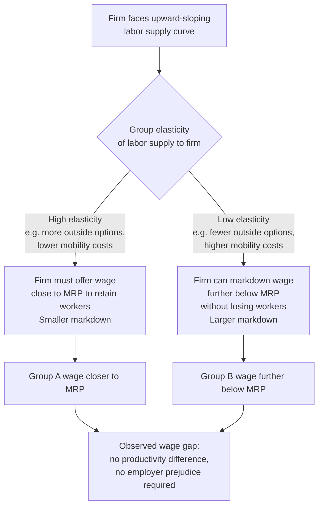

## Monopsony-Based Theories of Discrimination

### Definition and Origin

Monopsony-based theories of discrimination locate the source of persistent group wage gaps not in employer prejudice (Becker) or informational asymmetry (Arrow/Phelps), but in **employer wage-setting power** arising from labor market frictions. The foundational insight, traced to Joan Robinson's 1933 treatment of monopsony in *The Economics of Imperfect Competition*, is that if employers face an **upward-sloping labor supply curve** to the firm (rather than the perfectly elastic supply curve assumed in the competitive model), a wage-setting employer can profitably pay different groups different wages **without any productivity difference and without any taste for discrimination**, simply by exploiting differences in each group's labor supply elasticity to the firm.

This theory has gained substantial renewed prominence in modern labor economics as empirical evidence has accumulated that many labor markets exhibit meaningful monopsony power — even in ostensibly "competitive" settings with many employers — due to search frictions, mobility costs, and preference heterogeneity across job attributes.

### Core Mechanism: Differential Labor Supply Elasticity

In the monopsony model, a firm faces a labor supply curve $L(w)$ that is increasing in the wage it offers, because raising the wage attracts more workers from a pool with heterogeneous reservation wages, search costs, or outside options. The firm's marginal cost of labor exceeds the wage:

$$MC_L = w + L\frac{dw}{dL} > w$$

A profit-maximizing monopsonist sets:

$$MC_L = MRP_L$$

and pays the wage read off the supply curve, $w(L^*)$, which is **below** the marginal revenue product of labor $MRP_L$ — this wedge is the monopsony markdown.

**Key discrimination result**: If group $A$ and group $B$ workers have **identical marginal productivity** ($MRP_A = MRP_B$) but **different labor supply elasticities** to the firm ($\varepsilon_A \neq \varepsilon_B$), a profit-maximizing firm — even one entirely indifferent between the groups — will optimally set different wages, because the profit-maximizing wage markdown depends inversely on elasticity:

$$w_g = MRP \cdot \frac{\varepsilon_g}{1 + \varepsilon_g}, \quad g \in \{A, B\}$$

The group with the **lower labor supply elasticity** (i.e., whose labor supply to the firm responds less to wage changes — meaning workers in that group are less willing or able to switch employers in response to a wage cut) receives a **lower wage markdown-adjusted wage**, purely as a function of differential mobility, not differential ability.

### Why Supply Elasticities Differ by Group

The theory's explanatory power rests on identifying **why** protected-class groups might systematically exhibit lower labor supply elasticity to individual firms. Leading mechanisms in the literature include:

1. **Differential mobility costs**: If women, for example, bear disproportionate responsibility for household/childcare logistics, their willingness to commute farther or relocate for a better-paying job is constrained, making their labor supply to any single nearby firm less elastic — they have fewer accessible outside options at comparable non-wage terms.
2. **Preference heterogeneity over non-wage amenities**: If one group places systematically higher value on job attributes correlated with reduced mobility (e.g., schedule flexibility, proximity to home, family-friendly policies), and few firms offer these bundled attributes, workers with these preferences become more "locked in" to firms that do, reducing their elasticity of response to wage differences elsewhere.
3. **Statistical/network-based search frictions**: If informal referral networks (historically segregated by race or gender) channel different groups toward different, possibly smaller, sets of firms, the effective size of a worker's realistic choice set — and hence their wage-elasticity of labor supply to any given firm — differs by group.
4. **Discrimination by other employers restricting outside options**: If a subset of employers in the market discriminate in a taste-based manner (refuse to hire group $B$ at all), this mechanically shrinks the effective set of employers competing for group $B$ workers, lowering their market-wide labor supply elasticity even to non-discriminating firms — a channel connecting monopsony theory back to Becker-style prejudice as an upstream cause of monopsonistic wage-setting power.

### Diagram: Monopsony Wage-Setting with Differential Elasticity

### Illustration: Monopsonistic Wage Markdown by Group (svg_diagram)

<svg xmlns="http://www.w3.org/2000/svg" viewBox="0 0 640 400">
<text x="320" y="24" text-anchor="middle" font-size="15" font-weight="bold" fill="#1a1a1a">Monopsony Discrimination: Wage Markdown by Supply Elasticity (svg_diagram)</text>
<line x1="80" y1="340" x2="580" y2="340" stroke="#333" stroke-width="1.5" />
<line x1="80" y1="340" x2="80" y2="60" stroke="#333" stroke-width="1.5" />
<text x="330" y="368" text-anchor="middle" font-size="12" fill="#333">Employment (L)</text>
<text x="35" y="200" text-anchor="middle" font-size="12" fill="#333" transform="rotate(-90 35 200)">Wage</text>

<line x1="80" y1="100" x2="580" y2="100" stroke="#264653" stroke-width="1.5" stroke-dasharray="6,3" />
<text x="585" y="104" font-size="10" fill="#264653">MRP (identical for A and B)</text>

<path d="M 80 320 L 560 130" fill="none" stroke="#2b7a78" stroke-width="2.5" />
<text x="420" y="160" font-size="11" fill="#2b7a78">Group A supply (elastic: more outside options)</text>

<path d="M 80 320 L 300 130" fill="none" stroke="#d64550" stroke-width="2.5" />
<text x="180" y="150" font-size="11" fill="#d64550">Group B supply (inelastic: fewer outside options)</text>

<line x1="80" y1="180" x2="580" y2="180" stroke="#2b7a78" stroke-width="1" stroke-dasharray="3,3" />
<text x="585" y="184" font-size="10" fill="#2b7a78">w_A (smaller markdown)</text>
<line x1="80" y1="250" x2="580" y2="250" stroke="#d64550" stroke-width="1" stroke-dasharray="3,3" />
<text x="585" y="254" font-size="10" fill="#d64550">w_B (larger markdown)</text>

<line x1="500" y1="100" x2="500" y2="180" stroke="#2b7a78" stroke-width="1" />
<text x="505" y="140" font-size="9" fill="#2b7a78">markdown_A</text>
<line x1="500" y1="100" x2="500" y2="250" stroke="#d64550" stroke-width="1" />
<text x="505" y="220" font-size="9" fill="#d64550">markdown_B</text>

<text x="330" y="385" text-anchor="middle" font-size="9" fill="#555">Equal productivity, unequal wages — driven entirely by differential elasticity of labor supply to the firm</text>

</svg>

### Formal Model: Monopsonistic Wage Gap as a Function of Elasticity

Let $\varepsilon_g = \frac{dL_g}{dw_g}\cdot\frac{w_g}{L_g}$ denote the firm-level labor supply elasticity for group $g$. Under profit maximization, the standard monopsony markdown formula gives:

$$\frac{w_g}{MRP} = \frac{\varepsilon_g}{1+\varepsilon_g}$$

The **ratio of wages between groups**, holding $MRP$ constant, is therefore:

$$\frac{w_A}{w_B} = \frac{\varepsilon_A(1+\varepsilon_B)}{\varepsilon_B(1+\varepsilon_A)}$$

This expression shows the entire wage gap is a **pure function of the elasticity ratio** — as $\varepsilon_A \to \varepsilon_B$, the gap vanishes; as the elasticity gap widens, so does the wage gap, with no productivity term entering at all. This is the theory's defining feature relative to both Becker and Arrow/Phelps: the discriminatory outcome requires **no animus and no informational asymmetry**, only a difference in bargaining/mobility power.

### Relationship to Modern Monopsony Empirics

The theoretical prediction connects directly to a substantial modern empirical literature (surveyed extensively by Manning, and revitalized by later work using matched employer-employee and quasi-experimental variation) estimating labor supply elasticities to the firm by demographic group:

- Studies commonly find **women's labor supply elasticity to the firm is lower than men's**, often attributed to compensating differentials for flexibility and disproportionate non-market household responsibilities, consistent with the monopsony gender wage gap channel.
- Studies of **minimum wage effects** have used monopsony-consistent employment responses (i.e., minimum wage increases that do not reduce employment, or even raise it, in low-wage/low-elasticity segments of the labor market) as indirect evidence consistent with monopsony power in low-wage labor markets, which disproportionately employ historically disadvantaged groups.
- Research on **rural/thin labor markets** (fewer competing employers) finds larger monopsony markdowns, and disadvantaged groups are disproportionately represented in geographically or occupationally concentrated (thin) markets, reinforcing the elasticity-gap mechanism.

[Inference] The precise magnitude of the demographic elasticity gap, and how much of the aggregate gender/racial wage gap it can quantitatively explain relative to other channels (occupational sorting, taste discrimination, human capital differences), varies substantially across studies, datasets, and estimation methods, and remains an active empirical research question.

### Comparative Table: Three Discrimination Theories

| Dimension | Taste-Based (Becker) | Statistical (Arrow/Phelps) | Monopsony |
| --- | --- | --- | --- |
| Requires prejudice? | Yes | No | No |
| Requires informational imperfection? | No | Yes | No (can hold under full information) |
| Requires imperfect competition in labor market? | No (works even under perfect competition, though erodes there) | No | Yes — central and necessary |
| Source of wage gap | Employer disutility parameter $d_E$ | Differential signal precision/priors by group | Differential labor supply elasticity to firm |
| Predicted response to increased employer competition | Should erode discrimination | Ambiguous — no self-correcting mechanism | Should narrow gap (more competitors raise elasticity) |
| Relationship to minimum wage policy | Minimum wage generally reduces employment in competitive model | Not directly implicated | Minimum wage can raise both wages and employment for the low-elasticity group, up to the competitive wage |

### Policy Implications

Monopsony-based discrimination theory generates a distinctive and, in some respects, counterintuitive set of policy implications relative to the other two frameworks:

1. **Minimum wage and wage floors as discrimination-reducing tools**: Because monopsonistic firms pay below $MRP$, a binding minimum wage set between $w_g$ and $MRP$ can **increase both wages and employment** for the affected group, unlike in a competitive model where minimum wages above the market wage reduce employment. This provides a theoretical channel by which minimum wage policy could narrow gender or racial wage gaps concentrated in low-elasticity segments of the labor market.
2. **Enhancing worker mobility and reducing search frictions**: Policies that lower job-switching costs (e.g., portable benefits, reduced non-compete enforcement, subsidized childcare/transportation that relaxes mobility constraints) directly raise $\varepsilon_g$ for the disadvantaged group, narrowing the wage gap through the elasticity channel.
3. **Pay transparency and salary history bans**: By reducing employers' ability to price-discriminate based on a candidate's (elasticity-correlated) weaker bargaining position or lower reservation wage revealed through salary history, transparency policies can compress monopsonistic wage-setting discretion.
4. **Antitrust enforcement against employer coordination**: Because monopsony power is exacerbated by employer collusion (e.g., no-poach agreements), antitrust action against such coordination directly targets one structural source of the elasticity gap.
5. **Non-compete restrictions**: Since non-compete agreements directly reduce a worker's outside options and thus their firm-specific labor supply elasticity, and are disproportionately imposed in occupations/sectors with weaker worker bargaining power, restricting their use is a direct elasticity-equalizing intervention.

### Empirical Identification Strategies

- **Estimating firm-level labor supply elasticities by group**: Using matched employer-employee panel data and quasi-experimental wage variation (e.g., firm-specific shocks, minimum wage changes) to separately estimate $\varepsilon_A$ and $\varepsilon_B$, then testing whether the elasticity ratio quantitatively predicts the observed wage gap.
- **Minimum wage employment-effect heterogeneity**: Testing whether minimum wage increases have differential employment effects (null or positive vs. negative) across demographic groups, as a signature of differential monopsony exposure.
- **Market concentration measures (HHI) and wage gap correlation**: Testing whether local labor market concentration (fewer employers per worker) is associated with larger group wage gaps, consistent with monopsony-driven discrimination being more severe in thin markets.
- **Quit/separation elasticity estimation**: Estimating how sensitive quit rates are to wage changes by demographic group (a standard technique for recovering labor supply elasticity to the firm from separations data).

### Key Points

- Monopsony-based discrimination theory shows that wage gaps can arise purely from differences in labor supply elasticity to the firm, requiring neither employer prejudice nor informational asymmetry.
- The core formula $w_g/MRP = \varepsilon_g/(1+\varepsilon_g)$ implies the wage gap is entirely a function of the elasticity ratio between groups.
- Differential elasticity is commonly attributed to differential mobility costs, non-wage amenity preferences, network-based search frictions, and interaction effects with other employers' taste-based discrimination.
- Distinctive policy implication: minimum wage floors and mobility-enhancing policies can narrow group wage gaps without the employment losses predicted under the competitive model.
- Modern empirical monopsony literature provides substantial support for the plausibility of this channel, particularly for the gender wage gap and for workers in thin/rural labor markets.
- The theory is increasingly viewed as complementary to, rather than a substitute for, taste-based and statistical discrimination theories, since discriminatory practices by some employers can be an upstream cause of reduced elasticity (and hence monopsony exposure) for affected groups elsewhere in the market.

**Related Topics**

- Modern monopsony power estimation methods (matched employer-employee data)
- Minimum wage effects under monopsony vs. competitive models
- Gender wage gap and compensating differentials for flexibility
- Labor market concentration (HHI) and its effect on wages
- Non-compete agreements and worker mobility restrictions
- Taste-based discrimination (Becker) as an upstream source of reduced elasticity
- Statistical discrimination (Arrow/Phelps) comparative framework
- Search-and-matching models of the labor market