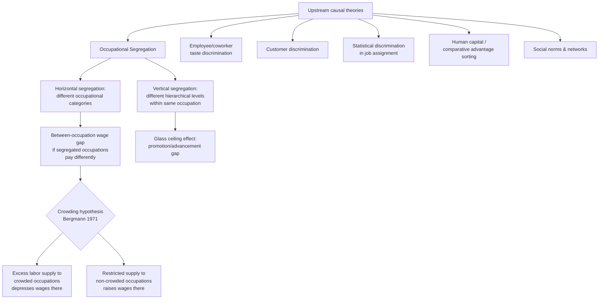

## Occupational Segregation

### Definition and Scope

Occupational segregation refers to the uneven distribution of demographic groups — most commonly analyzed by sex and race — across occupations, industries, or job categories, such that groups are concentrated in different jobs rather than distributed proportionally to their share of the overall labor force. It is conventionally decomposed into two related but distinct concepts:

- **Horizontal segregation**: Concentration of groups in different occupational *categories* at similar hierarchical levels (e.g., women concentrated in nursing and teaching, men concentrated in engineering and construction), without necessarily implying a vertical status difference.
- **Vertical segregation**: Concentration of groups at different *hierarchical levels* within the same occupation or organization (e.g., women underrepresented in senior management despite proportional representation in entry-level roles of the same firm) — often referred to as the "glass ceiling" phenomenon.

Occupational segregation is economically significant because it is one of the primary proximate mechanisms generating aggregate wage gaps: if segregated occupations differ systematically in pay (due to differences in required skill, compensating differentials, unionization, or — controversially — the *effect* of gender/race composition on wage-setting itself), then segregation alone can produce a substantial share of the observed group earnings gap, even absent any within-occupation wage discrimination.

### Measurement: The Duncan Dissimilarity Index

The standard summary measure of occupational segregation is the **Duncan and Duncan Index of Dissimilarity** (1955), which quantifies the share of one group that would need to change occupations for the occupational distributions of two groups to become identical.

$$D = \frac{1}{2}\sum_{i=1}^{n}\left|\frac{M_i}{M} - \frac{F_i}{F}\right| \times 100$$

Where $M_i$ and $F_i$ are the number of men and women (or group $A$/group $B$) in occupation $i$, and $M$ and $F$ are the total number of men and women in the labor force. The index ranges from 0 (no segregation — identical occupational distributions) to 100 (complete segregation — no occupational overlap).

**Interpretation**: $D = 40$ means 40% of one group (or, equivalently, 40% of the other group) would need to switch occupations to equalize the two distributions.

**Known limitations of the D-index**:

1. **Sensitive to occupational classification granularity**: A coarser occupational classification (e.g., "professionals" as one category) mechanically produces a lower $D$ than a finer classification (e.g., separating "surgeons" from "nurses"), since fine-grained categories reveal segregation masked by aggregation.
2. **Insensitive to group size (composition invariance issues)**: The index can behave counterintuitively under changes in the relative sizes of the two groups even when relative occupational concentration patterns are unchanged, a property that motivated later refinements.
3. **Does not capture vertical segregation directly**: Two occupations with identical numerical distributions can have very different internal hierarchical structures, which the D-index does not distinguish.

**Alternative and complementary measures** include the Karmel-MacLachlan Index (adjusts for changes in aggregate group size over time), the Gini-based segregation index, and entropy-based indices (e.g., Theil's H), which better satisfy certain desirable axiomatic properties (e.g., decomposability across nested classification levels, such as decomposing total segregation into within-industry and between-industry components).

### Formal Decomposition: Segregation's Contribution to the Wage Gap

A standard technique (in the spirit of Oaxaca-Blinder decomposition, extended to an occupational dimension) partitions the aggregate wage gap into a between-occupation component and a within-occupation component:

$$\bar{w}_A - \bar{w}_B = \underbrace{\sum_i (\pi_i^A - \pi_i^B)\bar{w}_i}_{\text{between-occupation (segregation)}} + \underbrace{\sum_i \pi_i^B(\bar{w}_i^A - \bar{w}_i^B)}_{\text{within-occupation}}$$

Where $\pi_i^g$ is the share of group $g$ employed in occupation $i$, and $\bar{w}_i$ is the (group-pooled or group-A) average wage in occupation $i$. The **first term** captures how much of the gap is attributable to groups being concentrated in occupations that pay differently (segregation effect); the **second term** captures residual within-occupation pay differences (potential direct discrimination, unobserved productivity differences, or unmeasured job-task heterogeneity within the occupation code).

Empirical decompositions in the gender-wage-gap literature consistently attribute a substantial share (commonly cited ranges of roughly one-quarter to one-half, varying by country, period, and classification detail) of the aggregate gap to the between-occupation/industry component, underscoring segregation's quantitative importance as a mechanism — though the precise share is sensitive to occupational classification granularity per the D-index's known limitation. [Unverified: specific percentage estimates vary considerably by study, country, time period, and occupational classification scheme, and should be sourced from current primary literature for any specific empirical claim.]

### Theoretical Explanations for the Existence and Persistence of Segregation

Occupational segregation is not a standalone theory but rather an **outcome** that multiple discrimination and labor-supply theories predict as an equilibrium result:

1. **Becker's employee/coworker discrimination**: As shown in the taste-based discrimination framework, firms accommodate coworker prejudice at lowest cost by segregating tasks/teams rather than paying an integration wage premium — predicting occupational and firm-level segregation as the equilibrium outcome of employee-taste discrimination, rather than firm-level wage gaps.
2. **Customer discrimination**: Persistent customer preferences for being served by a particular group in customer-facing roles generate segregation into different service/sales occupations that survives competitive pressure, since it operates through firm revenue.
3. **Statistical discrimination in occupational assignment**: If employers use group membership as a signal for occupation-relevant unobserved traits (e.g., presumed likelihood of career interruption, presumed physical strength, presumed interpersonal skill), they may **channel** applicants toward or away from certain occupations or promotion tracks at the point of hiring/assignment, independent of individual qualification — a variant sometimes termed **statistical discrimination in job assignment**, distinct from the wage-setting version discussed under Arrow/Phelps.
4. **Human capital and comparative advantage theories (non-discriminatory)**: Occupational choice models (Polachek and related human-capital-based explanations) argue that anticipated differences in labor force continuity (e.g., career interruptions for childbearing) lead individuals to rationally sort into occupations with lower skill-depreciation rates during time out of the labor force, generating segregation without any discrimination — a controversial and heavily contested explanation in the empirical literature, since it can itself reflect socially conditioned expectations rather than free, unconstrained choice.
5. **Monopsony and differential elasticity by occupation**: If certain occupations (e.g., those offering greater schedule flexibility) exhibit systematically lower firm-level labor supply elasticity because they attract workers with high value for that flexibility and few outside options offering the same bundle, monopsonistic wage-setting can compound segregation's wage effects — occupations disproportionately staffed by one group may face different markdowns even independent of the group-composition wage-penalty channel discussed below.
6. **Social norms, role models, and network effects**: Occupational choice is shaped by exposure to same-group role models, informal mentorship networks, and socialization processes beginning in childhood/education (e.g., differential STEM encouragement), which are not captured by static discrimination models but are argued to be central to segregation's intergenerational persistence.

### The "Devaluation" or "Crowding" Hypothesis

A distinct and influential explanation, associated with Barbara Bergmann's **crowding hypothesis** (1971), proposes a causal channel running from segregation *to* wages, rather than treating occupational pay levels as exogenous:

- If discriminatory barriers (of any of the types above) exclude one group from a subset of occupations, that group is "crowded" into a restricted set of remaining occupations.
- Increased labor supply to the "crowded" occupations, relative to demand, **depresses wages** in those occupations via standard supply-and-demand mechanics, independent of the intrinsic skill or productivity requirements of the work.
- Simultaneously, the exclusion of one group from "non-crowded" occupations **raises wages** there by artificially restricting labor supply.

$$w_{crowded} \downarrow \text{ as } L_{crowded} \uparrow \quad \text{(occupation-specific labor supply shift, not productivity)}$$

This generates the empirical prediction, tested extensively in the literature on gender/race and occupational pay, that **occupations with a higher share of female or minority workers pay systematically lower wages, controlling for measurable skill requirements** — the so-called "devaluation" or "occupational feminization wage penalty" finding. Empirical work using panel/fixed-effects approaches to track wages in occupations as their gender composition changes over time has generally found evidence consistent with a negative wage effect of increasing female share, net of observable skill controls, supporting a causal (not merely correlational) crowding/devaluation interpretation in much of this literature. [Inference: the precise magnitude of the composition-wage effect, and the extent to which unobserved skill/task changes concurrent with compositional shifts fully explain the correlation, remain subjects of ongoing methodological debate regarding endogeneity and omitted variable bias.]

### Diagram: Segregation Mechanisms and Wage Gap Channels

### Illustration: Crowding Hypothesis Supply-Wage Mechanism (svg_diagram)

<svg xmlns="http://www.w3.org/2000/svg" viewBox="0 0 640 400">
<text x="320" y="24" text-anchor="middle" font-size="15" font-weight="bold" fill="#1a1a1a">Bergmann Crowding Hypothesis: Occupational Wage Effects (svg_diagram)</text>

<text x="160" y="55" text-anchor="middle" font-size="12" font-weight="bold" fill="`#1a1a1a`">"Crowded" Occupation</text>

<line x1="60" y1="330" x2="300" y2="330" stroke="#333" stroke-width="1.5" />

<line x1="60" y1="330" x2="60" y2="70" stroke="#333" stroke-width="1.5" />

<text x="180" y="355" text-anchor="middle" font-size="10" fill="#333">Employment</text>

<text x="30" y="200" text-anchor="middle" font-size="10" fill="#333" transform="rotate(-90 30 200)">Wage</text>

<path d="M 70 100 L 290 280" fill="none" stroke="#264653" stroke-width="2" />
<text x="240" y="240" font-size="9" fill="#264653">Demand</text>

<line x1="140" y1="330" x2="140" y2="90" stroke="#999" stroke-width="1.5" stroke-dasharray="4,3" />
<text x="145" y="100" font-size="8" fill="#999">S(original)</text>

<line x1="230" y1="330" x2="230" y2="90" stroke="#d64550" stroke-width="2" />
<text x="235" y="100" font-size="8" fill="#d64550">S(after crowding, shifted right)</text>
<circle cx="140" cy="205" r="4" fill="#999" />
<circle cx="230" cy="248" r="4" fill="#d64550" />
<text x="240" y="252" font-size="9" fill="#d64550">wage falls</text>

<text x="480" y="55" text-anchor="middle" font-size="12" font-weight="bold" fill="`#1a1a1a`">"Non-Crowded" Occupation</text>

<line x1="380" y1="330" x2="620" y2="330" stroke="#333" stroke-width="1.5" />

<line x1="380" y1="330" x2="380" y2="70" stroke="#333" stroke-width="1.5" />

<text x="500" y="355" text-anchor="middle" font-size="10" fill="#333">Employment</text>

<path d="M 390 100 L 610 280" fill="none" stroke="#264653" stroke-width="2" />
<text x="560" y="240" font-size="9" fill="#264653">Demand</text>
<line x1="540" y1="330" x2="540" y2="90" stroke="#999" stroke-width="1.5" stroke-dasharray="4,3" />
<text x="545" y="100" font-size="8" fill="#999">S(original)</text>
<line x1="460" y1="330" x2="460" y2="90" stroke="#2b7a78" stroke-width="2" />
<text x="420" y="100" font-size="8" fill="#2b7a78">S(after exclusion, shifted left)</text>
<circle cx="540" cy="205" r="4" fill="#999" />
<circle cx="460" cy="165" r="4" fill="#2b7a78" />
<text x="415" y="160" font-size="9" fill="#2b7a78">wage rises</text>

<text x="330" y="385" text-anchor="middle" font-size="9" fill="#555">Exclusion from some occupations shifts labor supply, depressing wages in crowded occupations and raising them elsewhere</text>

</svg>

### Empirical Trends and Persistence

- **Long-run desegregation trend with plateau**: In the U.S. and many OECD countries, occupational segregation by sex declined substantially from the 1970s through the 1990s (falling D-index values), but the pace of desegregation has notably slowed or stalled since roughly the 1990s–2000s in much of this literature, a pattern often termed the "stalled gender revolution."
- **Segregation by race** has shown less consistent secular decline than sex segregation in significant portions of the empirical literature, with occupational and industry concentration by race remaining a substantial contributor to racial earnings gaps in many studies.
- **Within-firm segregation** persists even as broad occupational-code-level segregation has declined, since fine-grained task assignment, team composition, and informal hierarchy within nominally identical job titles can still differ substantially by group — a pattern increasingly documented using linked employer-employee administrative data that allows researchers to observe within-firm, within-occupation-code sorting.
- **STEM field segregation** remains a particularly persistent and heavily studied subcase, with substantial and durable gender gaps in fields such as computer science and engineering, motivating extensive research and policy attention on the "pipeline" (education-stage) versus "workplace" (post-entry, attrition-driven) sources of the gap. [Inference: the relative quantitative importance of pipeline versus post-entry attrition explanations for STEM segregation specifically is an actively debated empirical question, with findings varying by field, cohort, and country.]

### Policy Approaches

1. **Comparable worth / pay equity policy**: Directly targets the crowding/devaluation channel by mandating that occupations requiring comparable skill, effort, and responsibility receive comparable pay regardless of gender composition, rather than relying solely on market-determined occupational wage differentials.
2. **Anti-discrimination enforcement in hiring and assignment**: Targets the statistical-discrimination-in-assignment and taste-based coworker/customer discrimination channels by prohibiting group-based channeling into or exclusion from specific roles.
3. **Education and pipeline interventions**: Address the human-capital/comparative-advantage and social-norms channels through early STEM exposure, mentorship, and role-model programs intended to widen occupational aspiration sets before labor market entry.
4. **Family policy (parental leave, childcare subsidies)**: Targets the anticipated-career-interruption channel underlying human-capital-based sorting explanations, by reducing the labor-supply cost of childbearing and thereby weakening the rational basis for occupational sorting toward low-depreciation occupations.
5. **Transparency and audit requirements**: Mandated pay-gap reporting by occupation/level within firms increases visibility of vertical segregation (glass ceiling effects) that aggregate occupation-code statistics can mask.

### Key Points

- Occupational segregation is measured via indices such as the Duncan Dissimilarity Index, with known sensitivity to classification granularity.
- It decomposes conceptually into horizontal (different job categories) and vertical (different hierarchical levels within a job) segregation.
- A substantial share of aggregate group wage gaps is attributable to between-occupation composition effects rather than within-occupation pay differences, per standard decomposition methods.
- Multiple discrimination theories (Becker's coworker/customer variants, statistical discrimination in job assignment, monopsony) and non-discriminatory theories (human capital sorting, social norms) predict segregation as an equilibrium outcome.
- Bergmann's crowding hypothesis proposes a causal, supply-and-demand-based channel from exclusionary segregation to wage effects, generating the empirically tested "devaluation" prediction that female/minority-concentrated occupations pay less, controlling for skill.
- Desegregation trends have historically progressed but shown notable stalling in recent decades in much of the empirical literature, with within-firm and vertical segregation persisting even where occupational-code-level segregation has declined.

**Related Topics**

- Duncan Dissimilarity Index and alternative segregation measures (Theil's H, Karmel-MacLachlan)
- Bergmann's crowding hypothesis and occupational feminization wage penalty
- Oaxaca-Blinder decomposition methodology
- Glass ceiling and vertical segregation empirics
- Comparable worth / pay equity policy design
- Taste-based discrimination: employee and customer variants
- Statistical discrimination in hiring and job assignment
- Human capital theory and anticipated labor force continuity