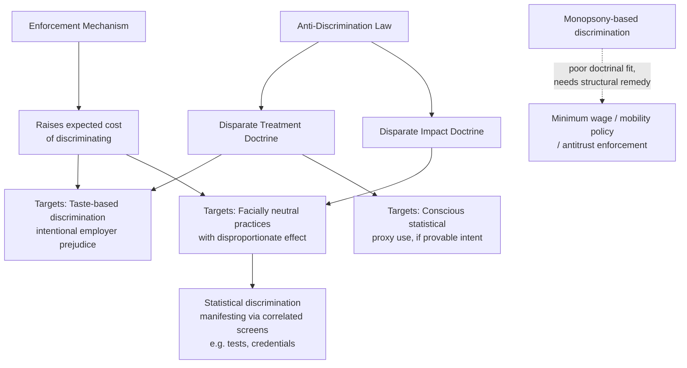

## Anti-Discrimination Law and Policy

### Definition and Scope

Anti-discrimination law and policy encompasses the legal and regulatory framework designed to prohibit and remedy differential treatment of individuals in employment on the basis of protected characteristics (race, sex, age, disability, national origin, religion, and others depending on jurisdiction). From an economic perspective, this body of law functions as a **policy response** to the market failures identified by the theoretical models of discrimination — Becker's taste-based model, Arrow/Phelps statistical discrimination, and monopsony-based wage-setting power — and its design and effectiveness can be evaluated using the same economic frameworks used to model discrimination itself.

Economists analyze anti-discrimination law along several dimensions: which theoretical mechanism of discrimination it is best suited to address, its incidence (who ultimately bears the compliance cost), its effect on measured labor market outcomes, and potential unintended consequences (including possible increases in more subtle or harder-to-detect forms of discrimination).

### Legal Doctrines: Disparate Treatment vs. Disparate Impact

U.S. anti-discrimination law (and, with variation, many other jurisdictions' frameworks) recognizes two principal doctrinal theories of liability, which map differently onto the underlying economic mechanisms:

**Disparate Treatment**: Intentional, differential treatment of an individual because of a protected characteristic. This doctrine directly targets **taste-based discrimination** (Becker) and, in principle, statistical discrimination as well, since using group membership as a proxy for productivity — even if "rational" from a profit-maximization standpoint — constitutes intentional differential treatment under the law. Proof typically requires establishing that the protected characteristic was a motivating factor in the adverse employment action, though evidentiary frameworks (e.g., the McDonnell Douglas burden-shifting framework in U.S. law) allow proof through circumstantial evidence and comparator analysis.

**Disparate Impact**: A facially neutral policy or practice that produces a statistically disproportionate adverse effect on a protected group, regardless of intent. This doctrine, established in the U.S. under *Griggs v. Duke Power Co.* (1971), is economically significant because it targets outcomes correlated with, but not directly caused by, an explicit taste or a deliberate statistical proxy — for example, a facially neutral hiring test or physical requirement that happens to screen out a protected group at a disproportionate rate. Under disparate impact doctrine, once a plaintiff establishes a statistically significant disparate effect, the burden shifts to the employer to demonstrate the practice is **job-related and consistent with business necessity**; even if met, the practice can still be struck down if the plaintiff shows a less discriminatory alternative achieving the same business purpose exists.

**Economic significance of the distinction**: Disparate impact doctrine is the primary legal tool capable of reaching statistical-discrimination-adjacent practices that are not provably intentional — it does not require demonstrating $d_E > 0$ or proving conscious reliance on a group-based prior, only a demonstrated disproportionate statistical outcome, making it doctrinally closer to a "results-based" standard than disparate treatment's "intent-based" standard.

### Key U.S. Statutory Framework

| Statute | Protected Characteristic(s) | Scope |
| --- | --- | --- |
| Title VII of the Civil Rights Act (1964) | Race, color, religion, sex, national origin | Core federal employment discrimination statute; created the EEOC |
| Equal Pay Act (1963) | Sex (equal pay for equal work) | Requires equal pay for substantially equal work under similar conditions; predates Title VII |
| Age Discrimination in Employment Act (ADEA, 1967) | Age (40+) | Separate statute with distinct proof frameworks from Title VII |
| Americans with Disabilities Act (ADA, 1990) | Disability | Also imposes an affirmative reasonable-accommodation duty, distinct from pure non-discrimination |
| Pregnancy Discrimination Act (1978) | Pregnancy (amendment to Title VII) | Clarifies pregnancy discrimination as sex discrimination |

[Unverified: subsequent legislative and judicial developments after this framework's establishment — including circuit splits, Supreme Court rulings, and state/local statutory expansions — should be verified against current legal sources for any application requiring up-to-date legal accuracy; this content provides the foundational economic-analytic framework, not current legal practice.]

### Economic Model: Anti-Discrimination Law as a Tax on Discriminatory Behavior

A standard economic framing treats anti-discrimination enforcement as imposing an **expected penalty** on discriminatory behavior, converting it into a modified cost-benefit problem for the discriminating employer. If an employer's private benefit from indulging a discrimination coefficient $d_E$ is the disutility avoided by not hiring group $B$, and enforcement imposes an expected liability cost:

$$E[\text{Penalty}] = p_{detect} \times p_{liability|detect} \times \text{Damages}$$

The employer's effective decision becomes a comparison between the value of indulging $d_E$ and the expected legal cost of doing so. This reframes anti-discrimination law's function, under a Becker-style model, as **artificially raising the cost of discriminating** — pushing $d_E$-driven behavior back toward the competitive, non-discriminatory outcome by making prejudice pecuniarily costly through legal liability rather than relying solely on product-market competition to erode it.

**Implication for the different discrimination theories**:

- Against **employer (taste-based) discrimination**, this legal cost mechanism is complementary to and reinforces the competitive erosion Becker's model already predicts — law accelerates a process markets would eventually produce, but may do so faster, especially in markets with weak product-market competition (where the erosion mechanism is theoretically weakest).
- Against **customer discrimination**, which Becker's model predicts to be the *most* persistent under competition (since it works through revenue, not cost), legal liability is theoretically the **most necessary and highest-value intervention**, since market forces alone provide no self-correcting mechanism.
- Against **statistical discrimination**, liability changes the calculus by making the previously "rational" profit-maximizing proxy strategy costly, effectively forcing employers to internalize an externality (the social cost of relying on group averages) that the market otherwise does not price.
- Against **monopsony-based discrimination**, direct disparate treatment/impact liability is a comparatively poor fit, since the wage gap arises from elasticity differences rather than any classifiable "treatment" decision — this is a key reason economists studying monopsony discrimination tend to emphasize structural remedies (minimum wage, mobility-enhancing policy, antitrust) over disparate-treatment-style enforcement.

### Diagram: Doctrine-to-Mechanism Mapping

### Empirical Evaluation Approaches

Economists evaluate anti-discrimination law's effectiveness using several distinct empirical strategies, each targeting a different aspect of impact:

1. **Event-study/difference-in-differences around statute enactment**: Comparing labor market outcomes (employment, wages, occupational attainment) for protected groups before and after a law's passage or a major enforcement-intensity change, relative to a comparison group (e.g., states without equivalent state-level protections, or age cohorts just inside/outside ADEA coverage thresholds), to identify causal effects of the legal change itself.
2. **Enforcement intensity variation**: Using variation in EEOC or equivalent agency budget, staffing, litigation activity, or state Fair Employment Practice Commission strength across regions/periods as a proxy for effective enforcement stringency, then correlating with outcome gaps.
3. **Audit study responses to legal salience**: Testing whether observed discrimination in correspondence/audit studies is lower in contexts with stronger recent enforcement activity or higher litigation risk (e.g., larger firms with more EEOC exposure, industries with recent high-profile settlements).
4. **Court decision impact studies**: Using landmark rulings that narrow or expand doctrinal scope (e.g., changes to disparate impact evidentiary standards) as natural experiments to test whether firm hiring/promotion behavior shifts detectably in the predicted direction.
5. **Compliance cost and incidence studies**: Estimating who ultimately bears the cost of anti-discrimination compliance — shareholders (reduced profits), consumers (higher prices), or other workers (reduced wages/hiring elsewhere) — which matters for welfare analysis of the policy's net incidence.

### Persistent Findings and Debates in the Empirical Literature

- **Title VII and the Black-white wage gap**: A substantial body of research finds that Title VII's passage and early EEOC enforcement activity coincided with measurable convergence in Black-white earnings and occupational attainment in subsequent decades, though isolating the law's causal contribution from concurrent civil rights-era social and economic changes (migration patterns, educational convergence, macroeconomic conditions) remains methodologically challenging and is treated with appropriate caution in the literature.
- **Disparate impact and testing/screening practices**: Following *Griggs*, employers' use of certain standardized tests and credential requirements shown to have disparate impact without demonstrated job-relatedness declined, which some studies link to shifts toward alternative (though not necessarily less-biased) screening methods — an area illustrating the general "unintended consequence" pattern in discrimination-law evaluation, where regulation targeting one channel of discrimination can shift behavior toward substitute channels not directly regulated.
- **Statistical discrimination and screening substitution**: A well-documented concern (paralleling the "ban the box" literature discussed under statistical discrimination) is that restricting one type of statistically informative but legally prohibited signal (e.g., a criminal-record inquiry, or an age-correlated credential) can cause employers to substitute toward cruder, more group-correlated proxies (e.g., name-based inference, neighborhood, or gaps in employment history) when direct information is unavailable — a pattern some studies interpret as a countervailing, unintended increase in statistical discrimination following certain restriction policies. [Inference: the magnitude and generality of this substitution effect versus its net welfare effect (better information overall vs. cruder proxying) is contested and appears sensitive to the specific policy and labor market context studied.]
- **Disability accommodation mandates (ADA) and employment effects**: Some empirical work has examined whether reasonable-accommodation mandates, by raising the expected cost of employing disabled workers (accommodation cost internalized ex ante by risk-averse employers even absent actual accommodation need), could have generated employment disincentive effects for the very population intended to be protected — an important illustration of how affirmative legal *obligations* (beyond pure non-discrimination) can generate economic incentives distinct from, and potentially working against, a simple anti-discrimination mandate. [Inference: findings on the direction and magnitude of ADA employment effects vary across studies, time periods, and firm-size thresholds, and remain debated in the literature.]

### Comparative and International Frameworks

Anti-discrimination legal architecture varies meaningfully across jurisdictions, with implications for the underlying economic mechanism each system best targets:

| Jurisdiction/Region | Distinguishing Feature | Economic Implication |
| --- | --- | --- |
| United States | Disparate treatment + disparate impact dual doctrine; largely litigation/enforcement-agency driven | Strong tool against both intentional taste-based and facially neutral statistical-adjacent practices; enforcement intensity varies with agency resources |
| European Union | Directive-based framework (e.g., Equal Treatment Directives) with both direct and indirect discrimination concepts, generally implemented via national law | "Indirect discrimination" concept parallels disparate impact; EU framework also includes explicit positive-action provisions in some member states |
| Comparable-worth/pay-equity regimes (e.g., certain Canadian provinces) | Proactive pay-equity audit requirements rather than purely complaint-driven enforcement | Targets the crowding/devaluation channel of occupational segregation directly, rather than relying on individual litigation |

### Policy Design Considerations from an Economic Perspective

1. **Complaint-driven vs. proactive enforcement**: Complaint-driven systems (reliant on individual litigation) place detection costs on the affected worker, who may face information asymmetry (not knowing they were discriminated against), retaliation risk, and litigation cost barriers — economically, this implies $p_{detect}$ in the expected-penalty framework above is systematically below 1 and may vary by worker resources, weakening deterrence for employers with less-informed or less-resourced applicant pools. Proactive audit-based regimes shift detection costs to the regulator, raising $p_{detect}$ but at higher public administrative cost.
2. **Remedies design and deterrence calibration**: The economic deterrence effect of anti-discrimination law depends on the product $p_{detect} \times \text{Damages}$; jurisdictions with capped damages (as in some U.S. Title VII contexts) may generate weaker deterrence than the theoretically optimal Becker-style "cost of discriminating" if detection probability is also low, implying potential under-deterrence even with facially strong statutory prohibitions.
3. **Interaction with structural remedies**: Given that disparate treatment/impact doctrine is a comparatively poor fit for monopsony-driven wage gaps, economically comprehensive anti-discrimination policy portfolios increasingly combine individual-rights litigation frameworks with structural labor-market interventions (minimum wage floors, pay transparency mandates, antitrust action against employer coordination) to address the full range of theoretical discrimination mechanisms.
4. **Affirmative obligations vs. pure prohibition**: Policies that impose affirmative duties (reasonable accommodation under the ADA, proactive pay-equity audits) differ economically from pure prohibition regimes because they can generate ex ante employment-cost effects (as in the ADA employment-effect debate above) not present under a pure non-discrimination mandate, requiring separate welfare analysis of the accommodation/audit cost itself.

### Key Points

- Anti-discrimination law operates through two principal doctrines — disparate treatment (intent-based) and disparate impact (effects-based) — which map differently onto the taste-based, statistical, and monopsony theoretical mechanisms of discrimination.
- Economically, enforcement can be modeled as raising the expected cost of discriminatory behavior, complementing (taste-based) or substituting for (customer discrimination, statistical discrimination) the market's own erosion mechanisms.
- Disparate impact doctrine is the primary legal tool capable of reaching facially neutral practices correlated with statistical discrimination, without requiring proof of intent.
- Monopsony-driven discrimination is a poor doctrinal fit for individual-rights litigation and is better addressed through structural policy (minimum wage, mobility-enhancing policy, antitrust).
- A well-documented empirical concern is behavioral substitution: restricting one discriminatory channel can shift employer behavior toward cruder, less-regulated proxies, partially offsetting intended effects.
- Policy design questions — complaint-driven vs. proactive enforcement, damages calibration, and affirmative accommodation obligations — carry distinct economic trade-offs beyond the simple existence of a prohibition.

**Related Topics**

- Griggs v. Duke Power Co. and the development of disparate impact doctrine
- EEOC enforcement data and empirical litigation-outcome studies
- "Ban the box" policy and statistical discrimination substitution effects
- Comparable worth / pay equity as a structural policy alternative
- ADA reasonable accommodation and employment-effect debates
- Audit/correspondence study methodology as a law-evaluation tool
- Monopsony-based discrimination and structural policy remedies
- International comparative anti-discrimination regimes (EU indirect discrimination doctrine)