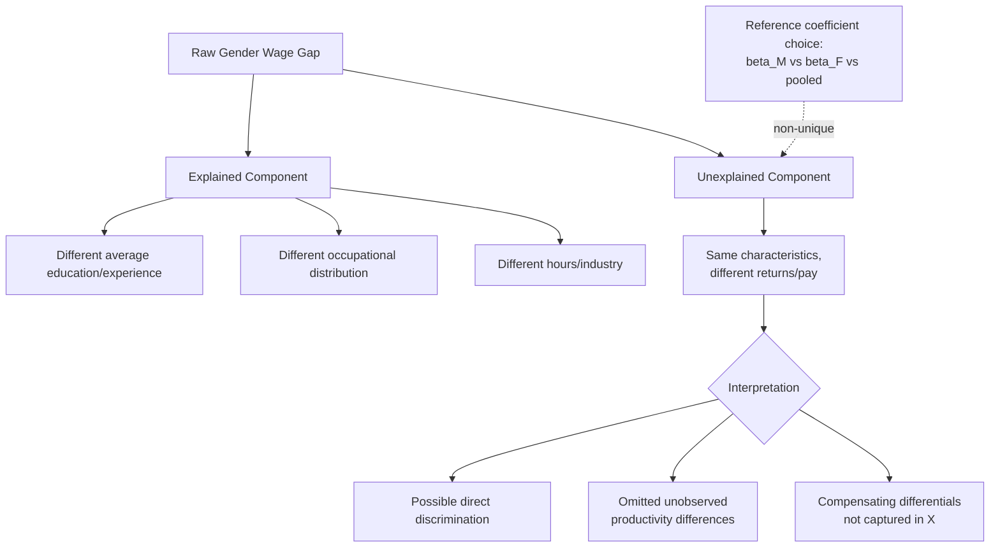

## The Gender Wage Gap

### Definition and Measurement

The gender wage gap refers to the difference in earnings between men and women, most commonly expressed as either a **raw (unadjusted) gap** or an **adjusted gap** that controls for observable productivity-related characteristics. Measurement choice substantially affects the magnitude reported and is a frequent source of confusion in public discourse, making methodological precision essential.

**Raw gap** (most commonly cited in headline statistics):

$$\text{Raw Gap} = 1 - \frac{\bar{w}_F}{\bar{w}_M}$$

Often computed using median full-time, year-round earnings rather than means, to reduce sensitivity to outliers at the top of the distribution.

**Adjusted gap**: Computed after controlling for observable characteristics (education, experience, occupation, industry, hours worked) via regression:

$$\ln(w_i) = \beta_0 + \beta_1 Female_i + \mathbf{X}_i'\boldsymbol{\gamma} + \varepsilon_i$$

Where $\beta_1$ is interpreted as the gap remaining after controlling for the covariates in $\mathbf{X}_i$. Critically, the magnitude of $\beta_1$ is **not** a fixed "true" discrimination estimate — it mechanically shrinks as more controls are added, and the appropriate set of controls is itself a substantive methodological and normative choice (e.g., controlling for occupation removes any gap operating through occupational sorting, which may itself be partly a product of discrimination — the "bad controls" problem in causal inference).

### The Oaxaca-Blinder Decomposition

The standard technique for decomposing the raw gap into an "explained" and "unexplained" component is the **Oaxaca-Blinder decomposition** (Oaxaca 1973; Blinder 1973), applied independently and near-simultaneously by the two authors.

Given separate wage regressions estimated for men and women:

$$\ln(w_M) = \mathbf{X}_M'\boldsymbol{\beta}_M, \qquad \ln(w_F) = \mathbf{X}_F'\boldsymbol{\beta}_F$$

The raw gap is decomposed as:

$$\ln(\bar{w}_M) - \ln(\bar{w}_F) = \underbrace{(\bar{\mathbf{X}}_M - \bar{\mathbf{X}}_F)'\boldsymbol{\beta}_M}_{\text{Explained (endowments)}} + \underbrace{\bar{\mathbf{X}}_F'(\boldsymbol{\beta}_M - \boldsymbol{\beta}_F)}_{\text{Unexplained (coefficients)}}$$

- **Explained component**: The portion of the gap attributable to men and women having different average levels of observable characteristics (education, experience, occupation).
- **Unexplained component**: The portion attributable to men and women being paid differently *for the same characteristics* — commonly interpreted as an upper-bound proxy for discrimination, though it also absorbs the effect of any unobserved productivity-relevant characteristics not included in $\mathbf{X}$ (an important caveat, since the "unexplained" residual is discrimination *plus* omitted-variable bias, not discrimination alone).

**Index-number problem**: The decomposition is not unique — using $\boldsymbol{\beta}_M$ versus $\boldsymbol{\beta}_F$ as the reference (non-discriminatory) coefficient vector in the weighting produces different decompositions, motivating alternative weighting schemes (e.g., pooled coefficients, or Reimers/Cotton weighted averages) with no consensus "correct" choice, since the reference coefficient vector represents a counterfactual, non-discriminatory wage structure that is fundamentally unobserved.

### Diagram: Oaxaca-Blinder Decomposition Logic

### Leading Explanatory Channels

**1. Human capital differences**: Differences in accumulated education, and especially **labor force experience/tenure** due to childbearing-related career interruptions, reduce women's average human capital stock relative to men's at a given age, contributing to the explained component of standard decompositions. This channel has narrowed substantially over recent decades in most high-income countries as educational attainment has converged or reversed (women now exceed men in college completion rates in many countries), shifting the empirical weight of the gap toward other channels.

**2. Occupational and industry segregation**: As detailed under Occupational Segregation, the concentration of women in lower-paying occupations/industries — whether via discriminatory channeling, human-capital-based sorting, or the Bergmann crowding/devaluation mechanism — is a substantial and well-documented contributor to the raw gap.

**3. The "motherhood penalty" and the child earnings gap**: A large and influential body of research (notably using Scandinavian administrative panel data, e.g., Kleven, Landais, and Søgaard's work on Denmark) finds that the gender wage/earnings gap is heavily concentrated around the timing of first childbirth, with women's earnings falling sharply and persistently relative to a pre-birth trend, while men's earnings show no comparable discontinuity — a pattern termed the **"child penalty."** This finding is significant because it shows the gap is not smoothly distributed across the life cycle but is a discrete, event-triggered divergence, implicating channels operating through post-birth labor supply reduction, occupational switching toward more "family-friendly" (often lower-paying) jobs, and employer statistical inference around anticipated future interruptions.

$$\text{Child Penalty}_t = 1 - \frac{E[w_{i,t} \mid \text{post-birth}]}{E[w_{i,t} \mid \text{counterfactual, no birth}]}$$

**4. Compensating differentials for flexibility ("Goldin's greedy jobs" framework)**: Claudia Goldin's influential work argues that a substantial share of the *residual* gap, even after controlling for occupation and hours, arises because certain high-paying occupations exhibit **convex/nonlinear returns to hours and schedule inflexibility** — workers willing to be "on call," work long or unpredictable hours, and be perfect substitutes for colleagues earn a disproportionate premium relative to workers desiring predictable, flexible schedules. Because women disproportionately demand flexibility (largely tied to household/childcare responsibilities), the gap within many high-paying occupations is argued to persist even absent discrimination, because the "price" of flexibility is a nonlinear wage penalty rather than a proportional one.

**5. Negotiation and bargaining differences**: A body of experimental and field evidence has examined gender differences in salary negotiation behavior and initiation rates, though the extent to which negotiation-behavior differences persist as an independent explanatory channel once institutional context (e.g., whether negotiation is explicitly invited or penalized) is accounted for remains debated. [Inference: findings on the magnitude of a residual, institution-independent negotiation-behavior gap are mixed across the experimental literature and sensitive to experimental design.]

**6. Direct discrimination**: The theoretical mechanisms discussed elsewhere (Becker taste-based, Arrow/Phelps statistical, monopsony-based wage-setting) remain candidate explanations for the residual unexplained component, with the monopsony channel receiving particular recent empirical attention given well-documented lower estimated labor supply elasticity for women in several studies.

### Illustration: Child Penalty Event-Study Pattern (svg_diagram)

<svg xmlns="http://www.w3.org/2000/svg" viewBox="0 0 640 380">
<text x="320" y="24" text-anchor="middle" font-size="15" font-weight="bold" fill="#1a1a1a">Child Penalty: Earnings Relative to First Birth (svg_diagram)</text>
<line x1="70" y1="320" x2="590" y2="320" stroke="#333" stroke-width="1.5" />
<line x1="70" y1="320" x2="70" y2="50" stroke="#333" stroke-width="1.5" />
<text x="330" y="350" text-anchor="middle" font-size="12" fill="#333">Years relative to first birth (event time)</text>
<text x="30" y="185" text-anchor="middle" font-size="12" fill="#333" transform="rotate(-90 30 185)">Earnings (indexed, pre-birth = 100)</text>

<line x1="330" y1="320" x2="330" y2="50" stroke="#999" stroke-width="1.5" stroke-dasharray="5,4" />
<text x="335" y="65" font-size="10" fill="#666">First birth (t=0)</text>

<path d="M 90 200 L 330 180 L 570 150" fill="none" stroke="#264653" stroke-width="2.5" />
<text x="450" y="140" font-size="11" fill="#264653">Men: no discontinuity, trend continues</text>

<path d="M 90 205 L 330 185" fill="none" stroke="#2b7a78" stroke-width="2.5" stroke-dasharray="2,2" />

<path d="M 330 185 L 360 280 Q 450 300 570 260" fill="none" stroke="#d64550" stroke-width="2.5" />
<text x="380" y="300" font-size="11" fill="#d64550">Women: sharp drop at birth, persistent gap thereafter</text>

<line x1="570" y1="150" x2="570" y2="260" stroke="#000" stroke-width="1" />
<text x="575" y="205" font-size="9" fill="#000">long-run child penalty</text>

<text x="330" y="365" text-anchor="middle" font-size="9" fill="#555">Parallel pre-trends followed by a discrete, persistent divergence at first childbirth (Kleven et al. methodology)</text>

</svg>

### Cross-National Variation and Policy Correlates

The magnitude of both the raw gap and the child penalty specifically varies substantially across countries, correlating with differences in family policy, labor market institutions, and social norms:

- Countries with more generous, well-designed parental leave and public childcare provision (several Nordic countries are frequently cited in this literature) tend to show smaller child penalties in some studies, though the relationship is not uniformly monotonic — some research finds that *very* long leave durations can paradoxically increase long-run child penalties by prolonging labor market absence and career-track detachment beyond a threshold, an important nonlinearity in the family-policy-design literature.
- Countries and sectors with **more rigid, standardized pay-setting institutions** (strong union coverage, centralized bargaining, transparent pay scales/public-sector pay grids) tend to exhibit smaller gender gaps, consistent with the Goldin "greedy jobs" mechanism being attenuated where nonlinear hours-based pay premia are institutionally constrained.
- **Occupational structure differences** across countries (e.g., relative size of public sector, which tends to have flatter, more transparent, less "greedy-job" pay structures) contribute to substantial cross-national variation independent of any difference in the extent of discrimination per se.

### Time-Series Trends

- The raw gender wage gap narrowed substantially in most high-income countries from the 1960s/1970s through roughly the 1990s, coinciding with rising female educational attainment and labor force participation.
- Convergence has **slowed markedly** since the 1990s–2000s in the U.S. and many peer economies — a pattern in the literature often analyzed jointly with the "stalled gender revolution" finding in occupational segregation, and increasingly attributed to the residual, harder-to-close channels (child penalty, greedy-jobs/flexibility pricing) becoming proportionally larger as the more easily closed human-capital gap has largely converged.
- The gap's magnitude and composition differ substantially by age (near-zero or reversed at labor market entry in some cohorts, widening sharply after the modal childbearing age) and by education/income level (some evidence of a larger residual gap at the top of the wage distribution — a "glass ceiling"-consistent pattern — versus a "sticky floor" pattern at the bottom in other contexts).

### Methodological Critiques and Ongoing Debates

1. **Selection into employment/full-time work**: Standard decompositions using observed wages for full-time workers implicitly condition on employment and full-time status, which is itself a choice correlated with gender and potentially with unobserved wage-relevant characteristics — raising a **sample selection bias** concern (Heckman-style), since women who select into full-time paid employment may be systematically different from those who do not, in ways correlated with wages.
2. **Bad controls problem**: As noted above, controlling for occupation, hours, or job title can absorb genuine discrimination that operates precisely through channeling into those categories, meaning heavily adjusted "gap remaining after controls" figures (sometimes cited as very small, e.g., in the range of a few cents on the dollar) should not be interpreted as an estimate of "how much discrimination exists," but rather as the residual after removing all group differences — including potentially discriminatory ones — captured by the included controls.
3. **Unexplained residual is not proof of discrimination**: Conversely, the unexplained component from Oaxaca-Blinder is also not directly interpretable as a clean discrimination estimate, since it mechanically absorbs any relevant unobserved productivity or preference heterogeneity not captured by available covariates (e.g., unmeasured effort, risk preferences, negotiation behavior) — meaning both the naive raw gap and the adjusted/unexplained gap represent different, partial, and imperfect windows onto the true underlying discriminatory component. [Inference: the degree to which the modern literature's unexplained residual reflects discrimination versus unmeasured factors remains an open and actively contested question, particularly given the child-penalty and greedy-jobs findings that offer non-discriminatory explanations for a substantial share of the previously "unexplained" gap.]

### Key Points

- The gender wage gap is measured as raw (unadjusted) or regression-adjusted, with the appropriate control set being a substantive, not purely technical, choice.
- Oaxaca-Blinder decomposition splits the gap into explained (endowment) and unexplained (coefficient/return) components, subject to a non-unique reference-coefficient (index-number) problem.
- The "child penalty" literature (Kleven et al.) identifies childbirth as a discrete event generating a sharp, persistent earnings divergence between men and women, reframing much of the gap as event-triggered rather than smoothly distributed.
- Goldin's "greedy jobs" framework attributes a substantial share of the residual gap to nonlinear, convex returns to long/inflexible hours in high-paying occupations, disadvantaging flexibility-demanding workers.
- Cross-national variation correlates with family policy design (with some evidence of nonlinear/non-monotonic leave-duration effects) and pay-setting institution rigidity.
- Both the raw gap and the adjusted/unexplained residual are imperfect discrimination proxies: the former ignores legitimate productivity differences, the latter risks both absorbing discrimination into "controls" and attributing unmeasured factors to "discrimination."

**Related Topics**

- Kleven, Landais, and Søgaard child penalty methodology and cross-country evidence
- Goldin's "greedy jobs" and compensating differentials for flexibility
- Occupational segregation and the crowding/devaluation hypothesis
- Monopsony-based theories of discrimination and gender-specific elasticity estimates
- Heckman sample selection correction methodology
- Family policy design (parental leave, childcare subsidies) and labor market effects
- Oaxaca-Blinder decomposition extensions and index-number problem solutions
- The racial wage gap: comparative decomposition methodology