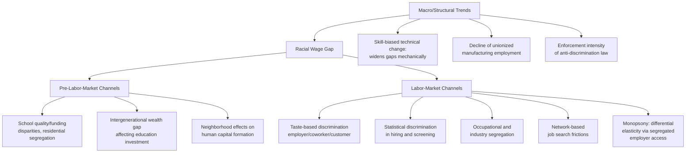

## The Racial Wage Gap

### Definition and Measurement

The racial wage gap refers to systematic earnings differences between racial and ethnic groups, most extensively studied in the U.S. context as the Black-white wage gap, with growing literature on Hispanic-white, Asian-white, and Native American gaps, as well as increasing attention to intersectional race-by-gender gaps. As with the gender wage gap, measurement distinguishes between the **raw gap** and the **regression-adjusted gap**, and the same methodological cautions about control-variable selection apply, often with even greater force given the extensive historical and structural channels through which race correlates with human capital accumulation.

$$\text{Raw Gap}_{race} = 1 - \frac{\bar{w}_{minority}}{\bar{w}_{white}}$$

A distinguishing empirical feature of the racial wage gap literature, relative to the gender gap literature, is that a substantially larger share of the raw gap in most U.S. studies survives standard human-capital and occupational controls, and the trajectory of convergence over time has been markedly less smooth — including documented periods of **stagnation or reversal** — which has shaped the theoretical and policy literature differently than the gender gap case.

### The Oaxaca-Blinder Decomposition Applied to Race

The same decomposition framework used for the gender gap applies directly:

$$\ln(\bar{w}_W) - \ln(\bar{w}_B) = \underbrace{(\bar{\mathbf{X}}_W - \bar{\mathbf{X}}_B)'\boldsymbol{\beta}_W}_{\text{Explained}} + \underbrace{\bar{\mathbf{X}}_B'(\boldsymbol{\beta}_W - \boldsymbol{\beta}_B)}_{\text{Unexplained}}$$

A key finding distinguishing the racial gap literature from the gender gap literature is that **educational quality and school segregation** enter as a substantial explanatory channel with a distinct measurement problem: standard controls for "years of education" or even degree attainment fail to capture large documented differences in school funding, teacher quality, and curricular resources historically and currently correlated with race in the U.S., due to residential segregation and school-district funding structures tied to local property tax bases. This means the "explained" component in standard decompositions likely **understates** the true role of unequal human capital *investment opportunity* (as opposed to unequal human capital *choice*), since the education variable is a coarse proxy that does not capture within-category quality differences — an issue less central, though not absent, in gender gap decompositions.

### Historical Trajectory: Convergence, Stagnation, and Reversal

Unlike the gender wage gap's largely (if slowing) monotonic convergence pattern, the Black-white wage gap in the U.S. exhibits a documented **non-monotonic historical trajectory**, which has been a major focus of economic history and labor economics research:

- **Pre-Civil Rights era**: Substantial gaps rooted in overt legal segregation (Jim Crow), occupational exclusion, and large education-quality disparities under segregated schooling systems.
- **1940s–1970s convergence**: A substantial body of research (including work using Census and CPS microdata) documents meaningful convergence in this period, associated with the Great Migration (relocation from the lower-wage, more discriminatory South to higher-wage Northern labor markets), rising Black educational attainment, and — particularly for the 1960s-70s — Title VII enactment and early EEOC/OFCCP enforcement activity.
- **Post-1970s stagnation/reversal in parts of the literature**: A substantial and influential body of research documents that convergence slowed sharply, and by some measures partially reversed, from the late 1970s/1980s onward. Proposed explanations in this literature include: rising overall wage inequality and skill-biased technical change (which mechanically widens gaps between groups with differing average skill/education distributions, independent of any change in discrimination), the decline of manufacturing and unionized blue-collar employment (sectors where the Black-white gap had been comparatively compressed due to union wage-setting norms), and weakening enforcement intensity of anti-discrimination law in certain periods.
- **Contemporary persistence**: Recent decades show continued substantial gaps, with some research documenting the gap being as large or larger among more educated cohorts (i.e., a larger absolute or relative gap among college graduates than among those with less education in some studies) — a pattern that runs counter to a pure human-capital-convergence explanation and has drawn attention to channels operating within high-skill labor markets specifically (e.g., differential access to informal networks, mentorship, and internal promotion tracks).

### Diagram: Explanatory Channel Taxonomy for the Racial Wage Gap

### The Intergenerational and Wealth-Based Channel

A distinguishing feature of the racial wage gap literature (with less direct parallel in the gender gap case) is the emphasis on the **racial wealth gap** as both a cause and consequence of the earnings gap, operating through channels not fully captured by a static, single-period earnings decomposition:

- Lower household wealth constrains investment in children's education (private schooling, tutoring, unpaid internships, geographic mobility toward higher-opportunity areas), a channel formalized in some models as a **wealth-constrained human capital investment** problem, where credit constraints (rather than preferences or ability) bind the optimal investment choice for lower-wealth families.
- The racial wealth gap substantially exceeds the racial income gap in most U.S. studies (commonly cited as wealth gaps being several multiples larger in proportional terms than income gaps), a divergence attributed in the literature to historical practices including discriminatory lending and housing policy (e.g., historical redlining), unequal access to asset appreciation (particularly housing equity), and intergenerational wealth transfer differentials — creating a **dynamic, multi-generational reinforcement mechanism** distinct from the contemporaneous labor-market discrimination mechanisms (Becker, Arrow/Phelps, monopsony) that dominate static wage-gap theory.

$$W_{t+1}^{minority} = f(W_t^{minority}, \text{Investment}(W_t^{minority}), \text{Inheritance}) \quad \text{with binding credit constraint if } W_t \text{ low}$$

This intergenerational framing implies that even a **complete elimination of contemporaneous labor-market discrimination** would not immediately close the racial wage gap, since a substantial share of the gap may be pre-determined by unequal human capital investment opportunity rooted in the wealth gap — a point with significant implications for the expected effectiveness of anti-discrimination law alone (as discussed in the Anti-Discrimination Law and Policy content) relative to policies targeting wealth accumulation, school funding equalization, or early childhood investment directly.

### Illustration: Static Discrimination vs. Dynamic Wealth-Constraint Channels (svg_diagram)

<svg viewBox="0 0 640 400" xmlns="http://www.w3.org/2000/svg">
<text x="320" y="24" text-anchor="middle" font-size="15" font-weight="bold" fill="#1a1a1a">Two Channel Classes of the Racial Wage Gap (svg_diagram)</text>
<!-- Static/contemporaneous channel box -->
<rect x="60" y="60" width="230" height="130" fill="#2b7a78" opacity="0.15" stroke="#2b7a78" stroke-width="1.5" rx="6"/>
<text x="175" y="82" text-anchor="middle" font-size="12" font-weight="bold" fill="#2b7a78">Contemporaneous Labor Market Discrimination</text>
<text x="80" y="110" font-size="10" fill="#1a1a1a">• Employer taste (Becker)</text>
<text x="80" y="128" font-size="10" fill="#1a1a1a">• Statistical discrimination</text>
<text x="80" y="146" font-size="10" fill="#1a1a1a">• Occupational segregation</text>
<text x="80" y="164" font-size="10" fill="#1a1a1a">• Monopsony elasticity gap</text>
<text x="175" y="182" text-anchor="middle" font-size="9" fill="#2b7a78">Static, single-period</text>
<!-- Dynamic/intergenerational channel box -->
<rect x="350" y="60" width="230" height="130" fill="#d64550" opacity="0.15" stroke="#d64550" stroke-width="1.5" rx="6"/>
<text x="465" y="82" text-anchor="middle" font-size="12" font-weight="bold" fill="#d64550">Intergenerational Wealth & Investment Constraint</text>
<text x="370" y="110" font-size="10" fill="#1a1a1a">• School funding/quality gap</text>
<text x="370" y="128" font-size="10" fill="#1a1a1a">• Credit-constrained</text>
<text x="370" y="142" font-size="10" fill="#1a1a1a"> human capital investment</text>
<text x="370" y="160" font-size="10" fill="#1a1a1a">• Housing/wealth accumulation</text>
<text x="465" y="182" text-anchor="middle" font-size="9" fill="#d64550">Dynamic, multi-generational</text>
<!-- combining arrow -->
<line x1="175" y1="190" x2="320" y2="250" stroke="#333" stroke-width="1.5"/>
<line x1="465" y1="190" x2="320" y2="250" stroke="#333" stroke-width="1.5"/>
<rect x="220" y="255" width="200" height="60" fill="#264653" opacity="0.15" stroke="#264653" stroke-width="1.5" rx="6"/>
<text x="320" y="280" text-anchor="middle" font-size="12" font-weight="bold" fill="#264653">Observed Racial Wage Gap</text>

<text x="320" y="345" text-anchor="middle" font-size="10" fill="#555">Anti-discrimination law targets the left channel;</text>

<text x="320" y="360" text-anchor="middle" font-size="10" fill="#555">closing the gap fully requires addressing the right channel as well</text>

</svg>

### Intersectionality: Race-by-Gender Gaps

A growing literature examines gaps at the intersection of race and gender (e.g., Black women vs. white men, vs. white women, vs. Black men), finding that **intersectional gaps are not simply additive** — the Black-white gap and the male-female gap do not combine linearly to predict the Black-woman-vs-white-man gap, motivating decomposition methods (e.g., detailed multi-group Oaxaca-Blinder extensions, interaction-term regression specifications) that avoid conflating group-specific and interaction effects. [Inference: the precise degree and direction of non-additivity varies by dataset, cohort, and country, and is an active area of methodological development in the decomposition literature.]

### Comparative and Cross-National Considerations

- **Hispanic-white gap**: Distinguished in the U.S. literature by the added dimension of immigrant generational status and English-language proficiency as explanatory channels not present (or present differently) in the Black-white comparison, requiring decomposition frameworks that separate nativity/generation effects from race/ethnicity effects per se.
- **Asian-white gap**: Frequently exhibits a raw *positive* gap in favor of Asian workers in aggregate U.S. statistics, but disaggregation by national-origin subgroup reveals substantial heterogeneity, and some studies find a documented "bamboo ceiling" phenomenon — underrepresentation in senior leadership roles despite favorable average earnings — illustrating that vertical segregation (glass-ceiling-type effects) can coexist with a favorable horizontal/aggregate earnings comparison.
- **Cross-national racial/ethnic gaps**: Comparative work (e.g., on ethnic minority gaps in the UK, or indigenous-population gaps in countries such as Australia, Canada, and New Zealand) generally finds qualitatively similar explanatory channel taxonomies (education/school quality, discrimination, geographic/network segregation), though the relative weight of each channel and the historical/legal context (e.g., differing colonial and land-dispossession histories for indigenous populations) differs substantially by country, limiting the direct transferability of U.S.-derived quantitative findings.

### Empirical Identification Strategies Specific to Race

- **Audit/correspondence studies with racially distinctive names**: The Bertrand and Mullainathan (2004) study using racially distinctive names on otherwise identical resumes is a canonical design in this literature, finding substantial callback-rate gaps attributable to perceived race, and has been replicated and extended across many labor markets and periods.
- **Natural experiments using Great Migration variation**: Using variation in the timing and destination of Black migration from the U.S. South as a quasi-experimental source of variation in exposure to different regional labor market and school-quality conditions, to help identify the causal contribution of place-based versus individual-level channels.
- **School finance reform studies**: Using court-mandated or legislative school-funding equalization reforms as natural experiments to estimate the causal effect of closing school-quality gaps on subsequent adult earnings gaps, directly testing the pre-labor-market/human-capital-investment channel.
- **Linked employer-employee data for within-firm racial gap estimation**: Following the same methodological approach used in gender-gap and occupational-segregation research, allowing separation of between-firm sorting effects from within-firm, within-job-title pay differences.

### Key Points

- The racial wage gap, like the gender gap, is analyzed via raw and Oaxaca-Blinder-decomposed adjusted measures, but a substantially larger unexplained/residual component typically survives standard controls relative to the gender case.
- Unlike the gender gap's largely monotonic (if slowing) convergence, the Black-white wage gap trajectory in the U.S. shows documented stagnation and partial reversal since the late 1970s/1980s in a substantial body of research.
- Educational quality/school-funding disparities constitute a distinct and quantitatively important explanatory channel not fully captured by standard years-of-education or degree-attainment controls.
- The racial wealth gap operates as a dynamic, intergenerational, credit-constraint-based mechanism distinct from contemporaneous labor-market discrimination theories, implying anti-discrimination law alone is unlikely to fully close the gap.
- Intersectional race-by-gender gaps are non-additive, requiring specialized decomposition methods.
- Racial/ethnic subgroup heterogeneity (Hispanic generational status, Asian subgroup and "bamboo ceiling" patterns) means aggregate racial-gap statistics can mask substantial internal variation.

**Related Topics**

- Bertrand and Mullainathan (2004) audit study methodology and replications
- Racial wealth gap and credit-constrained human capital investment models
- Great Migration natural experiments in labor economics
- School finance reform and intergenerational earnings mobility
- Skill-biased technical change and its interaction with group wage gaps
- Intersectional (multi-group) Oaxaca-Blinder decomposition methods
- Occupational segregation and the crowding/devaluation hypothesis
- Anti-discrimination law and policy: enforcement intensity and doctrinal fit