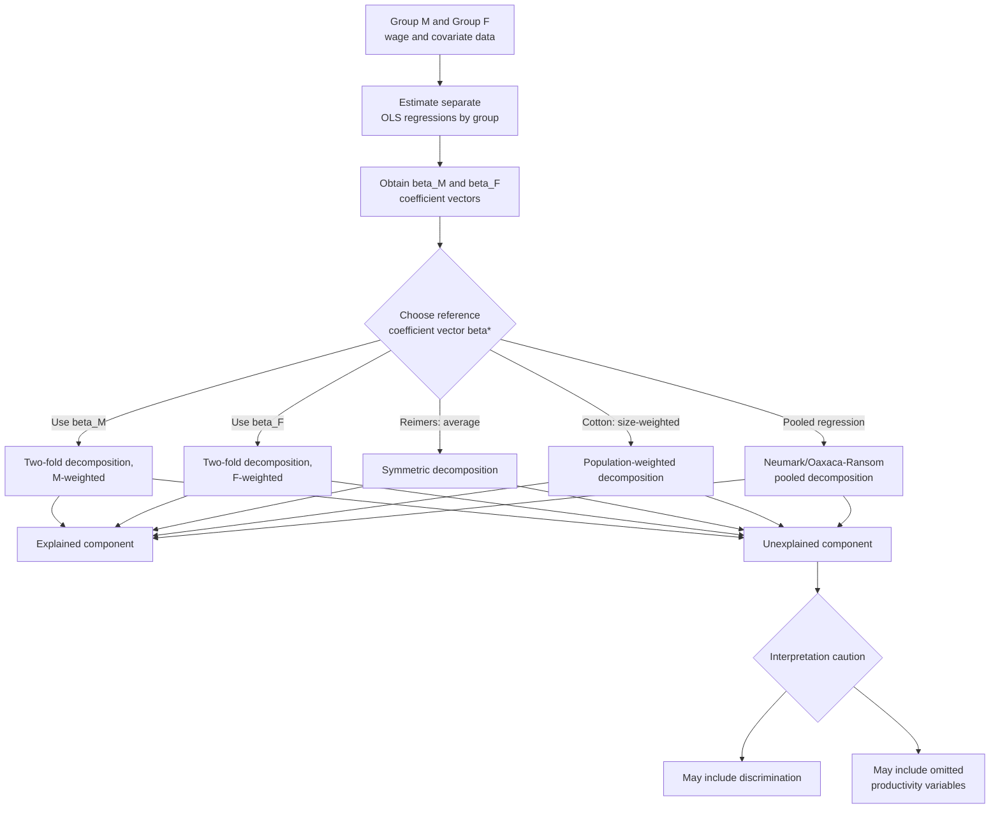

## Oaxaca-Blinder Decomposition

### Definition and Purpose

The Oaxaca-Blinder decomposition is an econometric technique for decomposing the mean difference in an outcome variable (typically log wages) between two groups into a component attributable to differences in observable, productivity-relevant characteristics ("endowments") and a component attributable to differences in the **returns** to those characteristics. It was developed independently and published essentially simultaneously by Ronald Oaxaca (1973) and Alan Blinder (1973), and remains the workhorse method throughout the empirical wage-gap literature, including its application to the gender wage gap and the racial wage gap.

The technique addresses a specific analytical question: of the total observed wage gap between group $M$ (e.g., men, or a reference/majority group) and group $F$ (e.g., women, or a minority group), how much reflects the two groups having genuinely different levels of measurable, wage-relevant characteristics (education, experience, occupation), and how much reflects the two groups being paid **differently for the same characteristics** — the latter serving as a widely used, if imperfect, empirical proxy for discrimination.

### Foundational Setup

The method begins by estimating **separate** linear (typically log-wage) regressions for each group:

$$\ln(w_i^M) = \mathbf{X}_i^{M\prime}\boldsymbol{\beta}^M + \varepsilon_i^M$$

$$\ln(w_i^F) = \mathbf{X}_i^{F\prime}\boldsymbol{\beta}^F + \varepsilon_i^F$$

Where $\mathbf{X}_i$ is a vector of observable characteristics (education, potential experience, occupation dummies, industry, region, etc.), and $\boldsymbol{\beta}$ is the vector of estimated returns to those characteristics, allowed to differ by group. Estimating **separate** regressions (rather than a single pooled regression with a group dummy) is the methodologically essential feature distinguishing Oaxaca-Blinder from a simple pooled regression approach, because it allows the *entire* coefficient vector — not just the intercept — to differ by group, capturing the possibility that the labor market rewards the same characteristic (e.g., an additional year of experience) differently across groups.

### The Core Decomposition Identity

Evaluating both regressions at the group-specific sample means, and using the property that OLS residuals average to zero, the observed mean log-wage gap can be written exactly as:

$$\overline{\ln w^M} - \overline{\ln w^F} = \bar{\mathbf{X}}^{M\prime}\hat{\boldsymbol{\beta}}^M - \bar{\mathbf{X}}^{F\prime}\hat{\boldsymbol{\beta}}^F$$

Adding and subtracting $\bar{\mathbf{X}}^{F\prime}\hat{\boldsymbol{\beta}}^M$ (a standard "adding-zero" algebraic trick central to the method) yields the canonical **two-fold decomposition**:

$$\overline{\ln w^M} - \overline{\ln w^F} = \underbrace{(\bar{\mathbf{X}}^M - \bar{\mathbf{X}}^F)'\hat{\boldsymbol{\beta}}^M}_{\text{Explained / Endowments Effect}} + \underbrace{\bar{\mathbf{X}}^{F\prime}(\hat{\boldsymbol{\beta}}^M - \hat{\boldsymbol{\beta}}^F)}_{\text{Unexplained / Coefficients Effect}}$$

- **Explained (endowments) component**: Holds returns fixed at group $M$'s estimated returns ($\hat{\boldsymbol{\beta}}^M$) and asks how much of the gap arises purely from group $F$ having different average characteristic levels ($\bar{\mathbf{X}}^F \neq \bar{\mathbf{X}}^M$).
- **Unexplained (coefficients) component**: Holds characteristics fixed at group $F$'s average levels ($\bar{\mathbf{X}}^F$) and asks how much of the gap arises from group $F$ receiving different (typically lower) returns to those same characteristics ($\hat{\boldsymbol{\beta}}^F \neq \hat{\boldsymbol{\beta}}^M$).

### The Index-Number (Reference Group) Problem

The algebraic decomposition above is **not unique**: the choice to evaluate the explained component using $\hat{\boldsymbol{\beta}}^M$ (rather than $\hat{\boldsymbol{\beta}}^F$) as the weighting/reference coefficient vector is an arbitrary methodological decision with real consequences for the resulting split. An equally valid algebraic rearrangement uses group $F$'s coefficients as the reference:

$$\overline{\ln w^M} - \overline{\ln w^F} = \underbrace{(\bar{\mathbf{X}}^M - \bar{\mathbf{X}}^F)'\hat{\boldsymbol{\beta}}^F}_{\text{Explained (alternative)}} + \underbrace{\bar{\mathbf{X}}^{M\prime}(\hat{\boldsymbol{\beta}}^M - \hat{\boldsymbol{\beta}}^F)}_{\text{Unexplained (alternative)}}$$

These two decompositions generally produce **different numerical splits** between explained and unexplained components, since $\hat{\boldsymbol{\beta}}^M$ and $\hat{\boldsymbol{\beta}}^F$ are, in general, different vectors. This is formally analogous to the **index-number problem** in price-index theory (the Laspeyres vs. Paasche index ambiguity), and there is no theoretically "correct" resolution, since the reference coefficient vector is meant to represent a **counterfactual, non-discriminatory wage structure** — which is fundamentally unobserved and unobservable directly from the data.

**Standard solutions to the reference-group ambiguity**:

1. **Reimers (1983) weighting**: Uses the simple average of the two groups' coefficient vectors, $\tfrac{1}{2}(\hat{\boldsymbol{\beta}}^M + \hat{\boldsymbol{\beta}}^F)$, as the counterfactual non-discriminatory structure.
2. **Cotton (1988) weighting**: Uses a weighted average of the two groups' coefficients, with weights proportional to each group's relative sample/population size.
3. **Neumark (1988) / Oaxaca-Ransom (1994) pooled-coefficient approach**: Estimates a single pooled regression on the combined sample (including a group indicator, or excluding it and using the pooled non-group coefficients) as the reference structure, on the theoretical argument that this best approximates the coefficients that *would* prevail in a non-discriminatory labor market, since it is estimated using the full combined sample's variation.

$$\overline{\ln w^M} - \overline{\ln w^F} = \underbrace{(\bar{\mathbf{X}}^M - \bar{\mathbf{X}}^F)'\hat{\boldsymbol{\beta}}^*}_{\text{Explained}} + \underbrace{\bar{\mathbf{X}}^{M\prime}(\hat{\boldsymbol{\beta}}^M - \hat{\boldsymbol{\beta}}^*) + \bar{\mathbf{X}}^{F\prime}(\hat{\boldsymbol{\beta}}^* - \hat{\boldsymbol{\beta}}^F)}_{\text{Unexplained, split into group M "advantage" and group F "disadvantage"}}$$

Where $\hat{\boldsymbol{\beta}}^*$ denotes the chosen reference coefficient vector (Reimers, Cotton, or pooled). None of these choices is derived from first-principles economic theory; each represents a different assumption about the counterfactual wage structure, and results should be understood as **sensitive to this choice** — a critical caveat when interpreting any single reported decomposition.

### Diagram: Decomposition Workflow and Reference-Group Choice Points

### Illustration: Explained vs. Unexplained Components Under Different Reference Choices (svg_diagram)

<svg xmlns="http://www.w3.org/2000/svg" viewBox="0 0 640 380">
<text x="320" y="24" text-anchor="middle" font-size="15" font-weight="bold" fill="#1a1a1a">Oaxaca-Blinder: Sensitivity to Reference Coefficient Choice (svg_diagram)</text>
<line x1="90" y1="330" x2="580" y2="330" stroke="#333" stroke-width="1.5" />
<line x1="90" y1="330" x2="90" y2="60" stroke="#333" stroke-width="1.5" />
<text x="335" y="358" text-anchor="middle" font-size="11" fill="#333">Reference coefficient vector chosen</text>
<text x="45" y="195" text-anchor="middle" font-size="11" fill="#333" transform="rotate(-90 45 195)">Share of total gap</text>

<rect x="120" y="150" width="60" height="180" fill="#2b7a78" opacity="0.85" />
<rect x="120" y="90" width="60" height="60" fill="#d64550" opacity="0.85" />
<text x="150" y="345" text-anchor="middle" font-size="9" fill="#1a1a1a">beta_M</text>

<rect x="230" y="190" width="60" height="140" fill="#2b7a78" opacity="0.85" />
<rect x="230" y="90" width="60" height="100" fill="#d64550" opacity="0.85" />
<text x="260" y="345" text-anchor="middle" font-size="9" fill="#1a1a1a">beta_F</text>

<rect x="340" y="170" width="60" height="160" fill="#2b7a78" opacity="0.85" />
<rect x="340" y="90" width="60" height="80" fill="#d64550" opacity="0.85" />
<text x="370" y="345" text-anchor="middle" font-size="9" fill="#1a1a1a">Reimers</text>

<rect x="450" y="165" width="60" height="165" fill="#2b7a78" opacity="0.85" />
<rect x="450" y="90" width="60" height="75" fill="#d64550" opacity="0.85" />
<text x="480" y="345" text-anchor="middle" font-size="9" fill="#1a1a1a">Pooled</text>

<rect x="530" y="90" width="14" height="14" fill="#d64550" opacity="0.85" />
<text x="548" y="102" font-size="9" fill="#1a1a1a">Unexplained</text>
<rect x="530" y="112" width="14" height="14" fill="#2b7a78" opacity="0.85" />
<text x="548" y="124" font-size="9" fill="#1a1a1a">Explained</text>

<text x="335" y="372" text-anchor="middle" font-size="9" fill="#555">Total gap held constant; the explained/unexplained split shifts with the reference weighting scheme</text>

</svg>

### Extension: Detailed Decomposition by Covariate

Beyond the aggregate two-fold split, researchers commonly report a **detailed decomposition**, breaking the explained component down by individual covariate to identify which specific characteristics (education, experience, occupation) drive the endowments effect:

$$\text{Explained} = \sum_{k=1}^{K} (\bar{X}_k^M - \bar{X}_k^F)\hat{\beta}_k^{M}$$

**Important caveat for detailed decomposition with categorical variables**: When $\mathbf{X}$ includes a set of dummy variables for a categorical predictor (e.g., occupation categories, education levels), the detailed decomposition of the *unexplained* component is **not invariant to the choice of omitted (base) category** — a well-documented technical problem in the literature (sometimes called the identification problem for detailed decompositions), since the coefficient on each dummy is defined only relative to the arbitrarily chosen reference category. Standard corrections include using **normalized/deviation-contrast coding** (Yun 2005) rather than a single omitted dummy category, which produces detailed decomposition results invariant to the reference category choice.

### The Unexplained Component: Interpretation and Limitations

The unexplained (coefficients) component is frequently, but imprecisely, described as a measure or "estimate" of discrimination. This interpretation requires several caveats central to responsible use of the method:

1. **Omitted variable bias runs in an unknown direction**: The unexplained component captures *any* systematic difference in returns not accounted for by $\mathbf{X}$, including genuine unobserved productivity differences (unmeasured effort, risk tolerance, unmeasured skill) correlated with group membership. If such omitted variables exist and are correlated with group status, the unexplained component will be **biased away from a clean discrimination estimate**, in a direction that depends on the sign of the omitted correlation — meaning the unexplained component can either overstate or understate true discrimination depending on what is omitted.
2. **The "bad controls" problem**: Conversely, including certain controls (particularly occupation, industry, or job title) can cause the explained component to **absorb** discrimination that operates precisely through channeling individuals into different occupations or firms — a mechanism documented in the occupational segregation literature. This means heavily controlled specifications can understate the discriminatory component by re-labeling it as "explained."
3. **Linearity and functional form assumptions**: The standard decomposition assumes linear, additively separable regression functions; nonlinear extensions (e.g., decompositions based on quantile regression, to study the gap across the wage distribution rather than only at the mean — sometimes called the Machado-Mata or Firpo-Fortin-Lemieux RIF-regression decomposition methods) relax this assumption and are increasingly used to study how the explained/unexplained split varies at different points in the wage distribution (e.g., "glass ceiling" and "sticky floor" patterns).
4. **Selection into the estimation sample**: As with any wage regression restricted to employed individuals, the decomposition is subject to potential Heckman-style sample selection bias if labor force participation itself is correlated with group membership and with unobserved wage-relevant characteristics.

### Extensions Beyond the Mean: Distributional Decompositions

Because the classical Oaxaca-Blinder decomposition operates only on the **conditional mean**, it cannot characterize how the explained/unexplained gap varies across the wage distribution (e.g., whether the unexplained gap is larger among high earners — consistent with a "glass ceiling" — or among low earners — consistent with a "sticky floor"). Modern extensions address this:

- **Quantile regression decomposition (Machado-Mata, 2005)**: Simulates counterfactual wage distributions using quantile regression coefficients, allowing decomposition of the gap at each quantile of the wage distribution rather than only at the mean.
- **RIF-regression decomposition (Firpo, Fortin, and Lemieux, 2009)**: Uses the **recentered influence function** (RIF) of a distributional statistic (a quantile, the variance, or another inequality measure) as the dependent variable in an OLS-style regression, enabling detailed Oaxaca-Blinder-style decomposition of *any* distributional statistic, not just the mean — a substantial methodological generalization that has become a standard tool in the contemporary wage-gap literature for studying the gap simultaneously across the full distribution.

### Key Points

- The Oaxaca-Blinder decomposition splits a mean group wage gap into an explained (endowments) component and an unexplained (coefficients/returns) component, using separately estimated group-specific regressions.
- The decomposition suffers from a fundamental index-number problem: the reference coefficient vector used to weight the explained component is not uniquely determined, with Reimers, Cotton, and pooled-regression (Neumark/Oaxaca-Ransom) approaches offering different, non-equivalent resolutions.
- Detailed decomposition by individual covariate requires care with categorical/dummy variables, since results can be sensitive to the arbitrary choice of omitted base category unless normalized coding is used.
- The unexplained component is a widely used but imperfect proxy for discrimination, subject to omitted-variable bias in an a priori unknown direction and to the "bad controls" problem when occupation/industry are included.
- The classical method is a conditional-mean technique; modern quantile-based and RIF-regression extensions allow decomposition across the full wage distribution, revealing glass-ceiling and sticky-floor heterogeneity invisible to the mean-based approach.

**Related Topics**

- The Gender Wage Gap: applied decomposition findings and child-penalty literature
- The Racial Wage Gap: applied decomposition and wealth-constraint channel
- RIF-regression and Firpo-Fortin-Lemieux distributional decomposition methods
- Quantile regression and the Machado-Mata decomposition
- Heckman sample selection correction
- Reimers, Cotton, and Neumark reference-group weighting schemes
- The "bad controls" problem in causal inference
- Occupational segregation and its interaction with decomposition bias