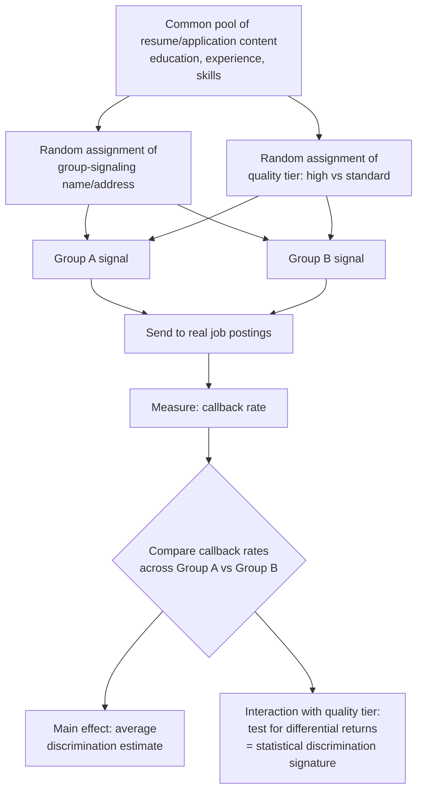

## Audit and Correspondence Studies

### Definition and Purpose

Audit and correspondence studies are field-experimental methodologies designed to measure discrimination directly by creating matched, artificially manipulated applicant or consumer profiles that differ **only** in a signal of group membership (name, address, photograph, disclosed characteristic), and then measuring differential treatment (callback rates, offer rates, prices, service quality) across otherwise identical profiles. These methods were developed specifically to address the central identification problem plaguing observational wage-gap studies: since observational data can never fully control for every productivity-relevant characteristic, any residual gap (as in Oaxaca-Blinder decomposition) remains contaminated by potential omitted-variable bias. Audit and correspondence studies solve this by **randomizing group signal assignment** across genuinely identical (or randomly varied and counterbalanced) underlying credentials, isolating the causal effect of the group signal itself.

### Correspondence Studies vs. In-Person Audit Studies

The two principal methodological variants differ in their mode of applicant presentation and carry distinct trade-offs:

**Correspondence studies**: Involve sending only written or electronic application materials (resumes, cover letters, rental inquiries) with manipulated name, address, or other group-signaling text, without any in-person or live interaction. The employer/landlord/seller responds (or not) based solely on the written materials.

- **Advantage**: Eliminates experimenter/confederate behavioral variation as a confound, since there is no live interaction to inadvertently signal something beyond the manipulated variable (e.g., a confederate's nervousness, accent inflection, or unconscious behavioral difference).
- **Limitation**: Can only measure the earliest stage of a hiring/rental/sales process (e.g., callback for interview), not final outcomes (hiring, wage offers, final terms), since escalating to a full in-person interaction would require a live confederate.

**In-person (matched-pair) audit studies**: Involve trained confederates (auditors), matched on observable characteristics other than the treatment variable (similar age, dress, communication style), who complete real application, interview, or purchase processes in person.

- **Advantage**: Can measure later-stage outcomes — actual job offers, negotiated wages, sales prices, apartment showings — not observable in correspondence-only designs.
- **Limitation**: Introduces potential confederate-behavior confounds (despite training, subtle behavioral differences between paired auditors of different groups can occur and are difficult to fully rule out), raises higher ethical and cost burdens (real time commitment from real firms/individuals), and generally permits smaller sample sizes than correspondence studies, since scaling requires recruiting, training, and deploying live auditor pairs.

### Formal Design Logic

The core identifying assumption is that, conditional on the randomized (or fully counterbalanced) assignment of the group-signaling characteristic, all other elements of the profile are **held constant or balanced** across treatment arms:

$$E[\text{Callback} \mid \text{Group} = A, \mathbf{X}] = E[\text{Callback} \mid \text{Group} = B, \mathbf{X}]^{H_0}$$

Under the null hypothesis of no discrimination, callback rates should be statistically indistinguishable across groups **conditional on identical (or randomized) $\mathbf{X}$**. The estimated treatment effect is typically reported as either the raw callback-rate difference or a **callback ratio**:

$$\text{Callback Ratio} = \frac{P(\text{Callback} \mid \text{Group A})}{P(\text{Callback} \mid \text{Group B})}$$

Because assignment of the group signal is randomized (or systematically rotated/counterbalanced across resume templates to avoid confounding with any particular resume's specific content), any statistically significant difference in the response rate can be attributed causally to the group signal itself, rather than to any underlying unobserved productivity difference — directly addressing the identification limitation of observational decomposition methods.

### The Canonical Design: Bertrand and Mullainathan (2004)

The most widely cited correspondence study in the racial discrimination literature is Bertrand and Mullainathan's "Are Emily and Greg More Employable Than Lakisha and Jamal?" (2004), which sent fictitious resumes to real job postings in Boston and Chicago newspapers, randomly assigning distinctively White-sounding names (e.g., Emily, Greg) or distinctively Black-sounding names (e.g., Lakisha, Jamal) to otherwise identical resumes, while also randomly varying resume quality (some resumes featuring stronger qualifications than others) to test whether higher-quality resumes reduced the racial gap in callbacks.

**Key design features illustrating best practice in the method**:

- Resume content (education, experience, skills) was drawn from a common pool and randomly assigned across name conditions, ensuring no systematic correlation between name and underlying qualification.
- Multiple resume templates were used and rotated across job postings to avoid any single resume template driving the results.
- The quality-manipulation cross-cut with the name manipulation, allowing a test of whether the "return to resume quality" differed by racial signal — a design innovation that moved beyond a simple average-treatment-effect estimate to test for **effect heterogeneity** consistent with statistical-discrimination-style differential signal weighting.

This basic design template — random assignment of a group signal onto matched underlying content, with a secondary manipulation to test heterogeneity — has become the standard architecture replicated across dozens of subsequent studies in employment, housing, and consumer-market discrimination research.

### Diagram: Correspondence Study Design Architecture

### Illustration: Interpreting the Callback Gap by Resume Quality (svg_diagram)

<svg xmlns="http://www.w3.org/2000/svg" viewBox="0 0 640 380">
<text x="320" y="24" text-anchor="middle" font-size="15" font-weight="bold" fill="#1a1a1a">Callback Rate by Group Signal and Resume Quality (svg_diagram)</text>
<line x1="90" y1="320" x2="580" y2="320" stroke="#333" stroke-width="1.5" />
<line x1="90" y1="320" x2="90" y2="60" stroke="#333" stroke-width="1.5" />
<text x="335" y="350" text-anchor="middle" font-size="12" fill="#333">Resume Quality Tier</text>
<text x="45" y="190" text-anchor="middle" font-size="12" fill="#333" transform="rotate(-90 45 190)">Callback Rate</text>

<text x="180" y="340" text-anchor="middle" font-size="10" fill="#333">Standard</text>

<text x="440" y="340" text-anchor="middle" font-size="10" fill="#333">High Quality</text>

<rect x="140" y="230" width="45" height="90" fill="#264653" opacity="0.85" />
<rect x="400" y="150" width="45" height="170" fill="#264653" opacity="0.85" />

<rect x="195" y="270" width="45" height="50" fill="#d64550" opacity="0.85" />
<rect x="455" y="240" width="45" height="80" fill="#d64550" opacity="0.85" />

<line x1="250" y1="230" x2="250" y2="270" stroke="#000" stroke-width="1" />
<text x="255" y="255" font-size="9" fill="#000">gap</text>
<line x1="510" y1="150" x2="510" y2="240" stroke="#000" stroke-width="1" />
<text x="515" y="200" font-size="9" fill="#000">larger gap</text>

<rect x="470" y="70" width="14" height="14" fill="#264653" opacity="0.85" />
<text x="488" y="82" font-size="9" fill="#1a1a1a">Group A</text>
<rect x="470" y="90" width="14" height="14" fill="#d64550" opacity="0.85" />
<text x="488" y="102" font-size="9" fill="#1a1a1a">Group B</text>

<text x="335" y="365" text-anchor="middle" font-size="9" fill="#555">A widening gap at higher quality (as in Bertrand-Mullainathan) is inconsistent with pure information-based statistical discrimination narrowing at higher signal precision</text>

</svg>

### Application Domains Beyond Employment

The audit/correspondence methodology has been extensively extended beyond hiring callback studies:

- **Housing/rental markets**: Testing racial or other group-based discrimination in landlord response rates to rental inquiries, apartment showing offers, and quoted rental terms — a domain with a long history predating the modern correspondence-study literature (e.g., HUD-sponsored in-person paired-testing audits of rental and sales markets).
- **Consumer/retail markets**: Testing price quotes or negotiation outcomes offered to different racial or gender groups in contexts such as automobile purchase negotiation (a classic early audit study domain) or online marketplace transactions (e.g., studies using online peer-to-peer platforms with randomized seller/buyer profile photos).
- **Credit and lending markets**: Testing loan approval rates and quoted terms using matched loan applications differing only in applicant race or gender signals.
- **Within-firm promotion and mentorship**: More recent extensions test discrimination in responses to informal networking or mentorship requests (e.g., emails to faculty requesting mentorship, varying sender name to signal race/gender), extending the method beyond formal hiring gatekeeping to informal opportunity-access channels.
- **Platform/gig economy discrimination**: Testing discrimination in ride-sharing, short-term rental, and freelance-platform contexts using manipulated profile photos or names, an active and growing area given the proliferation of two-sided digital marketplaces with visible user profiles.

### Distinguishing Taste-Based from Statistical Discrimination Using Audit Design

As referenced in the statistical discrimination literature, audit/correspondence studies can be extended to help **distinguish** taste-based from statistical mechanisms, though this remains methodologically challenging and no single design fully resolves the distinction:

- **Resume informativeness manipulation** (as in Bertrand-Mullainathan): If the group-signal gap **narrows** as resume quality/informativeness increases, this is consistent with a statistical-discrimination interpretation (better individual signal reduces reliance on the group prior). If the gap **persists or widens** at higher quality, this is harder to reconcile with a pure statistical-discrimination account and is more consistent with taste-based discrimination or a differential-signal-weighting variant of statistical discrimination (Phelps-style differential shrinkage, where even a strong individual signal is discounted more heavily for the disadvantaged group).
- **Varying market competitiveness across study sites**: Comparing callback gaps across labor markets or firms with differing degrees of product-market competition tests Becker's prediction that taste-based discrimination should be smaller where competitive pressure is stronger — a prediction not shared by pure statistical-discrimination theory, which is not predicted to erode under competition.
- **Removing versus retaining other statistical proxies**: Comparing results when only the primary group signal (name) is varied versus when secondary correlated signals (address/neighborhood, extracurricular activities suggestive of socioeconomic status) are also present or removed can help isolate whether observed discrimination operates through the primary signal alone or through correlated statistical proxies — directly relevant to the "ban the box"-style substitution-effect concern discussed in the statistical discrimination and anti-discrimination law literature.

### Methodological Critiques and Limitations

1. **External validity to final outcomes**: Correspondence studies measure only the earliest-stage response (callback), which may not proportionally translate into final hiring or wage-offer discrimination; the relationship between callback-stage discrimination and ultimate labor market outcome gaps is not mechanically one-to-one, and some researchers caution against over-extrapolating callback-gap magnitudes to overall wage-gap explanatory power.
2. **Confederate/researcher demand effects (in-person audits)**: Despite matching and training protocols, subtle unconscious behavioral differences between paired confederates remain a persistent, difficult-to-fully-eliminate threat to internal validity in live-interaction audit designs.
3. **Ecological validity of fictitious applications**: Real employers may behave differently when they later discover (or suspect) that applications are part of a study, or fictitious applications may fail to fully replicate the informational richness of genuine applications (e.g., real interview performance, informal reference-checking), potentially limiting generalizability to real hiring decisions.
4. **Publication and researcher degrees-of-freedom concerns**: As with the broader empirical social science literature, effect-size heterogeneity across audit studies conducted in different periods, markets, and with different design choices (which names/signals are chosen to represent a group, which is itself a substantive and consequential methodological decision) raises standard meta-analytic concerns about comparability and aggregation across the literature.
5. **Ethical considerations**: Correspondence studies typically involve deceiving real firms/landlords/individuals without their consent, raising research-ethics questions that have been addressed differently across academic institutional review processes and are the subject of ongoing methodological and ethical discussion in the field.

### Key Points

- Audit and correspondence studies are field experiments that randomize a group-signaling characteristic across matched profiles to causally identify discrimination, addressing the omitted-variable-bias limitation of observational decomposition methods.
- Correspondence studies (written-only) avoid confederate-behavior confounds but can only measure early-stage outcomes (callbacks); in-person audits can measure later-stage outcomes but introduce potential confederate-matching confounds.
- Bertrand and Mullainathan (2004) established the canonical design template: randomized name assignment crossed with a resume-quality manipulation, enabling tests of discrimination heterogeneity.
- Comparing how the discrimination gap responds to resume quality/informativeness and to market competitiveness offers (imperfect) empirical traction on distinguishing taste-based from statistical discrimination mechanisms.
- The methodology has been extended well beyond employment to housing, credit, consumer/retail, informal mentorship access, and gig-economy platform contexts.
- Key limitations include uncertain external validity to final labor market outcomes, potential confederate confounds, ecological validity concerns, and research-ethics questions regarding deception of real market participants.

**Related Topics**

- Bertrand and Mullainathan (2004) and its extensions/replications
- Taste-based vs. statistical discrimination: distinguishing empirical signatures
- HUD paired-testing audit methodology in housing markets
- "Ban the box" policy and statistical discrimination substitution effects
- Oaxaca-Blinder decomposition as the complementary observational method
- Research ethics in deception-based field experiments
- Platform/gig economy discrimination studies
- Anti-discrimination law: using audit evidence in litigation and enforcement