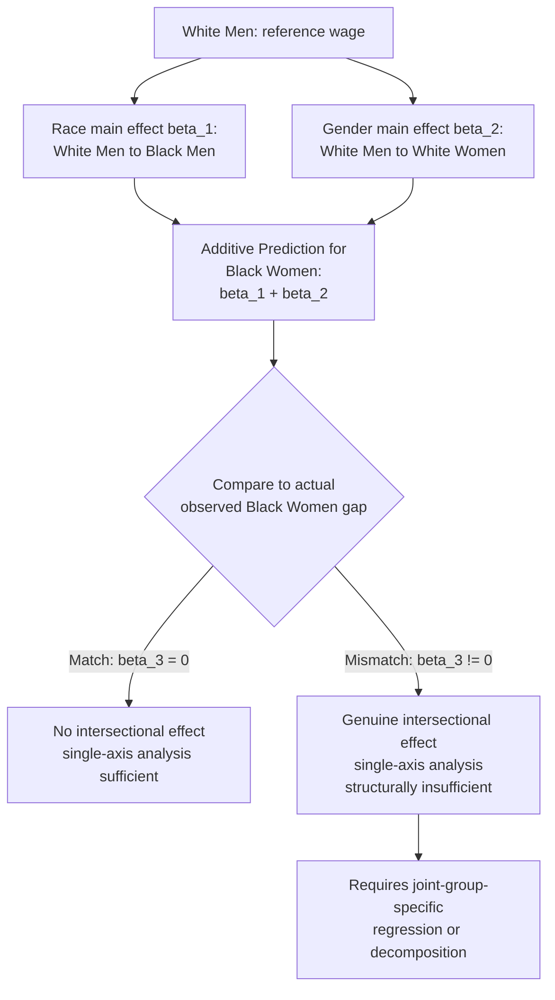

## Intersectionality in Labor Market Outcomes

### Definition and Conceptual Origin

Intersectionality, as a framework applied to labor market outcomes, refers to the analysis of how multiple, simultaneously held group identities (race, gender, ethnicity, disability, class, and others) combine to produce labor market outcomes that are **not predictable from the separate, additive effects of each identity alone**. The term originates in legal scholarship — most influentially Kimberlé Crenshaw's 1989 analysis of employment discrimination case law, which demonstrated that antidiscrimination doctrine treating race and sex as separate, independently litigable categories systematically failed to recognize discrimination experienced specifically by Black women, since courts often required plaintiffs to prove discrimination matched *either* the pattern experienced by white women *or* the pattern experienced by Black men, with neither comparison capturing an intersectional experience distinct from both.

Economically, intersectionality translates into a precise, testable statistical claim: the wage/employment gap for a group defined by the joint occurrence of two characteristics (e.g., Black women) is **not equal to the sum of the separate race gap and the separate gender gap** — there exists a non-zero **interaction effect** beyond the two main effects.

### Formal Statistical Framework: Interaction Effects

Consider a standard log-wage regression with indicator variables for race and gender and their interaction:

$$\ln(w_i) = \beta_0 + \beta_1 Black_i + \beta_2 Female_i + \beta_3(Black_i \times Female_i) + \mathbf{X}_i'\boldsymbol{\gamma} + \varepsilon_i$$

Under this specification:

- $\beta_1$ = the race gap for men (Black men vs. white men, holding other covariates fixed)
- $\beta_2$ = the gender gap for white workers (white women vs. white men)
- $\beta_1 + \beta_2$ = the **additive prediction** for the Black-woman gap if effects were purely additive (no intersectional effect)
- $\beta_3$ = the **intersectional interaction term** — the extent to which the actual Black-woman gap deviates from the additive prediction

$$\text{Actual Black Woman Gap} = \beta_1 + \beta_2 + \beta_3$$

A statistically significant, non-zero $\hat{\beta}_3$ constitutes direct econometric evidence of a genuine intersectional effect: the joint group's outcome cannot be reconstructed by simply summing the separate main effects, which is the core empirical signature intersectionality theory predicts and that reduced-form single-axis analyses (comparing only Black vs. white, or only male vs. female, in isolation) are structurally incapable of detecting.

### Why Single-Axis Analysis Is Insufficient: The Identification Problem

Standard single-axis decomposition approaches — running an Oaxaca-Blinder decomposition or regression separately by race, and separately by gender — implicitly assume the interaction term is zero, or at minimum, do not test for it. This creates two distinct problems documented in the intersectionality-in-economics literature:

1. **Masking via comparison-group averaging**: A gender-only decomposition comparing "all women" to "all men" implicitly averages the female disadvantage across racial subgroups, which can mask a much larger gap for one subgroup (e.g., Black women) offset by a smaller gap for another (e.g., white women) — the aggregate "gender gap" statistic is a composition-weighted average that obscures the underlying heterogeneity.
2. **Non-additivity means neither single-axis comparison is informative about the joint group**: Even a researcher who runs both the race-only and gender-only analyses separately, and mentally adds the two estimated gaps together, will generally arrive at an incorrect prediction for the intersectional group's actual outcome whenever $\beta_3 \neq 0$ — the problem is not solved by simply running two separate analyses and combining results informally.

### Diagram: Additive Prediction vs. Actual Intersectional Outcome

### Illustration: Non-Additivity of Race and Gender Effects (svg_diagram)

<svg xmlns="http://www.w3.org/2000/svg" viewBox="0 0 640 400">
<text x="320" y="24" text-anchor="middle" font-size="15" font-weight="bold" fill="#1a1a1a">Intersectional Non-Additivity: Predicted vs. Actual Wage (svg_diagram)</text>
<line x1="90" y1="340" x2="580" y2="340" stroke="#333" stroke-width="1.5" />
<line x1="90" y1="340" x2="90" y2="60" stroke="#333" stroke-width="1.5" />
<text x="335" y="368" text-anchor="middle" font-size="12" fill="#333">Group</text>
<text x="45" y="200" text-anchor="middle" font-size="12" fill="#333" transform="rotate(-90 45 200)">Log Wage (indexed)</text>

<rect x="110" y="90" width="55" height="250" fill="#264653" opacity="0.85" />
<text x="137" y="355" text-anchor="middle" font-size="9" fill="#1a1a1a">White Men</text>

<rect x="195" y="150" width="55" height="190" fill="#2b7a78" opacity="0.85" />
<text x="222" y="355" text-anchor="middle" font-size="9" fill="#1a1a1a">White Women</text>

<rect x="280" y="170" width="55" height="170" fill="#f2a541" opacity="0.85" />
<text x="307" y="355" text-anchor="middle" font-size="9" fill="#1a1a1a">Black Men</text>

<rect x="365" y="230" width="55" height="110" fill="none" stroke="#999" stroke-width="2" stroke-dasharray="5,4" />
<text x="392" y="220" text-anchor="middle" font-size="9" fill="#999">Additive prediction</text>

<rect x="440" y="270" width="55" height="70" fill="#d64550" opacity="0.85" />
<text x="467" y="355" text-anchor="middle" font-size="9" fill="#1a1a1a">Black Women (actual)</text>

<line x1="510" y1="230" x2="510" y2="270" stroke="#000" stroke-width="1.5" />
<text x="515" y="255" font-size="10" fill="#000">beta_3 (intersectional residual)</text>

<text x="335" y="382" text-anchor="middle" font-size="9" fill="#555">Actual outcome falls below the sum of separate race and gender effects — a negative intersectional residual</text>

</svg>

### Empirical Findings in the Labor Economics Literature

- **Black women in the U.S. labor market**: A substantial body of empirical work finds that the Black-woman wage gap relative to white men is not fully predicted by summing the (white-women vs. white-men) gender gap and the (Black-men vs. white-men) race gap, with much of this literature documenting a negative interaction — i.e., Black women fare worse than the additive prediction — though the sign, magnitude, and statistical significance of the interaction term vary across datasets, time periods, and covariate specifications. [Inference: precise, current quantitative interaction-term estimates should be sourced from recent primary studies given sensitivity to specification and period.]
- **Occupational segregation as an intersectional channel**: Occupational segregation patterns for Black women are documented in some studies to differ qualitatively from the patterns predicted by simply combining Black men's and white women's respective occupational distributions, consistent with distinct (rather than additive) sorting mechanisms operating at the intersectional level — potentially reflecting compounded statistical discrimination (employers forming beliefs about a joint group rather than applying separate, additive race and gender priors) or compounded network/referral segregation.
- **Asian women and the "bamboo ceiling" intersection**: The vertical-segregation "bamboo ceiling" pattern documented for Asian workers (underrepresentation in senior leadership despite favorable average earnings) has been found in some studies to be more pronounced for Asian women specifically than a simple combination of the Asian-aggregate and female-aggregate leadership-representation gaps would predict, illustrating that intersectional effects are not limited to Black-white/male-female comparisons but generalize across the broader taxonomy of protected characteristics.
- **Disability and gender/race intersections**: A smaller but growing literature examines interaction effects between disability status and race/gender, generally facing greater data limitations (smaller subgroup cell sizes in standard labor force surveys) that constrain the precision of interaction-term estimation relative to the race-gender intersectional literature.

### Methodological Approaches for Intersectional Decomposition

**1. Fully interacted regression** (as formalized above): The most direct approach, but requires sufficient subgroup sample sizes for precise estimation of the interaction term, which can be a binding constraint for narrowly defined intersectional groups (e.g., a specific ethnicity-by-gender-by-disability combination) in standard survey datasets.

**2. Detailed multi-group Oaxaca-Blinder decomposition**: Extensions of the standard two-group decomposition to more than two groups (e.g., four-way: white men, white women, Black men, Black women), typically estimating separate regressions for each of the four cells and using a generalized reference-coefficient approach (extending the Reimers/Cotton/pooled logic from the two-group case) to decompose each pairwise or joint gap into detailed endowment and coefficient components, while explicitly reporting the interaction/non-additivity term as a distinct decomposition element rather than allowing it to be implicitly absorbed.

**3. Difference-in-differences framing**: Framing the interaction term itself as a difference-in-differences estimator — the "difference" in the gender gap "across" the difference in race — provides a familiar econometric interpretation and connects intersectional interaction estimation to standard causal inference terminology and diagnostic tools (e.g., testing parallel-trends-style assumptions where applicable in panel contexts).

**4. Machine-learning/flexible functional form approaches**: Given that intersectionality theory does not specify *a priori* which combinations of characteristics will exhibit significant interaction effects (the framework is agnostic about which intersections matter empirically, an open question rather than a theoretical prior), some recent methodological work applies more flexible, data-driven approaches (e.g., regression trees, LASSO-selected interaction terms across many candidate characteristic combinations) to detect intersectional patterns without requiring the researcher to pre-specify which interactions to test — trading a theory-driven hypothesis-testing approach for an exploratory, discovery-oriented one, with corresponding multiple-testing and overfitting cautions.

### Relationship to the Underlying Discrimination Theories

Intersectionality is not itself a competing theory of discrimination alongside taste-based, statistical, and monopsony models — rather, it is a **statistical and conceptual lens** that can be applied on top of any of those mechanisms to test whether they operate additively or interactively across identity dimensions:

- **Taste-based intersectional discrimination**: An employer's discrimination coefficient could plausibly be non-additive across characteristics — e.g., $d_E(\text{Black woman}) \neq d_E(\text{Black}) + d_E(\text{woman})$ — if prejudice operates against specific, compounded stereotypes associated with the joint category rather than against each characteristic independently, a possibility directly testable using audit/correspondence study designs that manipulate race and gender signals jointly and orthogonally (a 2×2 factorial design), allowing direct estimation of an interaction term in callback rates analogous to $\beta_3$ above.
- **Statistical discrimination and compounded priors**: If employers form beliefs using a joint group-conditional prior (rather than separately updating on race and then on gender), Bayesian statistical discrimination models predict interaction effects whenever the joint-group productivity distribution genuinely differs from what separate race and gender priors would imply — connecting directly to the self-fulfilling-equilibrium mechanism discussed in the statistical discrimination literature, now operating at the intersectional-group level.
- **Monopsony and compounded elasticity constraints**: If mobility constraints (childcare responsibility, network access) operate multiplicatively rather than additively for intersectional groups — e.g., a Black woman facing both race-correlated network exclusion and gender-correlated mobility constraints simultaneously — the resulting labor supply elasticity to the firm could be lower than either constraint alone would predict, generating a compounded monopsony markdown.

### Policy and Measurement Implications

1. **Anti-discrimination law's single-axis structure**: As Crenshaw's original legal analysis emphasized, doctrinal frameworks requiring plaintiffs to prove discrimination "because of race" or "because of sex" as separate causes of action can structurally fail to recognize intersectional discrimination claims, motivating legal-economic scholarship on how disparate treatment and disparate impact doctrine might be adapted to test for joint-category discrimination directly.
2. **Survey and administrative data limitations**: Standard labor force surveys are often underpowered for precise intersectional subgroup estimation due to small cell sizes, creating a persistent data-adequacy constraint on the intersectional empirical literature relative to single-axis studies, and motivating pooled multi-year survey data, administrative data (with much larger sample sizes), or specialized oversampling designs.
3. **Targeting of workplace diversity and pay-equity interventions**: Aggregate, single-axis diversity metrics (overall percent female, overall percent Black) can mask persistently poor outcomes for intersectional subgroups even as aggregate single-axis metrics improve, motivating disaggregated reporting requirements in some contemporary pay-equity and diversity-audit policy proposals.

### Key Points

- Intersectionality in labor economics translates into a precise statistical claim: outcomes for a group defined by multiple characteristics are not the simple sum of each characteristic's separate main effect, formalized via a non-zero interaction term ($\beta_3$) in a fully interacted regression.
- Single-axis analyses (race-only or gender-only) are structurally incapable of detecting or correctly predicting intersectional effects, both due to averaging-based masking and genuine non-additivity.
- Methodological approaches include fully interacted regression, multi-group Oaxaca-Blinder extensions, difference-in-differences framing, and increasingly, flexible/exploratory machine-learning approaches given the lack of an a priori theory specifying which intersections matter.
- Intersectionality is a statistical/conceptual lens applicable across all major discrimination theories (taste-based, statistical, monopsony), each of which can be tested for additive versus interactive operation across identity dimensions.
- Key empirical and policy challenges include small subgroup sample sizes limiting estimation precision, and the single-axis structure of much existing anti-discrimination doctrine and diversity-metric reporting.

**Related Topics**

- Crenshaw's legal-scholarship origin of intersectionality theory
- Multi-group and detailed Oaxaca-Blinder decomposition extensions
- 2×2 factorial audit/correspondence study designs
- The Racial Wage Gap and The Gender Wage Gap as component single-axis analyses
- Statistical discrimination and compounded Bayesian priors
- Occupational segregation: intersectional sorting patterns
- Anti-discrimination law: doctrinal challenges to single-axis claims
- Small-sample and data-adequacy challenges in subgroup labor market research