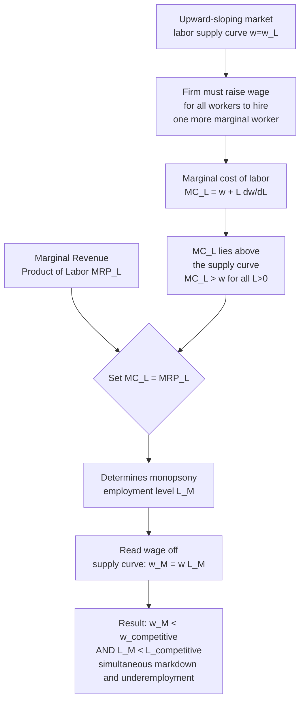

## Classical Monopsony Theory

### Definition and Historical Origin

Classical monopsony theory analyzes labor markets in which a **single buyer of labor** (or, in the broader "oligopsony" extension, a small number of buyers) faces the entire market supply curve of labor, giving that employer market power over the wage it pays — the mirror image of monopoly power on the product-market selling side. The foundational formalization is due to Joan Robinson's *The Economics of Imperfect Competition* (1933), which extended the theory of monopoly to the labor-buying side of the market and established the now-standard result that a monopsonist pays a wage **below** the competitive, marginal-revenue-product wage and hires **less** labor than a competitive market would.

The classical model was originally motivated by "company town" settings — a single dominant employer (a mine, mill, or plantation) in an isolated local labor market where workers have no realistic alternative employer to switch to. Contemporary monopsony theory has substantially broadened this scope (see the discussion of modern search-based monopsony below), but the classical, single-buyer textbook model remains the essential analytical starting point.

### The Core Distinction from Perfect Competition: The Labor Supply Curve Facing the Firm

In a perfectly competitive labor market, each individual firm is a **wage taker**: it faces a perfectly elastic (horizontal) labor supply curve at the market wage, since it is one of many firms competing for workers, and any single firm's hiring decision has no effect on the market wage.

$$\text{Competitive firm: } w = \bar{w} \text{ (constant, independent of } L_{firm})$$

A monopsonist, by contrast, **is** the (or a dominant) buyer of labor in its market, so it faces the **entire upward-sloping market labor supply curve**:

$$w = w(L), \quad \frac{dw}{dL} > 0$$

To hire additional workers, the monopsonist must raise the wage — and critically, under the standard assumption of a single, non-discriminating wage paid to all workers, raising the wage to attract the marginal worker means paying that **higher wage to all inframarginal workers already employed** as well (absent wage discrimination, which is treated as a separate extension below).

### Marginal Cost of Labor and the Wedge from the Wage

This "must raise everyone's wage to hire one more worker" feature is the mechanical source of monopsony power. The firm's **total labor cost** is:

$$TC_L = w(L) \cdot L$$

Differentiating with respect to $L$ gives the **marginal cost of labor**:

$$MC_L = \frac{d(TC_L)}{dL} = w(L) + L\frac{dw}{dL}$$

Since $\frac{dw}{dL} > 0$, it follows immediately that:

$$MC_L > w(L)$$

The marginal cost of hiring an additional worker **exceeds** the wage paid to that worker, because hiring the marginal worker also requires raising the wage paid to all existing workers. This wedge between $MC_L$ and $w$ is the defining structural feature distinguishing monopsony from the competitive labor market, where $MC_L = w$ exactly (a horizontal supply curve implies $\frac{dw}{dL} = 0$).

### Profit Maximization and the Monopsony Equilibrium

A profit-maximizing monopsonist sets the marginal cost of labor equal to the marginal revenue product of labor (the standard profit-maximizing hiring rule, applied under monopsony's distinct marginal cost function):

$$MC_L = MRP_L$$

This determines the profit-maximizing **employment level** $L^M$. The firm then pays the wage read off the **supply curve** (not the marginal cost curve) at that employment level:

$$w^M = w(L^M)$$

Because $MC_L > w$ at every point on the supply curve, and because the equilibrium condition uses $MC_L$ (not $w$) equated to $MRP_L$, the resulting monopsony wage and employment level are **both below** the levels that would prevail in a competitive market with the same underlying supply and demand (marginal revenue product) conditions:

$$w^M < w^C, \qquad L^M < L^C$$

This is the classical monopsony result: **wage markdown and employment underprovision relative to the competitive benchmark**, occurring simultaneously — a result that famously reverses the standard competitive-market prediction that a binding minimum wage above the market-clearing wage necessarily reduces employment (discussed further below).

### Diagram: Classical Monopsony Equilibrium Derivation

### Illustration: The Monopsony Diagram (svg_diagram)

<svg viewBox="0 0 640 400" xmlns="http://www.w3.org/2000/svg">
<text x="320" y="24" text-anchor="middle" font-size="15" font-weight="bold" fill="#1a1a1a">Classical Monopsony Equilibrium (svg_diagram)</text>
<line x1="80" y1="340" x2="580" y2="340" stroke="#333" stroke-width="1.5"/>
<line x1="80" y1="340" x2="80" y2="60" stroke="#333" stroke-width="1.5"/>
<text x="330" y="368" text-anchor="middle" font-size="12" fill="#333">Employment (L)</text>
<text x="35" y="200" text-anchor="middle" font-size="12" fill="#333" transform="rotate(-90 35 200)">Wage / Cost</text>
<!-- Supply curve (= average cost) -->
<path d="M 80 320 L 560 100" fill="none" stroke="#264653" stroke-width="2.5"/>
<text x="450" y="130" font-size="11" fill="#264653">Labor Supply S = w(L) = AC_L</text>
<!-- Marginal cost curve, steeper -->
<path d="M 80 320 L 400 90" fill="none" stroke="#d64550" stroke-width="2.5"/>
<text x="330" y="130" font-size="11" fill="#d64550">MC_L</text>
<!-- MRP demand curve, downward sloping -->
<path d="M 80 100 L 560 320" fill="none" stroke="#2b7a78" stroke-width="2.5"/>
<text x="440" y="290" font-size="11" fill="#2b7a78">MRP_L (Demand)</text>
<!-- Monopsony equilibrium: MC=MRP intersection -->
<line x1="290" y1="340" x2="290" y2="203" stroke="#999" stroke-width="1" stroke-dasharray="3,3"/>
<circle cx="290" cy="203" r="4" fill="#000"/>
<text x="230" y="200" font-size="9" fill="#000">MC_L = MRP_L</text>
<!-- Monopsony wage: read off supply curve at L_M -->
<line x1="80" y1="253" x2="290" y2="253" stroke="#264653" stroke-width="1" stroke-dasharray="3,3"/>
<circle cx="290" cy="253" r="4" fill="#264653"/>
<text x="60" y="257" text-anchor="end" font-size="10" fill="#264653">w_M</text>
<!-- Competitive benchmark: S=D intersection -->
<line x1="380" y1="340" x2="380" y2="185" stroke="#999" stroke-width="1" stroke-dasharray="2,2"/>
<circle cx="380" cy="185" r="4" fill="#333"/>
<line x1="80" y1="185" x2="380" y2="185" stroke="#333" stroke-width="1" stroke-dasharray="2,2"/>
<text x="60" y="189" text-anchor="end" font-size="10" fill="#333">w_C</text>

<text x="290" y="358" text-anchor="middle" font-size="9" fill="`#264653`">L_M</text>

<text x="380" y="358" text-anchor="middle" font-size="9" fill="#333">L_C</text>

<!-- markdown bracket -->
<line x1="300" y1="185" x2="300" y2="253" stroke="#d64550" stroke-width="1.5"/>
<text x="305" y="222" font-size="9" fill="#d64550">wage markdown</text>

<text x="330" y="382" text-anchor="middle" font-size="9" fill="#555">Monopsonist hires L_M < L_C at wage w_M < w_C, simultaneously underemploying and underpaying relative to the competitive benchmark</text>

</svg>

### Deadweight Loss and Welfare Analysis

Because monopsony restricts employment below the competitive level, it generates a **deadweight loss** analogous to that of product-market monopoly, representing foregone mutually beneficial transactions between workers (willing to work at wages between $w^M$ and $w^C$) and the firm (whose marginal revenue product exceeds those wages over that range of employment):

$$DWL = \frac{1}{2}(L^C - L^M)(MRP_{L^M} - w^M)$$

Unlike product-market monopoly (where the deadweight loss falls purely on consumers and is a pure efficiency loss with no offsetting transfer beyond monopoly profit), monopsony's welfare analysis has a distinctive feature: part of what would have been worker surplus under competition is **transferred** to the firm as monopsony profit (the firm captures the gap between $MRP_L$ and $w^M$ on all $L^M$ units of labor actually hired), while the deadweight-loss triangle represents transactions that simply do not occur at all — jobs that would have been mutually beneficial at the competitive wage but are not created under monopsony.

### The Minimum Wage Reversal Result

The most celebrated and policy-relevant theoretical result of classical monopsony theory is that, under monopsony (unlike under perfect competition), a **binding minimum wage set between $w^M$ and $w^C$ can simultaneously raise both the wage and employment**.

**Mechanism**: A minimum wage $w_{min}$, where $w^M < w_{min} \leq w^C$, effectively makes the labor supply curve **horizontal** at $w_{min}$ for all employment levels up to the point where the minimum wage curve intersects the original supply curve, because the firm can now hire additional workers at the fixed minimum wage without needing to bid up the wage paid to inframarginal workers (the legal wage floor, not the firm's own wage-setting decision, now governs the terms). This eliminates the $MC_L > w$ wedge over the relevant range — effectively, the minimum wage flattens the firm's marginal cost curve to equal $w_{min}$ up to the point of intersection with the original supply curve, restoring $MC_L = w_{min} = MRP_L$ at a **higher** employment level than $L^M$.

$$\text{For } w^M \leq w_{min} \leq w^C: \quad L(w_{min}) \geq L^M$$

This result directly reverses the standard competitive-market minimum-wage prediction (where any binding minimum wage above the market wage necessarily reduces employment) and is the central theoretical mechanism motivating a substantial empirical literature testing whether observed minimum-wage employment effects are more consistent with the competitive or the monopsony model — a debate significantly reshaped by influential empirical work (e.g., Card and Krueger's fast-food minimum wage studies) finding employment effects more consistent with monopsony-type dynamics than the simple competitive prediction in some contexts. [Unverified: the broader empirical minimum-wage-employment literature remains actively contested and highly context-dependent; specific current empirical consensus should be verified against recent primary sources.]

### Wage Discrimination Extension: Perfect (First-Degree) Monopsony

The baseline model above assumes the monopsonist must pay a **single, uniform wage** to all workers. A distinct extension considers a **wage-discriminating monopsonist** who can pay each worker their individual reservation wage (analogous to first-degree price discrimination in product markets):

- Under perfect wage discrimination, the firm's marginal cost of the marginal worker equals that worker's reservation wage exactly (since hiring the marginal worker no longer requires raising the wage paid to inframarginal workers, who each continue receiving their own, lower, individually negotiated wage).
- This restores $MC_L = w(L)$ along the supply curve (rather than the steeper $MC_L$ curve of the uniform-wage case), and the firm hires up to the point where $w(L) = MRP_L$ — **the same employment level as the competitive outcome**, $L^M_{discriminating} = L^C$.
- However, **every worker except the very last one hired is paid strictly less than their competitive-market wage** (since each receives only their own reservation wage rather than the market-clearing wage), meaning wage discrimination restores efficient employment levels while **redistributing the entire competitive worker surplus to the firm** as monopsony profit — an important theoretical nuance showing that "efficient employment" and "no exploitation" are separate, dissociable properties of a labor market equilibrium.

This wage-discrimination variant is directly relevant to the monopsony-based discrimination theory discussed elsewhere, where firms are shown to profitably set **different wages by demographic group** based on differential group-level labor supply elasticity — a real-world, imperfect (third-degree, group-based rather than fully individual) analog of the perfect-discrimination extension described here.

### Measuring Monopsony Power: The Elasticity of Labor Supply to the Firm

The standard summary statistic for the degree of monopsony power a firm possesses is the **firm-level labor supply elasticity**, $\varepsilon = \frac{dL}{dw}\cdot\frac{w}{L}$, which directly determines the size of the wage markdown via the standard monopsony markdown formula:

$$\frac{w}{MRP_L} = \frac{\varepsilon}{1+\varepsilon}$$

- As $\varepsilon \to \infty$ (perfectly elastic supply, the competitive benchmark), the markdown ratio $\to 1$, and $w \to MRP_L$ — the competitive outcome.
- As $\varepsilon \to 0$ (perfectly inelastic firm-specific supply, extreme monopsony power), the markdown ratio $\to 0$, and the firm can pay an arbitrarily small wage relative to $MRP_L$.

This elasticity-markdown relationship is the direct theoretical bridge connecting classical monopsony theory to the monopsony-based discrimination framework, where differential $\varepsilon_g$ across demographic groups (rather than differential market structure across firms) generates within-firm, group-specific wage markdowns from an otherwise common $MRP_L$.

### From Classical Single-Buyer Monopsony to Modern Search-Based Monopsony

Classical monopsony theory's reliance on a literal single-employer setting (the "company town" model) was long viewed as a special case of limited real-world applicability, since most labor markets feature multiple competing employers. Modern monopsony theory (most comprehensively developed in Alan Manning's *Monopsony in Motion*, 2003) generalizes the classical framework by showing that **any labor market with search frictions** — where workers face costs (time, information, relocation) in finding and switching between employers — generates an upward-sloping firm-level labor supply curve **even when many employers compete**, because a firm's wage offer affects its recruitment and retention rates gradually and continuously, rather than triggering an instantaneous, complete exodus of all its workers to any marginally higher-paying competitor.

This "dynamic monopsony" or "search-based monopsony" reframing is significant because it implies monopsony-consistent markdown behavior can be **pervasive** across ordinary, multi-employer labor markets, not confined to literal single-employer settings — substantially broadening the theory's empirical relevance and connecting it directly to the modern monopsony-based discrimination literature, which relies on exactly this generalized, search-friction-based mechanism rather than a literal single-buyer assumption.

### Key Points

- Classical monopsony theory (Robinson, 1933) analyzes a single-buyer labor market where the firm faces the entire upward-sloping market labor supply curve, generating a marginal cost of labor that exceeds the wage.
- Profit maximization under monopsony ($MC_L = MRP_L$) produces both a wage markdown and reduced employment relative to the competitive benchmark, generating a deadweight loss alongside a worker-to-firm surplus transfer.
- A binding minimum wage set between the monopsony and competitive wage can simultaneously raise both wages and employment — a direct reversal of the standard competitive-market prediction, and the theory's most policy-significant result.
- Perfect wage discrimination restores competitive employment levels while fully transferring worker surplus to the firm, showing efficiency and non-exploitation are theoretically separable properties.
- The wage markdown is governed by the firm-level labor supply elasticity via $w/MRP_L = \varepsilon/(1+\varepsilon)$, the same formula underlying monopsony-based discrimination theory.
- Modern search-based monopsony theory (Manning) generalizes the classical single-buyer model to ordinary multi-employer markets with search frictions, substantially broadening the theory's real-world applicability.

**Related Topics**

- Monopsony-Based Theories of Discrimination and group-specific elasticity markdowns
- Manning's dynamic/search-based monopsony framework
- Minimum wage employment effects: competitive vs. monopsony predictions
- Card and Krueger and the empirical minimum-wage-monopsony literature
- Deadweight loss analysis in imperfectly competitive markets
- Wage discrimination and third-degree price discrimination analogs
- Labor market concentration (HHI) as a monopsony power proxy
- Search-and-matching models of labor market frictions