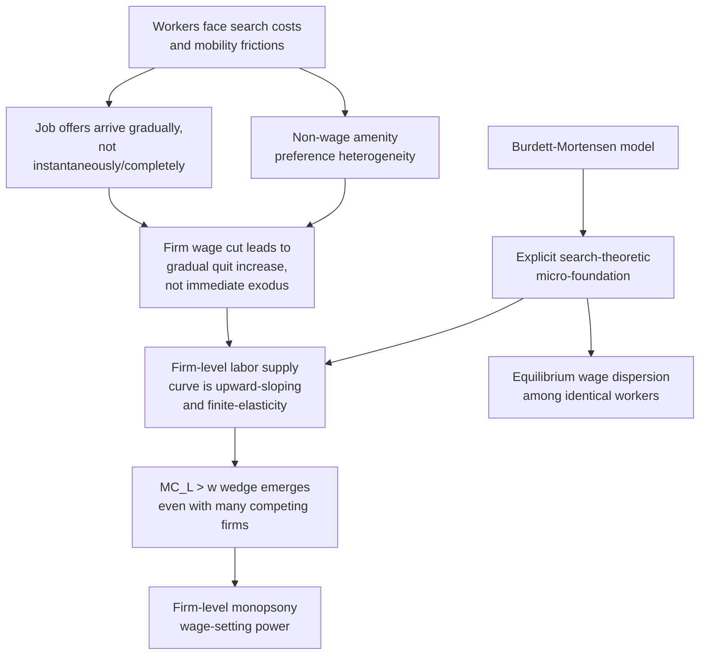

## Modern Dynamic Monopsony Models

### Definition and Motivation

Modern dynamic monopsony models generalize classical monopsony theory beyond the "single dominant employer / company town" setting to explain how wage-setting power can arise **even in labor markets with many competing employers**, provided the market features search and mobility frictions. The foundational reformulation is Alan Manning's *Monopsony in Motion: Imperfect Competition in Labor Markets* (2003), which reframes monopsony not as a special-case market structure but as the **generic** outcome of any labor market where workers cannot instantaneously and costlessly reallocate to the highest-paying employer in response to a wage differential.

The core motivating observation is empirical: classical monopsony theory, requiring a literal single buyer, seemed to apply only to rare, geographically isolated settings. Yet extensive labor-supply-elasticity estimation across ordinary, multi-employer labor markets consistently finds **finite, often quite low, firm-level labor supply elasticities** — inconsistent with the perfectly elastic supply curve assumed under textbook perfect competition, but not requiring literal single-buyer market structure to explain. Dynamic monopsony theory provides the micro-founded mechanism connecting search frictions directly to this finite-elasticity finding.

### Core Mechanism: Search Frictions Generate Firm-Specific Upward-Sloping Supply

In a frictionless labor market, if Firm A pays even marginally less than Firm B for identical work, all of Firm A's workers should instantaneously quit for Firm B, and Firm A should be unable to recruit anyone — implying an infinitely elastic (horizontal) firm-level labor supply curve, the textbook competitive assumption. Dynamic monopsony theory replaces this with a **continuous, gradual** relationship between a firm's relative wage and its workforce size, arising from the standard building blocks of search-and-matching theory:

1. **Costly search**: Workers do not have complete, costless information about all wage offers in the market; finding and evaluating alternative job offers takes time and effort.
2. **Costly mobility**: Switching employers often involves relocation, retraining, loss of firm-specific human capital, or disruption to non-work commitments, creating switching costs beyond pure search time.
3. **Preference heterogeneity over non-wage job attributes**: Workers differ in how they value commute distance, schedule flexibility, workplace culture, and other non-wage amenities, meaning even a wage-inferior employer retains workers who place high value on its non-wage attributes — a form of *product differentiation* on the labor-buying side, directly analogous to differentiated-product models in industrial organization.

These frictions mean a firm that cuts its wage relative to competitors loses workers **gradually**, through elevated quit rates over time, rather than **instantaneously and completely**. Symmetrically, a firm that raises its wage attracts workers gradually, through higher application/acceptance rates and lower quit rates, rather than instantaneously capturing the entire market. This gradual responsiveness is formally equivalent to the firm facing an **upward-sloping, finite-elasticity labor supply curve** — precisely the condition generating classical monopsony's $MC_L > w$ wedge — even though the market may contain hundreds of competing employers.

### Formal Framework: The Burdett-Mortensen Search Model

The theoretical workhorse underlying much of modern dynamic monopsony theory is the **Burdett-Mortensen (1998) equilibrium search model**, which provides an explicit, micro-founded derivation of an upward-sloping firm-level labor supply curve from search-theoretic primitives.

**Key building blocks**:

- Workers receive job offers at some arrival rate (while employed and while unemployed), drawn from the market-wide distribution of wage offers.
- Workers employed at a firm quit to another firm whenever they receive an offer with a strictly higher wage (**on-the-job search**), and separate to unemployment at some exogenous separation rate.
- Firms post wages to maximize steady-state profit, taking as given that their wage choice determines both their recruitment rate (higher wage attracts more applicants/offer-acceptances) and their retention rate (higher wage reduces the probability an existing worker receives and accepts a better outside offer).

**Steady-state firm-level labor supply**: In steady state, a firm's workforce size is determined by the balance between its recruitment inflow and its separation outflow (voluntary quits to better offers plus exogenous separations):

$$L(w) = \frac{\text{Inflow rate}(w)}{\text{Outflow rate}(w)}$$

Both the inflow and outflow rates are continuous, smooth functions of the firm's relative wage position within the market-wide wage-offer distribution, which is precisely what generates a smooth, continuous (rather than discontinuous, "all-or-nothing") relationship between $w$ and $L$ — the upward-sloping supply curve required for monopsony-consistent wage-setting, derived here from explicit search primitives rather than assumed as a reduced-form supply curve.

**Key equilibrium prediction — wage dispersion among identical workers**: A distinctive and much-discussed prediction of the Burdett-Mortensen framework is that **equilibrium wage dispersion persists even among perfectly homogeneous workers and firms** — different firms post different wages in equilibrium, and identical workers can end up earning different wages purely due to which firm they happened to match with, since search frictions prevent the instantaneous wage-equalizing arbitrage that would occur in a frictionless (Bertrand-style) market. This is a striking departure from the "law of one price" intuition of frictionless competitive labor markets and has motivated a substantial empirical literature testing for and measuring residual, within-observable-cell wage dispersion as indirect evidence of monopsony-consistent search frictions.

### Diagram: From Search Frictions to Firm-Level Monopsony Power

### Illustration: Firm-Specific Elasticity from a Recruitment/Retention Perspective (svg_diagram)

<svg xmlns="http://www.w3.org/2000/svg" viewBox="0 0 640 380">
<text x="320" y="24" text-anchor="middle" font-size="15" font-weight="bold" fill="#1a1a1a">Dynamic Monopsony: Recruitment and Separation Curves (svg_diagram)</text>
<line x1="90" y1="320" x2="580" y2="320" stroke="#333" stroke-width="1.5" />
<line x1="90" y1="320" x2="90" y2="60" stroke="#333" stroke-width="1.5" />
<text x="335" y="350" text-anchor="middle" font-size="12" fill="#333">Firm's relative wage offer</text>
<text x="45" y="190" text-anchor="middle" font-size="12" fill="#333" transform="rotate(-90 45 190)">Rate (recruits/separations)</text>

<path d="M 110 300 Q 300 220 560 100" fill="none" stroke="#2b7a78" stroke-width="2.5" />
<text x="430" y="150" font-size="11" fill="#2b7a78">Recruitment rate (increasing in wage)</text>

<path d="M 110 100 Q 300 200 560 300" fill="none" stroke="#d64550" stroke-width="2.5" />
<text x="150" y="130" font-size="11" fill="#d64550">Separation rate (decreasing in wage)</text>

<circle cx="335" cy="200" r="5" fill="#000" />
<line x1="335" y1="200" x2="335" y2="320" stroke="#999" stroke-width="1" stroke-dasharray="3,3" />
<text x="340" y="335" font-size="10" fill="#333">steady-state workforce size</text>

<text x="335" y="365" text-anchor="middle" font-size="9" fill="#555">Both curves respond smoothly, not discontinuously, to the firm's wage — the source of finite firm-level supply elasticity</text>

</svg>

### Empirical Estimation Strategies

Modern dynamic monopsony theory has generated a substantial and methodologically diverse empirical program aimed at estimating firm-level labor supply elasticities and testing monopsony-consistent predictions directly:

1. **Separation-elasticity method**: Estimates the firm-level labor supply elasticity indirectly via the elasticity of the **quit/separation rate** with respect to the wage, using the theoretical relationship between recruitment/separation elasticities and the overall labor supply elasticity implied by steady-state search models (a widely used approach given that separations are often more readily observable in administrative or survey panel data than direct recruitment flows).
2. **Firm-level wage-employment regression using firm-specific demand or productivity shocks**: Using exogenous shocks to firm-level labor demand (e.g., firm-specific productivity shocks, demand shocks, or policy changes affecting specific firms) as instruments to trace out the firm's labor supply curve directly, addressing the standard simultaneity problem in jointly observing wage and employment.
3. **Minimum wage bunching and employment-effect estimation**: Testing whether minimum wage increases produce employment effects consistent with the monopsony-reversal prediction (null or positive employment effects over some range) versus the standard competitive prediction (negative employment effects), used as an indirect test of monopsony power's empirical relevance across labor market segments.
4. **Employer concentration (HHI) and wage-level correlation studies**: Testing whether local labor market concentration (measured via a Herfindahl-Hirschman Index computed over employer market shares within a local labor market/occupation cell) is negatively correlated with wages, controlling for productivity — a reduced-form test of the monopsony prediction that more concentrated (fewer-employer) markets should exhibit lower wages for a given productivity level, without requiring direct elasticity estimation.
5. **Employer mergers as natural experiments**: Using merger events between competing employers in a local labor market as a source of exogenous, plausibly identified variation in labor market concentration, testing whether post-merger wage growth slows relative to comparable non-merging markets — a design that has produced some of the most credible causal estimates of concentration's wage effects in the modern literature.

### Non-Wage Amenities and the Compensating Differential Connection

A key modeling extension within dynamic monopsony theory incorporates heterogeneous worker preferences over **non-wage job characteristics** (schedule flexibility, commute distance, workplace culture, remote-work options) directly into the search-and-matching framework, generating a labor supply curve to the firm that depends not just on relative wage but on the full bundle of job attributes offered:

$$L_{firm} = L(w_{firm}, \mathbf{A}_{firm}; w_{market}, \mathbf{A}_{market})$$

Where $\mathbf{A}_{firm}$ represents the firm's bundle of non-wage attributes relative to competitors. This extension is directly relevant to the monopsony-based discrimination literature discussed elsewhere, since it formalizes why groups with systematically different valuations of specific non-wage amenities (e.g., schedule flexibility, tied disproportionately to household/childcare responsibilities) can exhibit lower firm-level labor supply elasticity **even in a highly competitive, many-employer market** — the amenity-heterogeneity mechanism is precisely a dynamic-monopsony-theoretic formalization of one of the leading explanations for differential group elasticity discussed in that theory.

### Connections to Related Modern Literatures

**1. New monopsony and the minimum wage debate**: Dynamic monopsony theory provides the primary theoretical grounding for the "new monopsony" school within the minimum wage literature, which interprets empirical findings of null or positive minimum-wage employment effects (contested against the traditional competitive-model prediction) as evidence that many real-world, low-wage labor markets exhibit meaningful monopsony power arising from exactly the search-friction mechanisms formalized here, rather than requiring literal single-employer market structure.

**2. Labor market concentration and antitrust**: The reframing of monopsony as a pervasive, elasticity-based phenomenon (rather than a rare, structural special case) has directly motivated a substantial and growing body of work applying antitrust economics tools — market concentration measures, merger simulation, no-poach and non-compete agreement analysis — to labor markets, treating employer-side market power as symmetric in importance to the traditional focus on seller-side (product market) market power in antitrust economics.

**3. Monopsony and macro-labor business cycle models**: Search-and-matching frameworks closely related to Burdett-Mortensen (e.g., Diamond-Mortensen-Pissarides-style models) form the standard modern toolkit for macro-labor analysis of unemployment, vacancy-posting, and wage-setting dynamics over the business cycle, meaning dynamic monopsony theory shares substantial theoretical infrastructure with mainstream search-and-matching macroeconomics, rather than existing as an isolated microeconomic curiosity.

**4. Rent-sharing and firm wage premia**: Related empirical literature documenting substantial firm-specific wage premia (identical workers earning persistently different wages depending on which firm they work for, estimated using matched employer-employee panel data via methods such as the Abowd-Kramarz-Margolis, AKM, decomposition) is closely connected to dynamic monopsony theory's wage-dispersion prediction, though the rent-sharing literature typically emphasizes bargaining-based explanations (firms sharing profits with workers who have some bargaining power) as a complementary, not fully overlapping, explanation for persistent firm-level wage differences.

### Key Points

- Modern dynamic monopsony models (Manning 2003; building on Burdett-Mortensen 1998) generalize classical single-buyer monopsony to any labor market with search and mobility frictions, showing firm-level wage-setting power can arise even with many competing employers.
- The core mechanism is that wage changes affect a firm's recruitment and retention rates gradually (through continuous search-and-matching dynamics) rather than triggering instantaneous, complete worker reallocation — generating a finite-elasticity, upward-sloping firm-level labor supply curve.
- The Burdett-Mortensen model provides explicit search-theoretic micro-foundations and predicts equilibrium wage dispersion among observably identical workers, a striking departure from frictionless "law of one price" intuition.
- Empirical estimation strategies include separation-elasticity methods, firm-shock-based supply curve tracing, minimum wage employment-effect tests, concentration-wage correlation studies, and merger natural experiments.
- Incorporating non-wage amenity heterogeneity into the search framework directly formalizes why demographic groups with different amenity valuations can face differential firm-level labor supply elasticity, connecting dynamic monopsony theory to monopsony-based discrimination.
- The theory underlies the "new monopsony" reinterpretation of minimum wage employment effects and has motivated a substantial modern labor-antitrust literature on employer concentration.

**Related Topics**

- Burdett-Mortensen equilibrium search model and wage dispersion
- Classical Monopsony Theory: the single-buyer baseline
- Monopsony-Based Theories of Discrimination: differential elasticity by group
- New monopsony and the minimum wage employment-effect debate
- Labor market concentration (HHI), mergers, and antitrust economics
- Diamond-Mortensen-Pissarides search-and-matching macro models
- AKM firm wage premia and rent-sharing literature
- Compensating differentials and non-wage amenity valuation