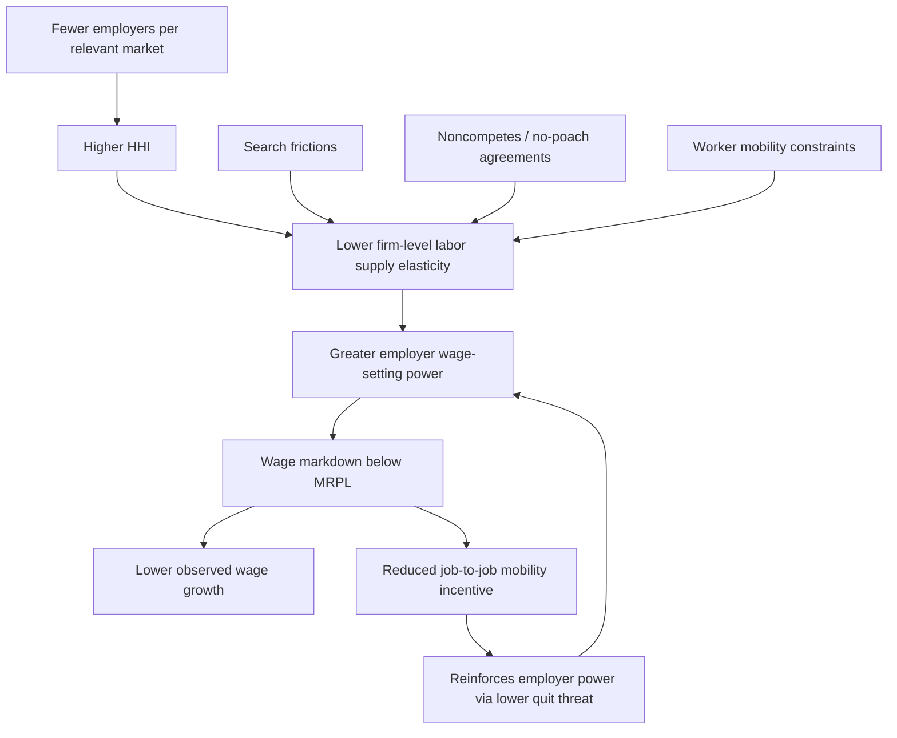

## Labor Market Concentration

### Definition and Conceptual Foundations

Labor market concentration refers to the degree to which employment and hiring in a given labor market are dominated by a small number of employers. Unlike product market concentration, which measures seller concentration in output markets, labor market concentration measures buyer (employer) concentration in the market for labor services. High concentration means workers face few alternative employers, which weakens the competitive pressure that would otherwise push wages toward the marginal revenue product of labor.

The theoretical relevance of labor market concentration derives directly from monopsony theory. In a perfectly competitive labor market, no single employer can influence the wage; firms are wage-takers. As concentration rises, individual employers gain wage-setting power because workers have fewer outside options, and the labor supply curve facing an individual firm becomes upward-sloping rather than flat.

### Defining the Relevant Labor Market

Measuring concentration first requires defining the boundaries of the relevant labor market, which is considerably harder than defining product markets:

- **Geographic dimension**: Commuting zones (CZs) are the standard unit in the U.S. literature, constructed from Census commuting-pattern data to approximate local labor markets more accurately than counties or metropolitan statistical areas (MSAs).
- **Occupational dimension**: Markets are frequently defined at the occupation level (e.g., 6-digit SOC codes), since a registered nurse and a software engineer are not close substitutes even if they live in the same city.
- **Combined market**: Most modern studies define a labor market as an occupation × commuting-zone (or occupation × MSA) cell, reflecting the idea that workers search within an occupation and within a limited geographic radius.
- **Industry dimension**: Some studies additionally condition on industry, since employer identity and industry affiliation shape which vacancies workers consider close substitutes.

The choice of market definition materially affects measured concentration: narrower markets (finer occupation codes, smaller geographic units) mechanically produce higher concentration measures.

### Measuring Concentration: The Herfindahl-Hirschman Index (HHI)

The standard concentration measure adapted from industrial organization is the **Herfindahl-Hirschman Index**, computed over employer shares of employment (or vacancies) within a defined labor market:

$$HHI = \sum_{i=1}^{N} s_i^2 \times 10{,}000$$

where $s_i$ is employer $i$'s share of total employment (or job postings) in the market, expressed as a fraction summing to 1, and the index is conventionally scaled by 10,000 so that a single-employer (pure monopsony) market yields $HHI = 10{,}000$.

**Key Points**

- U.S. antitrust guidelines (DOJ/FTC Horizontal Merger Guidelines) classify markets with $HHI < 1500$ as unconcentrated, $1500 \leq HHI \leq 2500$ as moderately concentrated, and $HHI > 2500$ as highly concentrated — thresholds originally designed for product markets but widely borrowed in labor market studies.
- HHI is sensitive to the number of employers ($N$) and the evenness of the employment distribution among them; a market with many small employers and one dominant firm can have the same HHI as a market with few, roughly equal-sized employers.
- Vacancy-based HHI (using job postings, e.g., from Burning Glass/Lightcast data) captures flow concentration in hiring, which can differ substantially from stock-based HHI computed on existing employment, since a dominant incumbent employer may post few vacancies in a given period.

### Empirical Measurement Approaches

**Employment-based HHI using administrative data**: Studies such as Rinz (2022) and Azar, Marinescu, and Steinbaum (2022) use Census Bureau LBD/QCEW-type establishment data to compute HHI from actual employment counts by firm within commuting zone × industry or commuting zone × occupation cells.

**Vacancy-based HHI using online job postings**: Azar, Marinescu, Steinbaum, and Taska (2020) construct HHI from the near-universe of U.S. online job vacancies, defining markets at the commuting-zone × SOC-6 occupation level. This approach captures the concentration of *active recruiting effort* rather than the stock of existing jobs, which is arguably more relevant to a job-switcher's actual choice set.

**Cross-country and international evidence**: Similar HHI-based approaches have been applied outside the U.S. — for example using Austrian social security records or UK vacancy data — generally finding elevated concentration in smaller and more rural labor markets.

### SVG Illustration: HHI Across Market Definitions (svg_diagram)

<svg xmlns="http://www.w3.org/2000/svg" viewBox="0 0 760 380">
<text x="380" y="28" text-anchor="middle" font-size="18" font-weight="bold" font-family="sans-serif">Labor Market HHI by Market Definition Granularity (svg_diagram)</text>
<line x1="90" y1="330" x2="720" y2="330" stroke="black" stroke-width="2" />
<line x1="90" y1="330" x2="90" y2="60" stroke="black" stroke-width="2" />
<text x="45" y="200" text-anchor="middle" font-size="13" font-family="sans-serif" transform="rotate(-90 45 200)">HHI (0-10000)</text>
<text x="405" y="365" text-anchor="middle" font-size="13" font-family="sans-serif">Market Definition (narrow to broad)</text>
<line x1="90" y1="240" x2="720" y2="240" stroke="#999" stroke-width="1" stroke-dasharray="4,4" />
<text x="725" y="244" font-size="11" font-family="sans-serif">1500</text>
<line x1="90" y1="180" x2="720" y2="180" stroke="#999" stroke-width="1" stroke-dasharray="4,4" />
<text x="725" y="184" font-size="11" font-family="sans-serif">2500</text>
<rect x="130" y="80" width="80" height="250" fill="#c0392b" />
<text x="170" y="345" text-anchor="middle" font-size="11" font-family="sans-serif">Occ x Narrow CZ</text>
<text x="170" y="72" text-anchor="middle" font-size="12" font-family="sans-serif" font-weight="bold">~4200</text>
<rect x="260" y="130" width="80" height="200" fill="#e67e22" />
<text x="300" y="345" text-anchor="middle" font-size="11" font-family="sans-serif">Occ x CZ</text>
<text x="300" y="122" text-anchor="middle" font-size="12" font-family="sans-serif" font-weight="bold">~3200</text>
<rect x="390" y="200" width="80" height="130" fill="#f1c40f" />
<text x="430" y="345" text-anchor="middle" font-size="11" font-family="sans-serif">Industry x MSA</text>
<text x="430" y="192" text-anchor="middle" font-size="12" font-family="sans-serif" font-weight="bold">~1800</text>
<rect x="520" y="270" width="80" height="60" fill="#27ae60" />
<text x="560" y="345" text-anchor="middle" font-size="11" font-family="sans-serif">Industry x State</text>
<text x="560" y="262" text-anchor="middle" font-size="12" font-family="sans-serif" font-weight="bold">~700</text>
<rect x="650" y="315" width="60" height="15" fill="#2980b9" />
<text x="680" y="345" text-anchor="middle" font-size="11" font-family="sans-serif">National</text>
</svg>

*[Inference — illustrative stylized values, not drawn from a specific dataset]: this diagram is a conceptual illustration showing the general empirical regularity that HHI falls mechanically as market definitions broaden, not an estimate from a specific study.*

### Theoretical Link to Wage Markdowns

Under a standard monopsony model with an upward-sloping firm-level labor supply curve, the wage markdown relative to the marginal revenue product of labor (MRPL) is related to the firm's residual labor supply elasticity, $\varepsilon$:

$$\frac{w}{MRPL} = \frac{\varepsilon}{1+\varepsilon}$$

Oligopsony models (e.g., Berger, Herkenhoff, and Mongey, 2022) link firm-level markdown power to market structure by showing that markdowns are increasing in HHI, in a manner analogous to how markups in oligopoly product markets rise with seller concentration. Intuitively, when a firm is one of many small employers, it faces a highly elastic residual labor supply curve (workers can easily switch to a competitor), so $\varepsilon \to \infty$ and $w \to MRPL$. As concentration rises and workers' outside options shrink, $\varepsilon$ falls and the wage markdown deepens.

### Empirical Findings on Concentration and Wages

**Key Points**

- Azar, Marinescu, and Steinbaum (2022) find that going from the 25th to 75th percentile of labor market concentration is associated with wages roughly 15-25% lower, with effects concentrated in already-concentrated markets, consistent with a concave (diminishing) relationship between HHI and wages.
- The concentration-wage elasticity is generally estimated to be small in magnitude at low levels of concentration but steepens sharply as markets approach monopsony/duopsony levels, suggesting nonlinear effects rather than a uniform log-linear relationship.
- Concentration is systematically higher in rural commuting zones, in smaller markets, and in certain occupations (e.g., healthcare occupations such as nursing, given hospital-based employment concentration).
- Studies using merger-induced *changes* in concentration (e.g., hospital mergers) find effects on wages consistent with cross-sectional HHI-wage estimates, which partially addresses concerns that concentration is correlated with unobserved local labor demand shocks. [Inference — the causal identification literature is smaller and more contested than the cross-sectional literature; effect sizes vary noticeably across identification strategies]

### Mechanisms Beyond Simple Employer Counts

Labor market concentration as measured by employer-count-based HHI is only one channel through which employer market power arises. The broader monopsony/oligopsony literature identifies several complementary and sometimes empirically more important mechanisms:

- **Search frictions**: Even with many employers, costly job search and imperfect information generate employer wage-setting power (Burdett-Mortensen search-theoretic models), so HHI alone can understate true employer power in markets with high search costs.
- **Labor market institutions**: Noncompete agreements, no-poach agreements, and occupational licensing raise effective switching costs independent of the raw employer count, amplifying the wage effects of a given HHI level.
- **Worker heterogeneity in mobility**: Workers with location-specific constraints (e.g., dual-career households, homeownership, caregiving responsibilities) face effectively more concentrated markets than aggregate HHI suggests, since their realistic choice set is smaller than the full set of employers in the CZ.
- **Monopsony amplifiers**: Idiosyncratic worker preferences over non-wage job attributes (commute, culture, hours flexibility) mean that even low-HHI markets can exhibit monopsony-like wage-setting power because workers do not treat all same-occupation jobs as perfect substitutes — this is the differentiated-jobs view formalized in Card, Cardoso, Heining, and Kline (2018) via a Bartik-style "job differentiation" markdown that operates independently of employer counts.

### Concentration Trends Over Time

**Key Points**

- U.S. studies using QCEW/LBD-derived measures generally document rising concentration in many local labor markets over the 1990s-2010s, though the trend is not uniform across all market definitions and some vacancy-based measures show more mixed patterns after accounting for the growth of online job platforms (which can mechanically lower measured HHI by revealing more competing postings).
- Rising industry consolidation (mergers and acquisitions), the decline of new-firm entry rates, and the growth of "superstar firms" in certain sectors are commonly cited candidate explanations for rising product-market concentration, with more contested and mixed evidence on whether these forces translate one-for-one into labor-market concentration. [Inference — the causal chain from product-market to labor-market concentration trends is an active and unsettled area of research]
- The rise of remote work since 2020 is hypothesized to reduce *effective* geographic labor market concentration for remote-eligible occupations by widening the feasible employer set beyond the local commuting zone, though empirical measurement of this effect is still developing. [Speculation — post-2020 remote-work effects on measured HHI are still being actively studied and estimates are not yet well-established]

### Concentration and Merger Policy

Labor market concentration has become directly relevant to antitrust enforcement. U.S. antitrust agencies have increasingly incorporated labor market effects into merger review:

- The 2023 DOJ/FTC Merger Guidelines explicitly state that agencies will consider whether a merger may substantially lessen competition in labor markets, not only in output/product markets.
- No-poach and wage-fixing agreements between employers have been pursued as per se antitrust violations (analogous to price-fixing), distinct from concentration per se but closely related as another mechanism of employer coordination that suppresses wage competition.
- Merger simulation techniques from industrial organization (adapting product-market merger simulation models to labor markets) have been used to predict post-merger wage markdowns, particularly in hospital merger cases given the salience of nurse and healthcare-worker labor markets.

### Mermaid Diagram: Causal Chain from Concentration to Wage Outcomes

### Worked Numerical Example

**Example**

Consider a commuting zone × occupation labor market with four employers and the following employment shares: Employer A = 45%, Employer B = 30%, Employer C = 15%, Employer D = 10%.

$$HHI = (0.45^2 + 0.30^2 + 0.15^2 + 0.10^2) \times 10{,}000$$

$$HHI = (0.2025 + 0.09 + 0.0225 + 0.01) \times 10{,}000 = 0.325 \times 10{,}000 = 3250$$

This market would be classified as highly concentrated under the standard DOJ/FTC thresholds ($HHI > 2500$). If Employer A and Employer B propose a merger, the post-merger combined share is 75%, and post-merger HHI becomes:

$$HHI_{post} = (0.75^2 + 0.15^2 + 0.10^2) \times 10{,}000 = (0.5625 + 0.0225 + 0.01) \times 10{,}000 = 5950$$

The change in HHI ($\Delta HHI = 5950 - 3250 = 2700$) far exceeds the 200-point threshold that triggers heightened antitrust scrutiny under the Horizontal Merger Guidelines, illustrating why this merger would likely draw labor-market-focused antitrust review even if product-market concentration effects were modest.

### Policy Responses

**Next Steps**

- Antitrust enforcement targeting labor market mergers and employer coordination (no-poach/wage-fixing bans)
- Noncompete agreement bans or restrictions (e.g., FTC's proposed noncompete rule, state-level bans) as a complementary tool addressing monopsony power that operates independently of raw employer counts
- Sectoral bargaining or minimum wage floors as blunter policy instruments that raise wages without requiring precise measurement of local concentration
- Occupational licensing reform to reduce artificial barriers to entry that constrain the effective employer set for licensed workers
- Data infrastructure investment (broader access to matched employer-employee administrative data) to improve the precision and timeliness of concentration measurement

### Limitations and Critiques of HHI-Based Approaches

**Key Points**

- Market definition sensitivity is the most significant methodological critique: measured concentration and its estimated wage effects are highly sensitive to arbitrary choices about geographic and occupational market boundaries, and there is no fully principled way to select the "correct" boundary.
- Commuting zones do not account for remote work, multi-establishment firms with centralized wage-setting, or cross-border/cross-region job search, all of which can bias HHI in either direction. [Inference — direction of bias depends on the specific labor market and worker population studied]
- HHI captures only the *static* employer count and share distribution; it does not directly capture dynamic entry/exit, the threat of entry, or monopsony power arising from information frictions rather than employer scarcity.
- Reverse causality and confounding remain concerns in purely cross-sectional HHI-wage regressions: declining regional labor demand can simultaneously reduce both employer entry (raising HHI) and wages, so cross-sectional correlations may partly reflect a common underlying shock rather than a pure concentration-to-wage causal channel.

### Related Topics

- Monopsony Wage-Setting Models and the Elasticity of Labor Supply to the Firm
- Noncompete Agreements and No-Poach Clauses
- Monopsony in Specific Sectors (Healthcare, Fast Food, Higher Education/Academic Labor Markets)
- Merger Simulation and Antitrust Enforcement in Labor Markets
- Search and Matching Models of the Labor Market (Burdett-Mortensen, Diamond-Mortensen-Pissarides)
- Job Differentiation and the "New Monopsony" Literature
- Occupational Licensing and Labor Market Frictions
- Minimum Wage Policy Under Monopsonistic Labor Markets