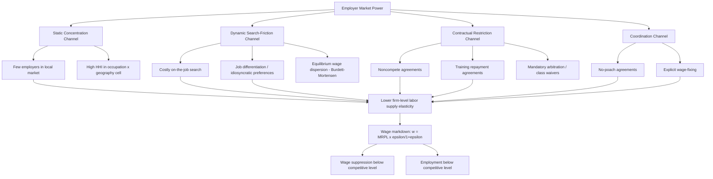

## Employer Market Power and Wage Suppression

### Conceptual Overview

Employer market power refers to the ability of a firm (or coordinated group of firms) to set wages below the competitive level — that is, below the marginal revenue product of labor (MRPL) — without losing its entire workforce. This is the labor-market mirror image of seller market power in product markets: just as a monopolist restricts output and raises price above marginal cost, a monopsonist restricts employment and suppresses wages below MRPL. Wage suppression is the observable outcome of employer market power being exercised; market power is the underlying structural condition that makes suppression possible.

### The Canonical Monopsony Model

In the textbook single-employer monopsony model, the firm faces the entire upward-sloping market labor supply curve, $L^S(w)$, rather than a horizontal (perfectly elastic) supply curve as in the competitive case. Because the firm must raise the wage paid to *all* workers to attract one more worker, the marginal cost of labor (MCL) exceeds the wage:

$$MCL(L) = w(L) + L \cdot \frac{dw}{dL}$$

The profit-maximizing monopsonist hires where marginal revenue product equals marginal cost of labor:

$$MRPL(L^*) = MCL(L^*)$$

and then pays the wage read off the supply curve at that employment level, $w^* = w(L^*)$, which is strictly less than $MRPL(L^*)$. This generates two simultaneous distortions relative to the competitive benchmark: **under-employment** ($L^* < L^{competitive}$) and **wage suppression** ($w^* < w^{competitive}$).

### SVG Illustration: Monopsony Equilibrium (svg_diagram)

<svg viewBox="0 0 720 420" xmlns="http://www.w3.org/2000/svg">
<text x="360" y="26" text-anchor="middle" font-size="17" font-weight="bold" font-family="sans-serif">Monopsony Wage and Employment Determination (svg_diagram)</text>
<line x1="80" y1="360" x2="680" y2="360" stroke="black" stroke-width="2"/>
<line x1="80" y1="360" x2="80" y2="50" stroke="black" stroke-width="2"/>
<text x="360" y="395" text-anchor="middle" font-size="13" font-family="sans-serif">Employment (L)</text>
<text x="30" y="200" text-anchor="middle" font-size="13" font-family="sans-serif" transform="rotate(-90 30 200)">Wage</text>
<!-- Labor supply curve (upward sloping) -->
<path d="M 100 340 L 620 100" stroke="#2980b9" stroke-width="2.5" fill="none"/>
<text x="600" y="90" font-size="12" fill="#2980b9" font-family="sans-serif">Labor Supply (w = ACL)</text>
<!-- Marginal Cost of Labor curve (steeper) -->
<path d="M 100 340 L 520 60" stroke="#c0392b" stroke-width="2.5" fill="none"/>
<text x="480" y="55" font-size="12" fill="#c0392b" font-family="sans-serif">MCL</text>
<!-- MRPL / Labor demand curve (downward sloping) -->
<path d="M 100 90 L 620 330" stroke="#27ae60" stroke-width="2.5" fill="none"/>
<text x="580" y="335" text-anchor="end" font-size="12" fill="#27ae60" font-family="sans-serif">MRPL (Labor Demand)</text>
<!-- Monopsony equilibrium point: MCL = MRPL -->
<circle cx="350" cy="210" r="5" fill="black"/>
<line x1="350" y1="210" x2="350" y2="360" stroke="#666" stroke-width="1" stroke-dasharray="3,3"/>
<text x="350" y="378" text-anchor="middle" font-size="11" font-family="sans-serif">L_M</text>
<!-- Monopsony wage on supply curve at L_M -->
<circle cx="350" cy="278" r="5" fill="#2980b9"/>
<line x1="80" y1="278" x2="350" y2="278" stroke="#666" stroke-width="1" stroke-dasharray="3,3"/>
<text x="60" y="282" text-anchor="end" font-size="11" font-family="sans-serif">w_M</text>
<!-- Competitive equilibrium: supply = demand -->
<circle cx="480" cy="190" r="5" fill="black"/>
<line x1="480" y1="190" x2="480" y2="360" stroke="#999" stroke-width="1" stroke-dasharray="2,2"/>
<line x1="80" y1="190" x2="480" y2="190" stroke="#999" stroke-width="1" stroke-dasharray="2,2"/>
<text x="480" y="378" text-anchor="middle" font-size="11" font-family="sans-serif">L_C</text>
<text x="60" y="194" text-anchor="end" font-size="11" font-family="sans-serif">w_C</text>

<text x="150" y="60" font-size="11" font-family="sans-serif" fill="#444">Monopsony: L_M < L_C, w_M < w_C</text>

</svg>

### Sources of Employer Market Power

**Key Points**

- **Spatial/geographic concentration**: Few employers within commuting distance, especially in rural or "company town" settings, reduces the number of realistic outside options.
- **Search frictions and information costs**: Workers do not costlessly observe all available wage offers; the Burdett-Mortensen equilibrium search model formalizes how costly search generates a distribution of wages for identical workers even absent any employer collusion.
- **Differentiated jobs / idiosyncratic preferences**: Workers value non-wage job attributes (commute distance, hours flexibility, workplace culture) heterogeneously, so employers are not perfect substitutes even when many exist in a market — this "modern monopsony" mechanism generates markdown power even in markets with low measured concentration.
- **Mobility costs and switching frictions**: Relocation costs, licensing requirements tied to a specific employer or jurisdiction, housing lock-in, and dual-career household constraints all raise the effective cost of quitting, which is economically equivalent to reducing labor supply elasticity.
- **Contractual restrictions**: Noncompete agreements, no-poach agreements between employers, training repayment agreements (TRAPs), and mandatory arbitration clauses with class-action waivers can all mechanically suppress a worker's outside option set or the perceived credibility of that option set.
- **Monopsonistic coordination**: Explicit wage-fixing or information-sharing agreements between nominally competing employers (illegal under antitrust law when they amount to horizontal agreements not to compete for workers).

### The Elasticity of Labor Supply to the Firm

The central parameter governing the magnitude of wage suppression is the firm-level (not market-level) elasticity of labor supply, $\varepsilon_{LS}$, typically defined as:

$$\varepsilon_{LS} = \frac{dL}{dw} \cdot \frac{w}{L}$$

Under profit maximization with monopsony power, the wage markdown relative to MRPL can be expressed as:

$$\frac{w}{MRPL} = \frac{\varepsilon_{LS}}{1 + \varepsilon_{LS}}$$

**Example**

If a firm's labor supply elasticity is estimated at $\varepsilon_{LS} = 4$ (a commonly cited empirical range for the U.S. labor market, well below the near-infinite elasticity assumed under perfect competition), the wage markdown is:

$$\frac{w}{MRPL} = \frac{4}{1+4} = \frac{4}{5} = 0.80$$

meaning workers are paid roughly 80% of their marginal revenue product — a 20% wage markdown attributable purely to employer market power. Empirical estimates of $\varepsilon_{LS}$ in the modern literature (e.g., Webber 2015; Sokolova and Sorensen 2021 meta-analysis; Yeh, Macaluso, and Hershbein 2022 using a Bartik-style shift-share approach) commonly cluster in the range of roughly 2 to 6, substantially below the values implied by textbook perfect competition, though estimates vary considerably by identification strategy, data source, and country. [Inference — the specific numerical range reflects a synthesis across a heterogeneous empirical literature rather than a single canonical estimate]

### Identification Strategies for Estimating Labor Supply Elasticity and Markdowns

- **Quit-based approaches**: Estimating how firm-level quit rates respond to relative wages within an industry/occupation cell (Manning 2003; Ransom and Oaxaca 2010), using the logic that a firm paying below-market wages should see higher separation rates, with the elasticity of separations to wages providing $\varepsilon_{LS}$.
- **Recruitment-based approaches**: Using firm-level new-hire elasticity with respect to posted wages (Webber 2015; Bassier, Dube, and Naidu 2022 using linked employer-employee data), typically finding a lower elasticity for recruitment than for separations, implying a wedge between "hiring monopsony power" and "retention monopsony power."
- **Structural estimation via matched employer-employee data (AKM-style models)**: Decomposing wage variance into worker and firm fixed effects (Card, Cardoso, Heining, and Kline, 2018) to estimate the pass-through of firm-specific productivity shocks to wages, from which markdown parameters can be backed out under a structural model.
- **Shift-share / Bartik instruments**: Using industry-level national employment shocks interacted with local industry employment shares as instruments for local labor demand shifts, isolating exogenous variation in labor demand to trace out the labor supply curve facing firms (Yeh, Macaluso, and Hershbein, 2022).
- **Event-study approaches around plant closures, mergers, or minimum wage changes**: Observing how wages and employment jointly respond to a discrete labor demand or labor market structure shock, which under monopsony can produce counterintuitive predictions (e.g., minimum wage increases raising employment, not just wages, near the monopsony optimum).

### Distinguishing Static Monopsony from Dynamic Monopsony

**Key Points**

- **Static monopsony**: The classical single-employer model above, in which the firm sets a single wage and faces a static upward-sloping supply curve. This model requires a literal single dominant employer to be empirically compelling and is often viewed as a special/limiting case.
- **Dynamic monopsony (search-theoretic)**: Following Burdett and Mortensen (1998), even in markets with many employers, on-the-job search frictions mean that not all workers instantaneously find and move to the highest-paying employer. This generates equilibrium wage dispersion for observably identical workers and gives each employer some wage-setting power because raising the wage attracts more applicants and reduces quits, without requiring the employer to be literally alone in the market.
- The dynamic monopsony framework is generally regarded as the more empirically relevant explanation for pervasive, economy-wide wage markdowns, since measured product-market-style concentration (HHI) is often too low in most labor markets to generate large markdowns through the static channel alone. [Inference — this is the dominant interpretive framework in the recent labor economics literature but remains a live area of methodological debate]

### Wage Suppression Channels Distinct from Pure Concentration

- **Noncompete agreements**: Estimated to cover a substantial share of the U.S. private-sector workforce historically (including many workers without access to trade secrets), noncompetes reduce job-to-job mobility and are associated with lower wages and wage growth in states and industries with weaker noncompete enforceability providing more worker bargaining leverage.
- **No-poach clauses**: Historically common in franchise agreements (e.g., fast-food chains), restricting franchisees from hiring each other's workers; the DOJ has pursued criminal antitrust cases against explicit wage-fixing and no-poach agreements between otherwise-competing employers.
- **Occupational licensing**: When licenses are not portable across state lines or employers, they can function as a mobility constraint that raises effective switching costs, particularly in healthcare and skilled trades.
- **Monopsonistic wage discrimination**: A profit-maximizing monopsonist with the ability to third-degree price-discriminate across worker groups with different labor supply elasticities will pay different wages to observably similar workers based on their elasticity of supply to the firm — a mechanism proposed (Robinson, 1933; Manning, 2003; Webber, 2016) as a partial explanation for persistent gender wage gaps, since women's labor supply elasticity to the firm may be lower on average due to disproportionate caregiving-driven mobility constraints. [Inference — this remains one candidate explanatory channel among several competing explanations for the gender wage gap, not an uncontested consensus finding]

### Mermaid Diagram: Employer Market Power Taxonomy

### Policy and Antitrust Responses

**Next Steps**

- FTC noncompete rulemaking and state-level noncompete bans (e.g., California's long-standing prohibition) as natural experiments for estimating the wage effects of mobility restrictions
- DOJ criminal enforcement against wage-fixing and no-poach agreements as per se antitrust violations
- Incorporation of labor market effects into merger review under the 2023 DOJ/FTC Merger Guidelines
- Minimum wage policy reinterpreted through a monopsony lens: near the monopsony optimum, a minimum wage set between $w_M$ and $w_C$ can raise both wages and employment simultaneously, reversing the standard competitive-market prediction — this is a key theoretical justification cited in the "new minimum wage economics" literature following Card and Krueger (1994)
- Sectoral bargaining and union representation as institutional counterweights to employer wage-setting power, operating through a bilateral monopoly framework rather than pure monopsony

### Limitations and Open Questions

**Key Points**

- Precisely separating "employer market power" from other explanations for observed wage compression (e.g., worker preference heterogeneity that is efficient rather than exploitative, compensating differentials for genuinely different job amenities) remains methodologically contested.
- Firm-level labor supply elasticity estimates vary substantially across identification strategies, industries, and countries, and there is no single settled "true" elasticity value comparable to, say, well-established product-demand elasticities in some markets. [Unverified] as a precise point estimate applicable across all labor markets.
- The relative empirical importance of static concentration versus dynamic search frictions versus contractual restrictions in explaining aggregate wage suppression is an active research frontier without full consensus. [Inference]
- Policy interventions calibrated to a monopsony diagnosis (e.g., minimum wage increases) can have very different — potentially adverse — employment effects if the true underlying labor market is closer to competitive than the monopsony model assumes, making correct diagnosis of market structure policy-relevant rather than purely academic.

### Related Topics

- Labor Market Concentration and HHI Measurement
- Burdett-Mortensen Equilibrium Search and Wage Dispersion Models
- Minimum Wage Policy Under Monopsonistic Labor Markets
- Noncompete Agreements, No-Poach Clauses, and Labor Market Frictions
- Monopsonistic Wage Discrimination and the Gender Wage Gap
- Bilateral Monopoly, Union Bargaining, and Wage Determination
- Antitrust Enforcement and Merger Review in Labor Markets
- Oligopsony Models and Markdown Estimation via Matched Employer-Employee Data