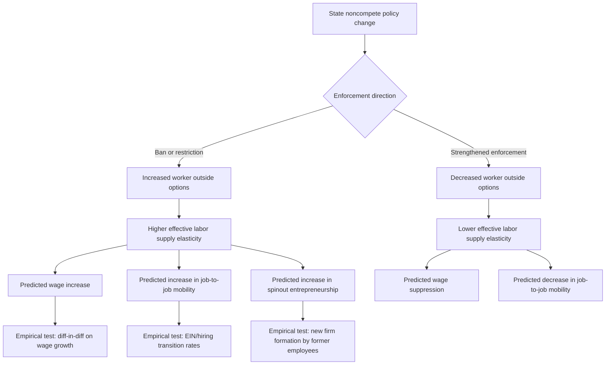

## Noncompete Agreements and Mobility Frictions

### Definition and Legal Basics

A noncompete agreement (NCA), also called a covenant not to compete, is a contractual clause preventing an employee from working for a competing employer or starting a competing business within a specified geographic area and time period after leaving their current job. Noncompetes are one instrument within a broader family of restrictive employment covenants, which also includes:

- **Non-disclosure agreements (NDAs)**: Restrict disclosure of confidential information but do not directly restrict subsequent employment.
- **Non-solicitation agreements**: Restrict soliciting former employer's clients or coworkers, without a blanket prohibition on working for a competitor.
- **Training repayment agreement provisions (TRAPs)**: Require repayment of training costs if the employee leaves within a specified period, functioning as a de facto mobility tax even absent an explicit noncompete.
- **Garden leave clauses**: Require continued (often reduced) pay during a post-employment restriction period, partially compensating the worker for the mobility restriction.

Legal enforceability varies substantially by jurisdiction. In the U.S., noncompete enforceability is governed primarily by state law: California, North Dakota, and Oklahoma have long banned noncompetes for employees almost entirely; Minnesota banned them effective 2023; several other states restrict enforceability by income threshold or occupation (e.g., banning noncompetes for low-wage workers or healthcare workers specifically). This cross-state legal variation is the primary source of empirical identification in the literature.

### The Federal Trade Commission Rulemaking

The FTC proposed a rule in 2023 that would have banned nearly all noncompete agreements nationwide, framing them as an unfair method of competition under Section 5 of the FTC Act. [Unverified — the final legal status and enforceability of this rule was subject to ongoing litigation and court challenges; readers should verify current status via primary FTC and court sources rather than relying on any single point-in-time summary, as this is a live regulatory matter.] The rule and litigation around it prompted extensive economic analysis by the FTC and outside researchers, drawing heavily on the pre-existing empirical noncompete literature to estimate wage and innovation effects of a national ban.

### Prevalence of Noncompete Agreements

**Key Points**

- Survey-based estimates (Starr, Prescott, and Bishara, 2021, using a nationally representative U.S. survey) find noncompetes cover a substantial share of the private-sector workforce, with estimates commonly cited in the range of roughly 1 in 5 workers, though prevalence estimates vary by survey methodology, question wording, and survey year. [Inference — precise prevalence figures vary meaningfully across studies and are sensitive to whether the question asks about current coverage, ever having signed one, or awareness of having signed one]
- Noncompetes are not confined to high-skill or high-wage occupations; empirical surveys find meaningful prevalence among low-wage and hourly workers, including in food service and retail, despite the traditional legal justification for noncompetes (protecting trade secrets and specialized know-how) applying most naturally to high-skill roles.
- A documented gap exists between formal legal enforceability and worker *belief* about enforceability: many workers in weak-enforcement states nonetheless behave as though bound by their noncompete, suggesting the deterrent effect of noncompetes may exceed their strict legal enforceability — sometimes termed the "chilling effect" independent of formal legal force.

### Theoretical Channels: Why Noncompetes Matter for Monopsony

Noncompetes map directly onto the monopsony framework by directly lowering the firm-level elasticity of labor supply, $\varepsilon_{LS}$. Recall the wage-markdown relationship:

$$\frac{w}{MRPL} = \frac{\varepsilon_{LS}}{1+\varepsilon_{LS}}$$

A binding noncompete reduces the worker's realistic outside option set (competing firms in the same industry/occupation become legally unavailable as employers), which is mechanically equivalent to steepening the labor supply curve facing the incumbent employer — reducing $\varepsilon_{LS}$ and deepening the wage markdown, even absent any change in the raw count of employers (HHI) in the market.

Two theoretically distinct channels operate simultaneously:

- **Ex-post monopsony channel**: Once hired, the worker's threat of quitting to a same-industry competitor is weakened, allowing the current employer to pay a lower wage than it otherwise could sustain without losing the worker.
- **Ex-ante search/matching channel**: Noncompetes may also affect *initial* hiring wage offers, job search intensity, and the composition of the applicant pool, since prospective employers know the worker will face a delayed or restricted ability to leave.

### Empirical Evidence on Wage Effects

**Key Points**

- Studies exploiting state-level noncompete enforceability differences (e.g., comparing wage growth for otherwise similar workers in high- vs. low-enforceability states) generally find noncompetes are associated with lower wages and lower wage growth, particularly for job-switchers and workers with weaker outside bargaining power.
- Starr, Balasubramanian, and Bhide (2018) and related work find heterogeneous effects: some evidence suggests certain workers (e.g., those with genuine trade-secret access) may see partially offsetting wage *premiums* for accepting a noncompete, consistent with a compensating-differential interpretation, while lower-bargaining-power workers see predominantly negative wage effects with little compensating premium.
- Lavetti, Simon, and White (2020), studying physician noncompetes, find evidence consistent with reduced physician mobility translating into wage suppression and reduced bargaining leverage in a highly credentialed, ostensibly high-bargaining-power occupation — suggesting mobility-restriction effects are not confined to low-wage workers.
- Cross-state migration studies find lower job-to-job mobility rates and lower rates of new-firm formation by former employees (reduced "spinout" entrepreneurship) in states with stronger noncompete enforcement, consistent with noncompetes suppressing both wage growth *and* the innovation/entrepreneurship channel through which competitive pressure on incumbent wages might otherwise arise.

### Mobility Frictions: A Broader Taxonomy

Noncompetes are one specific instrument within a broader category of **mobility frictions** — any factor that raises the effective cost of a worker moving between employers, occupations, or locations. A comprehensive taxonomy:

- **Contractual frictions**: Noncompetes, no-poach agreements between employers, TRAPs, mandatory arbitration with class-action waivers (raising the cost of collective legal action against wage suppression).
- **Licensing and credentialing frictions**: State-specific occupational licenses that do not transfer across state lines, requiring costly re-certification upon relocation (common in nursing, cosmetology, teaching, and legal professions).
- **Benefits and pension portability frictions**: Employer-sponsored health insurance tied to a specific job (historically a significant "job lock" mechanism in the U.S. prior to ACA marketplace expansion), vesting schedules for employer retirement contributions, and defined-benefit pension structures that penalize job switching.
- **Housing and locational frictions**: Homeownership transaction costs, mortgage rate lock-in effects (particularly salient when market rates rise well above a worker's existing mortgage rate), and dual-career household constraints where a move benefiting one spouse's career may harm the other's.
- **Information frictions**: Imperfect knowledge of outside wage offers, search costs, and the absence of pay transparency, which independently generate monopsony-like wage-setting power even without any contractual restriction (the Burdett-Mortensen search-theoretic channel).
- **Firm-specific human capital**: Genuine skill non-transferability (as opposed to a legal restriction) that reduces a worker's productivity — and therefore wage offers — at alternative employers, a "natural" mobility friction distinct from the contractually-imposed frictions above.

### SVG Illustration: Mobility Friction Taxonomy and Wage-Markdown Channel (svg_diagram)

<svg xmlns="http://www.w3.org/2000/svg" viewBox="0 0 740 400">
<text x="370" y="26" text-anchor="middle" font-size="16" font-weight="bold" font-family="sans-serif">Mobility Frictions and the Wage Markdown Channel (svg_diagram)</text>
<rect x="40" y="60" width="150" height="60" rx="6" fill="#fde8e8" stroke="#c0392b" stroke-width="1.5" />
<text x="115" y="85" text-anchor="middle" font-size="12" font-family="sans-serif">Contractual</text>
<text x="115" y="102" text-anchor="middle" font-size="11" font-family="sans-serif">Noncompetes, TRAPs,</text>
<text x="115" y="115" text-anchor="middle" font-size="11" font-family="sans-serif">no-poach clauses</text>
<rect x="220" y="60" width="150" height="60" rx="6" fill="#fdf1e0" stroke="#e67e22" stroke-width="1.5" />
<text x="295" y="85" text-anchor="middle" font-size="12" font-family="sans-serif">Licensing</text>
<text x="295" y="102" text-anchor="middle" font-size="11" font-family="sans-serif">Non-portable state</text>
<text x="295" y="115" text-anchor="middle" font-size="11" font-family="sans-serif">occupational licenses</text>
<rect x="400" y="60" width="150" height="60" rx="6" fill="#fdf8e0" stroke="#f1c40f" stroke-width="1.5" />
<text x="475" y="85" text-anchor="middle" font-size="12" font-family="sans-serif">Benefits Lock-In</text>
<text x="475" y="102" text-anchor="middle" font-size="11" font-family="sans-serif">Employer health insurance,</text>
<text x="475" y="115" text-anchor="middle" font-size="11" font-family="sans-serif">pension vesting</text>
<rect x="580" y="60" width="150" height="60" rx="6" fill="#e8f0fd" stroke="#2980b9" stroke-width="1.5" />
<text x="655" y="85" text-anchor="middle" font-size="12" font-family="sans-serif">Information</text>
<text x="655" y="102" text-anchor="middle" font-size="11" font-family="sans-serif">Search costs,</text>
<text x="655" y="115" text-anchor="middle" font-size="11" font-family="sans-serif">wage opacity</text>
<line x1="115" y1="120" x2="370" y2="200" stroke="#666" stroke-width="1.5" />
<line x1="295" y1="120" x2="370" y2="200" stroke="#666" stroke-width="1.5" />
<line x1="475" y1="120" x2="370" y2="200" stroke="#666" stroke-width="1.5" />
<line x1="655" y1="120" x2="370" y2="200" stroke="#666" stroke-width="1.5" />
<rect x="250" y="200" width="240" height="55" rx="6" fill="#e8fde8" stroke="#27ae60" stroke-width="2" />
<text x="370" y="223" text-anchor="middle" font-size="13" font-weight="bold" font-family="sans-serif">Lower Firm-Level</text>
<text x="370" y="242" text-anchor="middle" font-size="13" font-weight="bold" font-family="sans-serif">Labor Supply Elasticity ε</text>
<line x1="370" y1="255" x2="370" y2="300" stroke="#666" stroke-width="2" marker-end="url(#arrow)" />
<rect x="220" y="305" width="300" height="55" rx="6" fill="#f0e8fd" stroke="#8e44ad" stroke-width="2" />
<text x="370" y="328" text-anchor="middle" font-size="13" font-weight="bold" font-family="sans-serif">Wage Markdown</text>
<text x="370" y="346" text-anchor="middle" font-size="12" font-family="sans-serif">w/MRPL = ε/(1+ε)</text>
</svg>

### Worked Example: Estimating the Wage Effect of Noncompete Bans

**Example**

Suppose empirical research estimates that moving a worker from a state with strong noncompete enforcement to a state with a full noncompete ban is associated with a 3-6% increase in wages, holding worker and firm characteristics fixed (a range broadly consistent with several difference-in-differences studies exploiting state policy variation). If a worker earns $55,000 annually under strong enforcement, the estimated wage effect of moving to a ban regime implies:

$$\Delta w = \$55{,}000 \times [0.03, 0.06] = [\$1{,}650, \$3{,}300]$$

This range should be interpreted as an average treatment effect estimate from a specific empirical design rather than a guaranteed individual outcome; effects likely vary by occupation, initial bargaining power, and local labor market conditions. [Inference — effect size and its applicability to any specific worker or context requires care in extrapolation; treat the cited range as illustrative of typical study estimates, not a precise causal parameter for all settings]

### Mermaid Diagram: Noncompete Policy Evaluation Framework

### Firm Incentives and the Trade Secret Justification

**Key Points**

- The traditional economic justification for noncompete enforceability rests on protecting genuine investments in trade secrets and firm-specific know-how that would otherwise be under-provided if firms could not prevent employees from immediately transferring that knowledge to a competitor — an argument grounded in incomplete-contracts and hold-up problem theory.
- Empirical evidence on whether noncompetes actually increase firm-level investment in training or R&D is mixed: some studies find noncompete enforceability is associated with greater firm investment in worker training (consistent with the trade-secret justification), while others find noncompetes are used broadly across low-skill jobs where the trade-secret rationale is weak, suggesting rent-extraction motives dominate in a meaningful share of cases. [Inference — the relative weight of legitimate trade-secret protection versus rent-extraction motives is contested and likely varies substantially by industry and occupation]
- Some research finds noncompete enforcement is associated with *reduced* regional innovation and entrepreneurship (fewer spinout firms, reduced patent citations flowing through inter-firm worker mobility), which cuts against a simple "noncompetes encourage firm-level R&D investment" narrative by highlighting a offsetting negative effect on knowledge diffusion across firms.

### Policy Landscape and Enforcement Trends

**Next Steps**

- Track ongoing state-level legislative activity: several U.S. states have moved toward income-threshold-based noncompete restrictions (banning noncompetes below a specified salary threshold) as a middle-ground policy between full bans and unrestricted enforceability
- Monitor FTC rulemaking status and associated litigation, given its potential to preempt state-level variation entirely and thus eliminate the primary source of empirical identification going forward
- Examine TRAP (training repayment agreement provision) regulation as an emerging policy frontier, since TRAPs can replicate noncompete-like mobility suppression even in jurisdictions that ban noncompetes outright
- Consider international comparisons: several European countries require "garden leave" compensation during noncompete periods, a design feature largely absent from typical U.S. noncompete agreements, which may partially explain differences in the incidence and welfare effects of noncompetes across countries [Inference — cross-country comparative evidence on this specific mechanism is more limited than the U.S. state-variation literature]

### Limitations and Measurement Challenges

**Key Points**

- Self-reported survey measures of noncompete coverage may suffer from recall error and worker confusion about which restrictive covenants they have actually signed (e.g., conflating NDAs with noncompetes).
- Formal legal enforceability and actual behavioral deterrence diverge, complicating any research design that uses only statutory enforceability as the treatment variable without independently verifying worker beliefs or firm enforcement behavior.
- Selection effects are a persistent concern: firms that impose noncompetes may differ systematically from those that do not (e.g., in their reliance on trade secrets, average wage level, or workforce composition), making it difficult to cleanly isolate the causal wage effect of the noncompete itself from unobserved firm-type differences, even when using state-level enforceability variation as an instrument. [Inference — the credibility of causal identification varies significantly across studies in this literature depending on the specific empirical design employed]

### Related Topics

- Labor Market Concentration and HHI Measurement
- Employer Market Power and Wage Suppression
- Burdett-Mortensen Equilibrium Search and Wage Dispersion Models
- Occupational Licensing and Labor Market Frictions
- Job Lock and Employer-Sponsored Health Insurance
- Entrepreneurship, Spinouts, and Knowledge Diffusion Across Firms
- Minimum Wage Policy Under Monopsonistic Labor Markets
- No-Poach Agreements and Antitrust Enforcement in Labor Markets