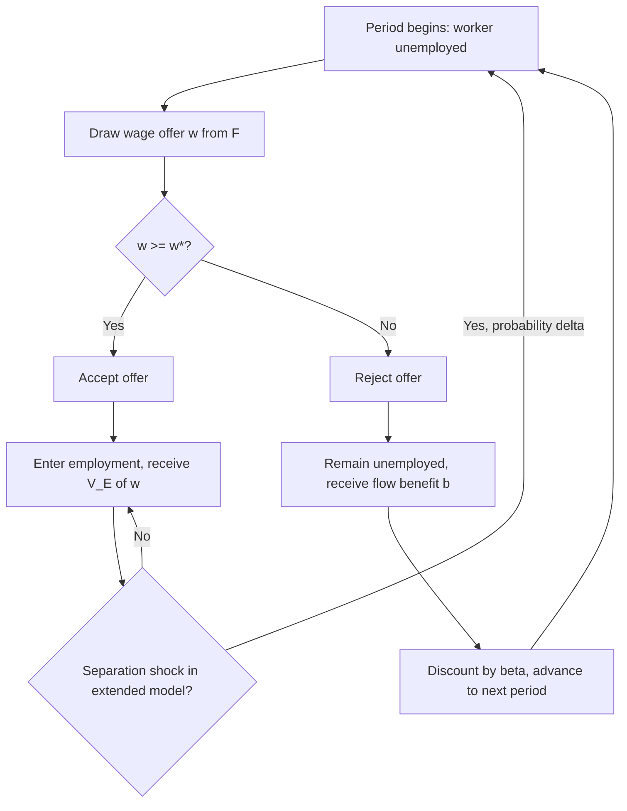

## The McCall Search Model

### Overview and Historical Origin

The McCall search model, introduced by John J. McCall (1970), is the foundational partial-equilibrium model of job search under uncertainty. It formalizes unemployment as an *optimal stopping problem*: an unemployed worker receives job offers over time, each offer drawing a wage from a known distribution, and must decide in each period whether to accept the offer or continue searching. The model's central contribution is deriving the **reservation wage** — the minimum wage a worker will accept — as the solution to a dynamic optimization problem, replacing earlier ad hoc treatments of unemployment duration.

The McCall model is the direct conceptual ancestor of the broader search-and-matching literature (Mortensen, Pissarides, Diamond) that later won the 2010 Nobel Memorial Prize in Economic Sciences, though the McCall model itself is partial equilibrium — it takes the wage-offer distribution as exogenously given rather than deriving it from firm posting behavior.

### Environment and Assumptions

- Time is discrete, and the horizon is infinite (or the worker faces an exogenous probability of retirement/death, in some variants).
- An unemployed worker receives exactly one wage offer per period, drawn independently from a known cumulative distribution function $F(w)$ with support $[w_{min}, w_{max}]$.
- The worker must decide immediately whether to **accept** (start working at that wage permanently, in the simplest version) or **reject** (remain unemployed, collect unemployment benefit/home production value $b$, and draw a new offer next period).
- The worker discounts future utility at discount factor $\beta \in (0,1)$.
- In the simplest version, accepted jobs last forever (no separation risk); richer versions add an exogenous job destruction probability $\delta$ per period.

### The Bellman Equation Formulation

Let $V_U$ denote the value of being unemployed (before observing this period's offer), and $V_E(w)$ denote the value of being employed at wage $w$. In the simplest infinite-horizon, no-separation version:

$$V_E(w) = \frac{w}{1-\beta}$$

since once employed at $w$ forever, the present value is simply the perpetuity value of $w$.

The value of unemployment, incorporating the option to search, satisfies:

$$V_U = b + \beta \int \max\{V_E(w'), V_U\} \, dF(w')$$

This says: this period, the worker receives unemployment benefit $b$, then next period draws a new wage offer $w'$ and optimally chooses the better of accepting (value $V_E(w')$) or continuing to search (value $V_U$).

### Deriving the Reservation Wage

The worker accepts an offer $w$ if and only if $V_E(w) \geq V_U$. Since $V_E(w)$ is strictly increasing in $w$, there exists a unique **reservation wage** $w^*$ such that:

$$V_E(w^*) = V_U$$

and the optimal policy is a simple threshold rule: **accept if $w \geq w^*$, reject otherwise**. Substituting $V_E(w^*) = \frac{w^*}{1-\beta}$ and using the definition of $V_U$ evaluated at the indifference point, the reservation wage can be shown to satisfy:

$$w^* = b + \frac{\beta}{1-\beta} \int_{w^*}^{w_{max}} (1 - F(w')) \, dw'$$

Equivalently, this is often written using integration by parts as:

$$w^* = b + \beta \int_{w^*}^{w_{max}} [1 - F(w)] \, dw$$

**Key Points**

- The integral term represents the **option value of search**: the expected gain from continuing to search rather than accepting a wage exactly equal to $b$, which is why $w^* > b$ in general — a searching worker demands a wage premium above their flow value of unemployment to compensate for giving up the option to wait for a better offer.
- The threshold/reservation-wage policy is optimal precisely because the offer distribution and the environment are stationary (memoryless) and offers are drawn i.i.d.; this stationarity is what makes a *simple cutoff rule* optimal rather than a more complex history-dependent policy.
- Because $V_E(w)$ is monotonically increasing and continuous in $w$ while $V_U$ is a constant, there is a unique crossing point, guaranteeing existence and uniqueness of $w^*$ under standard regularity conditions on $F$.

### SVG Illustration: The Reservation Wage Threshold Rule (svg_diagram)

<svg xmlns="http://www.w3.org/2000/svg" viewBox="0 0 720 380">
<text x="360" y="26" text-anchor="middle" font-size="16" font-weight="bold" font-family="sans-serif">McCall Reservation Wage Decision Rule (svg_diagram)</text>
<line x1="80" y1="330" x2="680" y2="330" stroke="black" stroke-width="2" />
<text x="380" y="360" text-anchor="middle" font-size="13" font-family="sans-serif">Wage offer, w</text>
<line x1="380" y1="80" x2="380" y2="330" stroke="#8e44ad" stroke-width="2" stroke-dasharray="5,5" />
<text x="380" y="65" text-anchor="middle" font-size="13" font-weight="bold" fill="#8e44ad" font-family="sans-serif">w*</text>
<rect x="80" y="290" width="300" height="35" fill="#fde8e8" stroke="#c0392b" />
<text x="230" y="312" text-anchor="middle" font-size="13" font-family="sans-serif">REJECT — remain unemployed, draw again</text>
<rect x="380" y="290" width="300" height="35" fill="#e8fde8" stroke="#27ae60" />
<text x="530" y="312" text-anchor="middle" font-size="13" font-family="sans-serif">ACCEPT — begin employment at w</text>
<path d="M 100 250 Q 200 100 380 80 Q 500 65 660 60" stroke="#2980b9" stroke-width="2" fill="none" />
<text x="600" y="90" font-size="11" fill="#2980b9" font-family="sans-serif">V_E(w) = w/(1-β)</text>
<line x1="80" y1="210" x2="680" y2="210" stroke="#e67e22" stroke-width="2" />
<text x="620" y="200" font-size="11" fill="#e67e22" font-family="sans-serif">V_U (constant)</text>
<circle cx="380" cy="210" r="5" fill="black" />
<text x="400" y="225" font-size="11" font-family="sans-serif">V_E(w*) = V_U</text>
</svg>

### Comparative Statics: How the Reservation Wage Responds to Parameters

**Key Points**

- **Unemployment benefit ($b$)**: $\partial w^*/\partial b > 0$ — a higher flow value of unemployment (more generous UI benefits, higher home production value) raises the reservation wage, since the opportunity cost of accepting a job is higher. This is the standard theoretical channel through which UI generosity is predicted to raise unemployment duration.
- **Discount factor ($\beta$)**: $\partial w^*/\partial \beta > 0$ — more patient workers (or equivalently, a lower effective discount rate/lower probability of imminent retirement) place higher value on the option to keep searching, raising the reservation wage and extending expected search duration.
- **Mean-preserving spread in $F(w)$**: A mean-preserving increase in the riskiness/dispersion of the wage-offer distribution *raises* the reservation wage, holding the mean fixed. This is a classic and somewhat counterintuitive result: more wage dispersion increases the option value of search (the upside from a lucky high draw outweighs the fact that low draws are simply rejected anyway), so searchers become choosier, not less choosy, when offers become more variable.
- **Arrival rate of offers**: In extensions where offers arrive with per-period probability $\lambda < 1$ (rather than one guaranteed offer every period), a lower arrival rate reduces the reservation wage, since search is more costly (in expected time) and the worker becomes less selective to avoid prolonged unemployment spells.

### The Duration of Unemployment Implied by the Model

Given a reservation wage $w^*$ and offer arrival probability $\lambda$ per period, the probability of accepting any given offer is $\lambda \cdot [1 - F(w^*)]$, i.e., the **job-finding rate**, often denoted $p$. Under the assumption of i.i.d. offers each period, the number of periods until acceptance follows a geometric distribution, so:

$$E[\text{unemployment duration}] = \frac{1}{p} = \frac{1}{\lambda[1-F(w^*)]}$$

**Example**

Suppose offers arrive every period ($\lambda = 1$), wages are uniformly distributed on $[10, 30]$ (so $F(w) = \frac{w-10}{20}$), and the computed reservation wage is $w^* = 18$. Then:

$$1 - F(18) = 1 - \frac{18-10}{20} = 1 - 0.4 = 0.6$$

so the job-finding rate is $p = 0.6$, and expected unemployment duration is:

$$E[\text{duration}] = \frac{1}{0.6} \approx 1.67 \text{ periods}$$

This illustrates the direct mapping in the model from the reservation wage to the empirically observable object of interest — unemployment duration — which is the model's primary link to labor market data.

### Extensions to the Basic Model

- **Finite horizon / recall models**: Allowing the worker to accept a previously rejected offer later (recall) generally does not affect the optimal reservation wage in the stationary infinite-horizon i.i.d. case (since a rejected offer will never dominate the current reservation wage under stationarity), but recall matters in non-stationary or finite-horizon variants.
- **On-the-job search**: Extending the model to allow workers to search *while employed* (accepting a job does not end search) leads naturally into the Burdett-Mortensen framework and equilibrium wage-posting models, since employed workers with on-the-job search create a channel for job-to-job transitions and equilibrium wage dispersion among ex-ante identical firms.
- **Job destruction / separation risk**: Adding an exogenous separation probability $\delta$ turns the model into a building block of the Mortensen-Pissarides search-and-matching framework, since now $V_E(w)$ itself depends on the probability of returning to unemployment, requiring $V_E(w) = w + \beta[(1-\delta)V_E(w) + \delta V_U]$ rather than the simple perpetuity formula.
- **Non-stationary environments**: Declining UI benefits over the unemployment spell (as in many real-world UI systems, which taper benefits over time) generate a *declining* reservation wage over the spell — a key theoretical prediction tested against the empirical "spike" in job-finding rates observed just before UI benefit exhaustion.
- **Endogenous search effort**: Extending the model to let the worker choose costly search intensity (affecting $\lambda$) alongside the reservation wage, connecting the McCall framework to broader analyses of moral hazard in unemployment insurance design.

### Mermaid Diagram: McCall Model Decision Timeline

### Empirical Applications and Tests

**Key Points**

- The declining-reservation-wage prediction under finite UI benefit duration has been tested using UI claimant data, with mixed but generally supportive evidence for a "spike" in exit rates near benefit exhaustion (e.g., Katz and Meyer, 1990; Card, Chetty, and Weber, 2007, though the latter finds the spike is partly an artifact of severance-like lump-sum payments rather than pure reservation-wage dynamics in some settings). [Inference — the precise interpretation of exhaustion-point spikes remains debated in the empirical UI literature]
- Direct survey measurement of stated reservation wages (e.g., in the Survey of Consumer Expectations Job Search Supplement) allows partial empirical tests of comparative statics predictions, generally finding reservation wages decline modestly over unemployment spells, broadly consistent with non-stationary extensions of the model, though the magnitude of decline is often smaller than simple theoretical calibrations predict.
- The basic McCall model's prediction that unemployment insurance generosity raises unemployment duration via a higher reservation wage is a workhorse theoretical building block for moral-hazard-based justifications of imperfect UI insurance (optimal UI theory, Baily-Chetty framework), even though the McCall model itself does not address optimal *insurance design*, only worker search behavior taking $b$ as given.

### Relationship to General Equilibrium Search Models

**Key Points**

- The McCall model is explicitly **partial equilibrium**: it takes the wage-offer distribution $F(w)$ as exogenously given, without explaining why firms post the wages they do or how $F(w)$ might respond to policy changes (e.g., a UI benefit increase might itself shift $F(w)$ in general equilibrium, an effect the McCall model is silent on by construction).
- The Diamond-Mortensen-Pissarides (DMP) search-and-matching model extends the search framework to general equilibrium by endogenizing vacancy creation and using a matching function to determine the job-finding rate, addressing the McCall model's silence on where offers come from.
- The Burdett-Mortensen model endogenizes $F(w)$ as an equilibrium object arising from ex-ante identical firms posting different wages in a symmetric mixed-strategy equilibrium, directly connecting the McCall search framework to the employer-market-power/monopsony literature by showing how search frictions alone (without literal employer concentration) generate persistent wage dispersion and employer wage-setting power.

### Related Topics

- Burdett-Mortensen Equilibrium Search and Wage Dispersion Models
- Diamond-Mortensen-Pissarides Search and Matching Framework
- Optimal Unemployment Insurance Design (Baily-Chetty Framework)
- Job-Finding Rates and the Beveridge Curve
- On-the-Job Search and Job-to-Job Transitions
- Nonstationary Reservation Wage Dynamics and UI Benefit Exhaustion
- Employer Market Power and Wage Suppression
- Matching Functions and Labor Market Tightness