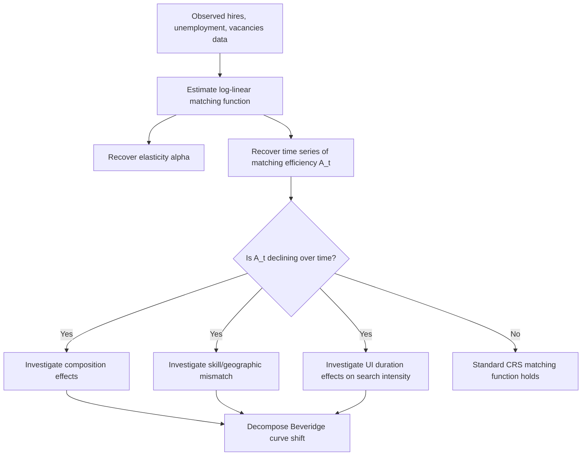

## The Matching Function

### Definition and Role in Search Theory

The matching function is the reduced-form technological primitive that converts stocks of unemployed job-seekers and posted vacancies into a flow of realized hires. It plays the same organizing role in search-and-matching labor economics that the production function plays in standard neoclassical growth and production theory: it summarizes, in a single aggregate relationship, an underlying decentralized process (individual workers meeting individual firms) that is too complex to model explicitly at the micro level for most macro-labor applications.

Formally, if $U$ denotes the stock of unemployed searchers and $V$ denotes the stock of posted vacancies, the matching function $m(\cdot,\cdot)$ generates the flow of new hires $M$ per unit time:

$$M = m(U, V)$$

This function is the foundation of the Diamond-Mortensen-Pissarides framework and virtually all subsequent applied search-and-matching macro-labor models.

### Standard Properties and Assumptions

**Key Points**

- **Increasing in both arguments**: $\partial m/\partial U > 0$ and $\partial m/\partial V > 0$ — more searchers or more vacancies mechanically produce (weakly) more matches, holding the other input fixed.
- **Constant returns to scale (CRS)**: The standard and empirically favored assumption is that $m(\lambda U, \lambda V) = \lambda \cdot m(U, V)$ for any $\lambda > 0$ — doubling both unemployment and vacancies doubles the number of matches, leaving the job-finding and vacancy-filling *rates* unchanged. CRS is what allows the matching function to be summarized entirely in terms of the single ratio $\theta = V/U$ (market tightness), which is the workhorse simplification used throughout the DMP literature.
- **Concavity**: $m$ is typically assumed jointly concave, capturing diminishing returns to search/recruiting effort on each side of the market — congestion effects mean that adding more searchers to an already-crowded pool of job-seekers yields progressively smaller increases in the aggregate match flow.
- **Boundary conditions**: $m(0, V) = m(U, 0) = 0$ — no matches occur without positive stocks on both sides of the market, a basic consistency requirement.
- **Sub-market-clearing property**: The matching function embodies the **friction** at the heart of search theory — unlike a Walrasian market, $m(U,V) < \min(U,V)$ in general, meaning not all searchers find jobs and not all vacancies get filled within a period, even though (by definition) both a willing worker and a willing firm exist somewhere in the aggregate economy.

### The Cobb-Douglas Functional Form

The most widely used parametric specification, due to its tractability and reasonably good empirical fit, is Cobb-Douglas:

$$M = A \cdot U^{\alpha} V^{1-\alpha}$$

where $A > 0$ is **matching efficiency** (analogous to total factor productivity in a production function) and $\alpha \in (0,1)$ is the elasticity of matches with respect to unemployment.

**Key Points**

- $A$ captures all factors affecting match efficiency that are not explicitly modeled — labor market institutions, the effectiveness of job search platforms and intermediaries (public employment services, online job boards), geographic/skill mismatch, and information frictions.
- $\alpha$ governs the elasticity structure: $\alpha$ close to 1 implies matches respond strongly to the unemployment stock and weakly to vacancies (a "search-driven" matching process), while $\alpha$ close to 0 implies the reverse (a "recruiting-driven" process).
- Under Cobb-Douglas, the job-finding rate $f(\theta) = M/U = A\theta^{1-\alpha}$ and the vacancy-filling rate $q(\theta) = M/V = A\theta^{-\alpha}$, giving closed-form, easily estimable relationships between market tightness and the two key transition rates.

### Deriving the Job-Finding and Vacancy-Filling Rates

Using CRS, the matching function can be normalized by either $U$ or $V$ to express outcomes purely as functions of tightness $\theta = V/U$:

$$f(\theta) \equiv \frac{M}{U} = m\left(1, \frac{V}{U}\right) = m(1, \theta)$$

$$q(\theta) \equiv \frac{M}{V} = m\left(\frac{U}{V}, 1\right) = m\left(\frac{1}{\theta}, 1\right)$$

with the identity $f(\theta) = \theta \, q(\theta)$ following directly from the definitions. Standard concavity and CRS properties imply $f'(\theta) > 0$ and $q'(\theta) < 0$: as the labor market tightens (relatively more vacancies per searcher), it becomes easier for workers to find jobs but harder for firms to fill vacancies — the fundamental **congestion externality** structure of search markets.

### SVG Illustration: Job-Finding and Vacancy-Filling Rates as Functions of Tightness (svg_diagram)

<svg xmlns="http://www.w3.org/2000/svg" viewBox="0 0 720 380">
<text x="360" y="26" text-anchor="middle" font-size="16" font-weight="bold" font-family="sans-serif">f(θ) and q(θ) as Functions of Market Tightness (svg_diagram)</text>
<line x1="90" y1="330" x2="650" y2="330" stroke="black" stroke-width="2" />
<line x1="90" y1="330" x2="90" y2="50" stroke="black" stroke-width="2" />
<text x="370" y="360" text-anchor="middle" font-size="13" font-family="sans-serif">Market tightness, θ = V/U</text>
<text x="45" y="200" text-anchor="middle" font-size="13" font-family="sans-serif" transform="rotate(-90 45 200)">Rate</text>
<path d="M 100 310 Q 250 150 620 70" stroke="#27ae60" stroke-width="2.5" fill="none" />
<text x="500" y="90" font-size="12" fill="#27ae60" font-family="sans-serif">f(θ) — job-finding rate, increasing</text>
<path d="M 100 70 Q 250 180 620 310" stroke="#c0392b" stroke-width="2.5" fill="none" />
<text x="450" y="290" font-size="12" fill="#c0392b" font-family="sans-serif">q(θ) — vacancy-filling rate, decreasing</text>
<line x1="300" y1="50" x2="300" y2="330" stroke="#999" stroke-width="1" stroke-dasharray="3,3" />
<text x="300" y="345" text-anchor="middle" font-size="11" font-family="sans-serif">θ = 1 (balanced market)</text>
</svg>

### Elasticity Estimation and Empirical Evidence

**Key Points**

- The matching function elasticity $\alpha$ (with respect to unemployment) is typically estimated via log-linear regressions of hires (or the job-finding rate) on unemployment and vacancy stocks: $\ln M_t = \ln A + \alpha \ln U_t + (1-\alpha) \ln V_t + \varepsilon_t$, often exploiting time-series or panel (state/regional) variation.
- Petrongolo and Pissarides (2001), in an influential survey, document that estimated matching function elasticities for the U.S. and several European countries commonly fall in the range of roughly $\alpha \approx 0.5$ to $0.7$, and that the CRS assumption is broadly, though not universally, supported by the data. [Inference — the specific estimate is sensitive to sample period, country, and vacancy data source, and precision varies across studies]
- The introduction of the U.S. JOLTS survey (2000-present) substantially improved the quality of U.S. matching function estimation relative to earlier reliance on the Conference Board's Help-Wanted Index (a print-newspaper-ad-based proxy for vacancies that became progressively less representative as online job posting grew).
- Estimated matching efficiency $A$ is not constant over time in most empirical work — this has become a central object of interest, particularly around the Great Recession and its aftermath.

### The "Matching Efficiency Decline" Debate (Post-2008/2009)

**Key Points**

- Following the 2008-09 U.S. recession, researchers (e.g., Şahin, Song, Topa, and Violante, 2014; Barnichon and Figura, 2015) documented an apparent outward shift in the empirical Beveridge curve — higher unemployment for any given vacancy rate than historical relationships would predict — which within the matching function framework is naturally interpreted as a decline in matching efficiency $A$.
- Proposed explanations for reduced matching efficiency during this period include increased skill and geographic mismatch between job-seekers and available vacancies, extended-duration unemployment insurance potentially reducing search intensity (a moral-hazard-type channel operating on the supply side rather than the technology itself), and increased long-term unemployment (since long-term unemployed workers are empirically found to have systematically lower job-finding rates, which shows up in the aggregate matching function as reduced efficiency even absent any change in the "true" underlying matching technology per searcher-type). [Inference — the relative contribution of these candidate explanations remains debated, and some researchers argue the apparent efficiency decline is at least partly a composition effect (more long-term unemployed in the searcher pool) rather than a change in the matching technology itself]
- This debate is a canonical illustration of the practical value of the matching function framework: it provides a disciplined way to decompose an observed empirical anomaly (elevated unemployment relative to vacancies) into "quantity" channels (more searchers, fewer vacancies) versus a residual "efficiency" channel, directing further research toward identifying the underlying mechanism.

### Mermaid Diagram: Matching Function Estimation and Decomposition Workflow

### Extensions Beyond the Basic Aggregate Matching Function

- **Stock-flow matching models**: An alternative to the standard matching function treats the *stock* of unemployed and vacancies each period as effectively searching the full stock of the other side (rather than a smooth continuous matching probability), better capturing certain empirical regularities in micro-level vacancy duration data, though at some cost to tractability relative to the CRS Cobb-Douglas benchmark.
- **Heterogeneous/multi-type matching functions**: Extending the matching function to allow for occupation-, skill-, or sector-specific searcher and vacancy types, generating a matrix of sub-market matching functions used to study mismatch unemployment (e.g., a Cobb-Douglas-style matching function applied separately within each occupation cell, then aggregated).
- **Directed search microfoundations**: Rather than treating the matching function as an unexplained technological black box, directed search models (Moen, 1997) derive an equivalent aggregate matching relationship from explicit micro-founded search behavior where workers direct their search toward posted wages, providing a choice-theoretic foundation for what the reduced-form matching function summarizes.
- **Spatial/network matching**: Incorporating explicit geographic distance or social network structure into the matching process, relevant for understanding why measured matching efficiency can vary substantially across regions and demographic groups even within a single national labor market.

### Practical Use in Applied and Policy Analysis

**Next Steps**

- Central bank and government labor market forecasting models frequently embed an estimated matching function to project how changes in vacancy postings (a relatively high-frequency, timely indicator) translate into future job-finding rates and unemployment dynamics
- Active labor market policy evaluation (job search assistance programs, employment subsidies) often uses matching function estimates to assess whether a policy operates primarily by shifting matching efficiency $A$ upward versus simply reallocating a fixed number of matches across different searcher subgroups (a distinction with significant welfare and equilibrium-effect implications, since a policy that only reallocates matches among searchers has zero aggregate benefit in general equilibrium even if it appears highly effective in a partial-equilibrium program evaluation)
- Cross-country comparisons of estimated matching efficiency $A$ are sometimes used as an indicator of labor market institutional quality, though such comparisons require caution given underlying data comparability issues across countries' vacancy measurement methodologies

### Limitations of the Matching Function Approach

**Key Points**

- As a reduced-form aggregate object, the matching function does not explain *why* matches take the time they do at the micro level — it is a convenient summary statistic for a search process rather than a structural model of individual search behavior, which limits its usefulness for some counterfactual policy questions that require understanding the underlying micro-mechanism.
- The assumption of a single economy-wide (or sector-wide) matching function abstracts from potentially important heterogeneity in matching technology across worker types, occupations, and local labor markets, which can bias aggregate elasticity estimates if the underlying composition of searchers and vacancies changes systematically over the sample period (as documented in the matching efficiency decline debate above).
- Distinguishing genuine technological change in matching efficiency from changes in unmeasured search intensity or recruiting intensity (effort per unemployed worker or per vacancy, as opposed to simple counts) remains an active empirical challenge, since most available data measure only stocks (number of unemployed, number of vacancies) rather than effort intensity directly. [Inference — this measurement limitation is a persistent methodological caveat across the empirical matching function literature]

### Related Topics

- The Diamond Mortensen Pissarides Model
- The Beveridge Curve and Labor Market Tightness
- Job-Finding Rates and Unemployment Duration
- Mismatch Unemployment and Sectoral Reallocation
- The Shimer Puzzle and Wage Rigidity in Search Models
- Directed Search and Competitive Search Equilibrium
- Active Labor Market Policies and Program Evaluation
- On-the-Job Search and Job-to-Job Transitions