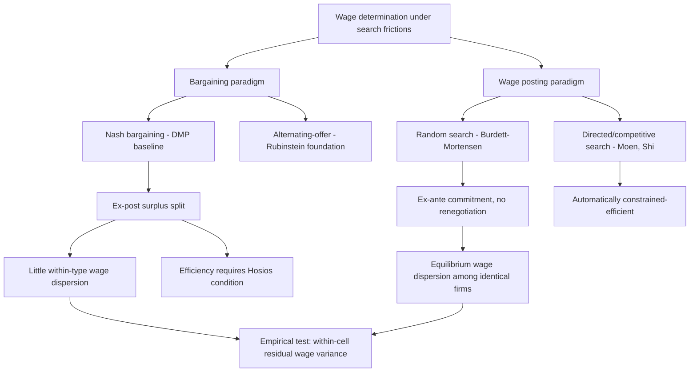

## Wage Posting Versus Bargaining

### Two Competing Paradigms of Wage Determination Under Search Frictions

In search-theoretic labor economics, wages cannot be set by a Walrasian auctioneer, since matching is frictional and bilateral. Two distinct theoretical paradigms have emerged for how the wage is actually determined once a worker and firm meet:

- **Bargaining**: The wage is determined by ex-post negotiation between the matched worker and firm over the surplus created by the match, typically formalized via Nash bargaining (as in the standard DMP model) or alternating-offer bargaining (Rubinstein-style).
- **Wage posting**: The firm commits to and publicly announces a wage *before* meeting any particular worker, and workers direct their search (or randomly encounter posted wages) based on these commitments; the firm cannot renegotiate once posted.

This distinction is not merely a modeling convenience — the two paradigms generate qualitatively different predictions about wage dispersion, the source of employer market power, and the efficiency properties of equilibrium, making the choice between them consequential for applied work.

### The Bargaining Paradigm: Nash Bargaining in DMP

Under Nash bargaining (the baseline DMP assumption), the wage splits the *match surplus* — the joint value created by the worker-firm pair relative to their outside options (unemployment for the worker, an unfilled vacancy for the firm) — according to a fixed bargaining power parameter $\beta$:

$$w = \beta(z + c\theta) + (1-\beta)b$$

**Key Points**

- Bargaining is inherently **ex-post**: the wage is negotiated only after the worker and firm have already met and identified each other as a specific match, so the wage reflects the bilateral surplus of *that particular* match, not a general market-clearing price.
- Because both parties have already incurred the (sunk) cost of finding each other, bargained wages can, in principle, respond to match-specific factors (e.g., worker's outside offer in hand, firm's urgency to fill the position) that a pre-committed posted wage cannot.
- The Nash bargaining solution is often criticized as an *ad hoc* cooperative-game solution concept lacking a fully non-cooperative microfoundation; the Rubinstein alternating-offer bargaining model provides a non-cooperative foundation that converges to the Nash bargaining solution under specific assumptions about discounting and breakdown risk, partially addressing this critique.

### The Wage-Posting Paradigm: Burdett-Mortensen and Directed Search

Wage posting comes in two principal variants, differing in whether workers can *observe* posted wages before deciding where to search:

**Random/undirected wage posting (Burdett-Mortensen, 1998)**: Firms post wages, but workers cannot direct their search toward specific firms — they encounter job offers randomly (e.g., via random meetings modeled through a matching function) and observe the wage only upon meeting the firm. In equilibrium, ex-ante identical firms post a *non-degenerate distribution* of wages, sustained because:

- Posting a higher wage attracts more applicants and reduces quits (raising the firm's size/profit via a larger workforce).
- Posting a lower wage extracts more profit per worker but shrinks the workforce through higher quits to better-paying rivals.
- In the mixed-strategy equilibrium, firms are indifferent across a continuous range of wages, generating equilibrium wage dispersion among ex-ante identical firms and workers — a striking departure from the "law of one price" that would hold in a frictionless labor market.

**Directed/competitive search (Moen, 1997; Shi, 2001; Menzio and Shi, 2011)**: Firms post wages, and workers *can* observe posted wages and direct their search accordingly, choosing which wage-tightness combination to search for. Because workers direct search toward the offers they find most attractive (adjusting for the endogenously lower job-finding probability at high-wage, high-competition postings), this generates a competitive-search equilibrium in which each posted wage is associated with an equilibrium market tightness, and the resulting allocation is constrained-efficient by construction — automatically satisfying an efficiency condition analogous to (but not requiring) the Hosios condition from bargaining models.

### SVG Illustration: Bargaining vs. Wage Posting Timing (svg_diagram)

<svg viewBox="0 0 740 360" xmlns="http://www.w3.org/2000/svg">
<text x="370" y="26" text-anchor="middle" font-size="16" font-weight="bold" font-family="sans-serif">Timing: Bargaining vs. Wage Posting (svg_diagram)</text>

<text x="185" y="60" text-anchor="middle" font-size="14" font-weight="bold" fill="`#2980b9`" font-family="sans-serif">Bargaining</text>

<rect x="60" y="80" width="120" height="50" rx="6" fill="`#e8f0fd`" stroke="`#2980b9`"/>

<text x="120" y="110" text-anchor="middle" font-size="11" font-family="sans-serif">Worker & firm meet</text>

<line x1="180" y1="105" x2="240" y2="105" stroke="black" stroke-width="2" marker-end="url(#a3)"/>

<rect x="240" y="80" width="120" height="50" rx="6" fill="`#e8f0fd`" stroke="`#2980b9`"/>

<text x="300" y="105" text-anchor="middle" font-size="11" font-family="sans-serif">Surplus revealed</text>

<text x="300" y="118" text-anchor="middle" font-size="10" font-family="sans-serif">(match-specific)</text>

<line x1="360" y1="105" x2="420" y2="105" stroke="black" stroke-width="2" marker-end="url(#a3)"/>

<rect x="420" y="80" width="120" height="50" rx="6" fill="`#e8f0fd`" stroke="`#2980b9`"/>

<text x="480" y="105" text-anchor="middle" font-size="11" font-family="sans-serif">Wage negotiated</text>

<text x="480" y="118" text-anchor="middle" font-size="10" font-family="sans-serif">(Nash split)</text>

<text x="185" y="200" text-anchor="middle" font-size="14" font-weight="bold" fill="`#c0392b`" font-family="sans-serif">Wage Posting</text>

<rect x="60" y="220" width="120" height="50" rx="6" fill="`#fde8e8`" stroke="`#c0392b`"/>

<text x="120" y="245" text-anchor="middle" font-size="11" font-family="sans-serif">Firm posts wage</text>

<text x="120" y="258" text-anchor="middle" font-size="10" font-family="sans-serif">(ex-ante commitment)</text>

<line x1="180" y1="245" x2="240" y2="245" stroke="black" stroke-width="2" marker-end="url(#a3)"/>

<rect x="240" y="220" width="120" height="50" rx="6" fill="`#fde8e8`" stroke="`#c0392b`"/>

<text x="300" y="245" text-anchor="middle" font-size="11" font-family="sans-serif">Worker searches</text>

<text x="300" y="258" text-anchor="middle" font-size="10" font-family="sans-serif">(random or directed)</text>

<line x1="360" y1="245" x2="420" y2="245" stroke="black" stroke-width="2" marker-end="url(#a3)"/>

<rect x="420" y="220" width="120" height="50" rx="6" fill="`#fde8e8`" stroke="`#c0392b`"/>

<text x="480" y="245" text-anchor="middle" font-size="11" font-family="sans-serif">Match at posted w</text>

<text x="480" y="258" text-anchor="middle" font-size="10" font-family="sans-serif">(no renegotiation)</text>

<defs>
<marker id="a3" markerWidth="10" markerHeight="10" refX="5" refY="5" orient="auto">
<path d="M0,0 L10,5 L0,10 z" fill="black"/>
</marker>
</defs>
</svg>

### Implications for Wage Dispersion

**Key Points**

- Under Nash bargaining in the baseline DMP model, ex-ante identical firms and workers would produce *identical* wages absent additional heterogeneity, since the bargaining outcome depends only on common parameters ($\beta$, $z$, $\theta$, $b$) — the standard DMP model has essentially no residual (within-type) wage dispersion.
- Under Burdett-Mortensen wage posting, wage dispersion among ex-ante identical workers and firms is not a deviation from the model but rather its central equilibrium prediction, directly matching the well-documented empirical fact of substantial residual wage dispersion among observably similar workers.
- This distinction is central to the modern "new monopsony" empirical literature: measured employer wage-setting power (markdowns) can arise from search-friction-driven wage posting even when raw employer counts (HHI) suggest a competitive market structure, since wage posting generates monopsony-like power through the elasticity of a firm's applicant flow and retention with respect to its own posted wage, rather than through literal employer scarcity.

### Empirical Estimation of Labor Supply Elasticity Under Each Paradigm

**Key Points**

- The wage-posting framework provides a direct structural mapping from **recruitment and retention elasticities** to employer market power: a firm's own-wage elasticity of labor supply, $\varepsilon_{LS}$, can be decomposed into a recruitment margin (how much higher wages attract more applicants) and a retention margin (how much higher wages reduce quits), both directly estimable from matched employer-employee administrative data (Manning, 2003; Webber, 2015; Bassier, Dube, and Naidu, 2022 estimate both margins using U.S. administrative wage records).
- Under bargaining models, by contrast, identifying the bargaining power parameter $\beta$ typically requires either calibration to match aggregate labor share targets or estimation via the pass-through of firm-specific productivity shocks to wages (as in Card, Cardoso, Heining, and Kline, 2018, using an AKM-style decomposition of matched employer-employee wage data), a conceptually distinct empirical strategy from the elasticity-based approach natural to wage-posting models.
- A growing body of empirical work finds that estimated firm-level labor supply elasticities are finite and often well below the near-infinite elasticity implied by perfect competition, providing indirect support for wage-posting-style monopsony power operating even in labor markets with many nominal competitors — a key piece of evidence motivating the shift in emphasis within the profession from concentration-based (static) monopsony toward search-friction-based (dynamic) monopsony explanations of wage suppression. [Inference — the relative empirical importance of wage posting versus bargaining mechanisms in explaining observed markdowns is an active and unsettled research question]

### Mermaid Diagram: Wage Determination Paradigm Comparison

### Hybrid and Alternative Models

**Key Points**

- **Sequential auctions / Postel-Vinay and Robin (2002)**: Employed workers can be poached by outside firms who bid up the wage in a sequential-auction structure, blending elements of bargaining (the wage responds to a specific outside offer) with posting-like commitment (the winning firm's bid becomes the new fixed wage until the next outside offer arrives), generating rich predictions about wage growth through job-to-job mobility that neither pure bargaining nor pure static posting can replicate.
- **Renegotiation-proof bargaining**: Some models allow limited within-match renegotiation triggered by observable outside offers, providing a middle ground between the extremes of never-renegotiated posted wages and freely renegotiated bargained wages, and offering a closer match to observed "counteroffer" behavior in labor markets.
- **Empirical wage-posting tests**: Researchers have tested which paradigm better fits observed data by examining whether wages respond to firm-specific productivity shocks in a manner consistent with ex-post bargaining (pass-through of shocks into existing workers' wages) versus whether wage changes occur primarily at the point of hire/rehire (consistent with posting and infrequent renegotiation) — evidence is mixed and likely varies by labor market segment (e.g., union vs. non-union, high- vs. low-skill). [Inference — no single paradigm has been shown to dominate empirically across all labor market contexts; the appropriate model likely depends on institutional features of the specific market being studied]

### Policy and Antitrust Relevance

**Next Steps**

- Wage-posting models provide the theoretical foundation for interpreting **pay transparency policies** (mandatory wage posting in job advertisements, now required in several U.S. states and countries): if wage dispersion partly reflects information frictions in worker search (as in Burdett-Mortensen), mandatory transparency could reduce dispersion and effective employer market power by lowering search costs
- Antitrust analysis of no-poach and wage-fixing agreements is most naturally modeled through the bargaining lens (since these agreements directly restrict outside offers that would otherwise trigger renegotiation or poaching), while merger analysis of employer concentration effects often draws more directly on wage-posting/monopsony elasticity frameworks
- Minimum wage policy analysis differs meaningfully across paradigms: under static monopsony/bargaining, a minimum wage near the competitive level can raise both wages and employment; under wage-posting models with heterogeneous firms, minimum wage effects depend additionally on how the wage floor compresses the equilibrium wage-offer distribution and reallocates workers across firms of different productivity

### Limitations and Open Questions

**Key Points**

- Neither paradigm alone provides a fully satisfactory account of all observed labor market wage-setting behavior: bargaining models struggle to generate realistic wage dispersion without additional heterogeneity, while pure wage-posting models struggle to explain well-documented instances of apparent ex-post renegotiation (e.g., counteroffers to retain a worker who has received an outside offer).
- Distinguishing empirically between the two paradigms using observational wage data is difficult because both can be calibrated to match many of the same aggregate moments (average wage level, unemployment rate, vacancy rate), requiring richer micro-data (e.g., linked vacancy-posting and realized-hire wage data, or experimental variation in pay transparency) for sharper identification. [Inference — this identification challenge is a recognized methodological limitation in the literature attempting to adjudicate between the two frameworks]
- The choice of paradigm has first-order consequences for policy conclusions (as noted above regarding minimum wage and antitrust analysis), meaning that model uncertainty about which paradigm better describes a given real-world labor market translates directly into meaningful uncertainty about the predicted effects of labor market policy interventions.

### Related Topics

- The Diamond Mortensen Pissarides Model
- Burdett-Mortensen Equilibrium Search and Wage Dispersion
- Directed Search and Competitive Search Equilibrium
- Employer Market Power and Wage Suppression
- The Hosios Condition and Search Externalities
- Pay Transparency Policy and Labor Market Information Frictions
- Sequential Auctions and Job-to-Job Wage Growth (Postel-Vinay and Robin)
- Minimum Wage Policy Under Monopsonistic Labor Markets