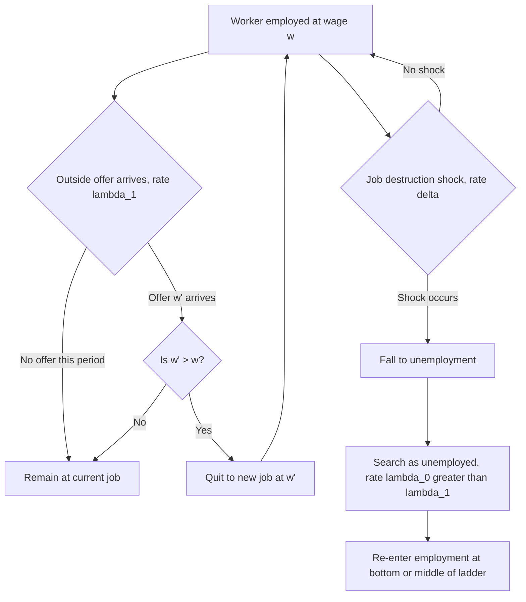

## On the Job Search and Job Ladders

### Conceptual Overview

On-the-job search (OJS) refers to the empirically well-documented phenomenon that employed workers continue to search for better job opportunities rather than exiting the labor market for job-search purposes upon becoming employed. This directly contradicts the simplest McCall search model, where accepting a job ends search permanently. Incorporating OJS transforms search theory from a model purely of unemployment duration into a model of a worker's entire career trajectory across employers, giving rise to the **job ladder** metaphor: workers climb from lower-paying to higher-paying (or better-matched) jobs over time via a sequence of job-to-job transitions, punctuated occasionally by spells of unemployment.

### Why On-the-Job Search Matters Empirically

**Key Points**

- Job-to-job (EE) transitions constitute a substantial share of total worker reallocation in modern labor markets — in the U.S., EE flows are typically comparable in magnitude to, and in many periods larger than, flows through unemployment (UE and EU flows combined), making OJS quantitatively central rather than a minor theoretical refinement.
- Wage growth over a worker's career is disproportionately concentrated in job-to-job transitions rather than within-job tenure-based raises; empirical decompositions (e.g., Topel and Ward, 1992, a foundational early study) find that a substantial share of early-career wage growth for young workers occurs through employer changes rather than wage growth within a single employer.
- EE transitions are strongly **procyclical**: job-to-job mobility falls sharply during recessions (workers become more reluctant to leave a job during weak labor markets, and fewer attractive outside offers arrive) and rises during expansions, making the EE flow rate a closely watched real-time indicator of labor market tightness alongside the more traditional UE (job-finding) rate.

### Formalizing On-the-Job Search in the Search Model

Extending the basic McCall/DMP framework to incorporate OJS requires modifying the employed worker's value function to include the option of receiving and accepting outside offers. Let $\lambda_0$ denote the offer arrival rate while unemployed and $\lambda_1$ denote the (generally lower) offer arrival rate while employed. The value of employment at wage $w$ becomes:

$$V_E(w) = w + \beta\Big[(1-\delta)\Big( (1-\lambda_1)V_E(w) + \lambda_1 \max\{V_E(w), \mathbb{E}_{w'}[V_E(w')]\} \Big) + \delta V_U \Big]$$

where $\delta$ is the exogenous job destruction rate. The key structural addition relative to the basic McCall model is the $\lambda_1 \max\{\cdot,\cdot\}$ term: an employed worker who receives an outside offer $w'$ moves to the new job only if $V_E(w') > V_E(w)$, i.e., **on-the-job search generates a job-to-job transition only when the outside offer represents a strict improvement**, distinguishing it fundamentally from the unemployed worker's problem where any acceptable offer beats continued search.

**Key Points**

- Because $V_E(w)$ is monotonically increasing in $w$, the acceptance rule for an employed worker reduces to a simple threshold: accept the outside offer $w'$ if and only if $w' > w$ (in the simplest specification without additional match-quality heterogeneity) — the worker always moves up the wage ladder, never sideways or down, absent other frictions.
- This generates the "job ladder" structure directly: a worker's wage sequence over their career is (weakly) monotonically increasing between job-to-job transitions, punctuated by potential resets to a lower value if a job destruction shock forces a return to unemployment (a "fall off the ladder" event).
- The empirically lower offer arrival rate for employed workers ($\lambda_1 < \lambda_0$) is typically justified by reduced search intensity while employed (time constraints, lower marginal benefit of search when already receiving income) — though the *ordering* $\lambda_1 < \lambda_0$ is a standard calibration choice rather than a directly observed structural parameter, and this ordering matters for a range of quantitative model predictions.

### SVG Illustration: The Job Ladder Concept (svg_diagram)

<svg xmlns="http://www.w3.org/2000/svg" viewBox="0 0 700 400">
<text x="350" y="26" text-anchor="middle" font-size="16" font-weight="bold" font-family="sans-serif">Career Trajectory as a Job Ladder (svg_diagram)</text>
<line x1="80" y1="360" x2="640" y2="360" stroke="black" stroke-width="2" />
<line x1="80" y1="360" x2="80" y2="50" stroke="black" stroke-width="2" />
<text x="360" y="385" text-anchor="middle" font-size="13" font-family="sans-serif">Time / career progression</text>
<text x="35" y="200" text-anchor="middle" font-size="13" font-family="sans-serif" transform="rotate(-90 35 200)">Wage</text>
<rect x="80" y="330" width="90" height="30" fill="#f1c40f" stroke="#333" />
<text x="125" y="350" text-anchor="middle" font-size="10" font-family="sans-serif">Unemployed</text>
<rect x="170" y="290" width="90" height="70" fill="#e67e22" stroke="#333" />
<text x="215" y="330" text-anchor="middle" font-size="10" font-family="sans-serif">Job A: low w</text>
<rect x="260" y="220" width="90" height="140" fill="#27ae60" stroke="#333" />
<text x="305" y="295" text-anchor="middle" font-size="10" font-family="sans-serif">Job B: higher w</text>
<rect x="350" y="330" width="90" height="30" fill="#f1c40f" stroke="#333" />
<text x="395" y="350" text-anchor="middle" font-size="10" font-family="sans-serif">Job loss - delta</text>
<rect x="440" y="150" width="90" height="210" fill="#2980b9" stroke="#333" />
<text x="485" y="255" text-anchor="middle" font-size="10" font-family="sans-serif">Job C: even higher w</text>
<rect x="530" y="100" width="90" height="260" fill="#8e44ad" stroke="#333" />
<text x="575" y="230" text-anchor="middle" font-size="10" font-family="sans-serif">Job D: top of ladder</text>
<path d="M 125 330 L 215 290 L 305 220 L 395 330 L 485 150 L 575 100" stroke="black" stroke-width="1.5" stroke-dasharray="3,3" fill="none" />
</svg>

### The Burdett-Mortensen Job-Ladder Equilibrium

The Burdett-Mortensen (1998) model is the canonical equilibrium framework combining wage posting with on-the-job search, generating an internally consistent theory of the *equilibrium wage-offer distribution* $F(w)$ that OJS-extended McCall models take as exogenously given. In steady state, the equilibrium wage distribution across employed workers, $G(w)$, differs systematically from the firms' posted wage-offer distribution $F(w)$:

$$G(w) = \frac{\delta F(w)}{\delta + \lambda_1[1-F(w)]}$$

**Key Points**

- Because higher-wage jobs are, by the acceptance rule above, never voluntarily quit for a lower-wage job, high-wage firms accumulate progressively larger stocks of workers over time relative to their flow of new hires — this is the **on-the-job search amplification of firm size dispersion**, a key mechanism explaining why observably similar firms can have very different equilibrium sizes even absent underlying productivity differences.
- The equilibrium distribution $G(w)$ (the distribution of wages actually *observed* among employed workers at any point in time) puts more mass on high wages than the underlying offer distribution $F(w)$ (the distribution of wages firms post), because high-wage jobs, once filled, are rarely vacated — a subtle but important distinction between the *offer* distribution and the *earned-wage* distribution relevant for interpreting cross-sectional wage data.
- This framework directly generates monopsony-style wage-setting power for every firm in the market (not just literally dominant ones), since each firm's applicant flow and retention respond continuously to its own posted wage relative to the market distribution — providing the theoretical foundation for the "new monopsony" / dynamic monopsony perspective discussed in the broader employer-market-power literature.

### Empirical Measurement of Job Ladders

**Key Points**

- Direct empirical tests of job-ladder climbing use matched employer-employee panel data to track whether job-to-job movers experience systematic wage *gains* on average (consistent with ladder-climbing) versus a mix of gains and losses (which would suggest match-quality or non-wage-amenity motives dominate pure wage-ladder climbing for a meaningful share of transitions).
- Studies generally find that average wage gains from job-to-job transitions are positive but with substantial heterogeneity — a meaningful share of job-to-job movers experience wage declines, which is difficult to reconcile with a pure wage-maximizing ladder-climbing model and has motivated extensions incorporating non-wage job amenities, relocation for family reasons, and forced transitions that are technically EE but economically closer to displacement-driven moves.
- "Firm-level job ladder rank" measures, constructed from the empirical pattern of which firms tend to poach workers from which other firms (Haltiwanger, Hyatt, Kahn, and McEntarfer, 2018, using U.S. LEHD administrative data), find a discernible ladder-like hierarchy among firms, with larger, higher-paying establishments systematically poaching from smaller, lower-paying ones — providing direct micro-evidence consistent with the theoretical job-ladder structure of Burdett-Mortensen-style models.

### Mermaid Diagram: On-the-Job Search Decision Process

### Cyclicality and Aggregate Implications

**Key Points**

- The procyclicality of job-to-job transitions has significant implications for wage inequality dynamics over the business cycle: recessions not only raise unemployment but also "freeze" workers in place on the job ladder, slowing the reallocation-driven component of aggregate wage growth even for workers who remain continuously employed throughout the downturn.
- Moscarini and Postel-Vinay (2016, 2017) document and model the "job ladder" cyclicality pattern showing that during expansions, EE poaching disproportionately benefits workers at smaller/lower-paying firms who move to larger/higher-paying firms, while during recessions this poaching channel collapses first and most sharply — a key stylized fact in modern business-cycle labor market research.
- The slowdown in EE reallocation during recessions is one channel through which recessions can have persistent ("scarring") effects on wage growth even for workers who never experience unemployment directly, since missed job-ladder-climbing opportunities during a downturn are not typically fully recovered later. [Inference — the degree of permanent versus temporary scarring from missed job-ladder opportunities is an area of ongoing empirical research with mixed findings across studies and time periods]

### Extensions and Related Modeling Approaches

- **Match-quality heterogeneity (Jovanovic, 1979)**: Incorporating idiosyncratic match quality that is only revealed over time (rather than known immediately at hire) generates additional job-to-job and job-to-unemployment transitions driven by "experimentation" and learning, distinct from pure wage-ladder climbing.
- **Human capital accumulation on the ladder**: Extending OJS models to allow for firm-specific or general human capital accumulation while employed generates interaction effects between tenure, job-ladder position, and wage growth, connecting search theory directly to the human capital literature.
- **Life-cycle job ladder models**: Incorporating age-varying offer arrival rates and finite horizons to explain the well-documented empirical pattern of declining job-to-job mobility rates over the life cycle, as older workers accumulate firm-specific capital and face higher relocation costs.
- **Search intensity choice**: Extending the framework to let workers optimally choose costly search effort while employed (rather than taking $\lambda_1$ as an exogenous parameter), generating richer predictions about how search intensity itself varies with current wage, job security, and business cycle conditions.

### Policy Relevance

**Next Steps**

- Understanding job-ladder dynamics informs the design of job search assistance programs targeted not just at the unemployed but at underemployed or mismatched employed workers, since a meaningful share of aggregate productivity gains from reallocation flow through EE rather than UE transitions
- Minimum wage and monopsony policy analysis increasingly incorporates job-ladder dynamics, since a wage floor can compress the bottom of the ladder and potentially accelerate low-wage workers' transitions to better-paying jobs, an effect distinct from the simple static monopsony employment-effect channel
- Recession-era policy design (e.g., short-time work/furlough schemes) can be partly motivated by a job-ladder logic: preserving existing employer-employee matches during downturns avoids both unemployment scarring and job-ladder disruption, potentially preserving reallocation-driven wage growth that would otherwise be lost

### Related Topics

- The Diamond Mortensen Pissarides Model
- Wage Posting Versus Bargaining
- Burdett-Mortensen Equilibrium Search and Wage Dispersion
- Employer Market Power and Wage Suppression
- Sequential Auctions and Job-to-Job Wage Growth (Postel-Vinay and Robin)
- Unemployment Scarring and Business Cycle Effects on Wage Growth
- Firm-Specific Human Capital and On-the-Job Training
- Job-to-Job Transition Rates as a Labor Market Tightness Indicator